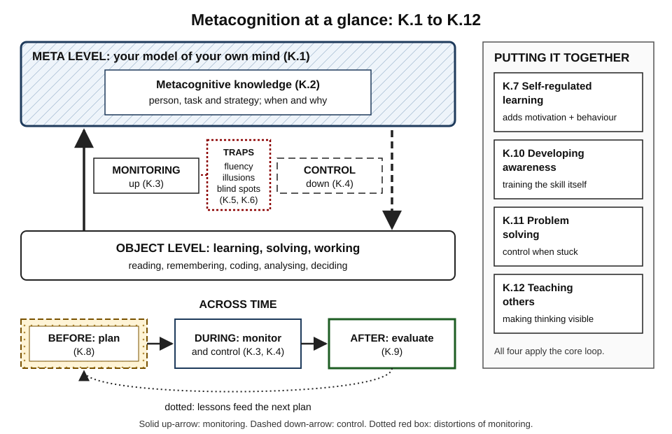
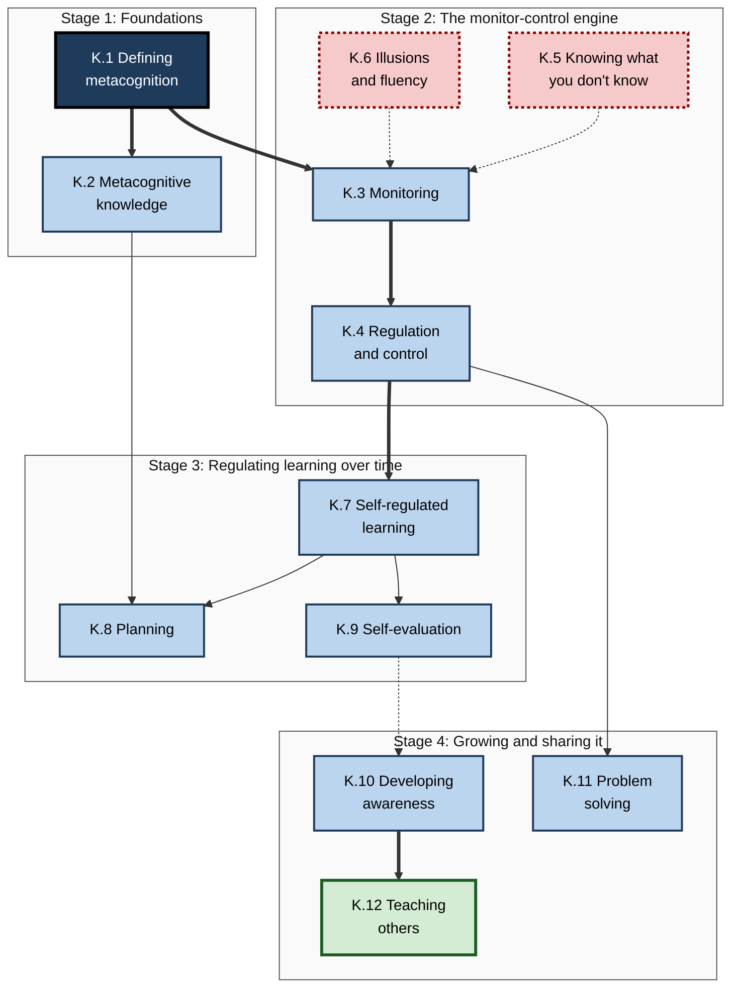
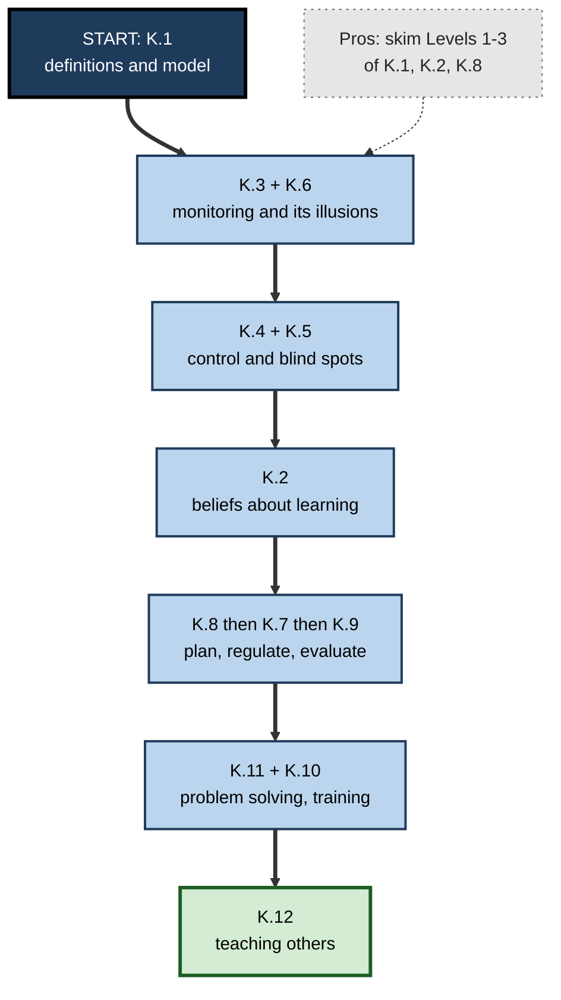

# K. Metacognition

> **What this subtopic is about:** Metacognition is thinking about your own thinking: knowing how learning and reasoning work, checking how well they are going right now, and steering them. These twelve notes cover what metacognition is, how self-monitoring works and fails, how people regulate learning and problem solving, and how to build and teach these skills, including in AI-assisted work.
>
> **Who it is for:** anyone who learns for a living, from students and new graduates to engineers, analysts, consultants, managers and L&D professionals · **Notes in this subtopic:** 12 · **Level span:** Novice → Expert

---

## Overview

Every learning and working session involves two layers. On one layer, you do the work: read, remember, calculate, code, decide. On the other, a quieter layer watches the work and asks "Do I understand this? Is this approach working? Am I sure?" That second layer is **metacognition**. The term was introduced by John Flavell in the 1970s, and the influential model of Thomas Nelson and Louis Narens (1990) describes it as a **meta level** that receives **monitoring** signals from the **object level** and sends **control** decisions back.

This subtopic follows that structure. It starts with definitions and the two halves of metacognition, knowledge and regulation. It then examines monitoring (how we judge our own learning), the illusions that distort it, and control (what we do with those judgements). It widens to self-regulated learning, planning and evaluation, and ends with how to develop metacognition in yourself, use it in problem solving, and teach it to others.

*Figure K-1 — Metacognition at a glance.* The hatched meta level (with metacognitive knowledge) sits above the object level where work happens. The solid arrow is monitoring (up); the dashed arrow is control (down); the dotted box shows the traps that distort monitoring. The timeline shows planning before, monitoring and control during, and evaluation after a task; the side panel lists the four applied notes.

---

## Why It Matters

- **It explains why effort does not equal learning.** People routinely choose methods that *feel* effective (rereading, watching, cramming) over methods that *are* effective, because their monitoring is fooled by fluency.
- **It predicts success in self-directed learning.** Online courses, certifications and on-the-job learning depend on learners setting goals, checking progress and adapting. Self-regulation consistently predicts who succeeds.
- **It is teachable and cheap.** Evidence reviews, including the UK Education Endowment Foundation's second-edition guidance published in November 2025, rate explicit metacognitive teaching among the highest-impact, lowest-cost approaches, while cautioning that results depend heavily on implementation.
- **It decides the quality of AI-assisted work.** Studies in 2025 found that AI assistance can raise performance while making people *worse* at judging their own performance, and that confidence in AI is associated with less critical thinking. Metacognition is the skill that decides what to verify.
- **It improves teams.** Debriefs and after-action reviews, which are metacognition at team level, show substantial performance gains in meta-analytic evidence.

---

## What You Will Learn

| # | Note | Core question it answers | Primary level |
|---|---|---|---|
| K.1 | Defining Metacognition | What exactly is metacognition, and how is it structured and measured? | Novice → Foundations |
| K.2 | Metacognitive Knowledge | What do we believe about how learning works, and why are those beliefs often wrong? | Foundations |
| K.3 | Metacognitive Monitoring | How do we judge our own learning, and how accurate are those judgements? | Foundations → Advanced |
| K.4 | Metacognitive Regulation and Control | How do self-judgements turn into decisions about what to study, when to switch and when to stop? | Practitioner → Advanced |
| K.5 | Knowing What You Don't Know | How do we find blind spots, and what does the Dunning–Kruger debate really show? | Practitioner → Advanced |
| K.6 | Illusions of Knowing and Fluency | Why does "easy to follow" feel like "learned", and how do we guard against it? | Foundations → Advanced |
| K.7 | Self-Regulated Learning | How do people manage their own learning, combining metacognition, motivation and behaviour? | Practitioner → Expert |
| K.8 | Planning Learning Strategies | How do we set goals and choose methods that fit before we start? | Practitioner |
| K.9 | Self-Evaluation After Learning | How do we turn experience into improvement through structured review? | Practitioner → Expert |
| K.10 | Developing Metacognitive Awareness | How does metacognition develop, and how can it be trained? | Practitioner → Advanced |
| K.11 | Metacognition in Problem Solving | How do good problem solvers manage their thinking, especially when stuck? | Practitioner → Expert |
| K.12 | Teaching Metacognition to Others | How do we make expert thinking visible and hand self-regulation over to others? | Advanced → Expert |

---

## Concept Map

**Figure K-2 — How the twelve notes fit together.**

*How to read it:* the four boxes are learning stages; thick arrows mark the main dependencies; dotted-border notes (K.5, K.6) describe the failure modes that distort monitoring, shown by dotted arrows.

---

## Recommended Learning Path

1. **Start with K.1** for the vocabulary and the monitor–control model.
2. **Read K.3 and K.6 together.** Monitoring and its illusions are the most practically important ideas in the subtopic.
3. **Then K.4 and K.5** to connect judgements to decisions and to blind spots.
4. **Then K.2**, which explains why your beliefs about learning may need updating.
5. **Move to the time-based cycle: K.8, K.7, K.9** (plan, regulate, evaluate).
6. **Apply it: K.11** in problem solving and **K.10** to train the skill.
7. **Finish with K.12** if you lead, mentor, teach or design learning or AI tools.

A **beginner** should follow the path in order and do the Practitioner sections. A **professional** who knows the basics can skim Levels 1–3 of K.1, K.2 and K.8 and go straight to the Level 4 and 5 sections of K.3, K.5, K.6, K.7 and K.12, where the evidence, debates and AI-era implications are.

**Figure K-3 — Recommended reading order.**

*How to read it:* follow the thick path from top to bottom; the dotted grey box is a shortcut for experienced readers.

---

## The Big Ideas in Brief

**K.1 Defining Metacognition.** Metacognition has two halves: knowledge of cognition (person, task, strategy) and regulation of cognition (plan, monitor, evaluate). Nelson and Narens's model describes monitoring flowing up from the object level and control flowing down. Measures taken during tasks predict achievement better than self-report questionnaires, and metacognitive accuracy is partly domain-specific.

**K.2 Metacognitive Knowledge.** Your "user manual" for your mind is often wrong. Learners favour rereading, highlighting and blocked practice, which feel effective, over retrieval, spacing and interleaving, which are effective. Conditional knowledge (when and why to use a strategy) is the bottleneck, and personal delayed evidence corrects beliefs better than being told.

**K.3 Metacognitive Monitoring.** Judgements of learning, feelings of knowing and confidence are inferences from cues, not direct readouts of memory. Accuracy has two parts: calibration and resolution. Delayed, cue-only retrieval judgements are far more accurate than immediate ones. Professionals put numbers on their confidence and score them.

**K.4 Metacognitive Regulation and Control.** Monitoring causally drives control: people restudy what they judge they do not know, even when that judgement is biased. Under time pressure, efficient learners focus on items just within reach; extra time on items beyond reach is labour-in-vain. Control fails first under stress, so build it into systems.

**K.5 Knowing What You Don't Know.** The riskiest ignorance is not knowing what you don't know. Explaining mechanisms step by step exposes the illusion of explanatory depth. The Dunning–Kruger effect is real as a common data pattern but contested as a special deficit; the robust lesson is that everyone has blind spots. Premortems, red teams and psychological safety surface them.

**K.6 Illusions of Knowing and Fluency.** Fluency (ease of processing) is mistaken for learning. Rereading, watching demos, fluent lecturers and polished AI text all inflate confidence. Making text hard to read does not help; disfluency fonts failed to replicate. Generative difficulty, meaning retrieval, discrimination and explanation, does help.

**K.7 Self-Regulated Learning.** Self-regulated learning is metacognition plus motivation plus behaviour, organised as a cycle of forethought, performance and self-reflection. It predicts success in self-paced learning and can be trained. AI tools risk "metacognitive laziness", so good programmes scaffold, co-regulate, then fade.

**K.8 Planning Learning Strategies.** A plan answers: what exactly, how, how will I know, when and where. Strategies should match goal type. Learning goals beat performance targets for complex new skills; if–then plans and buffers counter the planning fallacy.

**K.9 Self-Evaluation After Learning.** Experience becomes learning through evaluation of outcome, process and calibration, with controllable attributions. Postdicting before feedback defeats hindsight bias. Well-run debriefs improve performance substantially; feedback helps most when it focuses on task and strategy rather than the self.

**K.10 Developing Metacognitive Awareness.** Metacognition develops across the lifespan and with expertise and feedback. Think-alouds, prediction logs and structured self-questioning build it. Training with feedback on confidence improves accuracy with some transfer; self-report scores are weak evidence of real skill.

**K.11 Metacognition in Problem Solving.** Many problem-solving failures come from poor control, not missing knowledge. Pólya's phases and Schoenfeld's three questions ("What are you doing? Why? How does it help?") reduce wild goose chases. The feeling of rightness tracks fluency, not correctness, so use procedural checks.

**K.12 Teaching Metacognition to Others.** Expert thinking is invisible; teaching it means think-aloud modelling, scaffolding, metacognitive talk and gradual release. Evidence favours explicit, subject-embedded teaching. AI tutors should plan first, hint before answering, prompt reflection and fade.

---

## Novice-to-Pro Progression

| Level | What competence looks like here |
|---|---|
| **NOVICE** | Knows that feeling you understand is not the same as understanding; occasionally pauses to check. |
| **FOUNDATIONS** | Uses the vocabulary (monitoring, control, calibration, fluency) and recognises common illusions in their own study. |
| **PRACTITIONER** | Routinely plans with checkable goals, self-tests after a delay, rates confidence, switches strategies on evidence, and runs personal debriefs. |
| **ADVANCED** | Explains the models and evidence, including contested findings; well calibrated in their own domain; designs metacognitive checks into their workflow and AI use. |
| **EXPERT / PRO** | Builds metacognition into teams, programmes and tools: calibration metrics, after-action reviews, think-aloud mentoring, AI tutors that scaffold rather than replace thinking. |

---

## Where This Shows Up at Work

- **Software engineering:** hypothesis-driven debugging, confidence in code review, blameless postmortems, deciding when to trust or verify AI-generated code.
- **Data and analytics:** assumption registers, prediction-before-analysis, calibrated confidence on findings.
- **Consulting and strategy:** premortems, separating "know", "believe" and "assume", sensitivity analysis on fragile assumptions.
- **Sales and customer roles:** structured self-evaluation after calls, think-aloud call reviews with top performers.
- **Healthcare and safety-critical work:** diagnostic time-outs, simulation debriefs, checklists that externalise monitoring.
- **Management and leadership:** after-action reviews, coaching questions that build others' planning and monitoring, psychological safety for saying "I don't know".
- **L&D and instructional design:** delayed retrieval checks, confidence-weighted quizzes, planning prompts, scaffolds that fade, metrics beyond satisfaction.
- **AI-assisted work everywhere:** predicting before prompting, verifying in proportion to stakes, keeping a tool-free moment of explanation.

---

## Capstone Exercises

1. **Calibration month.** For four weeks, log 30 or more checkable predictions at work (task durations, estimates, outcomes) with confidence ratings. Build a calibration table by confidence band and write one paragraph on what it reveals.
2. **Belief audit and experiment.** List ten beliefs about how you learn. Test the most influential with a personal experiment comparing two methods on matched material, measured unaided after a delay. Rewrite your strategy rules as conditional if–then statements.
3. **Full self-regulated learning cycle.** Choose a real skill to learn over six weeks. Write a one-page plan, keep a weekly log, run fortnightly unaided checkpoints, and finish with a personal after-action review.
4. **Blind-spot hunt.** For a current project, run a premortem with your team and build an assumption register with confidence levels and tests. Report which assumptions changed the plan.
5. **AI fluency check.** On three AI-assisted tasks, write your own answer or prediction first, then use the tool, then explain the final result without it. Record where your confidence and accuracy diverged.
6. **Teach it.** Run a think-aloud demonstration of a task you are expert in for a newer colleague, followed by a gradual-release sequence over two weeks. Ask them to self-evaluate at the end and compare with your assessment.

---

## Key Takeaways

- Metacognition is **knowledge and regulation of your own thinking**: monitoring up, control down.
- **Feelings of knowing are inferences from cues**, and fluency often fools them; delayed, unaided retrieval is the reliable check.
- **Monitoring drives control**, so biased judgements produce biased study and work decisions.
- Learning is regulated **over time**: plan with checkable goals, monitor and adapt, evaluate with controllable attributions.
- Some famous claims are **contested** (the classic Dunning–Kruger interpretation, desirable-disfluency fonts); the robust lesson is that everyone has blind spots.
- Metacognition **develops and can be trained**, especially with feedback on confidence, and is best taught through **explicit, modelled, embedded** instruction.
- In the AI era, metacognition is the skill that keeps **performance and self-knowledge aligned**: predict first, verify in proportion to stakes, and keep a tool-free moment of explanation.
