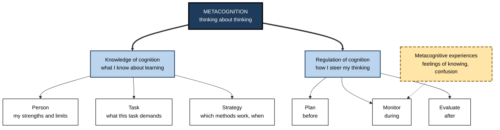
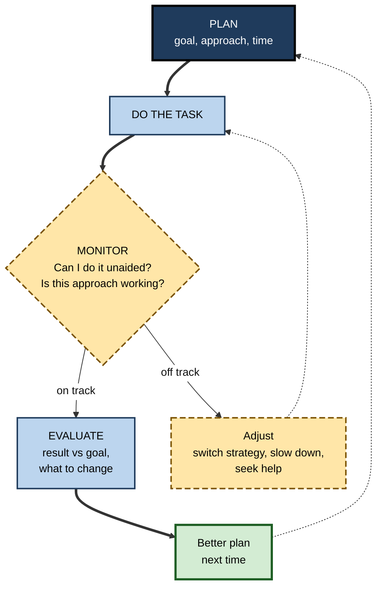

# K.1. Defining Metacognition

> **In one sentence:** Metacognition is your mind watching and steering itself: knowing how you think and learn, noticing how well it is going right now, and changing course when it is not.
>
> **Why it matters:** Two people with the same intelligence and the same materials can learn at very different speeds. One of the biggest differences is whether they can tell what they do and do not understand, and act on it. In knowledge work, especially when working with AI tools, that self-checking ability decides whether errors get caught.
>
> **Level span:** Novice → Expert · **Reading time:** ~17 min · **Builds on:** a basic idea of learning and memory

---

## The Learning Ladder

| Level | Badge | After this level you can... |
|---|---|---|
| 1 | NOVICE | Explain "thinking about your thinking" in plain words with everyday examples. |
| 2 | FOUNDATIONS | Name the two halves of metacognition (knowledge and regulation) and the three regulation activities (plan, monitor, evaluate). |
| 3 | PRACTITIONER | Run a simple plan–monitor–evaluate routine on a real learning or work task. |
| 4 | ADVANCED | Explain the object-level / meta-level model, the main measurement approaches, and what the evidence does and does not show. |
| 5 | EXPERT / PRO | Use the concept precisely when designing training, reviewing work processes, and deciding how people should work with AI. |

---

## Level 1 · Novice — The Big Picture

**Cognition** is thinking: reading, remembering, calculating, deciding. **Metacognition** is thinking *about* that thinking. It is the part of you that notices "I am not following this paragraph", "I always forget names unless I write them down", or "this answer feels wrong, let me check it".

A useful analogy is a car with a driver and a dashboard. The engine is your cognition: it does the actual work. The dashboard is your monitoring: speed, fuel, warning lights. The driver is your control: the one who reads the dashboard and decides to slow down, refuel or take a different road. A powerful engine with no dashboard and an inattentive driver still ends up in a ditch.

You have already experienced metacognition when:

- you reached the bottom of a page, realised you had absorbed nothing, and went back to read it again;
- you knew before an exam that one topic was weak, so you spent your last evening on that topic;
- you said in a meeting, "I'm not sure about that figure, let me check before we decide".

You have also experienced its *failure*: you felt sure you understood something, then could not explain it to a colleague. That gap between the feeling of knowing and actual knowing is what most of this subtopic is about.

**The beginner's takeaway:** metacognition is not a special talent. It is a set of habits (planning, checking and reviewing your own thinking), and habits can be learned.

---

## Level 2 · Foundations — Core Concepts

### Where the term comes from

The developmental psychologist **John Flavell** introduced the term in the 1970s and gave the classic account in 1979, describing metacognition as "knowledge and cognition about cognitive phenomena". He studied children who could not yet tell when they had memorised something well enough, and noticed that this self-knowledge develops with age and experience. Around the same time, **Ann Brown** studied how learners regulate their reading and problem solving. Their two emphases became the two halves of the modern definition.

### The two halves

| Half | Question it answers | Examples |
|---|---|---|
| **Metacognitive knowledge** (knowledge *of* cognition) | What do I know about how thinking and learning work, for me, for this task, for these strategies? | "I learn formulas better by deriving them than by reading them." "Essay questions need different preparation from multiple choice." |
| **Metacognitive regulation** (regulation *of* cognition) | What am I doing, right now, to steer my thinking? | Setting a plan, checking comprehension, noticing confusion, switching strategy, reviewing afterwards. |

Regulation is usually broken into three activities that map onto *before*, *during* and *after* a task:

1. **Planning**: choosing goals, strategies and time before you start.
2. **Monitoring**: tracking how well it is going while you work.
3. **Evaluating**: judging the result and the process afterwards, and deciding what to change next time.

Flavell also described **metacognitive experiences**: the conscious feelings that arise during thinking, such as the feeling of knowing, the tip-of-the-tongue state, or a sudden sense of confusion. These feelings are the raw data that monitoring works with.

**Figure K.1-1 — The anatomy of metacognition.**

*How to read it:* thick arrows split metacognition into its two halves; the dashed box shows the in-the-moment feelings that feed monitoring.

### Key terms

| Term | Plain meaning |
|---|---|
| **Cognition** | Mental work itself: perceiving, remembering, reasoning, deciding. |
| **Metacognition** | Awareness and control of your own cognition. |
| **Metacognitive knowledge** | Beliefs and facts about how thinking works: yours, the task's, the strategies'. |
| **Metacognitive regulation** | Planning, monitoring and evaluating your own thinking. |
| **Monitoring** | Judging the state of your own knowledge or progress ("Do I know this?"). |
| **Control** | Acting on that judgement ("Then I will study it again"). |
| **Metacognitive experience** | A felt signal during thinking: familiarity, confusion, the tip-of-the-tongue state. |
| **Calibration** | How well your confidence matches your actual performance. |

### What metacognition is not

- **Not intelligence.** It correlates with ability but is measurably separate; people of high ability can be poorly calibrated.
- **Not just "reflection".** Reflection usually means looking back; metacognition also operates before and *during* a task.
- **Not introspection about feelings in general.** It is specifically about cognitive activity: knowing, learning, reasoning, deciding.
- **Not always conscious.** Many monitoring signals, such as a sense of familiarity, arise automatically. The skill lies in learning when to trust them.

---

## Level 3 · Practitioner — Putting It to Work

The definition becomes useful when you turn it into three short questions asked at fixed moments. This is the simplest robust metacognitive routine.

### The Plan–Monitor–Evaluate routine

1. **Before (Plan).** Write two lines: *What exactly is the goal?* and *Which approach will I use, and why that one?* Add a rough time budget.
2. **During (Monitor).** Set two or three checkpoints. At each, close the source and ask: *Can I explain or do what I just covered, without help? Is my approach working, or am I just busy?*
3. **After (Evaluate).** Compare the result with the goal. Ask: *What worked? What did not? What will I do differently next time?* Write one sentence for each.

**Figure K.1-2 — The Plan–Monitor–Evaluate loop wrapped around a task.**

*How to read it:* the thick path is one pass through a task; dotted arrows are the feedback loops that make the next attempt better.

### Worked example — a consultant learning a new industry

| | Before (no metacognition) | After (Plan–Monitor–Evaluate) |
|---|---|---|
| **Plan** | "Read everything about the insurance sector this week." | "By Friday I can explain the five main revenue drivers of a mid-size insurer to my manager, without notes. Approach: two analyst reports, then build a one-page driver tree from memory." |
| **Monitor** | Reads 120 pages; feels well informed. | After each report, closes it and sketches the driver tree. Notices she cannot explain reinsurance; flags it. |
| **Adjust** | None. | Asks a colleague for a 15-minute explanation of reinsurance; redraws the tree. |
| **Evaluate** | In the client meeting, cannot answer a basic question on the combined ratio. | Explains the drivers on Friday; notes "learning from reports works only if I rebuild the structure from memory." |

### Common mistakes

- **Treating metacognition as a one-off reflection** at the end, instead of checkpoints during the task.
- **Monitoring with the source open.** Re-reading feels like checking but mostly measures recognition.
- **Vague goals** that cannot be monitored ("get better at Python").
- **Noticing a problem and not acting.** Monitoring without control changes nothing.

---

## Level 4 · Advanced — Mechanisms, Models & Evidence

### The object-level / meta-level model

The most influential formal model comes from **Thomas Nelson and Louis Narens (1990)**. They split the mind into two levels:

- The **object level** does the cognitive work: encoding, retrieving, solving.
- The **meta level** holds a simplified *model* of what the object level is doing.

Two flows of information connect them. **Monitoring** carries information *up*: the meta level receives signals about the state of the object level ("this item feels familiar"). **Control** sends instructions *down*: the meta level starts, continues, changes or stops object-level activity ("study this again", "stop searching memory"). The model's power is that it makes metacognition testable. You can measure monitoring by asking for confidence ratings or judgements of learning and comparing them with performance, and you can measure control by observing what people choose to restudy or how long they persist.

A key insight is that **monitoring and control can come apart**. Someone can accurately know they do not understand a topic and still not restudy it (a control failure), or diligently restudy the wrong items because their monitoring is off (a monitoring failure). Good self-regulation needs both.

### How metacognition is measured

| Approach | What it captures | Strengths | Weaknesses |
|---|---|---|---|
| **Self-report questionnaires** (for example the Metacognitive Awareness Inventory, Schraw and Dennison, 1994) | People's beliefs about their own metacognitive habits | Fast, scalable | Measures what people *say* they do; weakly related to actual monitoring accuracy |
| **Think-aloud protocols** | Planning, monitoring and evaluation statements made during a task | Rich, observed in action | Labour-intensive; talking can alter the task |
| **Judgement–performance comparison** | Accuracy of confidence ratings, judgements of learning and predictions | Objective, precise | Usually lab-based; task-specific |
| **Behavioural traces** (log data in digital learning) | Restudy choices, time allocation, help-seeking | Real behaviour at scale | Needs interpretation; intent is inferred |

A recurring lesson from meta-analyses is that **online measures** (collected during a task: think-aloud, judgement accuracy, traces) predict achievement better than **offline self-reports** collected before or after.

### What the evidence shows

- **The correlation with achievement is real but modest.** A widely cited 2016 meta-analysis of school-age learners (Dent and Koenka) found a small positive correlation between metacognitive processes and academic achievement, larger when metacognition was measured during the task.
- **Teaching metacognition works when done well.** The UK Education Endowment Foundation's evidence toolkit rates metacognition and self-regulation as one of the highest-impact, lowest-cost approaches in schools, and in November 2025 it published a second edition of its guidance after a review of several hundred studies. The *average* effect hides large variation: impact depends on explicit teaching, modelling, and embedding strategies in subject content rather than teaching "thinking skills" in a vacuum.
- **Some reported effects are inflated.** Recent meta-analyses in mathematics report very large effects of metacognitive instruction. Treat such numbers with caution: small studies and researcher-designed tests tend to inflate effect sizes.

### Domain-general or domain-specific?

Is metacognition one general ability or many local ones? Recent neuroscience, synthesised in Stephen Fleming's 2024 *Annual Review of Psychology* article, suggests **both**. People's overall *confidence level* (their bias) is fairly consistent across tasks, which looks domain-general. But *metacognitive efficiency* (how well confidence tracks accuracy) is partly domain-specific: patients with damage to the front-most part of the prefrontal cortex lost perceptual metacognitive accuracy while their memory metacognition stayed intact. The practical implication: being well calibrated about your coding does not guarantee calibration about your financial forecasts.

### Open debates

- **Conscious versus implicit.** Some researchers reserve "metacognition" for explicit, reportable reflection; others include fast, automatic feelings such as fluency. Most current work accepts both, distinguishing *experience-based* from *theory-based* judgements.
- **Metacognition versus self-regulated learning.** Self-regulated learning is broader: it adds motivation, emotion and behaviour. Metacognition is its cognitive control system.
- **Machine metacognition.** Since 2024 there has been a surge of work on whether large language models can monitor their own accuracy. This has sharpened the human-side definitions: monitoring is a confidence signal that should track accuracy, and control is the use of that signal to act.

---

## Level 5 · Expert / Pro — Professional Mastery

### Why the concept matters more in the AI era

Generative AI shifts knowledge work from *producing* answers to *judging* them. Microsoft Research's 2025 survey of 319 knowledge workers found that higher confidence in the AI was associated with *less* critical thinking, while higher self-confidence in one's own task ability was associated with *more*. A separate 2025 study in *Computers in Human Behavior* found that people solving reasoning problems with an AI assistant scored better than those without it but *overestimated* their performance substantially. In other words, AI can raise performance while lowering the accuracy of self-assessment. Metacognition is the professional skill that closes this gap: knowing when an output needs verification, and what you would need to know to verify it.

### How professionals use the definition

| Context | What metacognition looks like in practice |
|---|---|
| **Software engineering** | Estimating confidence in a fix before testing; writing "what would prove me wrong?" in a pull request; noticing when you are debugging by random edits rather than by hypothesis. |
| **Consulting and analysis** | Flagging confidence levels on findings; separating "we know", "we believe" and "we assume" in a deck. |
| **Management** | Running after-action reviews; asking "how did we decide?" as well as "what did we decide?" |
| **L&D and instructional design** | Building planning prompts, self-checks and reflection into programmes, and measuring calibration, not just test scores. |
| **Clinical and safety-critical work** | Structured checklists and speak-up protocols exist because individual monitoring fails under fatigue and time pressure. |

### Designing for metacognition at scale

Professionals who design learning or work systems treat metacognition as something to **externalise and scaffold**, not just exhort. Effective designs:

1. **Make monitoring cheap**: built-in, low-stakes self-tests with feedback, so learners get accurate signals instead of relying on feelings.
2. **Make planning visible**: templates that ask for goal, approach and success criteria before work begins.
3. **Make evaluation routine**: short structured debriefs after projects, incidents and courses.
4. **Fade the scaffolds**: prompts are removed as people internalise the questions, or the habits never become their own.
5. **Measure calibration**: the gap between predicted and actual performance is a metric in its own right.

### Professional scenario

**Role:** Head of data science at a retail company.
**Situation:** Analysts produce forecasts with AI coding assistants. Output volume doubled, but two forecasts went to the board with errors no one flagged; the analysts had rated both "high confidence".
**What the pro does:** Introduces a lightweight protocol. Before running a model, analysts write the expected range of the result (a plan and a prediction). During review, a peer asks three fixed questions: *What would make this wrong? What did you verify yourself rather than accept from the assistant? How confident are you, from 0 to 100?* Each quarter, stated confidence is compared with the error rate. Over the following quarters the team's confidence ratings start to track accuracy, and analysts begin flagging uncertainty themselves. The head reports calibration alongside throughput.

### Ethical and practical limits

- Metacognition is not a substitute for knowledge: you cannot monitor what you have no standard to compare against.
- Over-monitoring has costs. Constant self-checking slows fluent experts and can feed anxiety; the goal is *well-timed* monitoring.
- Do not use self-reported "metacognitive awareness" scores for performance evaluation; they are easily gamed and weakly related to real behaviour.

---

## Myths vs. Evidence

| Myth | What the evidence shows |
|---|---|
| "Metacognition is just a fancy word for reflection." | It covers planning and live monitoring as well as reflection afterwards, and includes knowledge about strategies. |
| "Smart people automatically have good metacognition." | Ability and metacognitive accuracy are related but distinct; capable people can be badly miscalibrated. |
| "If I feel I understand, I understand." | Feelings of knowing are built from cues such as familiarity that are often unrelated to real understanding. |
| "Metacognition can be taught as a stand-alone thinking-skills course." | It works best when taught explicitly *inside* real subject content and practised there. |
| "Self-report questionnaires tell you how metacognitive someone is." | They capture beliefs about habits and predict performance less well than measures taken during real tasks. |
| "AI assistance makes self-checking unnecessary." | Studies in 2025 found AI can raise performance while making people *worse* at judging how well they did. |

## Practitioner Toolkit

**Plan–Monitor–Evaluate card** (copy onto a sticky note or the top of a work document)

- [ ] **Goal:** What exactly will be true when I am done?
- [ ] **Approach:** Which method, and why this one for this task?
- [ ] **Checkpoints:** When will I stop and test myself without help?
- [ ] **Signals:** What would tell me the approach is not working?
- [ ] **Confidence:** 0–100, how sure am I of the result? (Write it before checking.)
- [ ] **Review:** What worked, what did not, what changes next time?

**Three-question peer prompt** for reviews: *What would make this wrong? What did you check yourself? How confident are you, and why?*

## Self-Check

1. **[NOVICE]** Explain metacognition to a friend in one sentence, using an everyday example.
2. **[NOVICE]** In the car analogy, what do the engine, dashboard and driver stand for?
3. **[FOUNDATIONS]** What are the two halves of metacognition, and the three regulation activities?
4. **[FOUNDATIONS]** What is a metacognitive experience? Give an example.
5. **[PRACTITIONER]** Why should a monitoring checkpoint be done with the source closed?
6. **[ADVANCED]** Describe the Nelson and Narens model in terms of levels and information flows.
7. **[ADVANCED]** Why do measures taken during a task predict achievement better than self-report questionnaires?
8. **[EXPERT / PRO]** What did 2025 studies find about AI assistance and self-assessment, and what would you change in a team process as a result?

### Answer Key

1. Thinking about your own thinking; for example, noticing you did not understand a paragraph and rereading it.
2. Engine = cognition doing the work; dashboard = monitoring signals; driver = control decisions based on those signals.
3. Knowledge of cognition and regulation of cognition; plan, monitor, evaluate.
4. A conscious feeling that arises during thinking, such as the tip-of-the-tongue state or a sudden sense of confusion.
5. With the source open you are recognising, not recalling, which overstates what you could do unaided.
6. An object level does the cognition; a meta level holds a model of it. Monitoring flows up from object to meta level; control flows down.
7. They capture actual behaviour and judgement accuracy, whereas questionnaires capture beliefs about habits, which are often inaccurate.
8. AI raised performance, but people overestimated how well they did, and confidence in AI was linked to less critical thinking. Add explicit verification steps and confidence ratings made before checking, and track calibration over time.

## Key Takeaways

- Metacognition is **awareness and control of your own thinking**: knowledge of cognition plus regulation of cognition.
- Regulation runs in three moments: **plan before, monitor during, evaluate after**.
- The Nelson and Narens model frames it as **monitoring up, control down** between an object level and a meta level, and the two can fail separately.
- Feelings of knowing are useful signals but **not proof**; check with unaided tests.
- Evidence: a modest correlation with achievement, strong effects of **explicit, embedded** instruction, and some inflated estimates.
- Metacognitive accuracy is **partly domain-specific**: calibration in one field does not guarantee it in another.
- In AI-assisted work, metacognition is the skill that decides **what to verify**.

## Glossary

| Term | Meaning |
|---|---|
| Calibration | The match between confidence and actual accuracy. |
| Cognition | The mental processes of perceiving, remembering, reasoning and deciding. |
| Control (metacognitive) | Using monitoring information to start, change or stop cognitive activity. |
| Metacognition | Knowledge about, and regulation of, one's own cognition. |
| Metacognitive experience | A conscious feeling during cognition, such as familiarity or confusion. |
| Metacognitive knowledge | Knowledge about persons, tasks and strategies as they affect thinking. |
| Metacognitive regulation | Planning, monitoring and evaluating one's own thinking. |
| Meta level | In Nelson and Narens's model, the level that models and steers cognition. |
| Monitoring | Assessing the current state of one's own knowledge or progress. |
| Object level | The level at which cognitive work itself happens. |
| Think-aloud protocol | A method in which people say their thoughts aloud while doing a task. |
