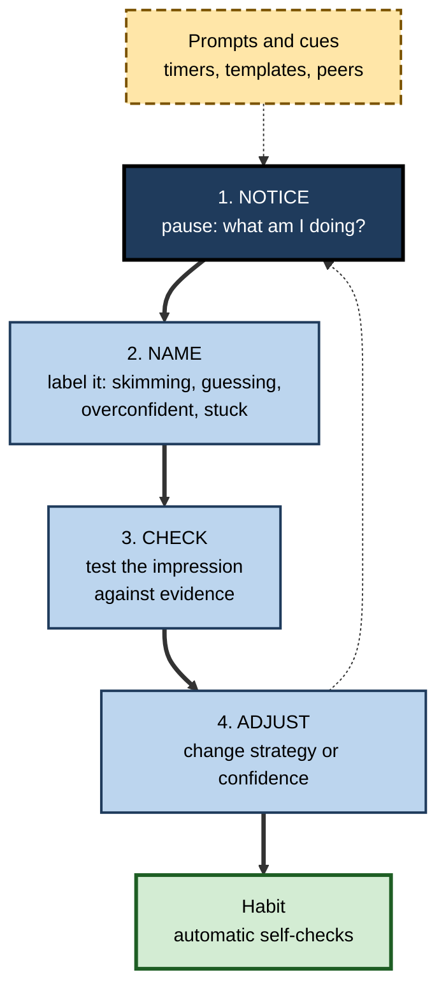
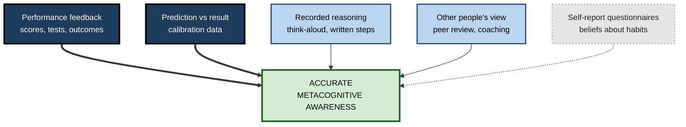

# K.10. Developing Metacognitive Awareness

> **In one sentence:** Developing metacognitive awareness means training yourself to notice what your mind is doing while it is doing it, and to check those impressions against reality, until accurate self-checking becomes a habit.
>
> **Why it matters:** Metacognition is not a fixed trait. It develops through childhood, keeps improving with expertise and feedback, and can be deliberately trained in adults. People who build it learn faster, catch more of their own errors and make better use of help and tools.
>
> **Level span:** Novice → Expert · **Reading time:** ~17 min · **Builds on:** metacognitive knowledge, monitoring and self-evaluation

---

## The Learning Ladder

| Level | Badge | After this level you can... |
|---|---|---|
| 1 | NOVICE | Notice and name your own thinking in a few everyday situations. |
| 2 | FOUNDATIONS | Describe how metacognition develops and the main ways to strengthen it. |
| 3 | PRACTITIONER | Run a four-week awareness-building routine with think-alouds, prediction logs and reflective notes. |
| 4 | ADVANCED | Evaluate measurement tools and training evidence, including what transfers across domains. |
| 5 | EXPERT / PRO | Build metacognitive awareness in yourself and others as part of professional development. |

---

## Level 1 · Novice — The Big Picture

Most of the time we think without noticing we are thinking. We read, decide and react on autopilot. **Metacognitive awareness** is the ability to step back for a moment and see the autopilot: "I'm skimming, not reading", "I'm assuming this number is right", "I'm getting frustrated and rushing".

An analogy is learning to hear your own accent. At first you cannot hear it at all; it is just "how you talk". With recordings, feedback and practice, you start to notice it, and then you can adjust it when you want to. Awareness comes before control.

You have already had flashes of metacognitive awareness when:

- you caught yourself rereading the same line and realised your mind had wandered;
- you noticed you always underestimate how long emails take;
- you realised halfway through an argument that you had misunderstood the other person's point.

**The beginner's takeaway:** awareness is a skill. You build it by regularly pausing to ask "What am I doing, and is it working?", and then checking the answer against evidence.

---

## Level 2 · Foundations — Core Concepts

### How metacognition develops

| Stage | What typically emerges | Example |
|---|---|---|
| **Early childhood** | Basic understanding that minds can be wrong; first feelings of knowing | A child realises a friend did not see where the toy was hidden. |
| **Primary school years** | Growing strategy knowledge; better judgement of when something is learned | Starting to rehearse a list before a test rather than looking once. |
| **Adolescence** | More abstract self-reflection; improved planning and monitoring, uneven across subjects | Recognising which subjects need which kind of study. |
| **Adulthood** | Expertise-specific awareness; calibration improves where feedback is frequent | An experienced forecaster knows when their gut is unreliable. |
| **Later adulthood** | Many monitoring abilities are relatively well preserved, even as some memory processes decline | Older adults often judge their learning accurately while noticing slower recall. |

Two points matter for adults. First, development **does not stop**: experience with clear feedback continues to sharpen awareness within a domain. Second, it is **uneven**: awareness in one domain (coding) does not automatically transfer to another (people management).

### Four routes to stronger awareness

1. **Externalise thinking**: think aloud, write reasoning down, explain to others.
2. **Predict and compare**: make predictions or confidence ratings, then check them against results.
3. **Reflect in a structured way**: short, regular, evidence-based reflection rather than vague journaling.
4. **Learn the vocabulary**: knowing terms such as fluency, calibration and planning fallacy makes patterns easier to notice.

**Figure K.10-1 — The awareness-building cycle.**

*How to read it:* the thick path is one cycle; repeated cycles (dotted loop) become a habit; dashed external prompts start the cycle until it runs on its own.

### Key terms

| Term | Plain meaning |
|---|---|
| **Metacognitive awareness** | Noticing your own thinking and learning processes as they happen. |
| **Think-aloud** | Speaking your thoughts while working on a task. |
| **Prediction log** | A record of predictions and confidence ratings compared with outcomes. |
| **Self-questioning** | Asking yourself structured questions during a task. |
| **Metacognitive Awareness Inventory (MAI)** | A 52-item self-report questionnaire by Schraw and Dennison (1994) covering knowledge and regulation of cognition. |
| **Metacognitive efficiency** | How well your confidence tracks your accuracy, given your level of performance. |

---

## Level 3 · Practitioner — Putting It to Work

### A four-week awareness programme (about 15 minutes a day)

**Week 1 — Notice.** Set two random alarms a day. When one rings, write one line: *What was I thinking about? Was I on task? What strategy was I using?* No judgement, just data.

**Week 2 — Think aloud.** Once a day, solve a real work problem (a bug, a spreadsheet, an email) while speaking your reasoning into a voice memo. Listen back for assumptions, skipped checks and moments of confusion you did not act on.

**Week 3 — Predict and compare.** Before tasks with checkable outcomes (estimates, test results, how long something will take, whether a fix will work), write a prediction and a confidence rating. Score them at the end of the week.

**Week 4 — Self-question.** Adopt three questions for every substantial task: *Before: What is my goal and plan? During: Is this working? After: What would I do differently?* Note which question most often changes what you do.

At the end, review the four weeks: What patterns did you notice? Where are you over- or underconfident? Which prompt was most useful? Keep that one.

### Worked example — a UX researcher building awareness

| | Week 1 | Week 4 |
|---|---|---|
| **Typical pattern** | Writes insight reports straight after interviews; "feels" which themes matter. | Before analysis, writes predicted top three themes with confidence. |
| **Awareness** | Unaware that early interviews dominate her conclusions. | Prediction log shows she overweights the first and most vivid interview. |
| **Adjustment** | None. | Codes all interviews before ranking themes; asks a colleague to code two blind. |
| **Result** | Stakeholders occasionally challenge findings. | Findings hold up better; she now flags confidence per insight. |

**Figure K.10-2 — Sources of evidence that sharpen awareness.**

*How to read it:* thick arrows mark the strongest evidence sources; the dotted, grey box (self-report) is useful for reflection but weak as evidence.

### Common mistakes

- **Journaling feelings without evidence.** Awareness needs comparison with outcomes, not just introspection.
- **Too much at once.** One prompt, practised daily, beats a long checklist used once.
- **Treating questionnaires as diagnosis.** A high MAI score shows what you believe about your habits, not how accurate your monitoring is.
- **Stopping when it becomes uncomfortable.** Awareness often reveals more mistakes at first; that is progress.

---

## Level 4 · Advanced — Mechanisms, Models & Evidence

### Measuring awareness: what each tool tells you

| Tool | Measures | Limits |
|---|---|---|
| **Metacognitive Awareness Inventory** (Schraw and Dennison, 1994) | Self-reported knowledge and regulation of cognition | Good internal consistency, but correlations with actual monitoring accuracy are weak; prone to social desirability. |
| **Think-aloud protocols** | Spontaneous planning, monitoring and evaluation statements | Time-consuming; verbalising can change the task. |
| **Calibration and resolution scores** | Accuracy of confidence judgements | Task-specific; need many items. |
| **meta-d' and M-ratio** | Metacognitive efficiency controlling for task performance | Requires many trials; mostly lab-based. |
| **Trace data** | Self-test use, revisits, help requests | Infers intent from behaviour. |

Research comparing these finds that **self-report and performance-based measures often disagree**. Performance-based measures predict learning outcomes more consistently. For personal development, use self-report to prompt reflection and performance-based measures to check reality.

### Can metacognitive ability be trained?

- **Strategy instruction improves monitoring accuracy.** A meta-analysis of 56 studies of learning-strategy instruction interventions found a moderate average improvement in monitoring accuracy, with substantial variation across studies.
- **Feedback on confidence helps.** Lab studies in which people rate confidence and receive feedback on its accuracy show improvements in metacognitive efficiency. A 2019 study by Jason Carpenter, Stephen Fleming and colleagues found that adaptive training with feedback on confidence improved metacognitive efficiency and that gains transferred to some untrained tasks, which suggests a partly domain-general component.
- **Practice alone is not enough.** Simply repeating tests without feedback on calibration often leaves overconfidence unchanged; some classroom studies found that general metacognitive training did not change calibration.
- **Mindfulness and meditation.** Small studies have reported improved metacognitive accuracy after brief mindfulness training. Evidence is preliminary.

### Why awareness grows with expertise and feedback

Experts develop **richer task knowledge**, so they know what a good answer looks like and can detect deviations. In domains with **fast, clear feedback** (weather forecasting, some games, testing code), calibration becomes good. In domains with **slow, noisy feedback** (long-term strategy, hiring, many medical judgements), even experienced professionals can remain poorly calibrated. Awareness depends on the environment as much as on the person.

### Awareness and emotion

Metacognitive awareness includes noticing emotional states that affect thinking: anxiety narrowing attention, frustration pushing premature closure, overconfidence after a success. Research on Boekaerts's dual-processing model of self-regulation shows that perceived threat shifts learners from learning-focused to self-protective goals. Noticing that shift is part of awareness.

### Open questions

- How domain-general is trained metacognitive ability? Evidence points to a mix of general and specific components.
- What is the best balance between external prompts and self-generated awareness, and when should prompts be faded?
- How does constant AI assistance affect the development of awareness in students and early-career professionals who have never worked without it? Early evidence on overestimation with AI suggests the risk is real.

---

## Level 5 · Expert / Pro — Professional Mastery

### Awareness as a professional development goal

Professionals in many fields now treat calibration and reflective awareness as competencies:

| Field | Practice |
|---|---|
| **Medicine** | Teaching diagnostic "time-outs" and reflection on reasoning to counter premature closure. |
| **Forecasting and intelligence analysis** | Scoring probability judgements and giving calibration feedback. |
| **Software engineering** | Code review that asks authors to state confidence and known risks; postmortems that examine reasoning. |
| **Leadership** | Coaching that develops awareness of one's own decision patterns and biases. |

### Coaching for awareness

A coach or manager builds awareness in others by:

1. **Asking, not telling**: "What was your reasoning there?" "How confident were you?"
2. **Making predictions explicit**: asking people to forecast outcomes before results are known.
3. **Reviewing evidence together**: comparing predictions and outcomes without judgement.
4. **Naming patterns**: "You tend to commit early when under time pressure. What could you check first?"
5. **Fading support**: gradually letting the person ask the questions themselves.

### AI-era awareness

Generative AI can be a mirror or a fog. As a **mirror**, it can ask Socratic questions, score your predictions and summarise patterns across your reflection logs. As a **fog**, it can do the thinking so that there is nothing for you to be aware of. The 2025 finding that AI users overestimate their performance, and that those who rate their AI literacy highly overestimate more, is a direct warning. A practical rule: in any AI-assisted task, keep one moment where you predict, decide or explain without the tool.

### Professional scenario

**Role:** Senior manager in a consulting practice responsible for developing junior analysts.
**Situation:** Juniors produce technically correct analyses but often miss when their conclusions rest on fragile assumptions; they rarely flag uncertainty.
**What the pro does:** Introduces a monthly "reasoning review". Each junior brings one recent analysis, walks through it thinking aloud, and states confidence for each key conclusion. The group asks only questions, no criticism. Juniors keep a prediction log for client numbers they estimate before data arrive. After three months, juniors flag assumptions in drafts unprompted, and the manager sees fewer late-stage reversals. The process is then handed to a rotating junior facilitator.

---

## Myths vs. Evidence

| Myth | What the evidence shows |
|---|---|
| "Some people are just self-aware; others aren't." | Metacognitive awareness develops with experience and can be trained, especially with feedback. |
| "Journaling builds self-awareness." | Reflection helps most when it is structured and compared against evidence; unanchored journaling can reinforce biases. |
| "A high score on a metacognition questionnaire means good metacognition." | Self-report scores relate only weakly to actual monitoring accuracy. |
| "Experts are always well calibrated." | Calibration is good in fast-feedback domains and can remain poor in slow, noisy ones. |
| "Metacognitive skill is completely domain-specific." | Training studies suggest a partly general component, alongside strong domain-specific elements. |

## Practitioner Toolkit

**Daily awareness prompts (pick one per week)**

- [ ] Random alarm check: what am I thinking, and is it on task?
- [ ] Think aloud through one real problem.
- [ ] Predict one checkable outcome with a confidence rating.
- [ ] Ask the three questions: plan, progress, review.
- [ ] Name one emotion that affected my thinking today and how.

**Prediction log template**

| Date | Prediction | Confidence (0–100) | Actual result | Hit or miss | Pattern noticed |
|---|---|---|---|---|---|
| | | | | | |

## Self-Check

1. **[NOVICE]** Describe a recent moment when you noticed your own thinking.
2. **[FOUNDATIONS]** Name two ways metacognition develops after childhood.
3. **[FOUNDATIONS]** What are the four routes to stronger awareness?
4. **[PRACTITIONER]** Outline the four-week awareness programme.
5. **[ADVANCED]** Why are self-report questionnaires such as the MAI limited as measures?
6. **[ADVANCED]** What does the training evidence say about improving metacognitive accuracy?
7. **[ADVANCED]** Why are professionals in some fields better calibrated than in others?
8. **[EXPERT / PRO]** How would you coach a colleague to become more aware of their reasoning?

### Answer Key

1. Answers vary; for example, noticing you were skimming rather than reading an important document.
2. Through expertise in a domain and through frequent, clear feedback; also via explicit training.
3. Externalise thinking, predict and compare, reflect in a structured way, learn the vocabulary.
4. Week 1 notice (random alarms); week 2 think aloud; week 3 predict and compare; week 4 self-question; then review and keep the most useful prompt.
5. They measure beliefs about habits, are prone to social desirability, and correlate weakly with actual monitoring accuracy.
6. Strategy instruction and feedback on confidence produce moderate improvements; repetition without calibration feedback often does not; some gains transfer across tasks.
7. Calibration depends on feedback: fast, clear feedback domains produce good calibration; slow, noisy ones do not.
8. Ask about reasoning and confidence, make predictions explicit, review outcomes together without judgement, name patterns, and fade support.

## Key Takeaways

- Metacognitive awareness is **noticing your thinking in action** and checking it against evidence.
- It **develops** across childhood and continues to grow with **expertise and feedback**.
- Build it with **think-alouds, prediction logs, self-questioning and structured reflection**.
- **Performance-based evidence** beats self-report for judging awareness.
- Training with **confidence feedback** improves accuracy, with some transfer.
- In AI-assisted work, keep **one tool-free moment** to predict, decide or explain.

## Glossary

| Term | Meaning |
|---|---|
| Calibration feedback | Information about how well confidence matched accuracy. |
| Metacognitive Awareness Inventory | A self-report questionnaire of knowledge and regulation of cognition. |
| Metacognitive awareness | Conscious noticing of one's own cognitive processes. |
| Metacognitive efficiency | Metacognitive sensitivity relative to task performance. |
| M-ratio | The ratio of meta-d' to d', a measure of metacognitive efficiency. |
| Prediction log | A record of predictions, confidence and outcomes. |
| Premature closure | Accepting a conclusion before it has been adequately checked. |
| Self-questioning | Asking oneself structured questions during a task. |
| Social desirability | The tendency to answer questionnaires in a favourable light. |
| Think-aloud | Verbalising thoughts while working on a task. |
