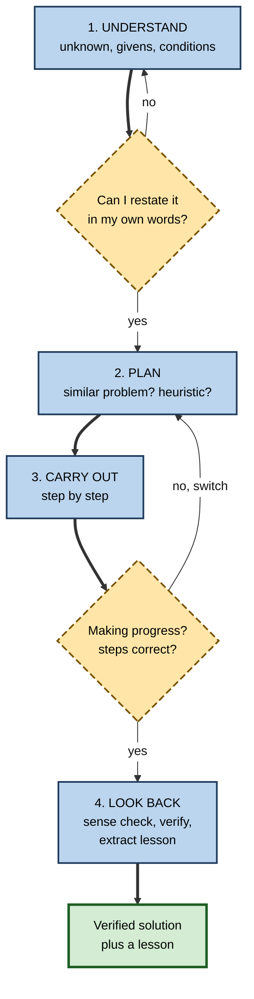
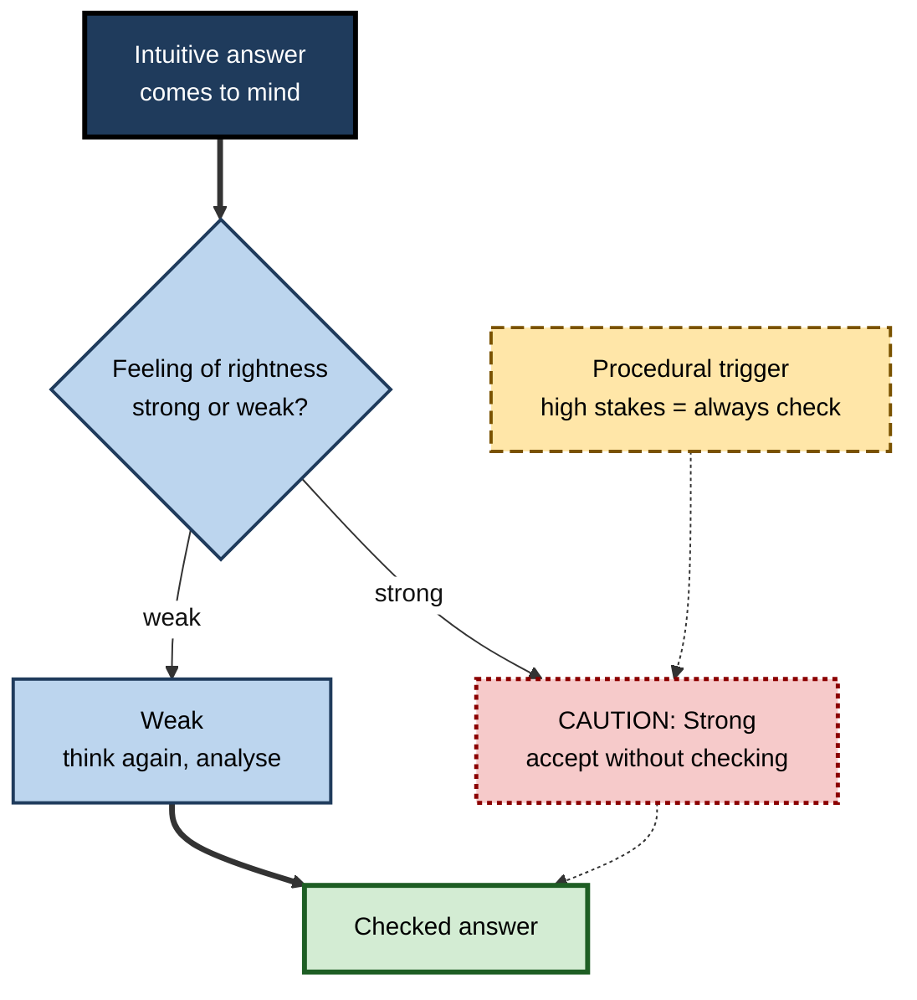

# K.11. Metacognition in Problem Solving

> **In one sentence:** Metacognition in problem solving is the "manager" in your head that makes sure you understand the problem, choose an approach deliberately, notice when you are going nowhere, and check the answer before trusting it.
>
> **Why it matters:** Research on problem solving shows that many failures come not from missing knowledge but from poor self-management: rushing into the first idea, persisting on a dead end, and not checking. These are exactly the failures that cost time in debugging, analysis, consulting and design.
>
> **Level span:** Novice → Expert · **Reading time:** ~18 min · **Builds on:** monitoring and control; planning and self-evaluation

---

## The Learning Ladder

| Level | Badge | After this level you can... |
|---|---|---|
| 1 | NOVICE | Explain why "how you manage your thinking" matters as much as "what you know" in solving problems. |
| 2 | FOUNDATIONS | Use Pólya's four phases and know where monitoring and control fit in each. |
| 3 | PRACTITIONER | Apply Schoenfeld's three control questions and a stuck-protocol to real problems. |
| 4 | ADVANCED | Explain the evidence on control failures, expert–novice differences, the feeling of rightness and insight. |
| 5 | EXPERT / PRO | Build metacognitive problem-solving routines into teams, reviews and AI-assisted work. |

---

## Level 1 · Novice — The Big Picture

Picture two people facing the same tricky spreadsheet error. The first immediately starts changing formulas, tries one idea for forty minutes, and gives up frustrated. The second spends two minutes asking "What exactly is wrong? What changed? What are three possible causes?", tests the most likely one, notices after ten minutes that it is not working, switches, and fixes it. They know the same amount about spreadsheets. The difference is **metacognition**: the second person is *managing* their problem solving.

An analogy is a hiking party lost in fog. Knowledge is the equipment in their packs. Metacognition is the person who stops the group every so often to ask: "Where are we? Is this path taking us where we want? Should we turn back?" Without that person, a well-equipped group can walk confidently in the wrong direction for hours.

You have already used metacognition in problem solving when:

- you reread a question because your answer did not make sense;
- you stopped trying to force a puzzle piece and looked for a different one;
- you checked an estimate ("that can't be right, it's ten times last year's figure").

**The beginner's takeaway:** good problem solvers regularly stop and ask, "What am I doing, why, and is it working?"

---

## Level 2 · Foundations — Core Concepts

### Pólya's four phases

The mathematician **George Pólya**, in *How to Solve It* (1945), described four phases that remain a standard framework:

| Phase | Core question | Metacognitive role |
|---|---|---|
| **1. Understand the problem** | What is unknown? What is given? What are the conditions? | Monitoring comprehension; noticing ambiguity. |
| **2. Devise a plan** | Have I seen something similar? What strategy might work? | Planning; choosing among heuristics. |
| **3. Carry out the plan** | Is each step correct? | Monitoring progress and correctness. |
| **4. Look back** | Does the answer make sense? Can I check it another way? What did I learn? | Evaluation; extracting lessons for next time. |

Pólya also listed **heuristics**, rules of thumb for making progress when there is no direct method: draw a diagram, solve a simpler version, work backwards, look for a related problem, break the problem into parts.

### Knowledge, heuristics and control

The mathematics educator **Alan Schoenfeld** argued that problem-solving performance depends on four things:

1. **Resources**: what you know (facts, procedures).
2. **Heuristics**: strategies for making progress.
3. **Control**: metacognitive management, meaning decisions about what to do, monitoring progress and switching.
4. **Beliefs**: what you believe about the domain and yourself (for example, "real maths problems take under five minutes").

His key finding was that students with enough knowledge often still failed because of weak **control**.

**Figure K.11-1 — Pólya's phases with metacognitive checkpoints.**

*How to read it:* boxes are Pólya's phases; dashed diamonds are metacognitive checkpoints that can send you back to an earlier phase.

### Key terms

| Term | Plain meaning |
|---|---|
| **Heuristic** | A rule of thumb for making progress when there is no direct method. |
| **Control** (in problem solving) | Managing the solution process: choosing, monitoring, switching. |
| **Wild goose chase** | Pursuing an approach for a long time without checking if it is working. |
| **Impasse** | A point where you are stuck and no next step seems available. |
| **Problem representation** | How you mentally frame what the problem is. |
| **Feeling of rightness** | The intuitive sense that an answer is correct. |
| **Sense check** | A quick test of whether an answer is plausible. |

---

## Level 3 · Practitioner — Putting It to Work

### Schoenfeld's three control questions

In his problem-solving courses, Schoenfeld regularly interrupted students to ask:

1. **What exactly are you doing?** (Can you describe it precisely?)
2. **Why are you doing it?** (How does it fit into the solution?)
3. **How does it help you?** (What will you do with the result?)

Over the course, students increasingly asked themselves these questions, and the share of solution attempts with no self-regulation dropped sharply.

### The stuck-protocol

When you hit an impasse:

1. **Stop and summarise**: write what you know, what you tried and what happened.
2. **Re-read the problem**: misunderstanding is the most common hidden cause.
3. **Generate alternatives**: list at least three different approaches or hypotheses.
4. **Pick the cheapest test**: which approach can be checked fastest?
5. **Time-box it**: set a limit before switching again.
6. **Explain it to someone** (or a rubber duck): verbalising often exposes the gap.
7. **Seek help** after two failed approaches, with a precise question.

### Worked example — a data engineer with a failing pipeline

| | Before (no control) | After (control questions and stuck-protocol) |
|---|---|---|
| **Understanding** | Assumes the source API changed. | Reads the error and logs; restates: "Job fails only on Mondays, after the weekend batch." |
| **Plan** | Rewrites the API client. | Lists hypotheses: data volume, time zone, API change. Cheapest test: compare Monday and Tuesday volumes. |
| **Execution** | Two hours rewriting, still failing. | Volume test shows Monday batches exceed a memory limit. |
| **Monitoring** | No checkpoints. | "Is this helping?" asked every 20 minutes. |
| **Look back** | Not done. | Adds a volume alert and writes a short note on the debugging path for the team. |

### Common mistakes

- **Diving in before understanding.** Most wasted effort traces back to a misread problem.
- **The wild goose chase.** Persisting on one approach without checking progress.
- **Skipping "look back".** Unchecked answers are where confident errors live, and the lesson is lost.
- **Changing several things at once.** You cannot tell which change worked.

---

## Level 4 · Advanced — Mechanisms, Models & Evidence

### Control failures: Schoenfeld's evidence

Schoenfeld videotaped college and high-school students working unfamiliar problems. Roughly **60%** of solution attempts followed the pattern "read, make a decision quickly, and pursue that direction" regardless of progress. Students often had the knowledge needed to solve the problem; they failed because they never reconsidered their initial choice. In his course, which emphasised the three control questions, the proportion of attempts without self-regulation fell to about **20%**, with corresponding gains in success. The findings are classic, from relatively small samples, but they align with later research on metacognitive instruction.

### Instruction that builds metacognitive problem solving

- **IMPROVE** (Zemira Mevarech and Bracha Kramarski) teaches students to ask themselves comprehension, connection, strategy and reflection questions while solving problems; studies report gains in mathematical reasoning, particularly on complex and unfamiliar problems.
- **Meta-analyses of metacognitive instruction in mathematics**, including a 2025 analysis of 43 studies, report large average effects on achievement. Treat the size cautiously: many studies are small and use researcher-designed tests. The direction of effect, however, is consistent.
- **The UK Education Endowment Foundation's 2025 guidance** emphasises modelling expert thinking aloud and structured talk about planning, monitoring and evaluating during problem solving.

### Experts versus novices

Classic work by Michelene Chi and colleagues (1981) showed that physics experts classified problems by **deep principles** (conservation of energy) while novices classified by **surface features** (inclined planes). Experts typically spend relatively more time **understanding and representing** the problem and less time flailing in execution. They monitor more and abandon unproductive paths sooner. Expertise brings better metacognition *within* the domain because experts know what progress looks like.

### The feeling of rightness and when we think twice

Valerie Thompson's **metacognitive dual-process** account proposes that every intuitive answer comes with a **feeling of rightness** (FOR). A strong FOR tends to stop further thinking; a weak FOR triggers more deliberate analysis. The FOR is driven by cues such as how fluently the answer came to mind, not by its correctness. This explains why people accept wrong intuitive answers on trick questions: the answer felt right, so no check was triggered. A practical implication is to rely on **procedural triggers** (always sense-check high-stakes answers) rather than waiting for a feeling of doubt.

**Figure K.11-2 — The feeling of rightness as a gate on further thinking.**

*How to read it:* a strong feeling of rightness normally ends thinking (dotted-border box); the dashed procedural trigger forces a check anyway, rejoining the path to a checked answer.

### Insight problems are different

Janet Metcalfe and David Wiebe (1987) asked people to rate their "warmth" (how close they felt to a solution) while solving problems. For step-by-step problems, warmth rose gradually as people approached the solution. For **insight problems**, warmth stayed low until the solution appeared suddenly. Feelings of progress are therefore **unreliable for insight-type problems**. For those, taking a break, changing representation, or explaining the problem to someone else often helps more than persistence.

### AI and problem solving

When an AI assistant proposes a solution, it supplies a ready-made answer with high fluency, which strengthens the feeling of rightness and weakens the urge to check. Microsoft Research's 2025 survey of knowledge workers found that AI shifts effort from problem solving to **verification and integration**, and that higher confidence in the AI was associated with less critical thinking. Metacognitive problem solving in the AI era means owning Pólya's phases 1 and 4 (understanding the problem and looking back) even when the tool handles phases 2 and 3.

---

## Level 5 · Expert / Pro — Professional Mastery

### Team-level metacognition in problem solving

| Practice | Metacognitive function |
|---|---|
| **Problem statements before solutions** | Forces phase 1; aligns the team on what is actually being solved. |
| **Hypothesis-driven debugging and analysis** | Makes plans explicit and testable; reduces wild goose chases. |
| **Time-boxed spikes with check-ins** | Built-in monitoring and switching points. |
| **Pairing and mob sessions** | One person drives, another monitors and asks control questions. |
| **Design and code reviews** | External look-back that catches what the solver's feeling of rightness missed. |
| **Postmortems on solution paths** | Evaluate the process, not just the fix; spread control strategies. |

### Professional scenario

**Role:** Principal engineer mentoring a team that struggles with production incidents.
**Situation:** Incidents drag on because responders jump to fixes, change several things at once, and rarely write down what they tried.
**What the pro does:** Introduces an incident problem-solving protocol: the incident commander states the problem in one sentence (understand); responders post hypotheses with the cheapest test for each (plan); every 15 minutes the commander asks Schoenfeld's three questions out loud (monitor); only one change at a time (control); and the postmortem includes a section on the reasoning path (look back). The principal engineer models the protocol in the first incidents, thinking aloud. Diagnosis time shortens, and newer engineers begin running incidents confidently because the protocol makes expert control visible.

### Designing AI-assisted problem solving

- **Keep understanding human.** Require a human-written problem statement before invoking the assistant.
- **Ask for alternatives, not an answer.** "Give me three hypotheses and how to test each" preserves the plan phase.
- **Verify independently.** Tests, recalculation, or a second source for every AI-proposed solution in high-stakes work.
- **Look back without the tool.** Explain why the solution works; if you cannot, you have not solved the problem yet.

### Limits

- Over-structured protocols can slow experts on routine problems. Use them for novel, high-stakes or stuck situations.
- Control questions asked as interrogation create defensiveness; ask them as shared thinking tools.

---

## Myths vs. Evidence

| Myth | What the evidence shows |
|---|---|
| "If you know enough, you'll solve the problem." | Schoenfeld showed that students with adequate knowledge often failed through poor control. |
| "Persistence always pays off." | Persisting without monitoring produces wild goose chases; switching at the right time matters. |
| "If an answer feels right, it probably is." | The feeling of rightness tracks fluency, not correctness, and can stop needed checking. |
| "Feeling close to a solution means you are close." | For insight problems, feelings of warmth do not predict imminent solution. |
| "Experts solve problems faster by skipping understanding." | Experts often spend relatively more time representing the problem and less time on fruitless execution. |
| "AI can do the problem solving now." | AI shifts work toward verification; understanding and looking back remain human responsibilities. |

## Practitioner Toolkit

**Problem-solving control card**

- [ ] I restated the problem in my own words, including what success looks like.
- [ ] I listed at least two approaches or hypotheses before starting.
- [ ] I set a time box and a check-in point.
- [ ] At each check-in I asked: What am I doing? Why? How does it help?
- [ ] I changed one thing at a time.
- [ ] I sense-checked and verified the answer another way.
- [ ] I wrote one lesson from the solution path.

**Stuck-protocol (copy into your notes)**

1. Summarise what you know and tried.
2. Re-read the problem.
3. List three alternatives.
4. Pick the cheapest test.
5. Time-box it.
6. Explain it aloud.
7. Ask for help after two failed approaches.

## Self-Check

1. **[NOVICE]** What does the "fog" analogy say about knowledge versus metacognition?
2. **[FOUNDATIONS]** Name Pólya's four phases and a metacognitive question for each.
3. **[FOUNDATIONS]** What four factors did Schoenfeld identify in problem-solving performance?
4. **[PRACTITIONER]** What are Schoenfeld's three control questions?
5. **[ADVANCED]** What proportion of attempts were "wild goose chases" in Schoenfeld's data, and what changed after his course?
6. **[ADVANCED]** What is the feeling of rightness, and why can it be misleading?
7. **[ADVANCED]** How do insight problems differ in their warmth ratings?
8. **[EXPERT / PRO]** How would you keep Pólya's phases human in AI-assisted work?

### Answer Key

1. Knowledge is the equipment; metacognition is the person who checks the map and decides whether to change direction.
2. Understand (can I restate it?), plan (have I seen a similar problem?), carry out (is each step correct and making progress?), look back (does it make sense, can I verify it?).
3. Resources, heuristics, control and beliefs.
4. What exactly are you doing? Why are you doing it? How does it help you?
5. About 60%; after the course, attempts without self-regulation fell to about 20%, with more successful solutions.
6. The intuitive sense that an answer is correct; it is driven by fluency, so wrong but fluent answers can feel right and stop further checking.
7. Warmth stays low until the solution appears suddenly, so feelings of progress do not predict success.
8. Write the problem statement yourself, ask the AI for alternatives rather than one answer, verify independently, and explain the solution without the tool.

## Key Takeaways

- Problem solving fails as often from **poor control** as from missing knowledge.
- **Pólya's four phases** (understand, plan, carry out, look back) give a structure for metacognitive checkpoints.
- **Schoenfeld's three questions** cut wild goose chases dramatically.
- The **feeling of rightness** reflects fluency, not correctness; use procedural checks.
- **Insight problems** do not give reliable progress signals; change representation or take a break.
- With AI, keep **understanding and looking back** firmly human.

## Glossary

| Term | Meaning |
|---|---|
| Control | Metacognitive management of the problem-solving process. |
| Feeling of rightness | An intuitive sense that an answer is correct, which governs whether further analysis occurs. |
| Heuristic | A rule of thumb for making progress on a problem. |
| Impasse | A state in which no next step seems available. |
| IMPROVE | A metacognitive instruction method using self-addressed questions during problem solving. |
| Insight problem | A problem typically solved by a sudden restructuring rather than step-by-step progress. |
| Problem representation | The mental model of what a problem is and what it requires. |
| Sense check | A quick plausibility test of an answer. |
| Warmth rating | A self-report of how close one feels to a solution. |
| Wild goose chase | Pursuing an unproductive approach without monitoring progress. |
