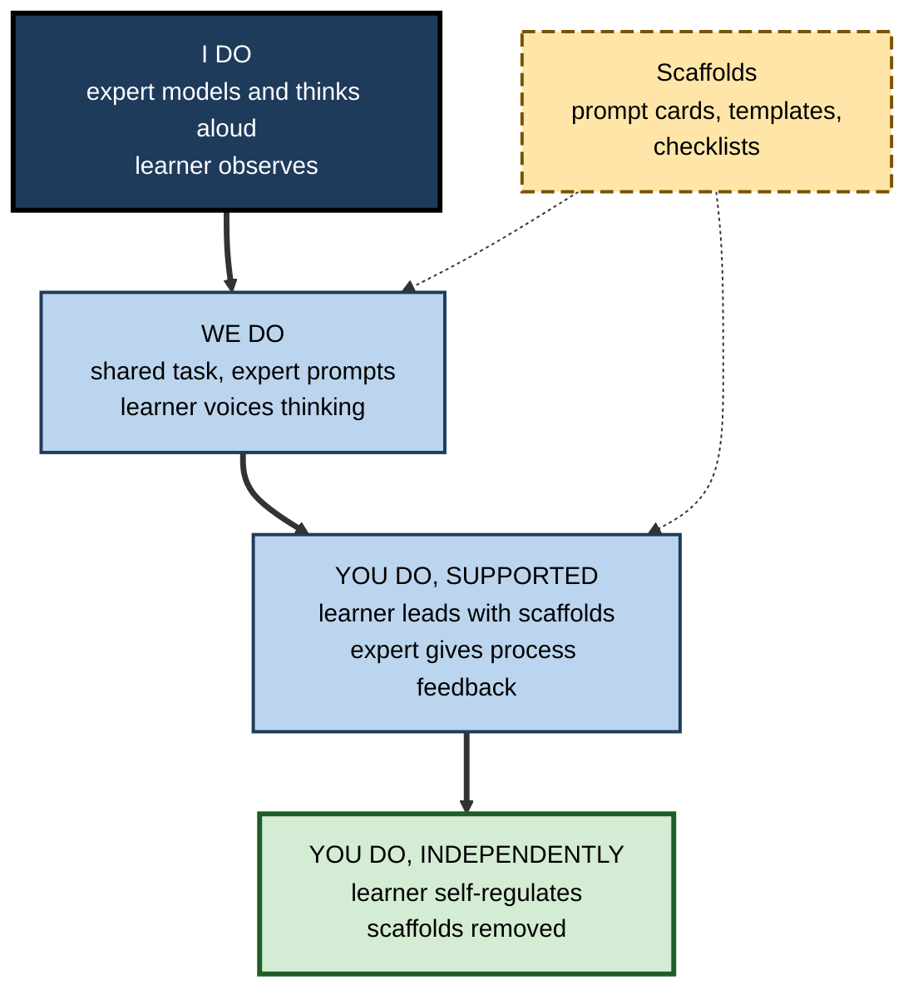
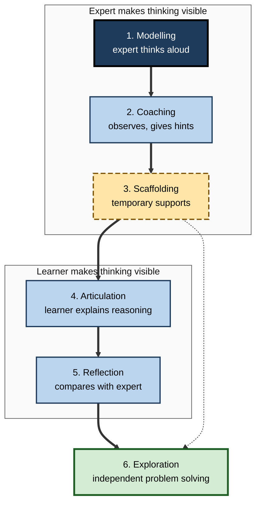

# K.12. Teaching Metacognition to Others

> **In one sentence:** Teaching metacognition means making your own invisible thinking visible to others, showing them how you plan, check and evaluate, and then gradually handing that self-management over to them.
>
> **Why it matters:** Metacognitive teaching is one of the best-evidenced, lowest-cost ways to improve learning in education, and the same principles power effective mentoring, onboarding, coaching and AI tutoring at work. People who can teach it multiply their impact far beyond their own output.
>
> **Level span:** Novice → Expert · **Reading time:** ~18 min · **Builds on:** all of the earlier metacognition concepts: knowledge, monitoring, control, self-regulation, evaluation

---

## The Learning Ladder

| Level | Badge | After this level you can... |
|---|---|---|
| 1 | NOVICE | Explain why experts' thinking is invisible to learners and why it needs to be shown. |
| 2 | FOUNDATIONS | Describe explicit instruction, modelling, scaffolding and fading, and metacognitive talk. |
| 3 | PRACTITIONER | Run a think-aloud demonstration and a gradual-release sequence with a learner or team. |
| 4 | ADVANCED | Explain the evidence base (including the EEF guidance, reciprocal teaching and cognitive apprenticeship) and its limits. |
| 5 | EXPERT / PRO | Design programmes, mentoring systems and AI tutors that build lasting metacognition in others. |

---

## Level 1 · Novice — The Big Picture

When an experienced colleague solves a problem, you see the result and maybe a few actions. You do not see the most important part: the quiet questions in their head. "What is this really asking? I've seen something like this before. That number looks wrong; let me check. This approach isn't working; let me try another." Because this thinking is **invisible**, learners copy the actions and miss the judgement.

Teaching metacognition is like a driving instructor who talks while driving: "I'm checking the mirror because I'm about to change lanes. That car is speeding up, so I'll wait." The learner hears the reasons, not just sees the moves. Later, the learner talks through their own driving while the instructor listens. Eventually, the talk goes silent, because it has moved inside the learner's head.

You have already experienced good metacognitive teaching if:

- a teacher showed you not just the answer, but how they figured out where to start;
- a manager asked "How will you know if it's working?" before you began a project;
- a mentor talked through how they decide which emails to answer first.

**The beginner's takeaway:** to teach metacognition, **say your thinking out loud, then help others say theirs, then step back.**

---

## Level 2 · Foundations — Core Concepts

### The core teaching moves

| Move | What it is | Example |
|---|---|---|
| **Explicit instruction** | Directly naming and explaining a metacognitive strategy | "Before solving, we always restate the problem in our own words. Here's why..." |
| **Modelling (think-aloud)** | Demonstrating a task while verbalising planning, monitoring and evaluation | A senior analyst narrates how they sanity-check a model. |
| **Scaffolding** | Temporary supports that let learners do what they can't yet do alone | Planning templates, prompt cards, checklists, partial worked examples. |
| **Fading** | Gradually removing supports as competence grows | The checklist becomes optional, then disappears. |
| **Metacognitive talk** | Structured dialogue about thinking and learning | "How did you decide that? How confident are you? What would you do differently?" |
| **Feedback on process** | Feedback that targets strategies and self-regulation, not just answers | "Your answer was right, but you didn't check it. How could you have?" |

### The gradual release of responsibility

A widely used structure, often summarised as **"I do, we do, you do"**, moves regulation from teacher to learner.

**Figure K.12-1 — Gradual release of metacognitive responsibility.**

*How to read it:* responsibility shifts down the thick path from expert to learner; dashed scaffolds support the middle stages and are removed by the end.

### Key terms

| Term | Plain meaning |
|---|---|
| **Think-aloud modelling** | Showing a task while saying your thinking out loud. |
| **Scaffolding** | Temporary support that enables a learner to perform beyond their independent level. |
| **Fading** | Withdrawing support as the learner becomes capable. |
| **Metacognitive talk** | Classroom or workplace dialogue that focuses on how people think and learn. |
| **Cognitive apprenticeship** | Making expert thinking visible through modelling, coaching, scaffolding, articulation, reflection and exploration. |
| **Reciprocal teaching** | A method in which learners take turns leading predicting, questioning, clarifying and summarising. |
| **Expert blind spot** | Experts' difficulty seeing what novices find hard, because their own knowledge is automatic. |

---

## Level 3 · Practitioner — Putting It to Work

### How to run a think-aloud demonstration

1. **Choose a real, moderately hard task.** Too easy, and there is no visible thinking; too hard, and the learner is lost.
2. **Announce what to watch for.** "Listen for how I decide where to start, how I check, and what I do when I'm stuck."
3. **Narrate decisions, not just actions.** "I'm choosing to start with the biggest cost line because errors there matter most."
4. **Show monitoring and mistakes.** Deliberately include a moment of "Hmm, that doesn't look right" and how you recover.
5. **End with evaluation.** "What worked? What would I do differently?"
6. **Debrief.** Ask learners what thinking moves they noticed; list them.
7. **Hand over.** Next time, the learner does a similar task and thinks aloud while you listen.

### Worked example — onboarding a new support engineer

| | Before | After (metacognitive teaching) |
|---|---|---|
| **Week 1** | Shadows a senior who resolves tickets quickly in silence. | Senior thinks aloud through five tickets: "First I check whether this is a known issue; I'm 70% sure it's a configuration problem, so I'll test that first." |
| **Week 2** | Handles easy tickets alone; escalates anything unfamiliar. | Pairs on tickets; the new engineer narrates, the senior asks "What's your hypothesis? How confident? What would rule it out?" |
| **Week 3** | Still escalates often; repeats the same checks. | Works alone with a triage prompt card; senior reviews two tickets a day focusing on reasoning. |
| **Week 4** | Unclear when they are "ready". | Prompt card optional; new engineer writes a brief self-evaluation of their week. Escalation rate and time to resolution both improve. |

### Common mistakes

- **Modelling only the polished version.** Learners need to see monitoring and recovery, not just a smooth performance.
- **Teaching strategies in isolation.** Generic "thinking skills" sessions rarely transfer; teach strategies inside real work.
- **Never fading.** Permanent scaffolds create dependence.
- **Asking metacognitive questions as tests.** "Why did you do that?" can sound like criticism; frame it as curiosity.
- **Overloading novices.** Learners with very little domain knowledge cannot monitor what they do not understand; build some knowledge first.

---

## Level 4 · Advanced — Mechanisms, Models & Evidence

### The education evidence base

The UK **Education Endowment Foundation (EEF)** Teaching and Learning Toolkit consistently rates metacognition and self-regulation among the highest-impact, lowest-cost approaches, with an average estimated gain of several months' additional progress across hundreds of studies. In November 2025 the EEF published the second edition of its guidance report on metacognition and self-regulated learning, based on a new evidence review. Key themes across its editions include:

- teachers need a solid understanding of metacognition themselves;
- strategies should be **explicitly taught** within subject content;
- teachers should **model** their thinking aloud;
- tasks should offer an **appropriate level of challenge**;
- **structured metacognitive talk** in the classroom, modelled and scaffolded by teachers, helps learners plan, monitor and evaluate;
- learners should be taught to **organise and manage independent learning**.

Critics note that "metacognition and self-regulation" bundles many different interventions, that averages hide large variation, and that some included studies are small or use researcher-designed tests. The defensible conclusion: **explicit, modelled, subject-embedded metacognitive teaching works on average, and implementation quality matters a lot.**

### Classic, well-tested methods

- **Reciprocal teaching** (Annemarie Palincsar and Ann Brown, 1984): learners take turns leading a group through four strategies on a text: predicting, questioning, clarifying and summarising. It has a long record of positive effects on reading comprehension and is a model of handing regulation to learners.
- **Cognitive apprenticeship** (Allan Collins, John Seely Brown and Susan Newman, 1989): adapts traditional apprenticeship to cognitive skills through six methods: modelling, coaching, scaffolding, articulation (learners explain their reasoning), reflection (comparing with experts) and exploration (independent problem solving). It is a widely used design framework in professional education.
**Figure K.12-2 — The six methods of cognitive apprenticeship.**

*How to read it:* the first group is led by the expert, the second by the learner; the dotted arrow shows scaffolds being removed as the learner moves toward independent exploration.

- **Self-explanation prompts**: asking learners to explain each step of a worked example improves understanding and monitoring.

### Why explicit modelling matters: the expert blind spot

Experts' knowledge is highly automated and organised; they often cannot recall the steps they no longer consciously take. Research on the **expert blind spot** shows that subject-matter experts tend to underestimate the difficulty of tasks for novices and skip steps when explaining. Think-aloud modelling and **cognitive task analysis** (structured interviews to extract expert decision-making) help surface this hidden knowledge.

### Boundary conditions

- **Prior knowledge matters.** Metacognitive teaching works best when learners have enough domain knowledge to monitor; for complete novices, guided instruction comes first.
- **Age and development.** Young children benefit, but strategies must match developmental level.
- **Transfer is not automatic.** Strategies taught in one subject often do not transfer unless learners practise applying them in new contexts and are explicitly prompted to do so.
- **Motivation is part of it.** Strategy teaching that ignores learners' beliefs and emotions often fails.

### AI tutors as metacognitive teachers

A large 2025 field experiment with high-school mathematics students found that an unrestricted GPT-4 assistant improved practice performance but harmed later unaided exam performance, while a tutor designed to give hints and guide rather than give answers largely avoided the harm. Separate 2025 work on "metacognitive laziness" and AI-induced overconfidence reinforces the design principle: an AI tutor should **behave like a good human teacher of metacognition** (ask for plans, prompt predictions and self-explanations, give hints before answers, and fade), not like an answer engine.

---

## Level 5 · Expert / Pro — Professional Mastery

### Teaching metacognition in organisations

| Setting | How metacognitive teaching shows up |
|---|---|
| **Onboarding** | Think-aloud shadowing, triage prompt cards, structured self-evaluation in the first weeks. |
| **Mentoring and coaching** | Questions that build planning, monitoring and evaluation ("How will you know? What would change your mind?"). |
| **Communities of practice** | Experts sharing *how* they decide, not just *what* they decided; recorded walkthroughs with narration. |
| **Leadership development** | Reflection on decision processes; after-action reviews led by leaders who model admitting uncertainty. |
| **Instructional design** | Built-in planning prompts, self-tests with confidence ratings, worked examples with self-explanation, faded scaffolds. |
| **AI tutor and copilot configuration** | System prompts and policies that make the AI ask before it tells. |

### Designing an AI tutor that teaches metacognition

1. **Plan first**: ask the learner for their goal and approach before helping.
2. **Hint ladder**: questions, then hints, then partial examples, then the answer only after an attempt.
3. **Confidence prompts**: ask the learner to rate confidence and explain it.
4. **Self-explanation**: ask the learner to explain the solution in their own words.
5. **Reflection close**: end with "What did you learn? What is still unclear? What will you do next?"
6. **Fade**: reduce prompts as the learner shows independent regulation.
7. **Measure**: track unaided performance and calibration, not just session satisfaction.

### Professional scenario

**Role:** Head of enablement at a SaaS company training 80 new account executives per year.
**Situation:** New sellers memorise the pitch and product facts, but struggle in discovery calls when customers go off script. Top performers cannot explain what they do differently ("I just read the room").
**What the pro does:** Runs cognitive task analysis interviews with five top performers to surface their in-call decision points (for example, "When the customer mentions a competitor, I check whether it's a real evaluation before responding"). Builds a programme where top performers review recorded calls aloud, narrating their thinking at each decision point. New sellers then role-play with a prompt card listing the decision questions, followed by peer think-alouds and a structured self-evaluation after each real call for the first month. An AI role-play partner is configured to pause and ask "What's your hypothesis about this customer? How confident are you?" The prompt card is withdrawn by week six. Time-to-first-deal and discovery-call quality scores improve versus previous cohorts, and top performers report that articulating their thinking sharpened their own practice.

### Ethical considerations

- **Respect autonomy.** The goal is independent self-regulation, not dependence on the teacher or the tool.
- **Psychological safety.** Think-alouds expose uncertainty; learners must feel safe being wrong in front of others.
- **Equity.** Learners with less prior support often benefit most from explicit metacognitive teaching; removing it in favour of "self-directed" learning can widen gaps.
- **Honesty in modelling.** Do not stage fake mistakes so often that modelling becomes theatre; real uncertainty is more instructive.

---

## Myths vs. Evidence

| Myth | What the evidence shows |
|---|---|
| "Good learners will pick up metacognition on their own." | Many do not; explicit teaching and modelling produce substantial benefits, especially for less advantaged learners. |
| "Metacognition is best taught as a separate thinking-skills course." | It works best embedded in subject or job content. |
| "Experts are naturally good at teaching their thinking." | The expert blind spot makes it hard; structured think-alouds and cognitive task analysis help. |
| "Scaffolds should stay so learners don't make mistakes." | Scaffolds must fade, or learners never develop independent regulation. |
| "An AI tutor that answers questions teaches students." | Answer-giving AI can raise practice scores while lowering unaided performance; hint-based, metacognitive designs do better. |
| "The large average effect sizes guarantee results." | Averages hide wide variation; implementation quality and context matter. |

## Practitioner Toolkit

**Metacognitive teaching checklist**

- [ ] I chose a real task at the right level of challenge.
- [ ] I modelled my thinking aloud, including monitoring and recovery.
- [ ] I named the strategies explicitly and explained when to use them.
- [ ] I moved through I do, we do, you do (supported), you do (independent).
- [ ] I used metacognitive questions framed as curiosity.
- [ ] I gave feedback on process, not just results.
- [ ] I planned when to remove each scaffold.

**Metacognitive question bank for mentors**

| Phase | Questions |
|---|---|
| Before | What is the goal? What approach will you take, and why? What might go wrong? |
| During | Is this working? How do you know? What will you try if it isn't? How confident are you? |
| After | What worked? What would you change? What did you learn about how you work? |

## Self-Check

1. **[NOVICE]** Why do learners often miss the most important part of an expert's performance?
2. **[FOUNDATIONS]** Define modelling, scaffolding and fading.
3. **[FOUNDATIONS]** What are the four stages of gradual release?
4. **[PRACTITIONER]** List four steps in running a think-aloud demonstration.
5. **[ADVANCED]** Name three themes from the EEF guidance on metacognition.
6. **[ADVANCED]** What are the four strategies in reciprocal teaching, and the six methods of cognitive apprenticeship?
7. **[ADVANCED]** What is the expert blind spot, and how can it be countered?
8. **[EXPERT / PRO]** Describe four features of an AI tutor designed to teach metacognition.

### Answer Key

1. Because expert thinking (planning, monitoring, evaluating) is invisible; learners see actions but not reasons.
2. Modelling: demonstrating while verbalising thinking. Scaffolding: temporary supports. Fading: removing supports as competence grows.
3. I do; we do; you do with support; you do independently.
4. Choose a suitable task; announce what to watch for; narrate decisions including monitoring and recovery; end with evaluation and debrief; then hand over.
5. Any three: explicit teaching within subjects; modelling thinking aloud; appropriate challenge; structured metacognitive talk; teaching learners to manage independent learning; teachers' own understanding.
6. Reciprocal teaching: predicting, questioning, clarifying, summarising. Cognitive apprenticeship: modelling, coaching, scaffolding, articulation, reflection, exploration.
7. Experts' automated knowledge makes them underestimate novice difficulty and skip steps; counter with think-alouds and cognitive task analysis.
8. Any four: ask for a plan first; hint ladder before answers; confidence prompts; self-explanation; reflective close; fading; measuring unaided performance.

## Key Takeaways

- Expert thinking is **invisible**; teaching metacognition means **making it visible**.
- Core moves: **explicit instruction, think-aloud modelling, scaffolding, fading, metacognitive talk, process feedback**.
- Use **gradual release**: I do, we do, you do with support, you do alone.
- Evidence is strong on average for **explicit, embedded, modelled** teaching, with wide variation in practice.
- Classic methods such as **reciprocal teaching** and **cognitive apprenticeship** remain useful design templates.
- AI tutors should **teach metacognition, not replace it**: plan first, hint before answering, prompt reflection, fade.

## Glossary

| Term | Meaning |
|---|---|
| Articulation | Learners explaining their reasoning aloud or in writing. |
| Cognitive apprenticeship | An instructional model that makes expert thinking visible through modelling, coaching, scaffolding, articulation, reflection and exploration. |
| Cognitive task analysis | Structured methods for extracting experts' decision-making knowledge. |
| Expert blind spot | Experts' tendency to overlook what novices find difficult. |
| Fading | Gradual withdrawal of instructional support. |
| Gradual release of responsibility | Shifting task control from teacher to learner in stages. |
| Hint ladder | A sequence of increasingly specific supports given before an answer. |
| Metacognitive talk | Dialogue focused on planning, monitoring and evaluating thinking. |
| Modelling | Demonstrating a task while making thinking explicit. |
| Reciprocal teaching | A method in which learners lead predicting, questioning, clarifying and summarising. |
| Scaffolding | Temporary support that enables performance beyond current independent ability. |
