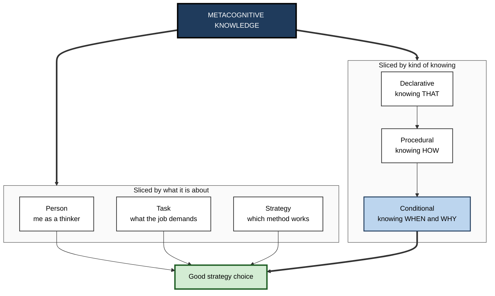
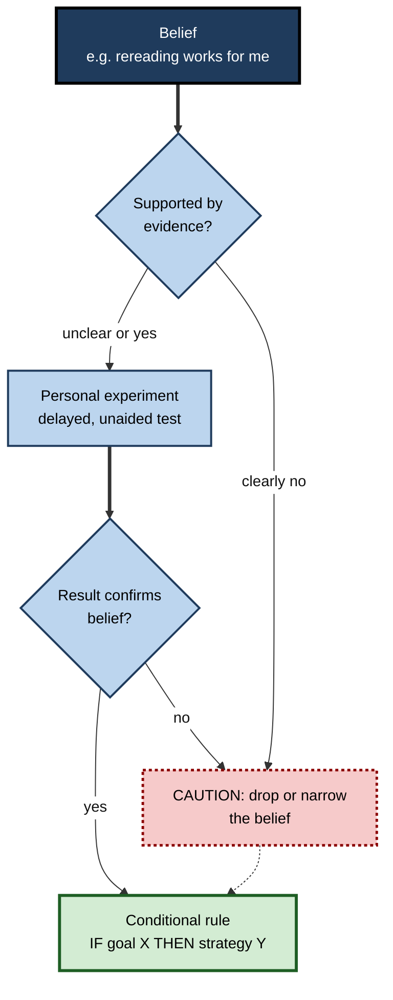

# K.2. Metacognitive Knowledge

> **In one sentence:** Metacognitive knowledge is what you know about how thinking and learning work: about yourself as a learner, about what different tasks demand, and about which strategies work, how, and when.
>
> **Why it matters:** You can only choose a good learning or working method if you know it exists, know how to do it, and know when it fits. Much wasted study and training time comes not from laziness but from confident, wrong beliefs about how learning works.
>
> **Level span:** Novice → Expert · **Reading time:** ~16 min · **Builds on:** the definition of metacognition (knowledge versus regulation)

---

## The Learning Ladder

| Level | Badge | After this level you can... |
|---|---|---|
| 1 | NOVICE | Describe what you know about how you learn, and notice that some of it might be wrong. |
| 2 | FOUNDATIONS | Use two classic frameworks: person–task–strategy, and declarative–procedural–conditional knowledge. |
| 3 | PRACTITIONER | Audit and rewrite your own learning beliefs into conditional "if–then" strategy rules. |
| 4 | ADVANCED | Explain why learners hold inaccurate beliefs, why those beliefs resist correction, and how belief and experience combine in judgements. |
| 5 | EXPERT / PRO | Diagnose and correct faulty strategy beliefs in teams and design training that builds accurate conditional knowledge. |

---

## Level 1 · Novice — The Big Picture

Everyone carries a private "user manual" for their own mind. It contains statements like "I'm a morning person", "I remember things better if I write them down", "highlighting helps me study", or "I'm bad with numbers". That user manual is your **metacognitive knowledge**.

Think of it as the map in a hiker's pocket. A good map lets you choose the right path for the terrain. A wrong map is worse than none: you walk confidently in the wrong direction. Some entries in most people's mental user manual are accurate; others are folklore picked up at school, from friends or from social media.

You have already used metacognitive knowledge when you:

- chose to make flashcards for vocabulary but practice problems for maths, because you knew the two tasks are different;
- turned off your phone before a hard task, because you know you get distracted;
- realised that "I read it three times" did not mean "I can explain it".

**The beginner's takeaway:** your beliefs about how you learn steer every study and work decision you make, so it pays to check whether they are true.

---

## Level 2 · Foundations — Core Concepts

### Framework 1: Flavell's person, task and strategy knowledge

John Flavell divided metacognitive knowledge by *what it is about*:

| Category | What it covers | Accurate example | Common inaccurate example |
|---|---|---|---|
| **Person** | What you know about yourself and people in general as thinkers | "I overestimate how fast I read technical papers." | "I'm a visual learner, so I can't learn from text." |
| **Task** | What different tasks demand and how conditions affect difficulty | "Recalling a design pattern from memory is harder than recognising it in code." | "If the material is clearly explained, it will be easy to remember." |
| **Strategy** | Which methods achieve which goals | "Testing myself produces more durable memory than rereading." | "Highlighting is an effective way to learn." |

The categories interact. Good choices come from combining all three: *this* kind of person, facing *this* kind of task, should use *this* strategy.

### Framework 2: declarative, procedural and conditional knowledge

Educational psychologists such as Gregory Schraw and colleagues divided knowledge of cognition by *what kind of knowing* it is:

- **Declarative knowledge**: knowing *that* a strategy exists and what it is ("Spaced practice means spreading study over time").
- **Procedural knowledge**: knowing *how* to do it ("I schedule three short reviews across two weeks").
- **Conditional knowledge**: knowing *when and why* to use it ("Spacing matters most for material I must retain for months; for a presentation tomorrow, a single rehearsal session is fine").

Conditional knowledge is the most valuable and the rarest. Many learners can name good strategies but do not know when each one pays off, so they never use them under pressure.

**Figure K.2-1 — Two ways to slice metacognitive knowledge.**

*How to read it:* both slicings feed one outcome, a good strategy choice; conditional knowledge (shaded) is the step most learners lack.

### Key terms

| Term | Plain meaning |
|---|---|
| **Metacognitive knowledge** | What you know or believe about how cognition works. |
| **Person knowledge** | Beliefs about yourself and others as learners and thinkers. |
| **Task knowledge** | Understanding of what a task requires and what makes it hard. |
| **Strategy knowledge** | Knowledge of methods for learning, remembering and solving. |
| **Declarative knowledge** | Knowing *that* something is the case. |
| **Procedural knowledge** | Knowing *how* to carry something out. |
| **Conditional knowledge** | Knowing *when* and *why* a strategy applies. |
| **Naive theory of learning** | An everyday belief about learning that may not match the evidence. |

---

## Level 3 · Practitioner — Putting It to Work

### The Learning Belief Audit — five steps

1. **List your beliefs.** Write ten statements about how you learn and work best ("I need to reread notes before a meeting", "I remember better when I hear it").
2. **Sort them** into person, task and strategy knowledge.
3. **Test each against evidence.** For each, ask: *Is this a well-supported finding, a personal preference, or folklore?* Check strategy beliefs against the evidence base (see the table in Level 4).
4. **Run a personal experiment** on the one belief that affects you most. For example, study half a topic by rereading and half by self-testing; test both halves cold three days later.
5. **Rewrite as conditional rules.** Replace "Flashcards work for me" with "**If** I need to recall discrete facts quickly, **then** I use spaced self-testing with flashcards; **if** I need to understand a system, **then** I explain it aloud and draw it from memory."

### Worked example — a new product manager

| | Before | After the audit |
|---|---|---|
| **Belief** | "I'm a big-picture person, I don't do details." | "I find detailed specs tiring, so I do them in the morning and use a checklist." |
| **Task knowledge** | "Reading the API docs once is enough to talk to engineers." | "Talking credibly with engineers needs recall of key concepts, not recognition." |
| **Strategy** | Rereads docs the night before sprint planning. | Writes five likely engineering questions and answers them from memory two days before; checks gaps. |
| **Result** | Feels prepared; struggles with follow-up questions. | Feels less sure beforehand; handles questions better. |

**Figure K.2-2 — From belief to tested conditional rule.**

*How to read it:* every belief ends as a tested conditional rule; dotted borders mark beliefs that failed and must be narrowed or replaced.

### Common mistakes

- **Collecting declarative knowledge only.** Knowing the names of ten strategies changes nothing if you do not know how and when to use them.
- **Judging a strategy by how it feels.** Strategies that feel smooth often work worst (see Level 4).
- **Overgeneralising person beliefs.** "I'm bad at maths" turns a skill gap into an identity and stops strategy search.
- **Never updating.** A rule that worked at university may not fit learning a codebase or a new market.

---

## Level 4 · Advanced — Mechanisms, Models & Evidence

### Learners' strategy knowledge is often wrong in predictable ways

Surveys of university students over two decades consistently find that **rereading and highlighting** are among the most popular study methods, while **self-testing** and **spacing** are under-used. An influential 2013 review by John Dunlosky and colleagues rated ten common techniques: practice testing and distributed practice earned the highest utility ratings, while rereading, highlighting and summarising (as typically done) earned low ratings. The popularity ranking and the effectiveness ranking are close to inverted.

Laboratory work on beliefs shows the same pattern. In studies by Nate Kornell and Robert Bjork (2008) on learning painting styles, most participants judged that studying one artist at a time (blocked) helped them more than mixing artists (interleaved), even though their own test scores showed the reverse. Follow-up studies tried to correct the belief by explaining the evidence; many participants **still** preferred blocking. Experience-based feelings of fluency are hard to override with information alone.

| Belief commonly held | What the evidence shows |
|---|---|
| Rereading is a good way to learn | Produces familiarity more than durable, retrievable memory. |
| Testing is only for measuring learning | Retrieval itself strengthens memory (the testing effect). |
| Massed practice (cramming) is efficient | Spacing produces better long-term retention for the same total time. |
| Blocked practice is better than mixed | Interleaving usually improves discrimination and transfer, although it feels harder. |
| Matching teaching to "learning styles" helps | Well-designed tests have repeatedly failed to find this benefit. |
| Effortful learning means the method is failing | Some difficulty is often a sign of productive processing. |

### Why wrong beliefs persist

1. **Fluency feels like learning.** Easy processing in the moment is mistaken for durable knowledge.
2. **Feedback is delayed and noisy.** The cost of a poor strategy shows up weeks later, mixed with many other causes.
3. **Strategies are rarely taught.** Most people are taught *what* to learn, almost never *how*.
4. **Identity protection.** Person beliefs ("I'm not a numbers person") are tied to self-image and resist evidence.

### Beliefs and experience combine in judgements

Asher Koriat's **cue-utilisation** view holds that people judge their learning by combining cues. Some are **theory-based** (beliefs such as "large fonts are easier to remember") and some are **experience-based** (the felt ease of processing). Metacognitive knowledge is the theory-based input. This explains why correcting beliefs helps a little but not fully: the experience-based fluency signal keeps pushing in the old direction. A durable fix usually needs both accurate knowledge *and* repeated personal experience of the delayed results.

### Conditional knowledge is the bottleneck

Research on strategy instruction shows that teaching *what* a strategy is often fails to transfer. Teaching that explicitly covers *when* and *why* a strategy applies, with practice choosing between strategies, transfers better. This is why the UK Education Endowment Foundation's guidance emphasises explicit instruction in metacognitive strategies *within* subject teaching rather than generic study-skills sessions.

### Development and expertise

Metacognitive knowledge grows with age and with domain expertise. Young children overestimate their memory; adults are better but still error-prone. Experts have rich *task* knowledge in their field (they know what makes a problem hard) but can be as naive as anyone about general learning strategies. Being a senior engineer does not make someone an expert on how to learn.

---

## Level 5 · Expert / Pro — Professional Mastery

### Diagnosing strategy beliefs in organisations

Organisations encode metacognitive knowledge, accurate or not, in their practices. Common organisational "naive theories":

| Organisational belief | Where you see it | Better-supported alternative |
|---|---|---|
| "Exposure equals learning." | Mandatory slide decks and videos with completion tracking | Practice and retrieval with feedback, spaced over time |
| "Satisfied learners learned." | Course evaluation forms as the success metric | Delayed performance checks and on-the-job indicators |
| "Experts can teach well because they know the content." | Subject-matter experts given no design support | Experts paired with learning designers; expert blind spots acknowledged |
| "People know how to learn from AI tools." | Rolling out AI assistants without guidance | Explicit norms: attempt first, ask for hints, verify, re-do alone |

### Building accurate conditional knowledge in teams

1. **Teach the evidence briefly, then let people experience it.** A short demonstration where participants predict which method will win and then see their own delayed results changes beliefs more than a lecture.
2. **Write conditional playbooks.** For example, an engineering onboarding guide that says: "For syntax and APIs, rely on search and AI; for architecture and failure modes, learn to recall without help, because you need them to judge AI output."
3. **Model aloud.** Senior staff explaining *why* they chose a learning or problem-solving approach transmits conditional knowledge that documents cannot.
4. **Retire myths explicitly.** Learning-styles questionnaires and "left-brain / right-brain" profiles still appear in corporate programmes; removing them signals that the organisation takes evidence seriously.

### AI-era implications

Generative AI adds a new entry to everyone's strategy knowledge: *when to offload and when not to*. Accurate conditional knowledge now includes rules such as:

- offload retrieval of rarely used facts; do not offload the understanding you need to check the output;
- ask the AI to quiz you, not just to explain;
- treat an AI explanation that "makes sense" as fluency, not as evidence that you could reproduce it.

A 2025 randomised lab study on writing (Fan and colleagues) found that learners supported by ChatGPT improved their essays more than other groups but did not gain more knowledge or transfer, and their self-regulation sequences differed. The authors called the risk **metacognitive laziness**: delegating the planning and monitoring as well as the work.

### Professional scenario

**Role:** L&D lead at a professional-services firm.
**Situation:** New analysts complete a polished e-learning library on financial modelling with high satisfaction, yet managers report the same basic errors every intake.
**What the pro does:** Runs a 30-minute kick-off where analysts predict whether rereading or self-testing will produce better recall, then try both on two short modules and take a surprise test two days later. Most predicted rereading would win; most scored higher on the self-tested module. The firm then replaces end-of-module "next" buttons with short retrieval exercises, adds a conditional strategy card to the onboarding pack, and tracks error rates on first live models. The belief change is driven by personal evidence, not by a slide.

---

## Myths vs. Evidence

| Myth | What the evidence shows |
|---|---|
| "I know how I learn best." | People's self-beliefs about learning are often inaccurate, especially about strategies. |
| "I'm a visual (or auditory) learner." | Matching instruction to a preferred style has not been shown to improve learning in well-controlled tests. |
| "Telling people the evidence fixes their beliefs." | Information helps, but fluency experiences keep pulling beliefs back; personal delayed evidence is more persuasive. |
| "Knowing strategy names is enough." | Without procedural and conditional knowledge, strategies are rarely used under real conditions. |
| "Experts know how to learn." | Domain expertise brings task knowledge, not necessarily accurate strategy knowledge. |

## Practitioner Toolkit

**Learning belief audit**

- [ ] I listed at least ten beliefs about how I learn and work.
- [ ] I sorted them into person, task and strategy knowledge.
- [ ] I marked each as evidence-based, preference or folklore.
- [ ] I tested my most influential belief with a delayed, unaided check.
- [ ] I rewrote my top strategies as IF–THEN conditional rules.
- [ ] I added one rule about when to use, and when not to use, AI help.

**Conditional strategy card template**

| If my goal is... | And the conditions are... | Then I use... | Because... |
|---|---|---|---|
| Recall facts for months | Weeks available | Spaced self-testing | Retrieval and spacing build durable memory |
| Understand a system | Unfamiliar domain | Explain aloud and diagram from memory | Exposes gaps that rereading hides |
| Judge AI output | Domain I must supervise | Learn core concepts to recall level | You cannot check what you do not know |

## Self-Check

1. **[NOVICE]** Give one belief you hold about how you learn. How could you test it?
2. **[FOUNDATIONS]** Define person, task and strategy knowledge with one example each.
3. **[FOUNDATIONS]** What is the difference between declarative, procedural and conditional knowledge?
4. **[PRACTITIONER]** Rewrite "flashcards work for me" as a conditional rule.
5. **[ADVANCED]** Why do learners keep preferring blocked practice even after being told interleaving works better?
6. **[ADVANCED]** What is the difference between theory-based and experience-based cues in judgements of learning?
7. **[EXPERT / PRO]** Name two organisational naive theories of learning and a better alternative for each.
8. **[EXPERT / PRO]** Write one conditional rule about AI use for a new hire in your field.

### Answer Key

1. Example: "Highlighting helps me." Test by studying matched material with and without highlighting and checking recall unaided a few days later.
2. Person: "I underestimate how long reading takes me." Task: "Recall is harder than recognition." Strategy: "Self-testing beats rereading for retention."
3. Declarative is knowing a strategy exists; procedural is knowing how to perform it; conditional is knowing when and why it applies.
4. "If I need fast recall of discrete facts over weeks, then I use spaced flashcard self-testing; for understanding systems I use explanation and diagrams instead."
5. Blocked practice feels more fluent in the moment, and that experience-based signal outweighs the information they were given.
6. Theory-based cues come from beliefs about memory; experience-based cues come from how easy processing feels right now.
7. "Exposure equals learning" (use spaced retrieval practice) and "satisfaction equals learning" (measure delayed performance and job behaviour).
8. Example: "Use the assistant to draft boilerplate, but explain every generated function aloud before committing it; if you cannot, study it first."

## Key Takeaways

- Metacognitive knowledge is your **user manual for thinking**; parts of it are usually wrong.
- Two frameworks: **person / task / strategy** and **declarative / procedural / conditional**.
- **Conditional knowledge** (when and why) is the bottleneck between knowing strategies and using them.
- Popular strategies (rereading, highlighting, massing) are often the **least effective**; effective ones feel harder.
- Wrong beliefs persist because **fluency feels like learning** and feedback is delayed; personal delayed evidence corrects them best.
- In the AI era, accurate knowledge includes **when to offload and when to keep thinking yourself**.

## Glossary

| Term | Meaning |
|---|---|
| Blocked practice | Practising one type of item or skill at a time before moving on. |
| Conditional knowledge | Knowing when and why to apply a strategy. |
| Cue utilisation | Koriat's view that judgements of learning combine multiple cues, including beliefs and felt fluency. |
| Declarative knowledge | Knowing that something is the case. |
| Interleaved practice | Mixing different types of items or skills within a practice session. |
| Metacognitive laziness | Handing over planning and monitoring, not just the task, to a tool. |
| Person knowledge | Beliefs about oneself and others as thinkers and learners. |
| Procedural knowledge | Knowing how to carry out a strategy. |
| Strategy knowledge | Knowledge about methods for learning and problem solving. |
| Task knowledge | Knowledge about what a task demands and what makes it difficult. |
| Testing effect | The finding that retrieving information strengthens memory more than restudying it. |
