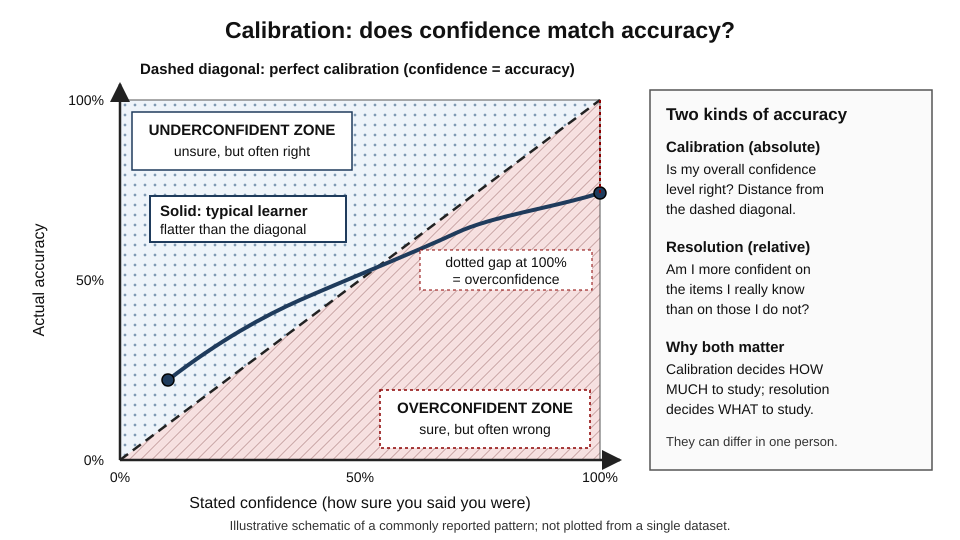
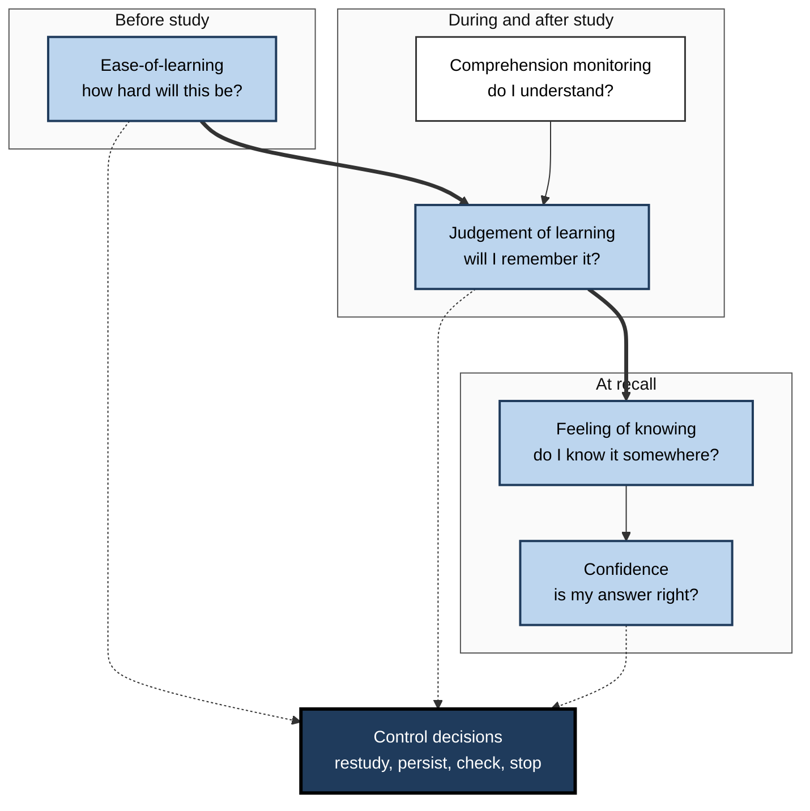
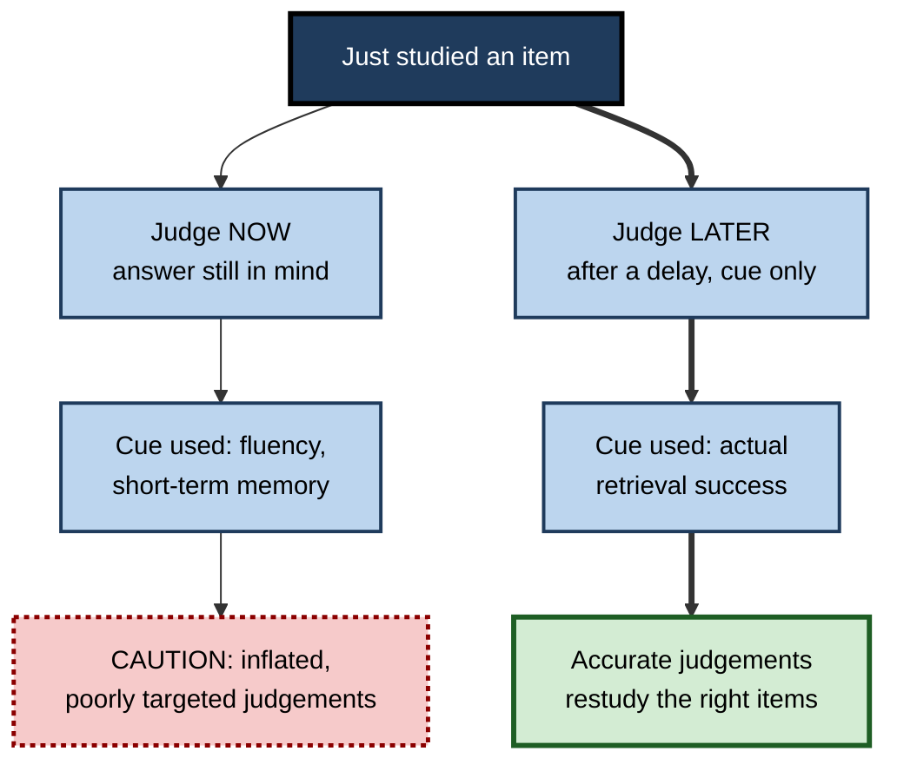

# K.3. Metacognitive Monitoring

> **In one sentence:** Metacognitive monitoring is the running self-check your mind performs on its own work: "Do I know this? Am I getting it? Is this answer right?"
>
> **Why it matters:** Every decision about what to study, what to check, when to ask for help and when to ship depends on these self-judgements. When monitoring is accurate, effort goes where it is needed; when it is off, people restudy what they already know, skip what they do not, and sign off on errors with confidence.
>
> **Level span:** Novice → Expert · **Reading time:** ~18 min · **Builds on:** the definition of metacognition; the idea of monitoring and control

---

## The Learning Ladder

| Level | Badge | After this level you can... |
|---|---|---|
| 1 | NOVICE | Recognise moments when your mind is checking itself, and notice when those checks fooled you. |
| 2 | FOUNDATIONS | Name the main kinds of monitoring judgement and the two ways of scoring their accuracy. |
| 3 | PRACTITIONER | Use delayed, retrieval-based self-checks and confidence ratings to monitor accurately. |
| 4 | ADVANCED | Explain the cue-utilisation account, the delayed-JOL effect, and signal-detection measures such as meta-d'. |
| 5 | EXPERT / PRO | Build calibration measurement and confidence reporting into training, analysis and AI-assisted workflows. |

---

## Level 1 · Novice — The Big Picture

While you read, cook, code or listen, a quiet background process keeps asking "Is this working?" It produces signals: the sense of "got it", the itch of "something's off", the tip-of-the-tongue feeling. That background checker is **metacognitive monitoring**.

Think of a smoke detector. Its job is not to cook dinner but to watch the kitchen and raise an alarm when something is wrong. A good detector rings when there is smoke and stays quiet when there is not. A bad one either stays silent during a fire (a **miss**) or goes off every time you make toast (a **false alarm**). Human monitoring fails in both ways, but most often it stays silent: it says "you know this" when you do not.

You have already experienced monitoring when:

- you felt certain you knew a colleague's name, then went blank when you had to introduce them;
- you were sure your code was right, ran the tests, and three failed;
- you read a contract clause, felt a vague unease, reread it and found the catch.

**The beginner's takeaway:** your sense of "I know this" is a *judgement*, not a fact. It can be checked, and it can be trained.

---

## Level 2 · Foundations — Core Concepts

### Kinds of monitoring judgement

Researchers name monitoring judgements by *when* they happen and *what* they predict.

| Judgement | When | Question it answers | Everyday example |
|---|---|---|---|
| **Ease-of-learning (EOL)** | Before study | "How hard will this be to learn?" | Glancing at a chapter and deciding it looks easy. |
| **Judgement of learning (JOL)** | During or just after study | "How likely am I to remember this later?" | "I'll remember this acronym in the exam." |
| **Feeling of knowing (FOK)** | When recall fails | "Do I know it even though I can't get it now?" | "I know that actor's name, it'll come to me." |
| **Tip-of-the-tongue (TOT)** | When recall almost succeeds | "It's right there..." | Knowing the word starts with "s" and has three syllables. |
| **Confidence judgement** | After answering | "How sure am I that this answer is correct?" | Rating an estimate "80% sure". |
| **Comprehension monitoring** | While reading or listening | "Do I understand this?" | Noticing you have lost the thread of an argument. |

### Two ways to score monitoring accuracy

- **Calibration (absolute accuracy)**: does your overall confidence level match your actual performance? If you say you are 90% sure across many answers and you are right 90% of the time, you are well calibrated. If you are right only 70% of the time, you are **overconfident**.
- **Resolution (relative accuracy)**: are you more confident about the items you actually know than about those you do not? Good resolution lets you pick out *which* items to restudy, even if your overall level is off.

They are independent. A learner can be overconfident overall (poor calibration) yet still rank items well (good resolution), or the reverse.

*Figure K.3-1 — Calibration curve: confidence versus accuracy.* Dashed diagonal: perfect calibration. Solid line: a typical learner, whose curve is flatter than the diagonal, so high-confidence answers are right less often than claimed. The side panel contrasts calibration with resolution. Schematic, not plotted from a single dataset.

**Figure K.3-2 — The monitoring judgements across a learning episode.**

*How to read it:* boxes are grouped by moment; thick arrows show the order of judgements; dotted arrows show that each judgement feeds a control decision.

### Key terms

| Term | Plain meaning |
|---|---|
| **Monitoring** | Assessing the current state of your own knowledge, understanding or progress. |
| **Judgement of learning (JOL)** | A prediction of how well you will remember something later. |
| **Feeling of knowing (FOK)** | A sense that you know something you cannot currently recall. |
| **Calibration** | How well your overall confidence matches your accuracy. |
| **Resolution** | How well your confidence separates what you know from what you do not. |
| **Overconfidence** | Confidence higher than accuracy. |
| **Underconfidence** | Confidence lower than accuracy. |
| **Monitoring cue** | A piece of information the mind uses to form a judgement, such as familiarity or ease of recall. |

---

## Level 3 · Practitioner — Putting It to Work

The single most useful fact about monitoring is this: **judgements made by trying to retrieve, after a delay, are far more accurate than judgements made immediately while the material is still in view.**

### The Predict–Retrieve–Compare routine

1. **Wait.** After studying a section, move on to something else for at least a few minutes, ideally longer.
2. **Cue, do not show.** Look only at the question or term ("What does idempotent mean?"), not at the answer.
3. **Try to retrieve fully.** Say or write the full answer. A vague "I know this one" does not count.
4. **Rate confidence** from 0 to 100 *before* checking.
5. **Check and score.** Mark correct, partly correct or wrong.
6. **Track the gap.** Over a session, compare average confidence with percent correct. Restudy the items that were wrong *or* low-confidence.

### Worked example — a cloud certification candidate

| | Before | After (Predict–Retrieve–Compare) |
|---|---|---|
| **Monitoring method** | Reads the summary page; each line "looks familiar". | Covers the answers, recalls each service's purpose from its name after a break, rates confidence. |
| **Judgement** | "I know about 90% of this." | Average confidence 75%; actual 58% correct. |
| **Decision** | Books the exam for next week. | Restudies the 40% wrong, focusing on the high-confidence errors. |
| **Outcome** | Fails networking and IAM sections. | Repeats the cycle twice; confidence and accuracy converge near 85%; passes. |

**Figure K.3-3 — Immediate versus delayed, retrieval-based monitoring.**

*How to read it:* the thick path (delayed, cue-only judgement) leads to accurate monitoring; the thin path through dotted boxes is the common trap.

### Common mistakes

- **Judging while the answer is visible.** Recognition masquerades as recall.
- **Accepting "I know this one" without producing it.** The feeling of knowing is not the knowledge.
- **Only tracking the score, not the confidence.** High-confidence errors are the most dangerous items; you need confidence ratings to find them.
- **Monitoring once.** Calibration drifts as material changes; keep checking.

---

## Level 4 · Advanced — Mechanisms, Models & Evidence

### Monitoring is inference from cues

People cannot inspect the memory trace directly. Asher Koriat's **cue-utilisation** framework (1997) proposes that judgements are *inferences* from available cues:

- **Intrinsic cues**: properties of the material itself (an easy word pair versus an abstract one).
- **Extrinsic cues**: conditions of study (how many times it was studied, how long until the test).
- **Mnemonic cues**: internal experiences such as ease of processing, retrieval fluency and familiarity.

Mnemonic cues tend to dominate. They are often valid, because things that come to mind easily usually are better learned, but they can be manipulated by factors that do not affect memory, which produces **metacognitive illusions**. A classic finding is that people give insufficient weight to extrinsic factors: they underestimate how much forgetting will happen over time and how much an extra study trial will help.

### The delayed-JOL effect

In 1991, Thomas Nelson and John Dunlosky showed that judgements of learning made **after a short delay, using only the cue**, were dramatically more accurate at predicting later recall than judgements made immediately after study. Immediate judgements showed modest resolution; delayed judgements were close to excellent in that study. A 2011 meta-analysis by Matthew Rhodes and Sarah Tauber confirmed that the effect is large and robust across many experiments. The leading explanation is that a delayed, cue-only judgement involves an attempt at retrieval from long-term memory, which is a good diagnostic of what will be retrievable later. Immediate judgements tap short-term memory, which says little about the future.

### Overconfidence and its patterns

- **The hard–easy effect**: people tend to be overconfident on hard items and less so, or underconfident, on easy ones.
- **Underconfidence with practice**: across repeated study–test trials, people often become underconfident, because their judgements do not fully credit the benefit of practice.
- **Stability bias**: people predict they will remember about as well in a week as they do now, ignoring forgetting.

### Measurement for professionals

| Measure | What it captures | Notes |
|---|---|---|
| **Calibration bias** | Mean confidence minus mean accuracy | Positive = overconfident. Easy to compute and explain. |
| **Calibration curve** | Accuracy at each confidence level | Shows *where* miscalibration lives. |
| **Brier score** | Mean squared error of probabilistic forecasts | Standard in forecasting; combines calibration and resolution. |
| **Gamma correlation** | Item-by-item association of confidence and accuracy | Traditional resolution measure in metamemory research. |
| **meta-d' and M-ratio** | Signal-detection sensitivity of confidence relative to task performance | Separates metacognitive efficiency from task ability; widely used in neuroscience. |

Signal-detection measures matter because simpler measures confound monitoring with task difficulty: someone who is better at the task can appear to have better monitoring simply because their answers are easier to judge. The meta-d' approach, developed by Brian Maniscalco and Hakwan Lau, asks how much information confidence carries *given* the person's level of task performance.

### Neural basis and generality

Stephen Fleming's 2024 *Annual Review of Psychology* synthesis describes confidence as a computation, partly supported by prefrontal regions, that can be dissociated from task performance. Average confidence (bias) is fairly stable across domains, while metacognitive efficiency is partly domain-specific. Training studies have tried to improve calibration with feedback; a meta-analysis of learning-strategy instruction across 56 studies reported a moderate improvement in monitoring accuracy, although individual studies vary and some general strategy courses show little calibration change.

### Boundary conditions

- Monitoring accuracy depends on **the test you are predicting**. Predicting a recognition test differs from predicting an application task.
- Delayed retrieval-based judgements help most for **memory**; for **comprehension** of texts, accuracy is typically lower and improves when people generate summaries, keywords or explanations after a delay.
- Monitoring is only useful if it drives **control**; accurate judgements that are ignored change nothing.

---

## Level 5 · Expert / Pro — Professional Mastery

### Calibration as a professional competence

Many professions now treat calibration as measurable skill. Forecasting teams score predictions with Brier scores; medical education studies diagnostic confidence alongside accuracy; security and incident teams ask responders for confidence levels on root-cause hypotheses. The same discipline helps any knowledge worker: **attach a number to your confidence and score it later.**

### Monitoring in AI-assisted work

AI tools interfere with monitoring in two ways. First, fluent, well-formatted output feels right, which inflates confidence (a mnemonic cue unrelated to correctness). Second, when the tool does the retrieval, the user never gets the internal "could I retrieve it?" signal that underpins accurate judgements. A 2025 study in *Computers in Human Behavior* found that people using an AI assistant on reasoning problems performed better than a control group yet overestimated their own scores markedly, and the classic pattern where weaker performers overestimate most largely disappeared: nearly everyone overestimated. Practical responses:

1. **Predict before you prompt.** Write your own expected answer or range first, then compare.
2. **Separate confidence in the tool from confidence in yourself.** Ask: "Could I defend this answer without the assistant?"
3. **Prefer verification you can perform.** Tests, references, independent recalculation.

### Designing monitoring into programmes

| Design element | How it works | Metric to track |
|---|---|---|
| Confidence-weighted quizzes | Learners rate confidence on each answer | Calibration bias, high-confidence error rate |
| Delayed retrieval checks | Short unannounced checks days after modules | Delayed accuracy versus immediate accuracy |
| Prediction before practice | Learners predict their score before a simulation | Prediction error over time |
| Reviewer confidence fields | Code or document reviews include a confidence rating | Defect escape rate by confidence band |

### Professional scenario

**Role:** Engineering lead for an incident-response rota.
**Situation:** Post-incident reviews show that on-call engineers repeatedly declared root causes "confirmed" that later proved wrong, extending outages.
**What the pro does:** Adds a required field to the incident channel: hypothesis, confidence (0–100), and the evidence that would raise or lower it. After each incident, the team scores hypotheses against the final root cause. A quarterly chart shows confidence bands against hit rates. Engineers discover that their 90% calls are right about two-thirds of the time; they start stating 60–70% and running one more discriminating check before acting. Mean time to correct diagnosis falls, and the review culture shifts from "who was wrong" to "how well were we calibrated".

### Ethical limits

- Calibration data about individuals is sensitive; use it for development, not ranking.
- Confidence statements can be gamed (always saying 50%); combine calibration with resolution and outcome measures.
- Encouraging uncertainty is not the same as encouraging indecision; the goal is accurate confidence, then action.

---

## Myths vs. Evidence

| Myth | What the evidence shows |
|---|---|
| "If it feels familiar, I know it." | Familiarity is a cue that can be inflated by rereading and exposure without improving recall. |
| "Checking right after studying tells me what I learned." | Immediate judgements are much less accurate than delayed, cue-only retrieval judgements. |
| "Confident people are usually right." | Confidence and accuracy are only loosely linked unless people have had accurate feedback in that domain. |
| "Only weak performers overestimate themselves." | Overconfidence is common at all levels; with AI assistance, 2025 evidence shows near-universal overestimation. |
| "Monitoring accuracy is a fixed trait." | It varies by domain and task and can be improved with feedback and retrieval-based checks. |

## Practitioner Toolkit

**Monitoring checklist**

- [ ] I judged my learning after a delay, not immediately.
- [ ] I looked only at the cue and tried to produce the full answer.
- [ ] I rated confidence before checking.
- [ ] I compared average confidence with actual accuracy.
- [ ] I prioritised high-confidence errors for restudy.
- [ ] When using AI, I wrote my own prediction first.

**Calibration log template**

| Date | Item or decision | My answer | Confidence (0–100) | Correct? | Notes |
|---|---|---|---|---|---|
| | | | | | |

At the end of each week, group rows by confidence band (50–60, 60–70 and so on) and compute percent correct in each band.

## Self-Check

1. **[NOVICE]** In the smoke-detector analogy, what are a miss and a false alarm?
2. **[FOUNDATIONS]** What is the difference between a judgement of learning and a feeling of knowing?
3. **[FOUNDATIONS]** Define calibration and resolution. Can someone be good at one and poor at the other?
4. **[PRACTITIONER]** List the steps of the Predict–Retrieve–Compare routine.
5. **[ADVANCED]** What is the delayed-JOL effect, and why does delay help?
6. **[ADVANCED]** Name the three kinds of cues in Koriat's framework.
7. **[ADVANCED]** Why do researchers use meta-d' rather than a simple correlation?
8. **[EXPERT / PRO]** How does AI assistance distort monitoring, and what two habits counter it?

### Answer Key

1. A miss is believing you know something when you do not; a false alarm is believing you do not know something when you do.
2. A JOL predicts future recall of something just studied; a FOK is a sense that you know something you currently cannot recall.
3. Calibration is the match between overall confidence and accuracy; resolution is how well confidence distinguishes known from unknown items. Yes, they are independent.
4. Wait; show only the cue; try full retrieval; rate confidence; check and score; track the confidence–accuracy gap and restudy errors and low-confidence items.
5. Judgements made after a delay using only the cue are much more accurate; they involve retrieval from long-term memory, which predicts later recall.
6. Intrinsic (material), extrinsic (study conditions) and mnemonic (internal experiences such as fluency).
7. Simple measures confound monitoring with task performance; meta-d' estimates metacognitive sensitivity relative to task sensitivity.
8. Fluent output inflates confidence and removes the internal retrieval signal. Predict before prompting, and ask whether you could defend the answer without the tool.

## Key Takeaways

- Monitoring is the mind's **self-check**, producing judgements such as JOLs, feelings of knowing and confidence.
- Accuracy has two parts: **calibration** (level) and **resolution** (ranking).
- Judgements are **inferences from cues**, and fluency cues can mislead.
- **Delayed, cue-only retrieval** is the most reliable way to judge your learning.
- Typical errors: **overconfidence on hard items**, ignoring forgetting, and underrating the benefit of practice.
- Professionals **put numbers on confidence and score them**; AI assistance makes this more, not less, necessary.

## Glossary

| Term | Meaning |
|---|---|
| Brier score | Mean squared error of probability forecasts; lower is better. |
| Calibration | Agreement between average confidence and average accuracy. |
| Comprehension monitoring | Tracking whether you understand what you read or hear. |
| Cue utilisation | The view that metacognitive judgements are inferred from available cues. |
| Delayed-JOL effect | The finding that delayed, cue-only judgements of learning are more accurate than immediate ones. |
| Ease-of-learning judgement | A prediction, before study, of how easy material will be to learn. |
| Feeling of knowing | A sense that unrecalled information is nonetheless known. |
| Gamma correlation | An ordinal statistic used to measure resolution in metamemory research. |
| Hard–easy effect | Greater overconfidence on difficult items than on easy ones. |
| Judgement of learning | A prediction of later memory for studied material. |
| meta-d' | A signal-detection measure of how well confidence discriminates correct from incorrect responses. |
| Resolution | The degree to which confidence discriminates known from unknown items. |
| Stability bias | Expecting future memory to match current memory, ignoring forgetting. |
| Tip-of-the-tongue state | Near-recall with partial information available. |
