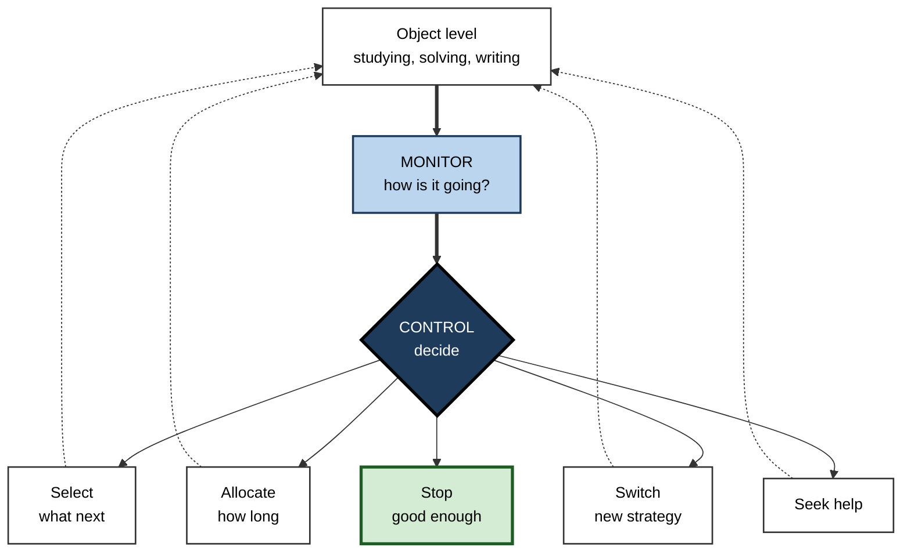
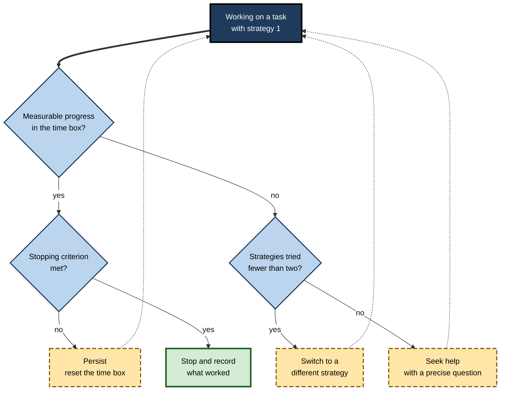

# K.4. Metacognitive Regulation and Control

> **In one sentence:** Metacognitive control is what you *do* with your self-checks: deciding what to study, how long to keep going, when to switch approach, when to ask for help, and when to stop.
>
> **Why it matters:** Accurate self-awareness is wasted if it does not change behaviour. The people who learn and perform best are not only good at noticing problems; they act on them quickly and sensibly, spending their limited time and attention where it pays off most.
>
> **Level span:** Novice → Expert · **Reading time:** ~17 min · **Builds on:** metacognitive monitoring (judgements of learning, confidence)

---

## The Learning Ladder

| Level | Badge | After this level you can... |
|---|---|---|
| 1 | NOVICE | Explain the difference between noticing a problem and doing something about it. |
| 2 | FOUNDATIONS | Name the main control decisions: select, allocate, persist or switch, seek help, stop, report. |
| 3 | PRACTITIONER | Use explicit decision rules for what to study next and when to stop or switch. |
| 4 | ADVANCED | Compare the discrepancy-reduction, region-of-proximal-learning and agenda-based models, and explain the evidence that monitoring causes control. |
| 5 | EXPERT / PRO | Design work and learning systems whose rules and defaults support good control decisions. |

---

## Level 1 · Novice — The Big Picture

Monitoring is the warning light; control is what you do when it turns on. If you notice you have read the same paragraph three times without understanding it, control is deciding to try a different explanation, draw a diagram, or ask someone, rather than reading it a fourth time.

A good analogy is a ship's captain. The crew reports conditions (monitoring): "storm ahead", "fuel at a third". The captain decides: change course, slow down, head for port. A captain who receives perfect reports but never changes course is as dangerous as one with no reports at all.

You have already used metacognitive control when you:

- skipped the exam question you were stuck on and came back to it later;
- stopped practising a piece of music you could already play and focused on the hard bar;
- abandoned a spreadsheet approach after an hour and asked a colleague for a better one.

**The beginner's takeaway:** knowing is not enough. The pay-off of metacognition comes from *decisions*: what to focus on, how long to persist, and when to change course.

---

## Level 2 · Foundations — Core Concepts

### The main control decisions

| Decision | Question | Example in learning | Example at work |
|---|---|---|---|
| **Selection** | What should I work on next? | Choosing which flashcards to restudy | Choosing which bug to investigate first |
| **Allocation** | How much time and effort does it deserve? | Spending longer on hard proofs | Time-boxing a spike on an unfamiliar library |
| **Persistence or switching** | Keep going, or change approach? | Switching from rereading to self-explaining | Moving from trial-and-error edits to a systematic bisect |
| **Help-seeking** | Do I need outside input? | Asking a tutor about a concept | Asking a senior colleague or checking documentation |
| **Termination** | Is this good enough to stop? | Deciding you are ready for the test | Deciding a document is ready to send |
| **Report or withhold** | Should I give this answer, or say I don't know? | Leaving a negatively marked question blank | Saying "I'll confirm that figure" in a meeting |

### Monitoring and control as a loop

Every control decision is supposed to be based on a monitoring signal. Nelson and Narens's 1990 model puts it simply: monitoring sends information up to the meta level; control sends instructions back down. In practice the loop runs many times a minute in skilled work and much less often in novices, who tend to start a task and persist with it regardless of signals.

**Figure K.4-1 — The monitor–control loop with its main decisions.**

*How to read it:* the thick path runs from the work to monitoring to a decision; dotted arrows show decisions feeding back into the work, until the stop decision ends the loop.

### Key terms

| Term | Plain meaning |
|---|---|
| **Metacognitive control** | Acting on monitoring to start, change or stop cognitive activity. |
| **Study-time allocation** | Deciding how much time each item or topic receives. |
| **Item selection** | Choosing which items to study or restudy. |
| **Stopping rule** | The criterion used to decide that learning or work is good enough. |
| **Help-seeking** | Getting input from people or resources when self-regulation is not enough. |
| **Labour-in-vain** | Spending extra time on items without proportional learning gain. |
| **Report option** | The choice to give or withhold an answer depending on confidence. |

---

## Level 3 · Practitioner — Putting It to Work

### Five decision rules you can adopt today

1. **The triage rule (selection).** After a self-test, sort items into *know cold*, *almost* and *lost*. Spend most time on *almost*, some on *lost*, and only spaced quick checks on *know cold*.
2. **The 20-minute rule (switching).** If you have made no measurable progress in about 20 minutes on a learning task, change strategy: try an example, draw it, explain it aloud, or find a different explanation.
3. **The two-strikes rule (help).** If two different strategies have failed, ask for help, and bring a specific question ("I get X but not why Y follows").
4. **The criterion rule (stopping).** Decide in advance what "done" means, for example "two correct, unaided recalls on different days", and stop only when it is met, not when it feels done.
5. **The confidence threshold (reporting).** For high-stakes statements, set a threshold ("I state numbers in meetings only if I am at least 90% sure; otherwise I say I will confirm").

### Worked example — a junior developer stuck on a bug

| | Before (no control) | After (decision rules) |
|---|---|---|
| **0–60 min** | Tries random edits, reruns tests, hopes. | At 20 minutes with no progress, switches from editing to writing down a hypothesis and adding logging. |
| **60–120 min** | Keeps going; feels too embarrassed to ask. | After a second failed strategy (bisecting commits), asks a senior with a precise question and the evidence gathered. |
| **Stopping** | Declares done when tests pass once. | Done = cause understood, regression test written, fix explained in the pull request. |
| **Result** | Half a day lost; bug reappears next sprint. | Resolved in 90 minutes; regression prevented. |

**Figure K.4-2 — A switch-or-persist decision rule.**

*How to read it:* each decision diamond asks one monitoring question; dashed boxes are control actions; the thick-bordered box is the only exit.

### Common mistakes

- **Spending most time on what you already know**, because it feels rewarding.
- **Persisting with a failing strategy** out of sunk cost or embarrassment.
- **Stopping when it feels done**, not when a criterion is met.
- **Seeking help too early or too late.** Too early skips useful struggle; too late wastes hours.

---

## Level 4 · Advanced — Mechanisms, Models & Evidence

### Does monitoring really cause control?

It is easy to assume, but it needs evidence. Janet Metcalfe and Bridgid Finn (2008) showed causation by manipulating judgements of learning *without* changing actual learning. When people were led to feel they knew some items better, they chose not to restudy them, even though their memory for those items was no better. The implication is uncomfortable: **if monitoring is biased, control faithfully follows the bias.** Fluent but unlearned material gets dropped from study.

### Three models of study-time allocation

| Model | Core claim | Predicts | Status |
|---|---|---|---|
| **Discrepancy reduction** (from early work by Dunlosky, Hertzog and others) | Learners study each item until the gap between current and desired learning closes, so they spend most time on the hardest items. | More time for harder items. | Holds when time is ample and goals are high. |
| **Region of proximal learning** (Metcalfe and Kornell) | Learners first drop what they already know, then focus on items just beyond their current reach, and stop when progress per unit time slows. | Easy-to-medium items first under time pressure; quit items that are not yielding gains. | Well supported, especially under time limits. |
| **Agenda-based regulation** (Ariel, Dunlosky and Bailey) | Learners build an agenda from their goals, rewards and constraints and allocate time to fit it. | Allocation shifts when value or time changes, for example prioritising high-reward items. | Integrates the others; good fit with goal-driven adult learning. |

The models are less rivals than descriptions of different conditions. Under tight time and low stakes, people sensibly study medium items; with plenty of time and mastery goals, they work on the hardest.

### Labour-in-vain and the stopping problem

Thomas Nelson and Louis Leonesio (1988) described **labour-in-vain**: when people were pushed to study for very high accuracy, they spent much more time on items with little added recall. Extra effort on items beyond reach is inefficient. The region-of-proximal-learning model adds a **stop rule based on rate of progress**: people stop when they feel they are no longer gaining, which is sensible when the feeling is accurate and costly when fluency misleads.

### Control can feed back into monitoring

Asher Koriat and colleagues showed that people also *infer* learning from their own control behaviour: items that took longer to learn are judged as less well learned ("data-driven" monitoring), while extra time chosen deliberately to reach a goal can raise confidence ("goal-driven"). Monitoring and control are not a one-way chain but a loop that can amplify errors.

### Report control and the accuracy–quantity trade-off

Koriat and Morris Goldsmith (1996) showed that when people may withhold answers, they use confidence to filter, which raises the accuracy of what they report at the cost of reporting less. This underpins professional norms such as "only state it if you can source it" and forecasting conventions that reward calibrated abstention.

### Executive function and limits

Control draws on executive functions: inhibiting a habitual response, switching task sets, and holding goals in working memory. Under stress, fatigue or high cognitive load, control tends to degrade first: people persist with the default strategy and stop checking. This is one reason why checklists and procedural "forcing functions" are effective in high-stakes work.

---

## Level 5 · Expert / Pro — Professional Mastery

### Designing environments that support good control

Professionals assume that individual control will lapse under pressure, and build supports into the environment:

| Control decision | Individual habit | System design that supports it |
|---|---|---|
| Selection | Triage after self-tests | Adaptive learning platforms that schedule weak items; backlogs ranked by risk |
| Allocation | Time boxes | Spike tickets with explicit time limits; "timebox and report" norms |
| Switching | 20-minute rule | Pairing rotation; "stuck" signals in stand-ups without stigma |
| Help-seeking | Two-strikes rule | Office hours, named buddies, a culture where asking with evidence is praised |
| Stopping | Pre-set criterion | Definitions of done; acceptance tests; review gates |
| Reporting | Confidence threshold | Confidence labels on findings; "unknown" as a legitimate status in dashboards |

### AI-era control decisions

Generative AI adds a new control decision to almost every task: **when to delegate, when to verify, and when to do it yourself.** A 2025 lab study by Fan and colleagues found that learners writing with ChatGPT produced better essays but showed different self-regulation sequences and no greater knowledge gain; the authors warned of **metacognitive laziness**, where planning and monitoring are handed over along with the work. Good AI-era control rules include:

- **Attempt first** on anything you are expected to learn; use the assistant to critique, not to originate.
- **Verify in proportion to stakes** and to your ability to verify; if you cannot verify, that is a signal to learn, not to trust.
- **Stop delegating** when you notice you can no longer explain the work you are shipping.

### Professional scenario

**Role:** Learning experience designer building a compliance and risk programme for a bank.
**Situation:** The old programme let employees click through all modules at their own pace, followed by a single test. Pass rates were high, but audit findings showed the same errors repeatedly.
**What the pro does:** Replaces the linear course with short scenario checks at the start of each module. Staff who answer confidently and correctly skip ahead (selection); those who are wrong with high confidence are routed to a focused explanation and a second scenario (allocation and switching). Completion requires two correct answers on different days (a stopping criterion). A "not sure, flag for advice" option is rewarded rather than penalised (report control). Average seat time falls, and repeat audit findings in the targeted areas decline.

### Limits and ethics

- Adaptive systems make control decisions *for* people; overuse can stop learners from developing their own control skills. Expose the logic and gradually hand decisions back.
- Time-box rules should flex for deep work; rigid rules can interrupt productive struggle.
- Help-seeking norms must be safe; in cultures that punish "not knowing", people hide problems and control fails silently.

---

## Myths vs. Evidence

| Myth | What the evidence shows |
|---|---|
| "If I notice I don't understand, I'll naturally fix it." | Monitoring does not guarantee action; many learners notice problems and persist with the same strategy. |
| "Studying hardest items first is always best." | Under time pressure, focusing on items just within reach is usually more efficient; very hard items can be labour-in-vain. |
| "More time on task means more learning." | Extra time on items beyond reach yields little; strategy changes matter more than duration. |
| "Asking for help is a sign of weak ability." | Strategic, well-timed help-seeking is a hallmark of skilled self-regulators. |
| "My restudy choices are based on what I actually know." | Experiments show choices follow judgements of learning, even when those judgements are wrong. |

## Practitioner Toolkit

**Control rules card**

- [ ] I triaged items into know cold / almost / lost before choosing what to study.
- [ ] I set a time box and a progress check before starting.
- [ ] I switched strategy after no progress, rather than repeating.
- [ ] I asked for help after two failed strategies, with a precise question.
- [ ] I stopped on a pre-set criterion, not a feeling.
- [ ] For high-stakes claims, I applied a confidence threshold or said "I'll confirm".

**Stuck-log template**

| Time | What I tried | Evidence of progress | Decision (persist / switch / help / stop) | Why |
|---|---|---|---|---|
| | | | | |

## Self-Check

1. **[NOVICE]** In the captain analogy, what is monitoring and what is control?
2. **[FOUNDATIONS]** Name five control decisions and give a work example of one.
3. **[PRACTITIONER]** What is the triage rule, and why spend most time on the "almost" items?
4. **[PRACTITIONER]** Why should stopping be based on a pre-set criterion?
5. **[ADVANCED]** What did Metcalfe and Finn's experiments show about monitoring and control?
6. **[ADVANCED]** Contrast the discrepancy-reduction and region-of-proximal-learning models.
7. **[ADVANCED]** What is labour-in-vain?
8. **[EXPERT / PRO]** Give two AI-era control rules and explain the risk they guard against.

### Answer Key

1. Monitoring is the crew's reports on conditions; control is the captain's decisions to change course, slow down or stop.
2. Selection, allocation, switching, help-seeking, termination, report or withhold. Example: time-boxing a spike on a new library (allocation).
3. Sort items into know cold, almost and lost; "almost" items yield the most gain per minute, while "lost" items may need a different approach and "know cold" items need only spaced checks.
4. Because the feeling of being done is driven by fluency and often comes too early.
5. Changing judgements of learning without changing memory changed restudy choices, so monitoring causally drives control, including when it is biased.
6. Discrepancy reduction predicts most time on the hardest items until the gap closes; region of proximal learning predicts focusing on items just beyond current mastery and stopping when progress slows.
7. Spending extra study time on items with little resulting gain in recall.
8. "Attempt first" and "verify in proportion to stakes"; they guard against metacognitive laziness and unverified errors.

## Key Takeaways

- Control turns monitoring into **action**: select, allocate, switch, seek help, stop, report.
- **Monitoring causally drives control**, so biased judgements lead to biased study and work choices.
- Under time pressure, focus on what is **just within reach**; very hard items can be labour-in-vain.
- Use **pre-set criteria** and **time boxes** rather than feelings to decide when to stop or switch.
- Control is the first thing to fail under **stress and load**; build it into systems and checklists.
- In AI-assisted work, the key new control decision is **delegate, verify or do it yourself**.

## Glossary

| Term | Meaning |
|---|---|
| Agenda-based regulation | Allocating study according to a goal-driven plan that reflects value and constraints. |
| Discrepancy reduction | Studying an item until the gap between current and target learning closes. |
| Executive functions | Mental processes such as inhibition, switching and goal maintenance that support control. |
| Help-seeking | Obtaining assistance from people or resources when needed. |
| Item selection | Choosing which items to study or restudy. |
| Labour-in-vain | Additional study time that produces little additional learning. |
| Metacognitive control | Regulating cognitive activity on the basis of monitoring. |
| Region of proximal learning | Metcalfe's model in which learners focus on items just beyond current mastery. |
| Report option | Choosing whether to volunteer or withhold an answer. |
| Stopping rule | The criterion for ending study or work on an item. |
| Study-time allocation | Distribution of study time across items or topics. |
