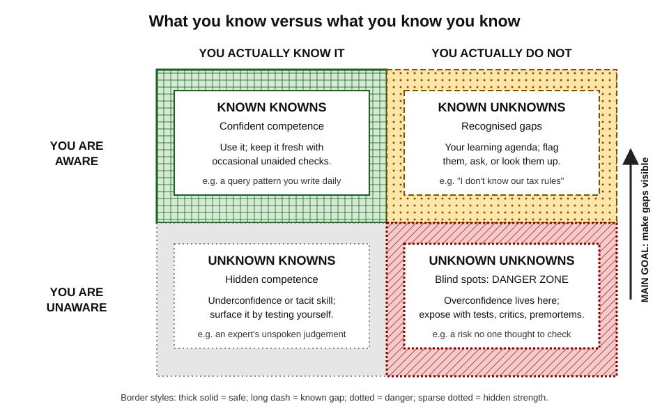
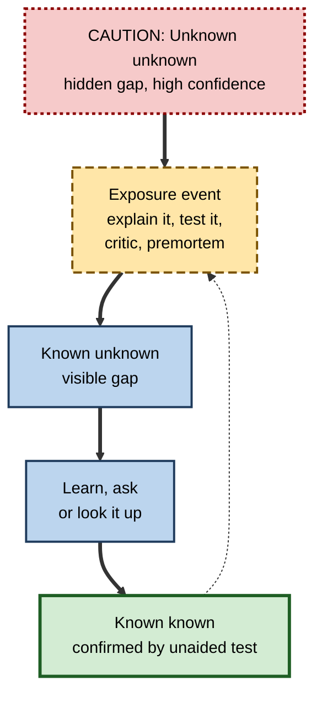
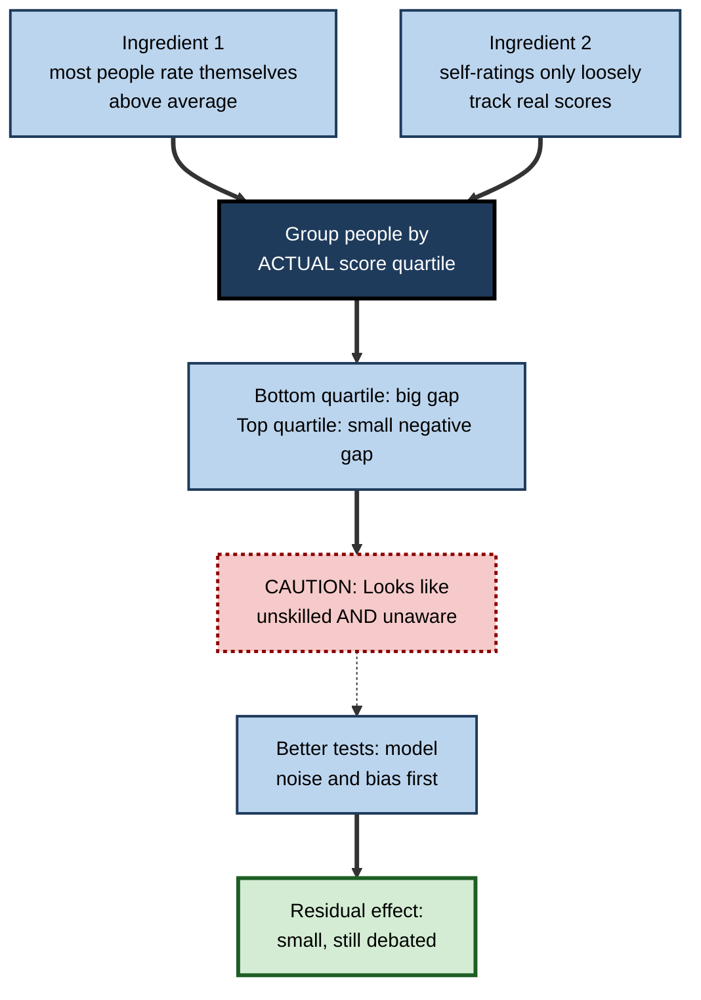

# K.5. Knowing What You Don't Know

> **In one sentence:** Knowing what you don't know is the ability to see the edges of your own knowledge: to tell the difference between "I know this", "I know I don't know this", and the dangerous zone of things you don't even realise you are missing.
>
> **Why it matters:** Recognised gaps can be filled; unrecognised gaps cause confident mistakes. In professional life, the costliest errors (a wrong figure in a board pack, a missed security risk, a misdiagnosis) usually come from blind spots, not from known weaknesses.
>
> **Level span:** Novice → Expert · **Reading time:** ~18 min · **Builds on:** metacognitive monitoring and calibration

---

## The Learning Ladder

| Level | Badge | After this level you can... |
|---|---|---|
| 1 | NOVICE | Explain why "not knowing that you don't know" is the riskiest kind of ignorance. |
| 2 | FOUNDATIONS | Use the knowledge–awareness matrix and define meta-ignorance, the illusion of explanatory depth and intellectual humility. |
| 3 | PRACTITIONER | Run techniques that expose blind spots: explain-it tests, gap maps, premortems and "I don't know" protocols. |
| 4 | ADVANCED | Critically evaluate the Dunning–Kruger effect, including the statistical-artefact debate, and explain why the knowledge illusion arises. |
| 5 | EXPERT / PRO | Build teams and processes in which gaps surface early and "I don't know" is safe and useful. |

---

## Level 1 · Novice — The Big Picture

Imagine three new hires. The first says, "I know how to do this", and does. The second says, "I don't know how to do this, can you show me?" The third says, "I know how to do this", and does it wrong, without realising. Which one worries a manager most? The third. The second has a **known gap** and will learn. The third has a **blind spot**.

A helpful picture is a torch in a dark room. The circle of light is what you know. The edge of the circle, where you can see that things continue into darkness, is what you know you don't know. The real danger is the room beyond, whose size you cannot see at all. Learning makes the circle bigger, and, oddly, also makes the edge longer: the more you know, the more you can see how much remains unknown.

You have already met this when:

- you thought a task was simple, started it, and discovered three skills you didn't know it needed;
- you confidently explained how a zip works to a child, then realised you couldn't actually describe the mechanism;
- a beginner in your field was more confident than you were, because they didn't yet see the complications.

**The beginner's takeaway:** the most useful phrase in learning is "I don't know that yet", because it turns a hidden gap into a visible one.

---

## Level 2 · Foundations — Core Concepts

### The knowledge–awareness matrix

Cross what you *actually* know with what you are *aware* of knowing and you get four zones.

*Figure K.5-1 — The knowledge–awareness matrix.* Top row: aware. Bottom row: unaware. Left column: actually known. Right column: actually unknown. The dotted, hatched bottom-right quadrant (unknown unknowns) is where overconfident errors live; the arrow shows the main goal of this note: moving gaps from unaware to aware.

| Zone | What it is | Typical consequence |
|---|---|---|
| **Known knowns** | Competence you correctly recognise | Efficient, reliable work |
| **Known unknowns** | Gaps you recognise | You ask, look it up, or learn; low risk |
| **Unknown knowns** | Competence you do not credit yourself with | Underconfidence; tacit expertise not shared |
| **Unknown unknowns** | Gaps you do not recognise | Confident errors; missed risks |

### Key ideas

- **Meta-ignorance** is ignorance of your own ignorance. It is hard to detect because the knowledge you need to spot an error is often the same knowledge you would need to avoid making it.
- **The illusion of explanatory depth** (Leonid Rozenblit and Frank Keil, 2002) is the tendency to believe you understand how things work (zips, toilets, economic policies, software systems) in far more detail than you do. When people are asked to write a step-by-step explanation, their self-ratings of understanding drop.
- **Intellectual humility** is a recognised set of dispositions: recognising the limits of your knowledge, owning your errors, and staying open to other views. Research links it with better scrutiny of misinformation and more willingness to learn.

### Key terms

| Term | Plain meaning |
|---|---|
| **Known unknown** | A gap you are aware of. |
| **Unknown unknown** | A gap you do not know exists. |
| **Meta-ignorance** | Not knowing that you do not know. |
| **Illusion of explanatory depth** | Believing you understand a mechanism better than you do. |
| **Intellectual humility** | Accurate recognition and acceptance of the limits of your knowledge. |
| **Knowledge illusion** | Mistaking knowledge available in your community or tools for knowledge in your own head. |
| **Overclaiming** | Claiming familiarity with things that do not exist or that you do not know. |

**Figure K.5-2 — How a blind spot becomes a learning target.**

*How to read it:* the main path converts a hidden gap into confirmed knowledge; the dotted loop reminds you to re-test even what you think you know.

---

## Level 3 · Practitioner — Putting It to Work

### Five techniques that expose blind spots

1. **The explain-it test.** Write or say a step-by-step causal explanation of how the thing works, as if to a smart newcomer. Wherever you write "and then it just..." you have found a gap.
2. **The gap map.** Draw the topic as a tree of subtopics. Mark each branch *can do unaided*, *partly*, or *no idea*. Ask an expert which branches are *missing entirely*; those are your unknown unknowns.
3. **Predict, then check.** Before looking at data, results or an AI answer, write what you expect. Surprises reveal faulty mental models.
4. **The premortem** (popularised by the psychologist Gary Klein). Imagine the project has failed a year from now; each person writes the most likely reasons. This legitimises naming risks people had not voiced.
5. **The "I don't know" protocol.** Have a rehearsed, professional way to say it: "I don't know yet; here's how I'll find out, and by when." Practise it so it does not feel like failure.

### Worked example — a marketing analyst asked to build a churn model

| | Before | After |
|---|---|---|
| **Self-assessment** | "I've done regression; churn models are basically the same." | Explain-it test reveals she cannot describe how to handle customers who haven't churned *yet*. |
| **Gap map** | Not done. | A data-science colleague adds a missing branch: survival analysis and censoring. |
| **Status** | Unknown unknown. | Known unknown, on her learning plan with a two-week deadline. |
| **Outcome** | Model would have systematically misestimated churn timing. | Builds a survival model with a colleague's review; documents assumptions. |

### Common mistakes

- **Asking yourself "do I understand?"** Self-rating triggers the illusion; producing an explanation breaks it.
- **Only asking people like you.** Blind spots are shared within groups; seek reviewers from adjacent disciplines.
- **Treating "I don't know" as weakness.** It is the start of competent action.
- **Over-correcting into paralysis.** The aim is accurate confidence, not doubting everything.

---

## Level 4 · Advanced — Mechanisms, Models & Evidence

### The Dunning–Kruger effect: what holds and what is contested

In 1999, Justin Kruger and David Dunning reported that people who scored lowest on tests of logic, grammar and humour greatly overestimated their percentile rank, while top scorers slightly underestimated theirs. They proposed a **dual burden**: the skills needed to perform well are the same skills needed to recognise good performance, so the unskilled are also unaware.

The effect became famous, then contested.

| Claim | Status as of 2026 |
|---|---|
| People in general overestimate their relative standing ("better-than-average") | Well supported. |
| The classic plot (low performers overestimate most, high performers underestimate) appears in many datasets | Yes, the pattern is common. |
| That plot proves a special metacognitive deficit in low performers | **Contested.** Much of the pattern can be produced by regression to the mean plus a general better-than-average bias, even in random data. |
| Using better statistics, a genuine Dunning–Kruger effect remains | **Mixed.** Gignac and Zajenkowski (2020) argued it is mostly a statistical artefact; a 2023 replication and response found a statistically significant but small effect. Studies in 2025 continue the debate, including heterogeneity by gender and measurement approach. |

**Figure K.5-3 — Why the classic Dunning–Kruger plot can appear without a special deficit.**

*How to read it:* two well-established ingredients, combined with grouping by actual score, are enough to produce the famous pattern; the dotted arrow shows the stricter analyses that remain once those ingredients are accounted for.

**Professional reading:** do not use "Dunning–Kruger" as a put-down. The safer, well-supported claims are that (a) *everyone* has blind spots, (b) self-assessment is generally weakly related to actual performance, and (c) feedback in a domain improves calibration. Notably, a 2025 study in *Computers in Human Behavior* found that when people solved reasoning problems with an AI assistant, nearly everyone overestimated their score, and those who rated themselves as more AI-literate overestimated more, which some commentators called a reversal of the classic pattern.

### Why the knowledge illusion arises

- **Mechanisms are hidden behind functions.** We use systems successfully without knowing how they work, and success at *using* is mistaken for understanding.
- **Knowledge is distributed.** Steven Sloman and Philip Fernbach argue that people treat knowledge held by others, or available in tools, as if it were in their own heads. Search engines and AI assistants likely widen this gap: easy access feels like knowing.
- **Explanatory knowledge is especially prone.** The illusion is stronger for causal mechanisms than for facts, procedures or narratives, which are easier to check.
- **Fluent material hides gaps.** Clear, well-designed explanations feel understood; the lack of friction removes the signal that something is missing.

### Developmental and expertise patterns

Novices often have too little knowledge to see the structure of a domain, so they cannot see what is missing. As expertise grows, people see more of the unknown edge and often become *less* confident for a while before calibration improves. Experts are typically better calibrated *within* their domain, especially where they get frequent, clear feedback (weather forecasting is a classic example), but can be overconfident just outside it.

### Intellectual humility research

Since the late 2010s, intellectual humility has become an active research field. It is measured as a trait and a state; it is associated with more accurate evaluation of evidence, openness to opposing views, and less susceptibility to misinformation. Effects are mostly correlational, and interventions (for example, reflecting on the limits of one's knowledge, or explaining mechanisms) show promising but still modest results.

---

## Level 5 · Expert / Pro — Professional Mastery

### Organisational blind spots

Blind spots scale. A team that shares training, tools and assumptions shares its unknown unknowns. Mature organisations counter this structurally:

| Practice | What it exposes | How to run it well |
|---|---|---|
| **Premortems** | Risks people sensed but did not voice | Everyone writes independently before discussion |
| **Red teams and devil's advocates** | Weak assumptions in plans and models | Rotate the role; protect the person doing it |
| **Cross-functional review** | Domain gaps invisible to specialists | Invite a reviewer from an adjacent field |
| **Assumption registers** | Untested beliefs underpinning decisions | List assumptions with confidence and a test date |
| **Blameless post-incident reviews** | Gaps revealed by failure | Focus on how the system let the gap persist |
| **Explicit uncertainty labels** | Overstated certainty in reports | Separate "known", "estimated" and "assumed" |

### AI-era: the knowledge illusion goes mainstream

Generative AI makes the boundary of personal knowledge blurrier than ever. When an assistant produces a plausible explanation in seconds, the user experiences fluency and access, both of which feel like understanding. Professional safeguards:

1. **Close the tool and explain.** Before relying on AI-assisted understanding, explain the key mechanism unaided.
2. **Ask the AI for your gaps, not just answers.** Prompts such as "quiz me on what I would need to know to check this" turn the tool into a gap detector.
3. **Mark AI-derived claims** in documents until verified.
4. **Keep a supervision core.** Decide which knowledge you must hold yourself in order to supervise AI output in your field.

### Making "I don't know" safe

Research on psychological safety in teams (notably Amy Edmondson's work) shows that teams learn more when members can admit errors and uncertainty without fear. Leaders set the tone: a senior person saying "I'm not sure, let's check" licenses others to do the same. Calibrated uncertainty should be rewarded; confident bluffing should not.

### Professional scenario

**Role:** Senior consultant leading a due-diligence project.
**Situation:** A junior team has built a market-sizing model the client wants by Friday. Everyone is confident; no one has questioned the core adoption assumption.
**What the pro does:** Runs a 30-minute premortem: "It's six months later and the model was badly wrong. Why?" Each person writes reasons silently. Three people independently name the adoption-rate assumption, sourced from a single vendor survey. The team adds an assumption register, runs a sensitivity analysis, and calls two industry experts. The final report shows a range, with the key assumption flagged. The client later says the transparency was the most valuable part.

### Limits and ethics

- Exposing gaps can embarrass people; frame exercises around the work, not the person.
- Excessive hedging can undermine trust; pair uncertainty with a plan to resolve it.
- Do not diagnose colleagues with "Dunning–Kruger"; it is scientifically contested and corrosive to teams.

---

## Myths vs. Evidence

| Myth | What the evidence shows |
|---|---|
| "The Dunning–Kruger effect proves incompetent people are always the most confident." | The classic pattern is partly a statistical artefact; better-supported claims are that everyone overestimates and self-assessment is generally weak. |
| "If I can use it, I understand it." | The illusion of explanatory depth shows that using a system and explaining its mechanism are different. |
| "Experts know where their knowledge ends." | Experts are usually better calibrated within their domain but can be overconfident just outside it. |
| "Having information at my fingertips means I know it." | Access through people, search or AI is easily mistaken for personal knowledge. |
| "Saying 'I don't know' damages credibility." | Paired with a plan to find out, calibrated uncertainty tends to build trust and prevents costly errors. |

## Practitioner Toolkit

**Blind-spot checklist (before an important decision or deliverable)**

- [ ] I explained the key mechanism step by step without notes or AI.
- [ ] I drew a gap map and asked someone outside my specialty what is missing.
- [ ] I wrote predictions before seeing results or AI output.
- [ ] I listed my assumptions with a confidence level for each.
- [ ] I ran or proposed a premortem for high-stakes work.
- [ ] I have a ready phrase: "I don't know yet; here's how I'll find out, and by when."

**Assumption register template**

| Assumption | Confidence (0–100) | Evidence so far | What would change my mind | Test by (date) |
|---|---|---|---|---|
| | | | | |

## Self-Check

1. **[NOVICE]** Why is a blind spot more dangerous than a known gap?
2. **[FOUNDATIONS]** Name the four zones of the knowledge–awareness matrix.
3. **[FOUNDATIONS]** What is the illusion of explanatory depth, and how is it revealed?
4. **[PRACTITIONER]** Describe the explain-it test and the premortem.
5. **[ADVANCED]** What is the statistical-artefact critique of the Dunning–Kruger effect?
6. **[ADVANCED]** Why do search and AI tools tend to widen the knowledge illusion?
7. **[EXPERT / PRO]** List three organisational practices that expose shared blind spots.
8. **[EXPERT / PRO]** How would you make "I don't know" safe in a team you lead?

### Answer Key

1. You can act on a known gap (ask, learn, check); a blind spot produces confident errors no one thinks to check.
2. Known knowns, known unknowns, unknown knowns, unknown unknowns.
3. Believing you understand mechanisms in more detail than you do; revealed when you try to write a step-by-step causal explanation and your rating of understanding drops.
4. Explain-it: write a step-by-step explanation to find gaps. Premortem: imagine the project failed and list likely reasons independently before discussing.
5. Regression to the mean plus a general better-than-average bias can produce the classic plot even without a special deficit in low performers; better analyses find a small or no residual effect, and the debate continues.
6. Easy access to knowledge held by others or by tools is experienced as personal knowledge, and fluent answers hide gaps.
7. Premortems, red teams, cross-functional reviews, assumption registers, blameless post-incident reviews, uncertainty labels (any three).
8. Model it yourself, reward calibrated uncertainty, pair "I don't know" with a plan, and run blameless reviews.

## Key Takeaways

- The riskiest ignorance is **meta-ignorance**: not knowing what you don't know.
- The goal is to **convert unknown unknowns into known unknowns**, then into confirmed knowledge.
- **Producing explanations** exposes gaps that self-ratings hide.
- The **Dunning–Kruger effect is contested**; rely on the robust claims that everyone has blind spots and self-assessment is weak without feedback.
- Tools, teams and AI create a **knowledge illusion**: access feels like understanding.
- Organisations expose shared blind spots with **premortems, red teams, cross-functional review and psychological safety**.

## Glossary

| Term | Meaning |
|---|---|
| Assumption register | A list of the beliefs a plan depends on, with confidence and tests. |
| Better-than-average effect | The tendency for most people to rate themselves above average. |
| Dunning–Kruger effect | The reported pattern that low performers overestimate their relative performance most; its interpretation is contested. |
| Illusion of explanatory depth | Overestimating one's understanding of causal mechanisms. |
| Intellectual humility | Recognising and owning the limits of one's knowledge. |
| Knowledge illusion | Mistaking knowledge in other people or tools for one's own. |
| Meta-ignorance | Ignorance of one's own ignorance. |
| Premortem | A planning exercise that imagines a future failure and works backwards to its causes. |
| Psychological safety | A shared belief that a team is safe for interpersonal risk-taking such as admitting mistakes. |
| Regression to the mean | The statistical tendency for extreme scores to be followed by less extreme ones. |
| Unknown unknown | A gap in knowledge that one is not aware of. |
