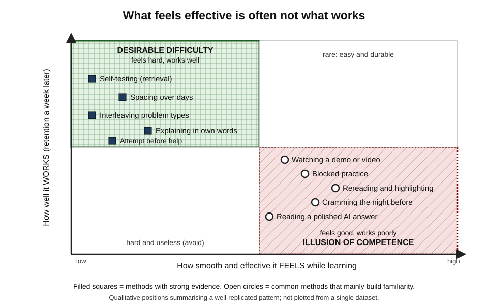
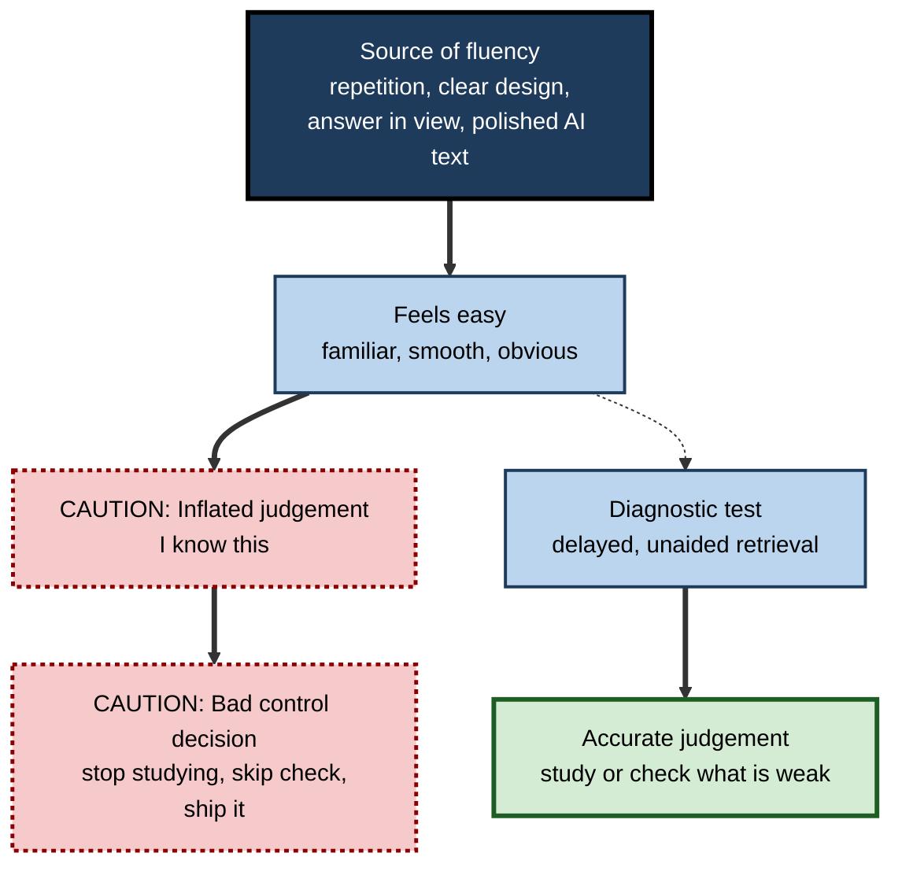
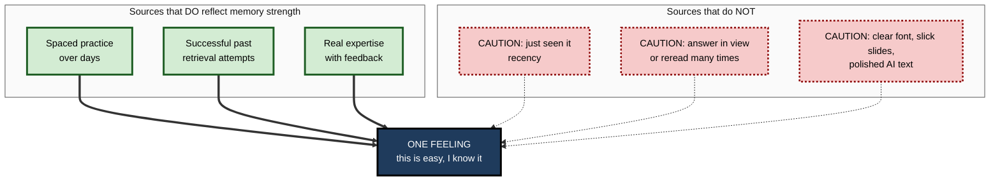

# K.6. Illusions of Knowing and Fluency

> **In one sentence:** Illusions of knowing happen when something *feels* easy to read, recognise or follow, and your mind mistakes that ease (fluency) for real, lasting knowledge.
>
> **Why it matters:** Fluency is the main reason people choose weak study methods, stop practising too early, over-trust polished slide decks and AI answers, and walk into exams, interviews and client meetings feeling more prepared than they are.
>
> **Level span:** Novice → Expert · **Reading time:** ~18 min · **Builds on:** metacognitive monitoring and cue-based judgements

---

## The Learning Ladder

| Level | Badge | After this level you can... |
|---|---|---|
| 1 | NOVICE | Recognise the moment when "this feels easy" is fooling you. |
| 2 | FOUNDATIONS | Name the main types of fluency and the classic illusions they cause. |
| 3 | PRACTITIONER | Replace fluency-based self-checks with effortful, diagnostic ones in your own learning and work. |
| 4 | ADVANCED | Explain the evidence, including contested findings such as the font-size effect and the failed "desirable disfluency" fonts. |
| 5 | EXPERT / PRO | Design training, documents and AI-assisted workflows that do not exploit or fall for fluency. |

---

## Level 1 · Novice — The Big Picture

Have you ever watched a cooking show and thought, "I could make that", then failed badly in your own kitchen? Or read a clear chapter twice, felt confident, and blanked in the test? In both cases, the experience *felt* smooth. That smoothness is called **fluency**, and your brain treats it as a sign that you have learned. Often it is only a sign that the material was in front of you, recently seen, or nicely presented.

An analogy: a well-worn path in a park looks like the right way to go because it is easy to walk, not because it leads where you need to be. Fluency is the well-worn path of the mind. It is a useful signal much of the time, which is why we trust it, and a misleading one exactly when we most need accuracy: while learning something new.

You have already been fooled by fluency when:

- a word you had seen a hundred times suddenly would not come when you needed it;
- a teacher's clear explanation made a topic seem easy until you tried a problem alone;
- a confident, well-formatted answer convinced you, until a colleague found the error.

**The beginner's takeaway:** "That was easy to follow" and "I can do that on my own" are two different things. Only the second counts.

---

## Level 2 · Foundations — Core Concepts

### Three kinds of fluency

| Type | What feels easy | Example of the illusion |
|---|---|---|
| **Perceptual fluency** | Seeing or hearing the material | Large, clear fonts and slick slides feel more memorable. |
| **Conceptual (processing) fluency** | Following the meaning | A clear explanation feels understood; you overestimate your ability to reproduce it. |
| **Retrieval fluency** | Bringing something to mind | An answer that pops up quickly feels more certain, even when it is wrong. |

### Classic illusions of knowing

- **The rereading illusion.** Each rereading makes text more familiar, so it feels better learned, even though gains in recall after the first reading are small compared with self-testing.
- **The illusion of competence from watching.** Watching skilled performance (a video, a demo, a worked example) raises people's belief that they can do it without raising their actual ability. Studies on "easier seen than done" found that repeated watching increased confidence but not performance.
- **Foresight bias.** When the answer is in view while studying, people cannot imagine how hard it will be to recall without it, so they overpredict later recall.
- **Stability bias.** People expect to remember tomorrow as well as they do now, ignoring forgetting.
- **Hindsight bias.** After learning an answer, people feel they "knew it all along", which hides what they actually had to learn.
- **The fluent-lecturer effect.** A polished, confident speaker raises students' judgements of how much they learned, often without improving actual learning compared with a less polished delivery of the same content.

*Figure K.6-1 — What feels effective is often not what works.* Filled squares (top left, solid green border): methods with strong evidence that feel effortful. Open circles (bottom right, dotted red border): common methods that feel smooth but mainly build familiarity. Positions are qualitative.

### Key terms

| Term | Plain meaning |
|---|---|
| **Fluency** | The felt ease of processing information. |
| **Illusion of knowing** | Believing you know or understand something because it feels fluent. |
| **Illusion of competence** | Believing you can perform a skill because it looked or felt easy. |
| **Foresight bias** | Overestimating future recall because the answer is present at study. |
| **Hindsight bias** | Believing, after the fact, that you knew something all along. |
| **Desirable difficulty** | A challenge that slows learning in the moment but improves long-term retention. |
| **Illusory truth effect** | Repeated statements feel more true because they are more fluent. |

**Figure K.6-2 — How fluency turns into a bad decision.**

*How to read it:* the thick path down the middle is the default trap; the dotted branch shows where inserting a diagnostic test breaks the chain.

---

## Level 3 · Practitioner — Putting It to Work

### The Fluency Firewall — six habits

1. **Never judge learning with the material in view.** Close it first.
2. **Swap "reread" for "recall".** After one reading, cover it and write what you remember; reread only to fix gaps.
3. **After watching, do.** Every demo, video or worked example is followed immediately by a similar problem attempted alone.
4. **Predict before you look.** Before reading an answer, solution or AI output, write your own.
5. **Distrust instant certainty on new material.** Fast answers in a new domain deserve a second check.
6. **Welcome the struggle.** When a method feels slow and effortful, ask whether it is a desirable difficulty before abandoning it.

### Worked example — a sales engineer preparing a product demo

| | Before | After (Fluency Firewall) |
|---|---|---|
| **Preparation** | Watches the recorded demo by a top performer three times; rereads the feature sheet. | Watches once, then runs the demo alone on a sandbox while recording himself. |
| **Self-check** | "I've seen it so often, I know it cold." | Lists the ten likeliest customer questions; answers them aloud without notes; scores 6 of 10. |
| **Fix** | None. | Studies the four weak answers; repeats the solo run two days later. |
| **Outcome** | Freezes on a technical question about integrations. | Handles the same question; flags one item for a follow-up email. |

### Common mistakes

- **Mistaking recognition for recall.** Multiple-choice practice and rereading test recognition; real tasks need recall and production.
- **Choosing methods by enjoyment.** Pleasant, smooth methods are not automatically effective.
- **Over-trusting presentation quality.** Beautiful slides, confident speakers and well-formatted AI text all raise felt credibility independent of accuracy.
- **Overcorrecting.** Not every easy experience is an illusion; experts' fluency is often well earned. The question is whether fluency was tested.

---

## Level 4 · Advanced — Mechanisms, Models & Evidence

### Why the mind uses fluency at all

Fluency is a **heuristic cue**: in everyday life, familiar things are usually things you have encountered often, and things that come to mind quickly are usually well learned. Using fluency is fast and often right. The problem is that fluency has **many sources unrelated to memory strength**: recency, perceptual clarity, repetition within a short time, the presence of the answer, and the quality of an explanation. Learners attribute fluency to the wrong source. This is an attribution error built into Koriat's cue-utilisation account and Larry Jacoby's work on familiarity.

**Figure K.6-3 — Valid and invalid sources of the same feeling.**

*How to read it:* thick arrows are legitimate sources of fluency, dotted arrows are misleading ones; because they all produce the same feeling, the feeling alone cannot tell you which you have.

### The evidence, including the contested parts

| Finding | Status |
|---|---|
| **Rereading yields limited benefit compared with retrieval practice**, while raising confidence | Robust and widely replicated. |
| **Blocked practice feels more effective than interleaved**, though interleaving often wins on delayed tests (for example Kornell and Bjork, 2008, on learning painting styles) | Robust for the belief; the interleaving benefit is strongest for discriminating similar categories and is not universal. |
| **Fluent lecturers raise judgements of learning more than actual learning** (Carpenter and colleagues, 2013, with later replications) | Generally replicated; effect on actual learning is small or absent. |
| **Watching demonstrations inflates perceived ability** | Replicated across several skills; size varies. |
| **Font-size effect**: larger fonts raise judgements of learning without improving recall (Rhodes and Castel, 2008) | The effect on judgements is reliable. *Why* is contested: Mueller and colleagues (2014) argued it is driven mostly by **beliefs** ("big text is easier to remember") rather than by the felt fluency of reading; later work suggests both contribute. |
| **"Desirable disfluency"**: hard-to-read fonts improve learning (Diemand-Yauman and colleagues, 2011) | **Failed to replicate** in larger studies. The specially designed "Sans Forgetica" font, launched in 2018 with claims of improved memory, showed no memory benefit in independent replications around 2020. |

The disfluency story is a useful caution: **making material superficially harder does not create a desirable difficulty.** Desirable difficulties work because they demand retrieval, discrimination or generation, not because they are irritating.

### Fluency and truth

The same mechanism affects belief, not just memory. The **illusory truth effect** shows that repeated statements are judged more likely to be true, even when people know better. Fluent, well-written text is judged more credible. In professional contexts this means that repeated internal claims ("our churn is driven by price") and polished documents gain credibility through familiarity alone.

### Fluency in the AI era

Generative AI produces maximally fluent output: grammatical, confident, well structured. Three effects compound:

1. **Conceptual fluency.** A clear AI explanation feels understood, in the same way as a fluent lecture, which inflates judgements of learning.
2. **Missing retrieval signal.** When the tool retrieves for you, you never experience the struggle that would have told you what you do not know.
3. **Credibility from form.** Fluent text is trusted more, regardless of accuracy.

Evidence is accumulating. A large 2025 field experiment with high-school mathematics students found that an unrestricted GPT-4 assistant improved practice performance but harmed later unaided exam performance, while a version designed to give hints rather than answers largely removed the harm. A 2025 study in *Computers in Human Behavior* found that people using an AI assistant overestimated their own performance substantially. The common thread: fluency and assistance raise performance and confidence together, while the learning that confidence implies may not be there.

### Boundary conditions

- Fluency is a **valid** cue for well-practised skills with good feedback, which is why expert intuition can be trusted in some domains and not others.
- Some disfluency effects on *judgements* are reliable even when effects on *learning* are not; do not confuse the two.
- Individual differences matter: learners with more accurate beliefs about learning are somewhat less swayed by fluency.

---

## Level 5 · Expert / Pro — Professional Mastery

### Designing against fluency illusions

| Design choice | Fluency trap | Better design |
|---|---|---|
| E-learning modules | Smooth click-through with immediate recognition quizzes | Short modules with recall questions and delayed checks |
| Demos and videos | Passive watching of experts | Watch once, then do; compare your attempt to the model |
| Slide-heavy briefings | Polish signals credibility | Separate evidence from narrative; show uncertainty |
| Documentation | "Clear" docs assumed to be understood | Include check-yourself questions and exercises |
| AI assistance | Answers on demand | Attempt first; AI gives hints, questions and critique |
| Evaluation of training | Satisfaction ("it was very clear") | Delayed unaided performance and on-the-job indicators |

### Professional scenario

**Role:** Engineering manager rolling out an AI coding assistant to a team of twelve.
**Situation:** After two months, velocity is up, but junior developers struggle in code review to explain the code they submitted, and two production bugs traced back to plausible-looking generated code.
**What the pro does:** Adds a "fluency check" to the pull-request template: the author explains, in their own words, what the change does and why it is correct, and names one way it could fail. For tasks tagged as learning tasks, juniors write a first attempt before invoking the assistant and use it to critique. In a fortnightly session, juniors explain a recent change at the whiteboard without the editor open. Velocity dips briefly; review rework and escaped defects fall; juniors' unaided explanations improve.

### Communicating with fluency in mind

Professionals who present also *produce* fluency. Ethical practice means:

- not using polish to compensate for weak evidence;
- signalling uncertainty explicitly, because fluent delivery hides it;
- building in audience retrieval ("Before I show the answer, what do you expect?") when the goal is understanding rather than persuasion.

### Limits

- You cannot eliminate fluency effects; you can only insert diagnostic checks where decisions matter.
- Making learning feel hard is not the goal; making it **diagnostic and generative** is.

---

## Myths vs. Evidence

| Myth | What the evidence shows |
|---|---|
| "If it was easy to follow, I've learned it." | Ease of processing is a weak and often misleading indicator of durable learning. |
| "Rereading is good revision." | It mainly builds familiarity; retrieval practice produces more durable memory. |
| "Hard-to-read fonts improve memory." | Early findings and the Sans Forgetica font failed to replicate in larger studies. |
| "A great presenter means I learned a lot." | Fluent delivery raises judged learning more than actual learning. |
| "A confident, well-written AI answer is probably right." | Fluent form raises perceived credibility regardless of accuracy. |
| "Watching experts is the fastest way to learn a skill." | Watching raises confidence; attempting the skill yourself is what builds it. |

## Practitioner Toolkit

**Fluency Firewall checklist**

- [ ] I judged my learning with the material closed.
- [ ] I replaced at least one reread with a recall attempt.
- [ ] I followed every demo or worked example with my own attempt.
- [ ] I wrote my prediction before viewing answers or AI output.
- [ ] I double-checked any fast, confident answer in an unfamiliar area.
- [ ] I asked whether a hard method was a desirable difficulty before abandoning it.

**Script for using AI without the illusion**

1. Write your own attempt or outline first.
2. Ask the assistant: "What is wrong or missing in my attempt? Ask me questions rather than giving the answer."
3. Revise yourself.
4. Close the tool and explain the final result aloud in two minutes.

## Self-Check

1. **[NOVICE]** Why can watching a cooking show make you overconfident about cooking?
2. **[FOUNDATIONS]** Name the three types of fluency with an example of each.
3. **[FOUNDATIONS]** What is foresight bias?
4. **[PRACTITIONER]** Give three habits of the Fluency Firewall.
5. **[ADVANCED]** What is contested about the font-size effect?
6. **[ADVANCED]** What happened to the "desirable disfluency" claim and the Sans Forgetica font?
7. **[ADVANCED]** Why is fluency a reasonable cue in everyday life but misleading during learning?
8. **[EXPERT / PRO]** Name three ways generative AI amplifies illusions of knowing, and one design response to each.

### Answer Key

1. Watching makes the skill look smooth and familiar, which raises belief in your ability without building the skill.
2. Perceptual (clear fonts feel memorable), conceptual (clear explanations feel understood), retrieval (fast answers feel certain).
3. Overestimating later recall because the answer is present while you study.
4. Any three: judge with material closed; recall instead of reread; do after watching; predict before looking; distrust instant certainty on new material; welcome struggle.
5. Large fonts reliably raise judgements of learning, but whether this reflects felt fluency or beliefs about font size is debated; both likely contribute.
6. Larger replication studies failed to find memory benefits for hard-to-read fonts, including Sans Forgetica.
7. In daily life fluency usually reflects frequent exposure and strong memory; during learning it is driven by recency, repetition and presentation, which do not predict later recall.
8. Conceptual fluency of explanations (respond with explain-it-back checks); loss of retrieval struggle (attempt first); credibility from polished form (require verification and uncertainty labels).

## Key Takeaways

- **Fluency** is the felt ease of processing, and the mind treats it as evidence of knowledge.
- It produces **illusions of knowing**: rereading, watching, foresight, stability and hindsight biases, fluent-lecturer effects.
- Effective methods **feel harder**; ineffective ones often feel better.
- **Superficial difficulty** (hard fonts) does not help; **generative difficulty** (retrieval, discrimination, explanation) does.
- Fluency also drives **belief and trust**, including in polished documents and AI output.
- The fix is not to avoid ease but to **insert diagnostic, unaided checks** before decisions.

## Glossary

| Term | Meaning |
|---|---|
| Conceptual fluency | Ease of understanding meaning. |
| Desirable difficulty | A learning challenge that slows performance now but improves long-term learning. |
| Disfluency | Deliberately making processing harder, for example with hard-to-read fonts. |
| Fluency | Subjective ease of processing information. |
| Fluent-lecturer effect | Polished delivery raising judged learning more than actual learning. |
| Font-size effect | Larger fonts producing higher judgements of learning without better recall. |
| Foresight bias | Overestimating future recall when the answer is visible during study. |
| Hindsight bias | The feeling of having known something all along once it is known. |
| Illusion of competence | Overestimating your ability to perform a skill after seeing it done. |
| Illusory truth effect | Repetition making statements seem more true. |
| Perceptual fluency | Ease of perceiving a stimulus. |
| Retrieval fluency | Ease and speed with which information comes to mind. |
