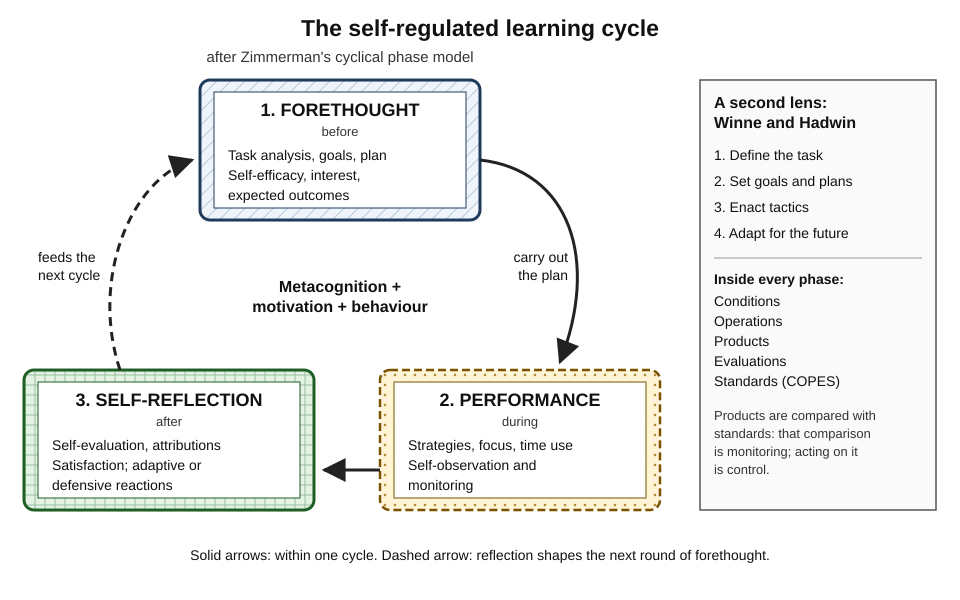
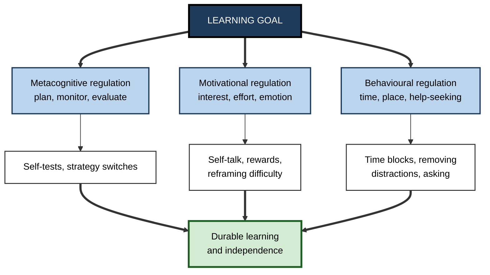
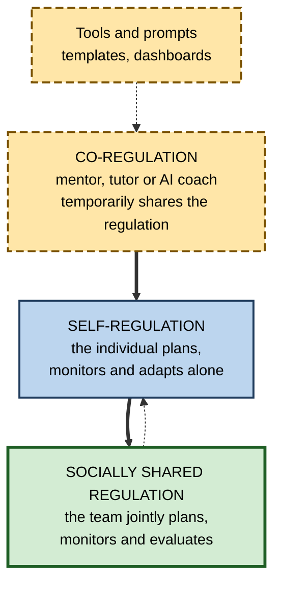

# K.7. Self-Regulated Learning

> **In one sentence:** Self-regulated learning is being the manager of your own learning: setting goals, choosing strategies, keeping yourself on track and motivated, checking progress, and adjusting, all without someone else doing it for you.
>
> **Why it matters:** Most adult and workplace learning has no teacher standing over it: online courses, certifications, new tools, new domains, AI-assisted self-study. Self-regulation is one of the most consistent predictors of who succeeds in these settings, and it can be strengthened with training.
>
> **Level span:** Novice → Expert · **Reading time:** ~18 min · **Builds on:** metacognitive monitoring and control

---

## The Learning Ladder

| Level | Badge | After this level you can... |
|---|---|---|
| 1 | NOVICE | Explain what it means to "run" your own learning, with an everyday example. |
| 2 | FOUNDATIONS | Describe the three-phase cycle (forethought, performance, self-reflection) and how metacognition, motivation and behaviour fit together. |
| 3 | PRACTITIONER | Run a full self-regulated learning cycle on a real goal, including motivation and environment management. |
| 4 | ADVANCED | Compare the major models (Zimmerman, Winne and Hadwin, Pintrich, Boekaerts), co- and shared regulation, and the evidence on training and online learning. |
| 5 | EXPERT / PRO | Design programmes, tools and AI tutors that build learners' self-regulation instead of replacing it. |

---

## Level 1 · Novice — The Big Picture

At school, much of learning was regulated *for* you: a timetable, a teacher who set tasks, deadlines and tests. In adult life, especially at work, most of that structure disappears. You decide what to learn, when, how, and whether you have learned it. **Self-regulated learning (SRL)** is the set of skills for doing that well.

An analogy is a personal trainer versus training alone. With a trainer, someone sets the programme, checks your form, pushes you on tired days and adjusts the plan. Training alone, you have to be your own trainer. Self-regulated learners have, in effect, internalised the trainer.

You have already self-regulated when you:

- planned a revision timetable before exams and stuck to it (mostly);
- noticed you kept checking your phone, so you moved it to another room;
- realised a course was not working for you and switched to a different resource;
- rewarded yourself with a walk after finishing a hard chapter.

**The beginner's takeaway:** self-regulated learning is metacognition *plus* motivation *plus* managing your behaviour and surroundings. It is a cycle you repeat, not a single decision.

---

## Level 2 · Foundations — Core Concepts

### A definition

Barry Zimmerman, one of the field's founders, described self-regulation as self-generated thoughts, feelings and actions that are planned and cyclically adapted to attain personal goals. Three things stand out: it is **self-generated**, it is **goal-directed**, and it is **cyclical**.

### The three-phase cycle

*Figure K.7-1 — The self-regulated learning cycle.* Three phases (hatched forethought, dotted performance, cross-hatched self-reflection) run clockwise; the dashed arrow shows reflection feeding the next round of forethought. The side panel summarises Winne and Hadwin's four-phase model and its COPES elements.

| Phase | When | Key processes | Example: learning SQL for a new analytics role |
|---|---|---|---|
| **Forethought** | Before | Analyse the task, set goals, plan strategies; beliefs such as self-efficacy and interest | "In four weeks I can write joins and window functions unaided. Three 40-minute sessions a week, practice problems from our real tables." |
| **Performance** | During | Use strategies, manage attention and time, self-observe and monitor | Sessions in a quiet slot, phone away; logs which problems needed hints. |
| **Self-reflection** | After | Evaluate against goals, attribute causes, react, adapt | "Window functions still need hints; cause is too little practice, not lack of ability. Add two sessions on them." |

### The three ingredients

SRL combines three kinds of regulation:

1. **Metacognitive**: planning, monitoring, evaluating thinking and learning.
2. **Motivational and emotional**: maintaining interest, managing frustration and anxiety, sustaining effort.
3. **Behavioural and environmental**: managing time, place, distractions, and help-seeking.

**Figure K.7-2 — Self-regulated learning as three kinds of regulation around a goal.**

*How to read it:* the goal drives three kinds of regulation, each with typical tactics; all three converge on the outcome.

### Key terms

| Term | Plain meaning |
|---|---|
| **Self-regulated learning (SRL)** | Actively managing your own learning: goals, strategies, motivation, behaviour and evaluation. |
| **Forethought** | The planning phase before learning. |
| **Self-efficacy** | Your belief that you can succeed at a specific task. |
| **Self-observation** | Tracking your own behaviour and progress during learning. |
| **Causal attribution** | What you believe caused a success or failure. |
| **Co-regulation** | Regulation supported temporarily by another person or tool. |
| **Socially shared regulation** | A group jointly regulating its collective learning. |

---

## Level 3 · Practitioner — Putting It to Work

### A full SRL cycle in seven steps

1. **Define the task.** What exactly must you be able to do, by when, and under what conditions?
2. **Set a proximal, specific goal.** Weekly targets beat a vague end goal.
3. **Plan strategies and schedule.** Choose methods that fit the goal; block time in the calendar.
4. **Set up the environment.** Remove distractions, prepare materials, decide when help is allowed.
5. **Perform and self-observe.** Keep a light log: what you did, what you could do unaided, what needed help.
6. **Evaluate and attribute.** At the end of each week, compare with the goal. Attribute shortfalls to *controllable* causes (strategy, time, practice), not fixed ones ("I'm not a numbers person").
7. **Adapt.** Change one thing: strategy, schedule, environment or goal size.

### Worked example — a nurse moving into clinical informatics

| | Before | After (SRL cycle) |
|---|---|---|
| **Goal** | "Learn informatics." | "In eight weeks, build and explain a basic dashboard of ward-level falls data." |
| **Plan** | Enrols in a long online course; plans to "do it when I have time". | Three 45-minute sessions per week after early shifts; course modules plus one hands-on task per week. |
| **Environment** | Studies on the sofa with the television on. | Library room on two evenings; notifications off. |
| **Monitoring** | Watches lectures; feels it is going fine. | Logs each week what she built without help. |
| **Reflection** | Falls behind at week three; concludes "I'm not technical". | Notes that weeks with a hands-on task went better; attributes slow progress to too much video, too little practice. |
| **Adaptation** | Drops the course. | Cuts video time in half, adds a fortnightly 20-minute check-in with an informatics colleague. Completes the dashboard in week nine. |

### Common mistakes

- **Planning without monitoring.** A beautiful study plan with no checks becomes fiction by week two.
- **Ignoring motivation.** Strategy is useless if you never start; plan for low-energy days.
- **Unhelpful attributions.** Blaming ability leads to giving up; blaming strategy leads to adapting.
- **Over-regulating.** Spending more time on planners and apps than on learning.

---

## Level 4 · Advanced — Mechanisms, Models & Evidence

### The main models compared

| Model | Core idea | Distinctive contribution |
|---|---|---|
| **Zimmerman** (social-cognitive) | Forethought, performance and self-reflection phases in a cycle | Integrates motivation (self-efficacy, interest) with strategy; describes a developmental path from observation to self-regulation. |
| **Winne and Hadwin** (information-processing) | Four loosely sequenced phases: task definition, goals and plans, enactment, adaptation; each analysed with COPES (Conditions, Operations, Products, Evaluations, Standards) | Puts metacognitive monitoring at the heart: products are compared with standards; enables trace-based measurement in digital environments. |
| **Pintrich** | Four phases crossed with four areas: cognition, motivation and affect, behaviour, context | A comprehensive map for research and diagnosis. |
| **Boekaerts** (dual processing) | Learners switch between a growth pathway (learning) and a well-being pathway (protecting the self) | Explains why stress and threat derail strategy use. |
| **Efklides** | Distinguishes a person level (traits, beliefs) from a task level (in-the-moment experiences) | Highlights metacognitive feelings such as difficulty and confidence. |

### From co-regulation to shared regulation

Allyson Hadwin, Sanna Järvelä and Mariel Miller distinguish three forms of regulation in social settings:

- **Self-regulation**: an individual regulates their own learning.
- **Co-regulation**: one person or a tool temporarily supports another's regulation (a mentor asking "what's your plan?").
- **Socially shared regulation**: a team jointly plans, monitors and evaluates its collective work.

**Figure K.7-3 — From self-regulation to shared regulation.**

*How to read it:* support from others (dashed box) builds individual self-regulation, which in turn enables shared regulation in teams; the dotted arrow shows team practices feeding back into individual habits.

This matters for modern work, where learning increasingly happens in teams and with AI systems that can play a co-regulating role.

### What the evidence shows

- **SRL predicts achievement.** Meta-analyses consistently find positive associations between SRL strategies and achievement, typically small-to-moderate. In online and blended learning, time management, metacognitive regulation and effort regulation tend to show the clearest links, while some popular cognitive strategies such as rehearsal show weak links.
- **SRL can be trained.** Training programmes in schools and universities produce positive effects on strategy use and achievement, larger when they combine cognitive, metacognitive and motivational components and include practice in real coursework. The UK Education Endowment Foundation's 2025 guidance stresses explicit teaching, modelling and structured talk about learning.
- **Self-report has limits.** Questionnaires about strategy use only partly match what learners actually do. Since the 2010s, research has shifted to **trace data** (clicks, revisits, time on task), think-aloud and multimodal measures, analysed with learning analytics.

### SRL and generative AI

A 2025 randomised lab study by Fan and colleagues compared learners writing with ChatGPT, a human expert, writing analytics or no support. The ChatGPT group improved essay scores most but did not gain more knowledge or transfer, and their sequences of SRL processes differed, with signs of handing planning and monitoring to the tool. The authors labelled the risk **metacognitive laziness**. Other recent work explores AI tutors built to *prompt* SRL (asking for goals, plans and self-explanations) rather than simply to answer; early results are promising but heterogeneous, and quality and hallucination control are active concerns.

### Open questions

- How domain-general is SRL? Skills transfer partly, but strategy knowledge is often domain-specific.
- How best to fade external scaffolds (prompts, dashboards, AI coaching) so that regulation becomes internal.
- How to measure SRL validly at scale without reducing it to clickstream proxies.

---

## Level 5 · Expert / Pro — Professional Mastery

### Designing for self-regulation in organisations

Self-directed learning platforms, learning-in-the-flow-of-work and AI tutors all assume learners can self-regulate. Many cannot, at least not yet. Designers who take SRL seriously build in three layers:

| Layer | What it does | Examples |
|---|---|---|
| **Scaffold** | Supplies the regulation the learner cannot yet do | Goal templates, planning prompts, scheduled reminders, embedded self-tests |
| **Co-regulate** | A person or system shares regulation | Mentors, learning buddies, cohort check-ins, AI coaches asking reflective questions |
| **Fade** | Hands regulation back | Prompts become optional; learners set their own goals and checks |

### Metrics that capture regulation, not just completion

- Proportion of learners who set a specific goal and a plan.
- Use of self-tests and spaced revisits (from platform traces).
- Calibration: predicted versus actual assessment scores.
- Time-to-competence on a real task, measured without support.
- Persistence after a failed attempt (did they return?).

### AI tutors that build, not replace, regulation

Evidence from 2025 suggests a design principle: an AI tutor should behave like a good human coach, not like an answer engine.

1. Ask for the learner's goal and plan before helping.
2. Give hints and questions before solutions.
3. Prompt prediction and self-explanation.
4. End sessions with a reflection: what was learned, what remains unclear, what is next.
5. Gradually reduce prompting as the learner's own regulation improves.

### Professional scenario

**Role:** Head of L&D at a software company launching a self-paced cloud certification programme for 300 engineers.
**Situation:** A previous self-paced programme had a high sign-up rate and low completion; many who did finish failed the exam.
**What the pro does:** Adds a short forethought step at enrolment (goal date, weekly hours, chosen strategy). Learners join cohorts of six with a fortnightly 30-minute check-in (co-regulation). The platform inserts short self-tests with confidence ratings and sends a "you predicted 80%, scored 55%" summary. An AI study coach is configured to ask for the learner's plan and give hints first. After the first exam attempt, each learner completes a structured reflection. Completion and first-time pass rates rise compared with the previous programme; cohorts that kept meeting outperform those that lapsed.

### Limits and ethics

- SRL is not a substitute for good instruction; novices in a complex domain need guidance as well as autonomy.
- Tracking self-regulation behaviours can become surveillance; be transparent and use data for support, not judgement.
- "Self-directed" programmes can widen gaps: people with strong SRL thrive, others fall behind. Scaffolds are an equity measure.

---

## Myths vs. Evidence

| Myth | What the evidence shows |
|---|---|
| "Self-regulated learning means learning alone." | It includes help-seeking and is often co-regulated or socially shared. |
| "Adults are naturally self-regulated." | Many adults struggle without structure; SRL skills vary widely and can be trained. |
| "Motivation is separate from learning strategy." | SRL models treat motivation and emotion as integral; they drive whether strategies are used. |
| "Self-paced platforms automatically produce self-directed learners." | Without scaffolds, completion and learning are often low, especially for less experienced learners. |
| "The 70-20-10 rule is a research finding." | It originated from limited survey work and is better treated as a rough heuristic than as evidence. |
| "AI tutors will handle the regulation for learners." | Answer-giving tools can encourage metacognitive laziness; well-designed tutors prompt learners to regulate. |

## Practitioner Toolkit

**Weekly SRL cycle card**

- [ ] **Forethought:** goal for this week, strategies chosen, time blocked, confidence (0–100) that I will meet it.
- [ ] **Environment:** distractions removed; help sources identified.
- [ ] **Performance:** log of sessions, what I could do unaided, what needed help.
- [ ] **Self-reflection:** goal met? Controllable cause identified?
- [ ] **Adaptation:** one change for next week.

**SRL log template**

| Week | Goal | Planned hours | Actual hours | Unaided check result | Cause of gap | Change next week |
|---|---|---|---|---|---|---|
| | | | | | | |

## Self-Check

1. **[NOVICE]** What does it mean to be your own "personal trainer" for learning?
2. **[FOUNDATIONS]** Name the three phases of Zimmerman's cycle and one process in each.
3. **[FOUNDATIONS]** What three kinds of regulation make up SRL?
4. **[PRACTITIONER]** Why should shortfalls be attributed to controllable causes?
5. **[ADVANCED]** What does COPES stand for, and where does monitoring happen in it?
6. **[ADVANCED]** Distinguish self-regulation, co-regulation and socially shared regulation.
7. **[ADVANCED]** What did Fan and colleagues (2025) find about learning with ChatGPT?
8. **[EXPERT / PRO]** Describe the scaffold–co-regulate–fade approach for a self-paced programme.

### Answer Key

1. Setting your own goals and plans, checking your own progress, motivating yourself, and adjusting, as a trainer would.
2. Forethought (goal setting), performance (self-monitoring), self-reflection (self-evaluation or attribution).
3. Metacognitive, motivational and emotional, behavioural and environmental.
4. Controllable attributions (strategy, effort, time) lead to adaptation; fixed attributions (ability) lead to giving up.
5. Conditions, Operations, Products, Evaluations, Standards; monitoring is comparing products with standards to form evaluations.
6. Self: the individual regulates themselves. Co: another person or tool temporarily supports regulation. Shared: a group jointly regulates its collective learning.
7. Essay scores improved most but knowledge gain and transfer did not; SRL process patterns differed, suggesting metacognitive laziness.
8. Start with templates, prompts and self-tests (scaffold); add mentors, cohorts or AI coaching (co-regulate); then remove prompts as learners set goals and checks themselves (fade).

## Key Takeaways

- Self-regulated learning is **managing your own learning**: metacognition, motivation and behaviour together.
- It runs as a **cycle**: forethought, performance, self-reflection, then adapt.
- Major models (Zimmerman, Winne and Hadwin, Pintrich, Boekaerts) differ in emphasis but agree on **goals, monitoring and adaptation**.
- SRL **predicts success** in self-paced and online learning and **can be trained**, best when embedded in real work.
- **Co-regulation and shared regulation** matter in teams and with AI tools.
- AI can induce **metacognitive laziness**; design tools and programmes to **scaffold, co-regulate, then fade**.

## Glossary

| Term | Meaning |
|---|---|
| Causal attribution | The cause a person assigns to a success or failure. |
| Co-regulation | Temporary support of one learner's regulation by another person or tool. |
| COPES | Conditions, Operations, Products, Evaluations, Standards: Winne and Hadwin's elements of each SRL phase. |
| Effort regulation | Maintaining effort in the face of difficulty or boredom. |
| Forethought phase | The planning phase that precedes learning. |
| Performance phase | The phase in which strategies are used and progress is monitored. |
| Self-efficacy | Belief in one's capability to succeed at a specific task. |
| Self-reflection phase | The phase in which outcomes are evaluated and future action adapted. |
| Self-regulated learning | Learning directed by the learner's own goals, strategies, monitoring and adaptation. |
| Socially shared regulation | Collective regulation of a group's learning. |
| Trace data | Records of learner actions in digital environments used to infer regulation. |
