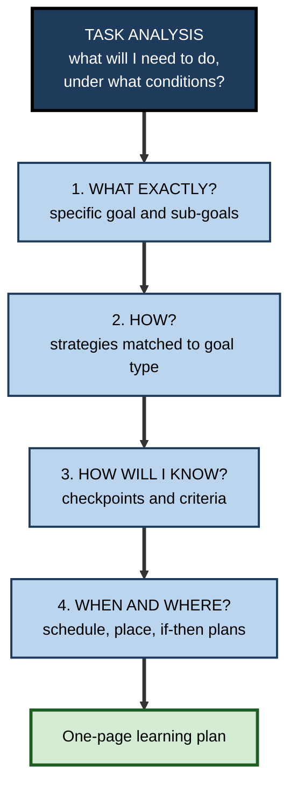
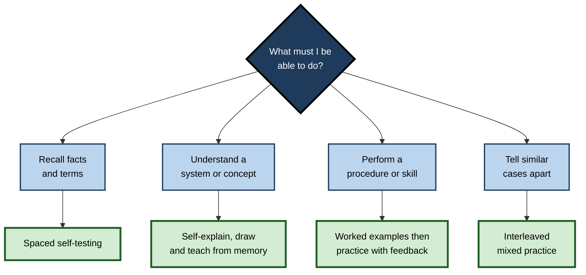

# K.8. Planning Learning Strategies

> **In one sentence:** Planning learning strategies means deciding, before you start, what exactly you are trying to learn, which methods fit that goal, how you will check progress, and when and where the work will happen.
>
> **Why it matters:** Most failed learning efforts fail at the planning stage: vague goals, a method chosen by habit, no checkpoints, and a schedule that ignores real life. A few minutes of evidence-informed planning saves hours of low-yield effort.
>
> **Level span:** Novice → Expert · **Reading time:** ~17 min · **Builds on:** metacognitive knowledge (especially conditional knowledge); the self-regulated learning cycle

---

## The Learning Ladder

| Level | Badge | After this level you can... |
|---|---|---|
| 1 | NOVICE | Explain why a learning plan beats "I'll just start" and name its basic parts. |
| 2 | FOUNDATIONS | Use task analysis, goal types and strategy fit to build a plan. |
| 3 | PRACTITIONER | Write a one-page learning plan with goals, strategies, checkpoints, schedule and if–then plans. |
| 4 | ADVANCED | Explain the science behind goal setting, implementation intentions, the planning fallacy and strategy selection. |
| 5 | EXPERT / PRO | Design planning supports for teams and programmes, including when to let AI help plan and when not to. |

---

## Level 1 · Novice — The Big Picture

Imagine two people preparing for the same professional exam. One opens the textbook at page one and starts reading. The other spends twenty minutes first: looking at past questions, listing the topics that carry the most marks, deciding to practise questions rather than reread, booking three sessions a week, and setting a mock exam for week four. Six weeks later, the second person is almost always better prepared, not because they worked harder, but because they **planned**.

Planning is like route planning before a road trip. You decide the destination, choose the roads, estimate the time, and plan where to stop and check the map. Without it, you might drive a long way, enjoy the scenery, and arrive somewhere you did not intend.

You have already planned learning when you:

- made a revision timetable before exams;
- decided to learn a language with an app every morning on the train;
- asked a colleague "What should I learn first?" before starting a new tool.

**The beginner's takeaway:** a learning plan answers four questions: *What exactly? How? How will I know? When and where?*

---

## Level 2 · Foundations — Core Concepts

### Step 1: Analyse the task

**Task analysis** means working out what the learning goal really demands. Ask:

- What will I need to *do* with this knowledge? Recall facts, understand a system, perform a procedure, or make judgements?
- Under what conditions? Time pressure, open book, with tools, in front of people?
- How will it be tested or used? An exam format, a client conversation, production code?

### Step 2: Choose the right type of goal

| Goal type | Example | Best when |
|---|---|---|
| **Outcome goal** | "Pass the exam with 75%." | Defines success; motivating at the end. |
| **Performance goal** | "Score 80% on two mock exams." | Measurable progress markers. |
| **Learning or process goal** | "Find and practise three strategies for solving case questions." | Complex, unfamiliar tasks where you do not yet know how to succeed. |
| **Proximal sub-goal** | "This week: complete and self-test chapters 3 and 4." | Sustains effort and gives frequent feedback. |

### Step 3: Match strategies to the goal

| What you need | Strategies with strong evidence | Common weak defaults |
|---|---|---|
| **Recall of facts and terms** | Spaced retrieval practice (self-testing) | Rereading, highlighting |
| **Understanding systems and concepts** | Self-explanation, explaining to others, drawing from memory, worked examples followed by problems | Copying notes, passive videos |
| **Procedures and skills** | Deliberate practice with feedback; worked examples fading into problems | Watching demos only |
| **Discriminating similar cases** | Interleaved practice of mixed examples | Blocked practice of one type |
| **Judgement in messy situations** | Varied cases, reflection, expert feedback | Memorising rules alone |

### Step 4: Plan checks, time and place

Decide in advance how you will **monitor** (self-tests, mock tasks), **when** you will work (calendar blocks), and **where** (an environment that supports focus).

**Figure K.8-1 — The four questions of a learning plan.**

*How to read it:* each question builds on the one before; the plan is complete only when all four are answered.

### Key terms

| Term | Plain meaning |
|---|---|
| **Task analysis** | Working out what a learning goal actually requires. |
| **Learning goal** | A goal focused on acquiring strategies or understanding rather than a score. |
| **Proximal goal** | A near-term sub-goal on the way to a larger goal. |
| **Implementation intention** | An if–then plan linking a situation to an action ("If it's 7 a.m. on a weekday, then I do 20 minutes of practice questions"). |
| **Planning fallacy** | The tendency to underestimate how long tasks will take. |
| **Mental contrasting** | Imagining the desired outcome and then the obstacles in the way. |
| **Strategy fit** | How well a method matches the goal type and conditions. |

---

## Level 3 · Practitioner — Putting It to Work

### The one-page learning plan

1. **Goal (one sentence):** "By [date], I will be able to [observable action] under [conditions]."
2. **Why it matters:** one line of personal or business relevance (supports motivation).
3. **Sub-goals:** weekly or session-level targets.
4. **Strategies:** for each sub-goal, the method and why it fits.
5. **Checkpoints:** when and how you will test yourself unaided; what counts as passing.
6. **Schedule:** specific calendar blocks; add a buffer of at least a third more time than you think you need.
7. **Obstacles and if–then plans:** list the two or three most likely obstacles and a response for each.
8. **Review date:** when you will evaluate the plan itself.

### Worked example — a finance manager learning Python for automation

| Plan element | Weak plan | Strong plan |
|---|---|---|
| Goal | "Learn Python." | "By 30 June, write a script that pulls our monthly ledger export, cleans it and produces the variance table, without copying code." |
| Sub-goals | None. | Weeks 1–2: basics and pandas loading; weeks 3–4: cleaning; weeks 5–6: the variance table. |
| Strategies | Watch a 20-hour course. | Short tutorials, then rebuild each example from a blank file; weekly practice on real (anonymised) data. |
| Checkpoints | None. | End of each fortnight: complete a small task unaided in 30 minutes. |
| Schedule | "Evenings when I can." | Tuesday and Thursday 7:30–8:15 a.m.; Saturday 1 hour; buffer week in July. |
| If–then plans | None. | "If month-end close takes over Tuesday, then I move the session to Wednesday lunch." "If I'm stuck over 20 minutes, then I post a question in the analytics channel." |

**Figure K.8-2 — Choosing a strategy from the goal type.**

*How to read it:* start at the question, pick the branch that matches your goal, and use the strategy in the thick-bordered box. Most real goals combine branches.

### Common mistakes

- **Goals that cannot be checked** ("understand machine learning").
- **Choosing a method by habit** rather than by goal type.
- **No buffer.** Plans built on best-case time estimates collapse at the first busy week.
- **Planning and never reviewing.** A plan is a hypothesis; review it after two weeks.
- **Planning instead of doing.** Elaborate planning can become procrastination. Twenty to thirty minutes is enough for most multi-week goals.

---

## Level 4 · Advanced — Mechanisms, Models & Evidence

### Goal-setting science

Edwin Locke and Gary Latham's **goal-setting theory**, built on hundreds of studies, found that specific, challenging goals usually lead to higher performance than "do your best". An important boundary condition: for **complex tasks where people do not yet have the strategies they need**, specific performance goals can hurt, because they push people to act before learning. In those cases, **learning goals** (for example, "discover and practise three effective strategies") tend to outperform performance goals. This is directly relevant to learning new professional skills.

Albert Bandura and Dale Schunk showed that **proximal sub-goals** increase self-efficacy, interest and performance more than distant goals alone, because they provide frequent evidence of progress.

### Implementation intentions

Peter Gollwitzer's **implementation intentions** are if–then plans that link a specific situation to a specific action. A widely cited 2006 meta-analysis by Gollwitzer and Paschal Sheeran found a medium-to-large average effect on goal attainment. The mechanism is that the situation becomes a cue that triggers the action automatically, reducing reliance on in-the-moment willpower. Combining them with **mental contrasting** (Gabriele Oettingen's approach of imagining the desired outcome and then the obstacles) strengthens the effect in several studies. Effects vary by domain, and later large-scale replications in some areas have found smaller effects than early studies, so treat them as helpful tools rather than guarantees.

### The planning fallacy

Roger Buehler, Dale Griffin and Michael Ross documented that people consistently underestimate task completion times, even when they know similar tasks took longer in the past. The cause is focusing on the specific plan ("inside view") rather than on base rates of how long such tasks usually take ("outside view"). Remedies with support include using past completion times, breaking tasks into components, and adding explicit buffers.

### Strategy selection and metacognitive knowledge

Planning depends on **conditional knowledge**: knowing which strategy fits which goal. The influential 2013 review by John Dunlosky and colleagues rated practice testing and distributed practice as high-utility across many learners and materials; interleaving, self-explanation and elaborative interrogation as moderate; and rereading, highlighting and summarising (as commonly done) as low. Because learners' beliefs often favour the low-utility strategies, planning is the moment to override habit with evidence.

### Why planning helps, mechanistically

- It **externalises** goals and criteria, freeing working memory during the task.
- It creates **standards** for monitoring: you cannot judge progress without a target.
- It **pre-commits** decisions that would otherwise be made under fatigue or temptation.
- It improves **calibration** when plans include predicted performance that can later be compared with actual results.

### Boundary conditions

- Over-detailed plans can reduce flexibility and motivation; plans should specify goals, strategies and checkpoints, not every minute.
- Rigid performance targets on complex new tasks can encourage shortcuts.
- Planning is most valuable for **multi-session** learning; for a 20-minute task, a one-line intention is enough.

---

## Level 5 · Expert / Pro — Professional Mastery

### Planning supports in organisations

| Support | Purpose | Notes |
|---|---|---|
| **Individual development plans** | Translate career goals into learning goals | Effective only if they contain checkable goals and checkpoints, not just course lists. |
| **Onboarding learning maps** | Sequence what to learn in the first 30, 60 and 90 days | Pair each stage with a real task that demonstrates competence. |
| **Learning sprints** | Short, time-boxed learning cycles in teams | Borrow agile rituals: plan, demo, retrospective. |
| **Manager check-ins** | Co-regulate planning | A five-minute "what's your goal and how will you know?" question is powerful. |

### AI and planning

AI assistants can generate study plans in seconds. Two risks and one opportunity:

- **Risk: generic plans.** AI plans often default to content coverage ("Week 1: read chapters 1–3") rather than to retrieval, application and checkpoints. Prompt explicitly for evidence-based strategies and unaided checks.
- **Risk: offloaded planning.** If the AI always plans, learners do not build the planning skill. Research on **metacognitive laziness** (Fan and colleagues, 2025) suggests handing over regulation can reduce engagement in it.
- **Opportunity: critique.** Ask the AI to critique *your* plan: "What is unrealistic? Where are the checkpoints weak? What strategies better fit this goal?"

### Professional scenario

**Role:** Engineering manager supporting a mid-level developer who wants to move into a site-reliability role within a year.
**Situation:** The developer has bought several courses and completed none; their development plan lists courses rather than outcomes.
**What the pro does:** In a 30-minute session, they rewrite the plan around four quarterly capabilities, each with a real task (for example, "lead a post-incident review"; "write an alert runbook that another engineer uses successfully"). For each, the developer chooses strategies (shadowing, practice in a staging environment, spaced review of key concepts), sets fortnightly checkpoints, and writes two if–then plans for busy sprints. The manager adds a monthly ten-minute check-in. The plan is reviewed after the first quarter and the second capability is adjusted. Progress is now visible to both, and the developer leads their first incident review in month five.

### Ethics and limits

- Planning tools should serve learners, not become compliance paperwork.
- Do not mistake a polished plan for progress; evaluate against checkpoints.
- Respect workload: planning learning on top of an overloaded job without protected time sets people up to fail.

---

## Myths vs. Evidence

| Myth | What the evidence shows |
|---|---|
| "Planning wastes time; just start." | Brief planning improves strategy choice, persistence and monitoring for multi-session learning. |
| "Specific, ambitious targets always help." | For complex new tasks, learning goals often beat performance targets. |
| "I know how long it will take." | The planning fallacy is robust; use past data and buffers. |
| "Willpower is what gets plans done." | If–then plans shift action to situational cues and reduce reliance on willpower. |
| "Any study method works if you put in the hours." | Strategies differ widely in effectiveness; matching method to goal matters. |
| "An AI-generated study plan is as good as my own." | Generic AI plans often favour coverage over retrieval and checkpoints, and outsourcing planning may weaken the skill. |

## Practitioner Toolkit

**One-page learning plan template**

| Section | Your answer |
|---|---|
| Goal: by (date) I can (action) under (conditions) | |
| Why it matters | |
| Sub-goals (weekly) | |
| Strategy for each sub-goal, and why it fits | |
| Checkpoints and pass criteria | |
| Schedule (calendar blocks plus buffer) | |
| Top obstacles and if–then plans | |
| Plan review date | |

**Planning checklist**

- [ ] My goal names an observable action and conditions.
- [ ] I chose strategies by goal type, not habit.
- [ ] Each sub-goal has an unaided checkpoint.
- [ ] I used past experience to estimate time and added a buffer.
- [ ] I wrote at least two if–then plans.
- [ ] I set a date to review the plan itself.

## Self-Check

1. **[NOVICE]** What four questions does a learning plan answer?
2. **[FOUNDATIONS]** What is task analysis, and why does it come first?
3. **[FOUNDATIONS]** Which strategy fits each goal: recall facts, understand a system, discriminate similar cases?
4. **[PRACTITIONER]** Write an if–then plan for a likely obstacle in your own learning.
5. **[ADVANCED]** When can specific performance goals backfire, and what works better?
6. **[ADVANCED]** What causes the planning fallacy, and how can you counter it?
7. **[ADVANCED]** How do implementation intentions work?
8. **[EXPERT / PRO]** How should you use AI in planning without losing the planning skill?

### Answer Key

1. What exactly? How? How will I know? When and where?
2. Working out what the goal really demands (type of knowledge, conditions, how it will be used); strategy choice depends on it.
3. Spaced self-testing; self-explanation and drawing or teaching from memory; interleaved practice.
4. Example: "If a meeting overruns into my study slot, then I do a 15-minute self-test on my phone before leaving work."
5. On complex tasks where the learner lacks strategies; learning goals focused on discovering and practising strategies work better.
6. Focusing on the specific plan instead of base rates; counter with past completion data, task breakdown and buffers.
7. They link a situational cue to an action so the action is triggered automatically, reducing reliance on willpower.
8. Draft your own plan first, then ask the AI to critique it; prompt explicitly for evidence-based strategies and checkpoints.

## Key Takeaways

- A learning plan answers: **what exactly, how, how will I know, when and where**.
- Start with **task analysis**; choose strategies by **goal type**.
- Use **proximal sub-goals**, and **learning goals** for complex new skills.
- **If–then plans** and **buffers** protect plans from real life and the planning fallacy.
- Plans create the **standards** that make monitoring possible.
- Use AI to **critique** your plan, not to replace your planning.

## Glossary

| Term | Meaning |
|---|---|
| Goal-setting theory | Locke and Latham's theory that specific, challenging goals usually raise performance. |
| Implementation intention | An if–then plan linking a situation to a goal-directed action. |
| Inside view | Estimating from the specifics of the current plan. |
| Learning goal | A goal to acquire strategies or understanding. |
| Mental contrasting | Imagining a desired future and then the obstacles to it. |
| Outside view | Estimating from base rates of similar past tasks. |
| Performance goal | A goal defined by a level of performance or score. |
| Planning fallacy | Systematic underestimation of task completion time. |
| Proximal goal | A short-term sub-goal. |
| Strategy fit | The match between a learning method and the goal it serves. |
| Task analysis | Breaking down what a learning goal requires. |
