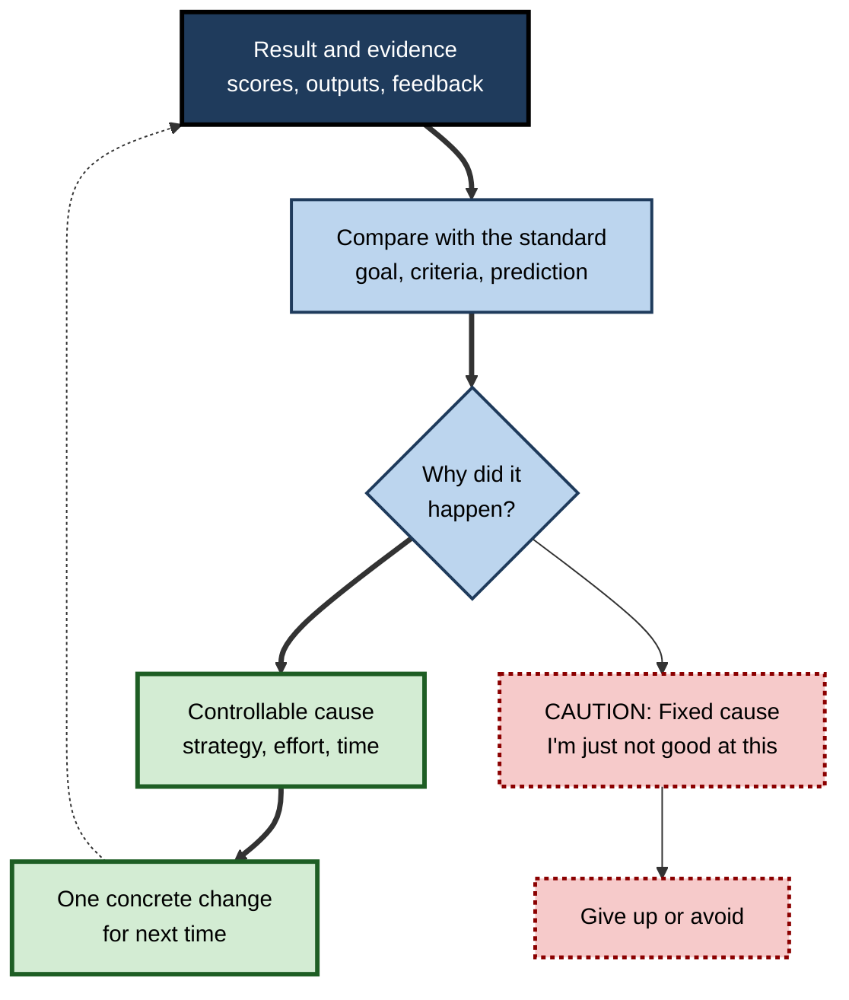
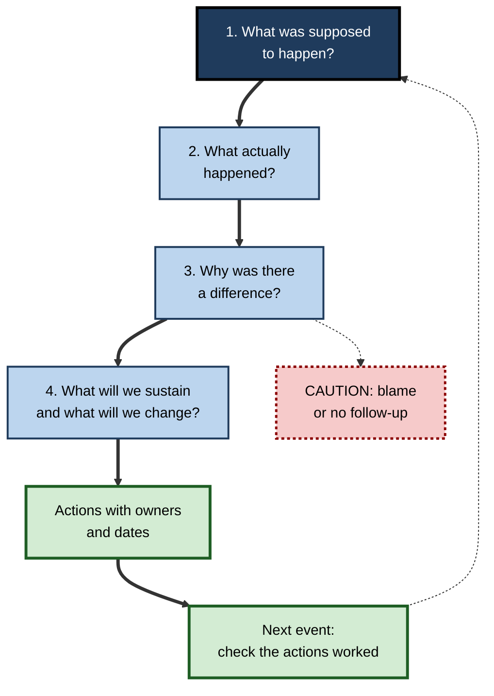

# K.9. Self-Evaluation After Learning

> **In one sentence:** Self-evaluation after learning is looking back honestly at what you actually learned and how you learned it, explaining why it went the way it did, and deciding what to change next time.
>
> **Why it matters:** Experience alone does not make people better; experience that is evaluated does. Structured reflection after projects, courses and incidents is one of the cheapest, best-evidenced ways for individuals and teams to improve.
>
> **Level span:** Novice → Expert · **Reading time:** ~17 min · **Builds on:** monitoring and calibration; the self-regulated learning cycle

---

## The Learning Ladder

| Level | Badge | After this level you can... |
|---|---|---|
| 1 | NOVICE | Explain the difference between "how did it go?" and a useful self-evaluation. |
| 2 | FOUNDATIONS | Evaluate both the outcome and the process, against a standard, with helpful attributions. |
| 3 | PRACTITIONER | Run a personal learning debrief and use an exam or project "wrapper". |
| 4 | ADVANCED | Explain attribution theory, hindsight bias, self-assessment accuracy and the debrief and feedback evidence. |
| 5 | EXPERT / PRO | Build after-action reviews and reflective practice into teams and programmes. |

---

## Level 1 · Novice — The Big Picture

When a test, project or presentation ends, most people do one of two things: move on as fast as possible, or replay the worst moment over and over. Neither helps much. **Self-evaluation** is a third option: a calm, structured look at what happened, why, and what to do differently.

Think of a sports team watching the game video on Monday. They are not there to celebrate or to blame. They look at specific moments, ask why the play worked or failed, and choose one or two things to practise that week. The video session is where the game becomes learning.

You have already self-evaluated when:

- you got an exam back, noticed most lost marks were on one topic, and changed how you revised it;
- after a job interview, you wrote down the questions you struggled with;
- after a project, your team agreed "next time we involve legal earlier".

**The beginner's takeaway:** a good self-evaluation compares what happened with what you intended, finds causes you can control, and ends with one concrete change.

---

## Level 2 · Foundations — Core Concepts

### Evaluate two things: outcome and process

| Evaluate | Question | Example |
|---|---|---|
| **Outcome** | Did I reach the goal, to the standard set? | "I can now write window functions unaided: 4 of 5 correct." |
| **Process** | Which strategies, schedule and environment helped or hurt? | "Practice on real tables worked; video tutorials did not stick." |
| **Calibration** | How accurate was my prediction of how I would do? | "I predicted 90%, scored 70%: overconfident on joins." |

### Attributions: what you think caused the result

Psychologist **Bernard Weiner** showed that the *causes* people assign to success and failure shape their emotions and future effort. Causes vary on three dimensions:

- **Locus**: inside you (effort, strategy) or outside (task difficulty, luck)?
- **Stability**: likely to stay the same (ability) or change (effort, strategy)?
- **Controllability**: can you change it?

**Strategy attributions** ("I used the wrong method") are the most useful after failure: they are internal, unstable and controllable, so they point to action. "I'm not smart enough" is internal, stable and uncontrollable, so it points to giving up.

### Feedback versus self-evaluation

**Feedback** is information from outside (a score, a reviewer's comments, a customer reaction). **Self-evaluation** is your own judgement. The best learning combines them: you evaluate first, then compare with feedback, which also trains your calibration.

**Figure K.9-1 — The self-evaluation loop.**

*How to read it:* the thick path leads through a controllable attribution to a change; the dotted-border path shows how fixed attributions end learning.

### Key terms

| Term | Plain meaning |
|---|---|
| **Self-evaluation** | Judging your own outcome and process against a standard. |
| **Attribution** | The cause you assign to a result. |
| **Postdiction** | A judgement of how you did, made after the task but before feedback. |
| **Hindsight bias** | Believing after the fact that you knew it all along. |
| **After-action review (AAR)** | A structured debrief comparing what was intended with what happened. |
| **Exam or project wrapper** | A short structured reflection form completed after an assessment or project. |
| **Reflective practice** | Habitual, structured reflection on professional experience. |

---

## Level 3 · Practitioner — Putting It to Work

### The personal learning debrief (15 minutes)

1. **Postdict first.** Before looking at results or feedback, write how well you think you did and why.
2. **Gather evidence.** Scores, errors, reviewer comments, outputs.
3. **Compare.** Outcome versus goal; postdiction versus actual (calibration).
4. **Categorise errors.** For each error: *knowledge gap*, *misunderstanding*, *careless slip*, *time pressure*, or *strategy problem*.
5. **Attribute.** For the biggest category, name a controllable cause.
6. **Decide one change.** Specific and scheduled ("For the next module, I replace one rereading session with two self-tests").
7. **Record it.** A short log lets you see patterns across several debriefs.

### Worked example — an exam wrapper for a professional certification module

| Wrapper question | Answer |
|---|---|
| How did you prepare (hours, methods)? | 10 hours; 7 rereading notes, 3 practice questions. |
| What score did you predict before seeing results? | 80%. |
| Actual score? | 62%. |
| Where were marks lost (by error type)? | 50% knowledge gaps in regulation topics; 30% misreading scenario questions; 20% time. |
| What will you do differently? | Swap ratio to 3 hours reading, 7 hours practice questions under timed conditions; read each scenario stem twice. |
| How will you check the change worked? | Timed mock at week 3; target 75% with prediction within 10 points. |

### Common mistakes

- **Evaluating only the outcome.** A good score with a poor process may not repeat; a poor score with a sound process may be bad luck.
- **Rumination instead of evaluation.** Replaying feelings without analysing causes.
- **Too many changes.** Pick one or two; you cannot test ten changes at once.
- **Skipping the postdiction.** Without it, you miss calibration data and fall into hindsight bias.
- **Reflecting without evidence.** Memory of how it went is biased; look at the actual outputs.

---

## Level 4 · Advanced — Mechanisms, Models & Evidence

### Self-assessment accuracy

A major review by David Dunning, Chip Heath and Jerry Suls (2004) concluded that people's self-assessments of skill are generally only weakly related to objective performance, across health, education and the workplace. Self-assessment improves when it is **specific** (judging particular items or tasks rather than global ability), **retrospective** (after the task rather than before), and **anchored** in clear standards and frequent feedback. **Postdictions** are typically more accurate than predictions, because the experience of doing the task supplies diagnostic cues.

### Hindsight bias

After learning an outcome, people overestimate how predictable it was. In self-evaluation, this means "I knew that" after seeing the answer, which hides the gap and reduces restudy. Writing a postdiction **before** seeing feedback is the main protection.

### Debriefs and after-action reviews: the evidence

A meta-analysis by Scott Tannenbaum and Christopher Cerasoli (2013), covering 46 samples, found that debriefs improved individual and team performance by roughly 20–25% on average compared with controls (a medium-to-large effect). Effects were similar for individuals and teams, simulated and real settings, and medical and non-medical samples. Debriefs worked better when they were **aligned** (focused on specific performance episodes and objectives), **structured**, and **facilitated**. The US Army's after-action review, with its core questions about what was supposed to happen, what actually happened, why, and what to change, is the best-known model and has been widely adopted in healthcare, aviation, software and emergency response.

### Feedback is powerful but not automatically positive

Avraham Kluger and Angelo DeNisi's 1996 meta-analysis of feedback interventions found a positive average effect, but in over a third of cases feedback *reduced* performance. Feedback that directs attention to the self ("you are good or bad at this") tends to harm; feedback that directs attention to the task and to strategies tends to help. Self-evaluation works the same way: task- and strategy-focused reflection helps; self-focused judgement often does not.

### Exam wrappers: mixed evidence

Exam wrappers, short reflection forms after assessments, have been used widely since the 2000s. Results are mixed. Some multi-course implementations report improved study habits and grades; a controlled single-course study (Soicher and Gurung, 2017) found no improvement in exam scores or metacognitive awareness scores. Recent reviews in nursing and other fields conclude that wrappers are promising when students get **specific guidance** on what to change and **repeated** use, and weak when they are a one-off form. This fits the broader pattern: reflection helps when it leads to concrete strategy changes that are then tried and checked.

### Reflection and learning from experience

Field experiments in workplace training have reported that brief, structured written reflection on what was learned can improve later performance more than an equivalent amount of extra practice, plausibly by consolidating lessons and raising self-efficacy. Evidence is promising but limited to a few settings. Theoretical roots include Donald Schön's distinction between **reflection-in-action** (during work) and **reflection-on-action** (after), and David Kolb's experiential learning cycle, whose cycle structure is widely used even though the associated "learning styles" inventory lacks support.

---

## Level 5 · Expert / Pro — Professional Mastery

### Building evaluation into team practice

| Practice | When | Core questions | Success factors |
|---|---|---|---|
| **After-action review** | After a project phase, event or exercise | What was supposed to happen? What happened? Why? What will we sustain or change? | Short, soon after the event, facilitated, focused on specific episodes |
| **Blameless post-incident review** | After outages or errors | What conditions made the error possible? What will prevent recurrence? | Psychological safety; focus on systems not individuals |
| **Sprint retrospective** | Every iteration | What helped, what hindered, what will we try? | One or two actions, owners, and follow-up next time |
| **Learning reviews in L&D** | After programmes | Did people learn and apply it? What design choices helped? | Delayed performance data, not just satisfaction |

**Figure K.9-2 — The after-action review in four questions.**

*How to read it:* the thick path is one review; the dotted loop links reviews over time; the dotted-border box marks the two ways reviews most often fail.

### Avoiding common organisational failure modes

- **Ritual without change.** Retrospectives that produce the same actions every time. Track action completion and whether the issue recurs.
- **Blame.** If debriefs assign fault to individuals, people hide errors and the system learns nothing.
- **Outcome bias.** Judging decisions only by results. Good evaluation asks whether the decision was sound given the information available.
- **Too late.** Lessons-learned documents written months after a project rarely change practice.

### AI-era self-evaluation

AI tools can help evaluation: summarising errors, clustering feedback, drafting AAR notes. They can also hollow it out. Keep the human steps that carry the learning: **postdict before you look**, **name your own attribution**, and **choose the change yourself**. Use AI to challenge your analysis ("What other explanations fit these errors?") rather than to write it.

### Professional scenario

**Role:** Clinical educator running simulation training for an emergency department.
**Situation:** Teams complete realistic simulations, but debriefs are informal and inconsistent, and the same communication errors recur.
**What the pro does:** Introduces a structured, facilitated debrief after each simulation: participants first state what they think happened (postdiction), then review the video, then answer four AAR questions focused on two specific moments, ending with one change per team. Facilitators are trained to steer toward task and strategy, not personal blame. Each team's change is checked at the next simulation. Over successive sessions, the targeted communication errors become less frequent, and staff report the debrief as the most valuable part of training.

---

## Myths vs. Evidence

| Myth | What the evidence shows |
|---|---|
| "Experience makes you better." | Experience combined with structured evaluation and feedback improves performance; unexamined experience often does not. |
| "People know how good they are." | Global self-assessments are weakly related to actual performance; specific, retrospective judgements are better. |
| "Any feedback helps." | Feedback improves performance on average but harms it in a substantial share of cases, especially when it focuses on the self. |
| "A reflection form after an exam is enough." | One-off wrappers show mixed results; guided, repeated reflection that changes strategy works better. |
| "Debriefs are soft and optional." | Meta-analytic evidence shows substantial performance gains from well-run debriefs. |
| "If it turned out well, the decision was good." | Outcome bias confuses luck with judgement; evaluate the process too. |

## Practitioner Toolkit

**Personal learning debrief checklist**

- [ ] I wrote a postdiction before seeing results.
- [ ] I compared the outcome with the goal and the prediction.
- [ ] I categorised errors by type.
- [ ] I named a controllable cause for the main error type.
- [ ] I chose one specific change and scheduled it.
- [ ] I logged the debrief to spot patterns.

**After-action review script (15–30 minutes)**

1. What did we intend to happen? (objectives, plan)
2. What actually happened? (facts, timeline, data)
3. Why was there a difference? (causes; focus on conditions and decisions)
4. What will we sustain, and what will we change? (one or two actions, owners, dates)

## Self-Check

1. **[NOVICE]** What three things does a good self-evaluation do?
2. **[FOUNDATIONS]** Why evaluate both outcome and process?
3. **[FOUNDATIONS]** Explain locus, stability and controllability, and why strategy attributions help.
4. **[PRACTITIONER]** Why write a postdiction before looking at feedback?
5. **[ADVANCED]** What did Tannenbaum and Cerasoli's meta-analysis find, and which factors strengthened debriefs?
6. **[ADVANCED]** Why can feedback sometimes reduce performance?
7. **[ADVANCED]** What does the evidence say about exam wrappers?
8. **[EXPERT / PRO]** Name two organisational failure modes of debriefs and how to prevent them.

### Answer Key

1. Compares what happened with what was intended, finds controllable causes, and ends with a concrete change.
2. Outcomes can reflect luck; process evaluation identifies what to repeat or change.
3. Locus (internal or external), stability (stable or changeable), controllability (can I change it?). Strategy attributions are internal, changeable and controllable, so they point to action.
4. It captures calibration data and protects against hindsight bias.
5. Debriefs improved performance by roughly 20–25% on average; alignment, structure and facilitation strengthened effects.
6. When it shifts attention to the self rather than the task and strategies.
7. Mixed: some studies show improvements, others none; they work better with specific guidance and repeated use.
8. Ritual without change (track action completion and recurrence); blame (use blameless formats and focus on systems); also outcome bias and lateness.

## Key Takeaways

- Self-evaluation turns **experience into learning**.
- Evaluate **outcome, process and calibration**, against a clear standard.
- Make **controllable, strategy-focused attributions**; avoid fixed-ability explanations.
- **Postdict before feedback** to train calibration and defeat hindsight bias.
- Well-run **debriefs and after-action reviews** produce substantial, well-evidenced gains.
- Feedback and reflection help most when they focus on the **task and strategy**, not the self.

## Glossary

| Term | Meaning |
|---|---|
| After-action review | A structured debrief comparing intended and actual outcomes and identifying changes. |
| Attribution | The perceived cause of an outcome. |
| Blameless review | A debrief focused on system conditions rather than individual fault. |
| Calibration | Agreement between predicted and actual performance. |
| Debrief | A structured discussion after an event to extract lessons. |
| Exam wrapper | A reflection form completed after an assessment. |
| Hindsight bias | Overestimating, after the fact, how predictable an outcome was. |
| Outcome bias | Judging a decision by its result rather than its quality. |
| Postdiction | A self-assessment made after performing but before feedback. |
| Reflection-on-action | Reflecting after an experience on how it went and why. |
| Self-evaluation | Judging one's own outcomes and processes against standards. |
