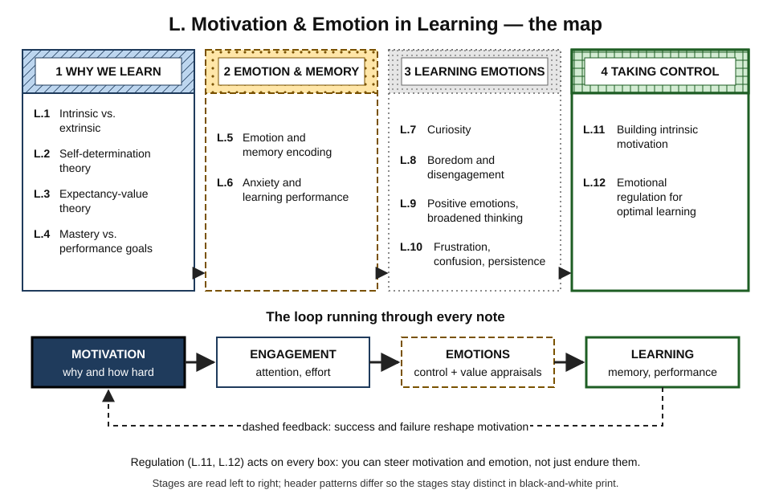
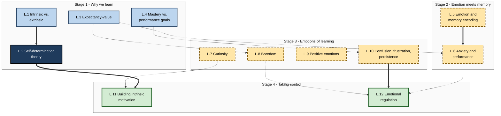
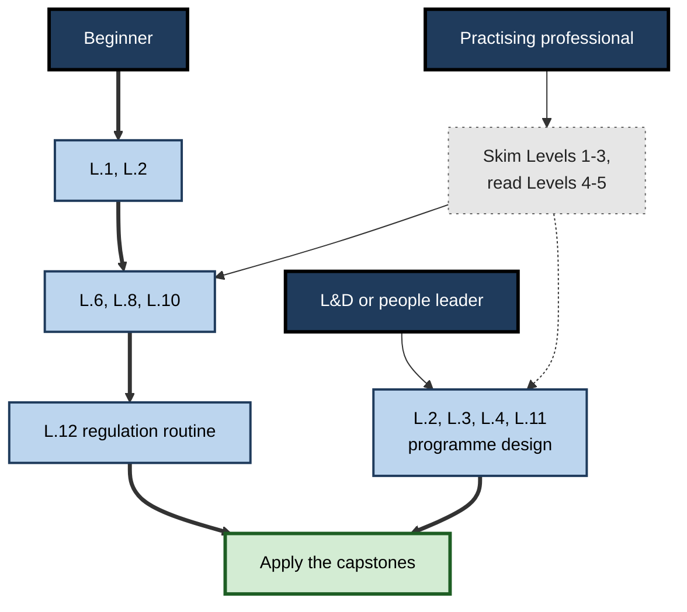

# L. Motivation & Emotion in Learning

> **What this subtopic is about:** Why people start, sustain and abandon learning — and how feelings such as curiosity, anxiety, boredom, confusion and enjoyment shape attention, memory and performance. It covers the major motivation theories, the science of emotion in learning, and practical ways to grow motivation and regulate emotion in yourself and others.
>
> **Who it is for:** Anyone who learns for work, plus managers, mentors, L&D professionals, instructional designers and builders of learning tools · **Notes in this subtopic:** 12 · **Level span:** Novice → Expert

---

## Overview

Most learning advice is about *methods* — how to space practice, how to test yourself, how to structure notes. Methods only work if people show up, pay attention and keep going when the work gets hard. That is the territory of **motivation** (the reasons that start, direct and sustain effort) and **emotion** (the feelings that colour every learning moment and change what the brain notices and keeps).

This subtopic treats motivation and emotion as part of the science of learning, not as soft extras. The first four notes cover the most tested theories of motivation: intrinsic versus extrinsic motivation, self-determination theory, expectancy-value theory and achievement goals. The next two connect emotion to the machinery of memory and to performance under pressure. Four notes then examine the specific emotions that dominate real learning — curiosity, boredom, positive emotions, and the triad of confusion, frustration and persistence. The last two turn the science into skill: growing intrinsic motivation and regulating emotion.

*Figure L-1 — Motivation and emotion in learning: the map.* Top: the four stages of the subtopic, each with a distinct header pattern and border. Bottom: the loop that runs through every note — motivation drives engagement, engagement produces emotions, emotions shape learning, and the dashed feedback line shows results reshaping motivation.

---

## Why It Matters

- **Motivation decides whether learning happens at all.** Workplace surveys in 2025 continue to find that heavy workloads and weak manager support are among the biggest barriers to development, and Gallup's 2025 global report estimated only about one in five employees were engaged at work.
- **Emotion changes what is remembered.** Arousal strengthens memory for what is central, anxiety consumes working memory, boredom drives mind wandering, and resolved confusion predicts deeper understanding.
- **The evidence is strong enough to act on.** Meta-analyses link enjoyment positively, and boredom and anxiety negatively, to achievement; self-determination-theory interventions reliably raise intrinsic motivation; brief relevance interventions produce small but dependable gains.
- **Generative AI raised the stakes.** Recent studies show AI help can improve immediate output without raising intrinsic motivation or durable learning, and can remove the productive struggle and curiosity that drive memory. Designing *how* people use AI is now a motivation-and-emotion problem.

---

## What You Will Learn

| # | Note | Core question it answers | Primary level |
|---|---|---|---|
| L.1 | Intrinsic vs. Extrinsic Motivation | When do rewards help, and when do they crowd out interest? | Novice → Practitioner |
| L.2 | Self-Determination Theory | What do people need psychologically to stay motivated and learn deeply? | Foundations → Advanced |
| L.3 | Expectancy-Value Theory of Motivation | Is the problem confidence, value or cost — and how do I fix each? | Foundations → Practitioner |
| L.4 | Goal Orientation: Mastery vs. Performance | How does aiming to improve versus aiming to look good change learning? | Foundations → Expert |
| L.5 | Emotion and Memory Encoding | Why are emotional events remembered better, and what are the trade-offs? | Foundations → Advanced |
| L.6 | Anxiety and Learning Performance | How does anxiety hurt thinking, and what reliably helps? | Novice → Advanced |
| L.7 | Curiosity as a Learning Driver | How does curiosity prime memory, and how do I spark it? | Novice → Practitioner |
| L.8 | Boredom and Disengagement | Why do people tune out, and how do I diagnose and fix it? | Novice → Practitioner |
| L.9 | Positive Emotions and Broadened Thinking | Which positive emotions help which kinds of thinking? | Foundations → Advanced |
| L.10 | Frustration, Confusion, and Persistence | When is struggle productive, and how do I keep it that way? | Practitioner → Expert |
| L.11 | Building Intrinsic Motivation for Learning | How do I grow lasting interest in myself and others? | Practitioner → Expert |
| L.12 | Emotional Regulation for Optimal Learning | How do I steer emotions so they help rather than hijack learning? | Practitioner → Expert |

---

## Concept Map

**Figure L-2 — How the twelve notes relate.**

*How to read it:* subgraphs are the four stages; thick arrows are direct prerequisites; dotted arrows show where an idea from one note explains or feeds another (for example, expectancy and value appraisals explain anxiety and boredom).

---

## Recommended Learning Path

1. **Start with L.1 and L.2.** They give the core vocabulary — intrinsic, extrinsic, autonomous, controlled, basic needs — used everywhere else.
2. **Read L.3 and L.4** to diagnose motivation problems (confidence, value, cost) and goal climates (mastery versus performance).
3. **Read L.5 and L.6** to see how emotion reaches into memory and performance under pressure.
4. **Read L.7 to L.10 in order.** Curiosity and boredom are two sides of engagement; positive emotions and confusion show how feelings change thinking and persistence.
5. **Finish with L.11 and L.12**, which turn everything into personal and team practice.

**Figure L-3 — Learning path by reader type.**

*How to read it:* beginners follow the thick path from the top; professionals can skim the first three levels of each note (sparse-dotted box) and focus on mechanisms and practice; leaders jump to the design-heavy notes.

**Where a pro can skim:** experienced practitioners can skim Levels 1–3 of L.1, L.7 and L.9, and read the Level 4 and 5 sections closely — especially the evidence updates on rewards, the performance-approach debate, curiosity's limits, the positivity-ratio retraction, grit and ego depletion, and the 2024–2026 meta-analyses.

---

## The Big Ideas in Brief

**L.1 Intrinsic vs. Extrinsic Motivation.** Intrinsic motivation comes from the activity, extrinsic from separable outcomes. The predictive split is autonomous versus controlled motivation. Expected, tangible, task-contingent rewards on already-interesting tasks can undermine later free-choice interest; informational feedback and unexpected recognition tend to help. Incentives drive quantity; intrinsic motivation better predicts quality.

**L.2 Self-Determination Theory.** People thrive when three needs are met — autonomy, competence, relatedness. Motivation runs on a continuum, and internalisation lets necessary but dull learning become self-endorsed. Structure plus autonomy support beats control. 2024 meta-analyses confirm SDT interventions raise autonomy, competence and intrinsic motivation, while relatedness is hardest to move.

**L.3 Expectancy-Value Theory of Motivation.** Effort depends on "Can I?" (expectancy), "Is it worth it?" (intrinsic, attainment and utility value) and "What will it cost?" Expectancy predicts performance; value predicts choices and persistence. Self-generated relevance interventions show small, reliable gains, often larger for lower-confidence learners.

**L.4 Goal Orientation: Mastery vs. Performance.** Mastery-approach goals predict deep strategies and persistence; performance-avoidance goals predict anxiety and help avoidance. Performance-approach goals are contested — linked to grades but also anxiety. Environments shape goals; for complex, novel tasks, learning goals beat outcome goals.

**L.5 Emotion and Memory Encoding.** Arousal tags experiences as important via the amygdala and noradrenaline, boosting consolidation (including during sleep). Emotion narrows attention and inflates confidence, so vivid memories can be wrong. Make the emotion carry the key idea and avoid seductive details; stress at recall usually hurts.

**L.6 Anxiety and Learning Performance.** Worry consumes working memory; anxiety reduces efficiency before effectiveness. The inverted-U is a heuristic, not a law. Realistic, spaced, low-stakes practice and stress reappraisal (small, reliable effects) help; anxiety interventions reduce anxiety more reliably than they raise scores.

**L.7 Curiosity as a Learning Driver.** Curiosity is the response to a noticed information gap and peaks when people know some but not all. Curiosity states engage dopamine and hippocampal systems; a 2026 meta-analysis found a moderate memory benefit for target information and a small one for incidental material, and a 2024 study found curiosity can interfere with nearby complex facts. Ask before you tell.

**L.8 Boredom and Disengagement.** Boredom comes from low value and from challenge that is too low *or* too high. It reliably predicts lower achievement, with reciprocal effects. Fix fit, value and activity before adding entertainment, and measure engagement with pulses and decisions, not seat time.

**L.9 Positive Emotions and Broadened Thinking.** Low-intensity positive emotions tend to broaden attention and thinking; high-intensity approach states narrow it. Enjoyment is a robust predictor of achievement. The "positivity ratio" was debunked. Use broad states to explore and focused states to check; avoid toxic positivity.

**L.10 Frustration, Confusion, and Persistence.** Confusion that gets resolved is linked to deeper learning; unresolved confusion becomes frustration, then boredom. Productive failure helps conceptual understanding when designed well. Grit's effects are modest and ego depletion has largely failed replication; persistence rests on expectancy, value, strategies and timely help.

**L.11 Building Intrinsic Motivation for Learning.** Interest develops through four phases from a spark to identity. Five levers — curiosity, competence, autonomy, relatedness, meaning — grow it. Early wins and communities are practical boosters; gamification and rewards are supports, not engines.

**L.12 Emotional Regulation for Optimal Learning.** Regulation is steering, not suppressing. The process model gives five strategy families. Problem-solving is linked to achievement while avoidance and self-blame hurt it; reappraisal changes emotion but has a weaker direct link to grades. Self-compassion, flexibility and co-regulation matter; emotion-detecting AI faces ethical and legal limits.

---

## Novice-to-Pro Progression

| Level | What competence looks like here |
|---|---|
| **1 · NOVICE** | Names the main motivations and learning emotions, recognises them in daily life, and knows that boredom, anxiety and confusion are signals rather than character flaws. |
| **2 · FOUNDATIONS** | Uses the vocabulary of SDT, expectancy-value, achievement goals and control-value theory correctly, and explains the basic mechanisms linking emotion to attention and memory. |
| **3 · PRACTITIONER** | Diagnoses motivation and emotion problems in their own learning and in sessions they run, and applies matched fixes — rationale and choice, early wins, curiosity-first openings, stuck protocols, reappraisal. |
| **4 · ADVANCED** | Weighs evidence critically: knows effect sizes are usually small to moderate, distinguishes replicated findings from contested or debunked ones, and understands boundary conditions. |
| **5 · EXPERT / PRO** | Designs programmes, team practices, recognition systems and AI tools that grow autonomous motivation and productive emotions at scale, measures them credibly, and respects ethical limits. |

---

## Where This Shows Up at Work

- **Onboarding.** Early wins, buddies and curiosity-first exploration accelerate time-to-independence and support relatedness.
- **Upskilling and reskilling.** Expectancy, value and cost diagnostics explain why AI-fluency or data-literacy programmes stall, and how to fix them.
- **Performance management.** Ranking systems create performance-avoidance climates; separating developmental feedback from evaluation protects learning.
- **Certification and assessment.** Realistic mocks, reappraisal and accurate communication about stakes reduce harmful anxiety.
- **Compliance training.** Diagnostic test-outs, real incidents and decision points reduce boredom while meeting coverage requirements.
- **Engineering, analytics and consulting teams.** Stuck protocols, hint ladders and blameless reviews keep struggle productive and reduce wheel-spinning.
- **Product and tool design.** Learning apps and AI tutors that ask before telling, give hints before answers, and avoid manipulative streaks support real motivation.
- **Leadership.** Managers' autonomy support and co-regulation strongly shape team motivation and emotional climate.

---

## Capstone Exercises

1. **Motivation audit of a real programme.** Choose a course or onboarding path you know. Score it on autonomy, competence, relatedness, expectancy, value, cost and goal structure. Propose three changes and the metric you would use to judge each.
2. **Redesign a dull session.** Take a 30-minute mandatory session and redesign it with a curiosity-first opening, a diagnostic test-out, decision points every few minutes, and a relevance reflection. Predict which learners will benefit most.
3. **Personal emotion log.** For two weeks, log your learning emotions (curiosity, boredom, anxiety, confusion, frustration, enjoyment) after each study session, with the likely control and value appraisal and the strategy you used. Identify your most common unhelpful pattern and one replacement strategy.
4. **AI tutor specification.** Write a one-page specification for an internal AI learning assistant that supports autonomy and competence, protects productive struggle and curiosity, and avoids emotion surveillance.
5. **Evidence check.** Pick three popular claims from this subtopic's Myths tables, explain the current evidence for each, and write how you would explain the nuance to a senior stakeholder in two minutes.

---

## Key Takeaways

- Motivation and emotion are part of the **science of learning**, not decoration.
- **Quality of motivation** (autonomous versus controlled) matters more than its quantity.
- Diagnose before fixing: **needs, expectancy, value, cost and goal climate** each have different remedies.
- Emotions change **attention and memory**: arousal tags, anxiety crowds, boredom drifts, curiosity primes, resolved confusion deepens.
- Most effects are **small to moderate**; several popular claims (positivity ratio, ego depletion, strong grit and Yerkes–Dodson claims) are contested or debunked.
- **Productive struggle and curiosity** are easily destroyed by instant answers — including from AI.
- Motivation can be **grown** and emotions can be **steered**, by individuals and by the environments leaders build.
