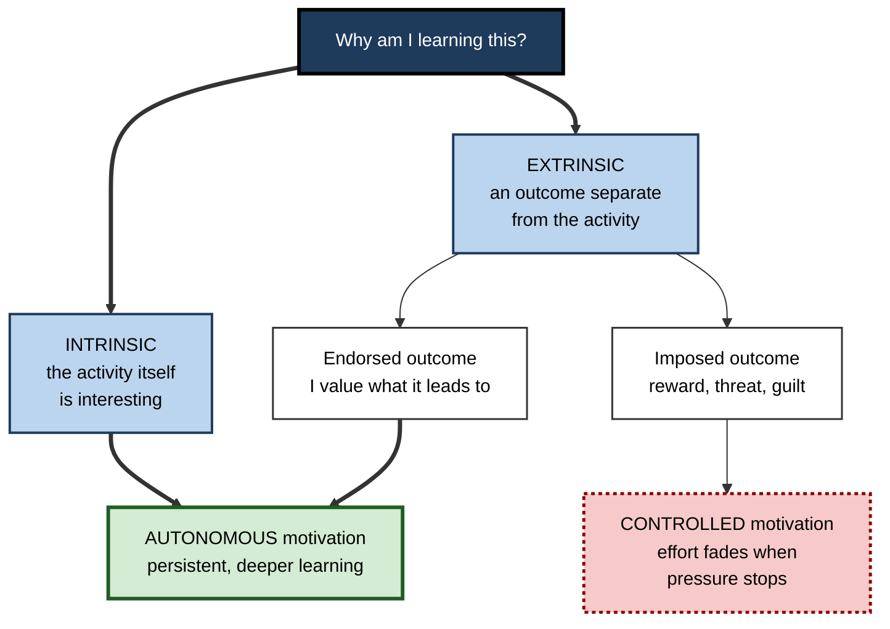
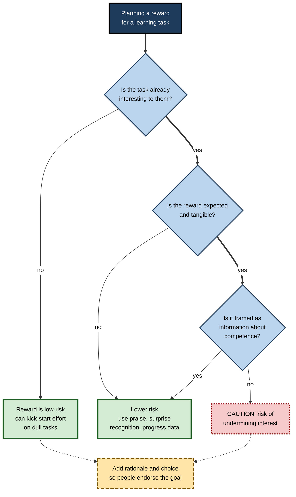
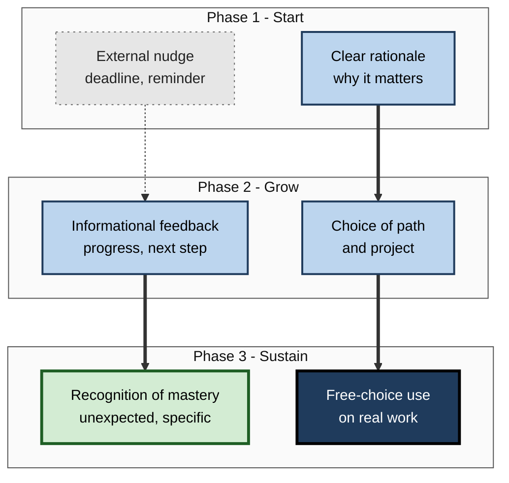

# L.1. Intrinsic vs. Extrinsic Motivation

> **In one sentence:** Intrinsic motivation is doing something because the activity itself is interesting or satisfying; extrinsic motivation is doing it to get something separate from the activity, such as money, grades, praise or avoiding trouble.
>
> **Why it matters:** Almost every learning programme, bonus scheme and productivity app quietly bets on one kind of motivation or the other. Knowing when external rewards help, when they backfire, and how the two kinds combine lets you design learning that people keep doing after the incentive stops.
>
> **Level span:** Novice → Expert · **Reading time:** ~17 min · **Builds on:** nothing — start here

---

## The Learning Ladder

| Level | Badge | After this level you can... |
|---|---|---|
| 1 | NOVICE | Tell intrinsic and extrinsic motivation apart in everyday examples from your own life. |
| 2 | FOUNDATIONS | Use the core vocabulary — reward contingency, undermining effect, autonomous versus controlled motivation — correctly. |
| 3 | PRACTITIONER | Audit a learning situation and adjust rewards, feedback and framing so they support rather than crowd out interest. |
| 4 | ADVANCED | Explain the evidence on rewards and interest, including what the meta-analyses found, where they disagree, and why. |
| 5 | EXPERT / PRO | Design incentive and recognition systems for teams and L&D programmes that drive both effort and lasting engagement. |

---

## Level 1 · Novice — The Big Picture

**Motivation** is whatever gets you started on something, keeps you going, and decides how hard you try. Psychologists split the reasons behind motivation into two broad families.

- **Intrinsic motivation** means the reward is *inside* the activity. You do a crossword because solving it is fun. You read about black holes because you want to know. Nobody has to pay you.
- **Extrinsic motivation** means the reward is *outside* the activity. You complete a compliance course because your manager will chase you if you do not. You study for a certification because it comes with a pay rise.

A helpful analogy is two kinds of engine in a boat. Extrinsic motivation is an outboard motor you can bolt on: powerful, quick to start, but it runs only while someone keeps feeding it fuel. Intrinsic motivation is a sail: slower to rig, but once it catches the wind it keeps pushing without extra fuel. Good sailors use both — and they make sure the motor does not tear the sail.

You have already experienced both when:

- you lost track of time learning a hobby, a game or a musical instrument (intrinsic);
- you crammed for a test only because of the grade, then forgot most of it (extrinsic);
- something you once loved started to feel like a chore after it became your job or was tied to a target (the motor tearing the sail).

The key idea for a beginner: **both kinds of motivation are normal and useful; problems start when external pressure replaces, rather than supports, a person's own reasons.**

---

## Level 2 · Foundations — Core Concepts

### It is not a simple either–or

Most real learning has mixed reasons. A developer may learn a new framework partly out of curiosity, partly because the team is migrating, and partly because it looks good on a CV. Modern research, mainly from Edward Deci and Richard Ryan's **self-determination theory**, therefore treats extrinsic motivation as a *range*: some external reasons feel imposed, while others have been taken on as genuinely your own ("I practise code review because I value quality, even though nobody makes me").

The more useful dividing line is between:

- **Autonomous motivation** — you act with a sense of choice and endorsement. Includes intrinsic motivation *and* well-internalised extrinsic reasons.
- **Controlled motivation** — you act because you feel pressured, either from outside (rewards, threats, surveillance) or from inside (guilt, shame, needing to prove yourself).

**Figure L.1-1 — Where a reason to learn comes from.**

*How to read it:* the top split is the classic intrinsic–extrinsic distinction; the bottom split is the one that best predicts outcomes. Endorsed extrinsic reasons join intrinsic ones on the autonomous side.

### Reward contingencies

How a reward is tied to behavior matters a great deal. A **reward contingency** is the rule that decides when a reward is given.

| Contingency | Rule | Workplace example |
|---|---|---|
| **Task-noncontingent** | Given just for being there | Free lunch at every training day |
| **Engagement-contingent** | Given for doing the task at all | Points for opening each module |
| **Completion-contingent** | Given for finishing | Certificate or badge when the course ends |
| **Performance-contingent** | Given for reaching a standard | Bonus for passing the exam above 85 percent |
| **Unexpected** | Given after the fact, not promised | Surprise recognition for a great internal talk |

### Key Terms

| Term | Plain meaning |
|---|---|
| **Intrinsic motivation** | Doing an activity for the satisfaction inherent in it. |
| **Extrinsic motivation** | Doing an activity to obtain a separable outcome. |
| **Autonomous motivation** | Acting with a sense of volition — wanting to, not having to. |
| **Controlled motivation** | Acting under felt pressure from rewards, threats or self-imposed guilt. |
| **Undermining effect** | The drop in free-choice interest after an expected, tangible reward is introduced and then removed. Also called the overjustification effect. |
| **Informational feedback** | Feedback that tells you how you are doing and how to improve. |
| **Controlling feedback** | Feedback that pressures you to behave a certain way ("you should", "you must"). |

---

## Level 3 · Practitioner — Putting It to Work

### The four-question motivation audit

Use this whenever you design a course, an onboarding plan, or your own study routine.

1. **What is the starting motivation?** Is the material already interesting to these learners, or is it necessary-but-dull (compliance, tooling migrations, regulation)?
2. **What rewards and pressures exist?** List every grade, badge, deadline, leaderboard, KPI and manager check-in attached to it.
3. **Are they informational or controlling?** Does each one tell people about their competence and progress, or does it mainly push and monitor?
4. **What happens when the reward stops?** If the answer is "people stop", you have built an outboard motor with no sail. Add a reason people can endorse — usefulness, mastery, choice, contribution.

**Figure L.1-2 — Deciding whether a reward will help or hurt.**

*How to read it:* follow the thick path for the high-risk case — an already-interesting task with an expected, controlling, tangible reward. Dotted arrows show the repair step.

### Worked example — a data team's SQL upskilling drive

| | Before | After |
|---|---|---|
| **Incentive** | Gift card for every module completed; weekly leaderboard of module counts. | No per-module reward. Monthly showcase where people present a real query they improved. |
| **Framing** | "Leadership needs 100 percent completion by Q3." | "These skills remove the three slowest reports from your week. Pick the track that fits your work." |
| **Feedback** | "You are behind the team average." | "Your query now runs in 4 s instead of 90 s — here is the next technique to try." |
| **Result** | Completions spiked, then collapsed after the gift cards ended; people clicked through videos. | Fewer completions in month one; steadier use, more people applying the skills to their own reports. |

### Common mistakes

- **Paying for what people already enjoy.** Tangible, expected rewards on already-interesting tasks carry the clearest risk of undermining.
- **Rewarding activity instead of competence.** Points for logging in train people to log in.
- **Confusing praise with pressure.** "Great work, you nailed the edge cases" is informational; "Good, that is what I expect from you" is controlling.
- **Assuming extrinsic means bad.** Necessary-but-dull learning often needs an external push to get started. The goal is to help people internalise the reason, not to ban incentives.

---

## Level 4 · Advanced — Mechanisms, Models & Evidence

### The undermining effect and its evidence

In the early 1970s, Deci and, separately, Mark Lepper and colleagues found that people who were paid or promised a reward for an interesting activity later spent *less* free time on it than people who were never rewarded. The classic children's study had pupils who liked drawing; those who expected a "good player" certificate later drew less in free play than those who received no reward or an unexpected one.

The strongest summary remains the meta-analysis by Deci, Koestner and Ryan (1999), covering 128 experiments. Measured by free-choice behavior, tangible rewards that were expected and contingent on doing, completing or performing the task reduced later intrinsic motivation, with engagement-contingent rewards showing the largest drop. Unexpected rewards and task-noncontingent rewards did not show this effect, and positive, informational feedback tended to *enhance* intrinsic motivation.

The finding has been contested. Judy Cameron, David Pierce and colleagues argued in a series of reviews that undermining is narrow and easy to avoid, and that rewards for meeting challenging standards can sustain interest. A later meta-analysis using the free-choice measure again found a negative effect for expected and tangible rewards, while self-reported interest showed weaker and less consistent effects. The balanced reading: **the undermining effect is real for a specific, common configuration — expected, tangible, task-contingent rewards on an already-interesting task — and is small or absent in many other configurations.**

### Why it happens: cognitive evaluation theory

Deci and Ryan's **cognitive evaluation theory**, a sub-theory of self-determination theory, explains rewards by asking what they *communicate*:

- If a reward is experienced as **controlling** ("you are doing this for me"), it shifts the felt cause of behavior from inside to outside, reducing autonomy and therefore interest.
- If it is experienced as **informational** ("you are good at this"), it can boost felt competence and increase interest.

The same reward can land either way depending on tone, the relationship, and whether it was promised in advance. Deadlines, surveillance, imposed goals and competition framed as pressure tend to act like controlling rewards.

### Quality versus quantity

A widely cited 2014 meta-analysis by Christopher Cerasoli, Jessica Nicklin and Michael Ford, covering decades of school and workplace studies, found that intrinsic motivation and incentives both predicted performance, but differently: intrinsic motivation was the better predictor of the *quality* of performance, while incentives were more strongly linked to *quantity*, especially when directly tied to output. This fits everyday experience in knowledge work: you can pay for more tickets closed, but it is much harder to pay for curiosity, careful thinking and craft.

### Boundary conditions

| Condition | Effect on intrinsic interest |
|---|---|
| Task is dull or unfamiliar | Rewards rarely harm interest; they can create the first positive experiences that later become interest. |
| Reward is unexpected | Little or no undermining. |
| Reward is verbal and informational | Usually enhances interest. |
| Reward recognises a high standard of mastery | Mixed; risk falls when framed as information. |
| Culture and relationship | Strongly hierarchical or punitive settings make the same reward feel more controlling. |

### What recent research changed

Recent reviews argue for moving "beyond dichotomies": real rewards are seldom purely good or bad, and their effect depends on the meaning learners attach to them. Large meta-analyses of self-determination theory interventions in education published in 2024 found that teaching approaches which support autonomy and competence reliably increased students' intrinsic motivation, which strengthens the practical case for changing *how* rewards and feedback are delivered rather than simply removing them.

Generative AI adds a new twist. In a 2025 randomised study of essay revision, students supported by ChatGPT improved their essays more than those supported by a human expert or a checklist, yet showed no difference in post-task intrinsic motivation and no advantage in knowledge gain or transfer. The researchers warned of "metacognitive laziness" — handing off the thinking. An AI that does the interesting part of the work can remove the very activity that would have generated intrinsic interest.

---

## Level 5 · Expert / Pro — Professional Mastery

### Designing incentive systems that do not eat interest

Experienced L&D leaders and engineering managers use a few design principles:

1. **Separate recognition from control.** Celebrate learning publicly and specifically, but avoid making access, status or pay depend on clicking through content.
2. **Reward outcomes of mastery, not activity.** If you must attach a tangible reward, tie it to demonstrated capability on real work, and explain the rationale.
3. **Prefer unexpected recognition** for discretionary learning — a spot award after a strong internal tech talk rather than a promised bonus for giving one.
4. **Use extrinsic scaffolds for the dull start**, then fade them. Compliance and tooling training can start with deadlines and nudges, then shift to usefulness and choice.
5. **Measure free-choice behavior.** The best signal of intrinsic motivation is what people do when nobody is tracking — voluntary practice, optional sessions attended, internal documentation contributed.

**Figure L.1-3 — Building an incentive mix that lasts.**

*How to read it:* external nudges (sparse dotted border) are allowed at the start but fade; the thick arrows show the path to self-sustaining use.

### Metrics a pro tracks

| Metric | What it tells you |
|---|---|
| Voluntary re-engagement rate | Share of learners who return to optional content after the mandatory part ends. |
| Post-incentive persistence | Practice levels in the month after a campaign's rewards stop. |
| Applied-skill evidence | Pull requests, analyses or client deliverables using the new skill. |
| Perceived autonomy and competence | Short pulse items: "I had real choice", "I am getting better at this". |

### Professional scenario

**Role:** Head of Sales Enablement at a software company.
**Situation:** A product-certification programme paid a cash bonus per module. Completion hit 95 percent, but call recordings showed reps still could not demo the new features, and module activity fell to almost zero once bonuses ended.
**What the pro does:** Replaces per-module cash with a single recognition for passing a live, recorded demo assessed by peers. Adds short "why this wins deals" stories from top reps, lets reps choose which product area to master first, and gives informational coaching on each demo. Tracks voluntary use of the practice sandbox. Completion falls slightly, but demo quality and sandbox use rise and stay up after the launch window.

### Ethical limits

Gamification and incentive design can slide into manipulation: streaks that induce guilt, leaderboards that shame, dark-pattern notifications. Professionals ask whether a mechanism helps people pursue goals they endorse or merely extracts clicks. Meta-analyses of gamification in education generally report positive average effects on engagement and achievement, but with wide variation and warnings that heavy reliance on points and rewards can buy short-term engagement at the cost of deep learning.

---

## Myths vs. Evidence

| Myth | What the evidence shows |
|---|---|
| "Rewards always kill intrinsic motivation." | Undermining is reliable mainly for expected, tangible, task-contingent rewards on already-interesting tasks. Informational praise usually helps. |
| "Extrinsic motivation is bad motivation." | Extrinsic reasons that people have internalised and endorse behave much like intrinsic ones and predict persistence. |
| "If people are paid enough, they will learn anything." | Incentives reliably raise quantity of effort; quality and depth are better predicted by intrinsic motivation. |
| "Gamification makes learning intrinsically motivating." | Average effects are positive but variable; points and badges alone can produce shallow, reward-chasing engagement. |
| "Intrinsically motivated people don't need feedback." | Informational feedback feeds competence, which is one of the main sources of intrinsic interest. |
| "Using AI to finish the task keeps learners motivated." | A 2025 experiment found better task output with ChatGPT but no gain in intrinsic motivation or knowledge transfer. |

## Practitioner Toolkit

**Reward-design checklist**

- [ ] I know whether the target activity is already interesting to these learners.
- [ ] Every reward is tied to demonstrated capability, not mere activity.
- [ ] Rewards are framed as information about progress, not as control.
- [ ] Discretionary learning is recognised with unexpected, specific recognition.
- [ ] Each learner has at least one real choice (topic, project, pace or format).
- [ ] I have a meaningful rationale people can endorse.
- [ ] I measure what happens after incentives stop.

**Script — turning controlling feedback into informational feedback**

| Instead of... | Say... |
|---|---|
| "You need to finish the module by Friday." | "Finishing by Friday means you can use this in next week's client review." |
| "You are below the team average." | "Your last two attempts improved on accuracy; edge cases are the next thing to work on." |
| "Good — that is what I expect." | "The way you handled the null values there is exactly the hard part." |

## Self-Check

1. **[NOVICE]** Give one example of intrinsic and one of extrinsic motivation from your own week.
2. **[NOVICE]** In the boat analogy, what does the sail represent and why does it matter?
3. **[FOUNDATIONS]** What is the difference between autonomous and controlled motivation?
4. **[FOUNDATIONS]** Name three types of reward contingency.
5. **[PRACTITIONER]** A manager wants to pay a bonus for every hour engineers spend on an already-popular internal hackathon training. What risk would you flag and what would you suggest?
6. **[ADVANCED]** According to cognitive evaluation theory, why can the same reward increase or decrease interest?
7. **[ADVANCED]** What did the Deci, Koestner and Ryan meta-analysis find about unexpected rewards and positive feedback?
8. **[EXPERT / PRO]** Which metric would best reveal whether a learning programme built intrinsic motivation?
9. **[EXPERT / PRO]** How might an AI writing assistant undermine intrinsic motivation even while improving output?

### Answer Key

1. Answers vary — for example, reading about a topic you love (intrinsic); completing a required security course to avoid escalation (extrinsic).
2. Intrinsic motivation; it keeps you moving without continuous external fuel, so learning continues after incentives stop.
3. Autonomous motivation is acting with a sense of choice and endorsement; controlled motivation is acting under felt pressure, from outside or from inside.
4. Any three of: task-noncontingent, engagement-contingent, completion-contingent, performance-contingent (and unexpected rewards as a contrast case).
5. Expected, tangible, engagement-contingent rewards on an already-interesting activity are the textbook case for undermining. Suggest specific, unexpected recognition of what people build instead.
6. Rewards carry two aspects; if experienced as controlling they reduce autonomy and interest, if experienced as informational they raise competence and interest.
7. Unexpected rewards did not undermine intrinsic motivation, and positive informational feedback tended to enhance it.
8. Free-choice behavior after incentives stop — voluntary re-engagement and applied use on real work.
9. It can take over the interesting, effortful part of the task, removing the experiences of challenge and competence that generate interest, and encouraging dependence.

## Key Takeaways

- Intrinsic motivation comes from the activity; extrinsic motivation comes from outcomes separate from it.
- The more predictive split is **autonomous versus controlled** motivation; endorsed extrinsic reasons work well.
- **Expected, tangible, task-contingent rewards** on interesting tasks are the main risk for undermining interest.
- **Informational feedback** and unexpected recognition tend to support interest.
- Incentives boost **quantity**; intrinsic motivation better predicts **quality**.
- Judge success by **what people do when nobody is tracking**.
- AI tools that do the interesting part of the work can quietly remove the source of intrinsic motivation.

## Glossary

| Term | Meaning |
|---|---|
| Autonomous motivation | Motivation experienced as volitional and self-endorsed. |
| Cognitive evaluation theory | A sub-theory of self-determination theory explaining how rewards and feedback affect intrinsic motivation through autonomy and competence. |
| Controlled motivation | Motivation driven by external or internal pressure. |
| Extrinsic motivation | Doing something for an outcome separable from the activity. |
| Free-choice measure | A research method that observes whether people continue an activity when they are free to do anything else. |
| Informational feedback | Feedback that conveys competence and how to improve. |
| Intrinsic motivation | Doing something for the inherent satisfaction of the activity. |
| Metacognitive laziness | Relying on a tool so heavily that you stop monitoring and regulating your own thinking. |
| Overjustification effect | Another name for the undermining effect. |
| Reward contingency | The rule that links a reward to behavior. |
| Undermining effect | Reduced intrinsic interest after an expected, tangible reward is introduced and later withdrawn. |
