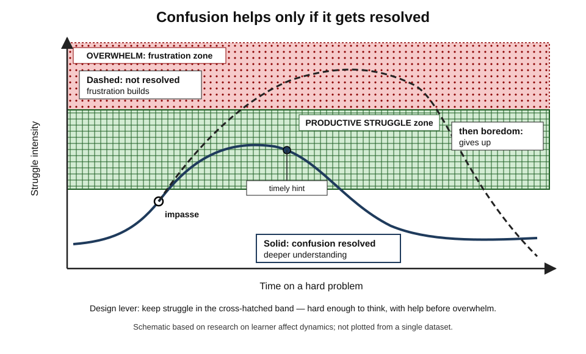
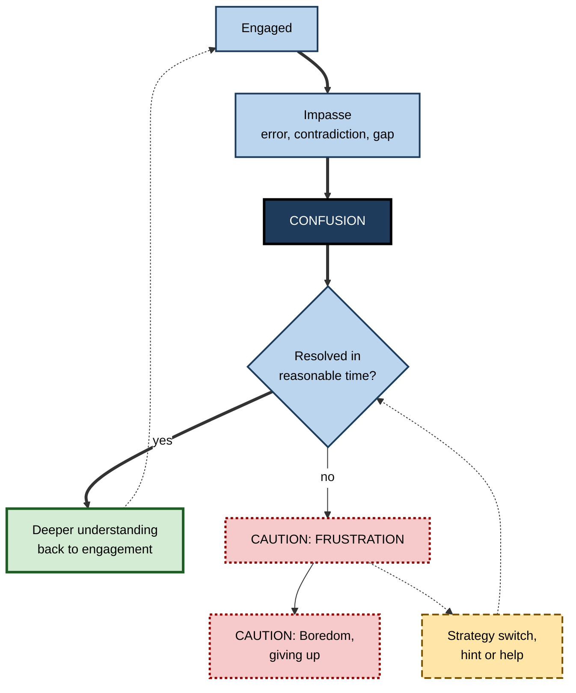
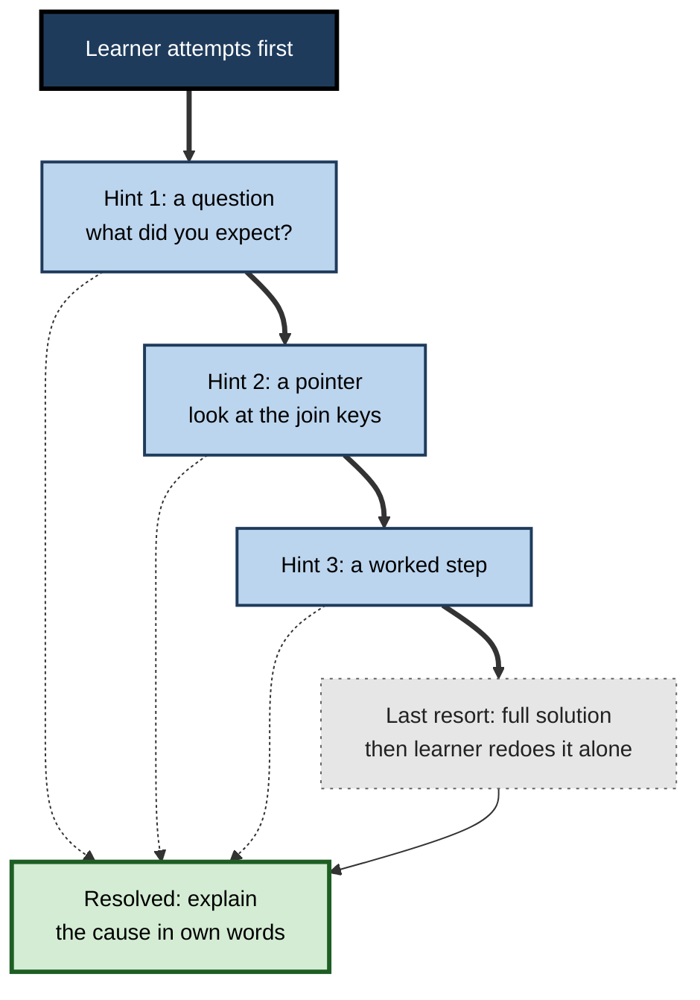

# L.10. Frustration, Confusion, and Persistence

> **In one sentence:** Feeling confused when learning something hard is often a sign that real learning is about to happen — as long as the confusion gets resolved — but confusion that drags on without help turns into frustration and then giving up.
>
> **Why it matters:** Every valuable professional skill involves stretches of "I don't get it". People and teams who know how to keep struggle productive — not too easy, not hopeless — learn faster, persist longer, and make better use of help, mentors and AI.
>
> **Level span:** Novice → Expert · **Reading time:** ~18 min · **Builds on:** boredom and disengagement, anxiety, goal orientation

---

## The Learning Ladder

| Level | Badge | After this level you can... |
|---|---|---|
| 1 | NOVICE | Recognise confusion and frustration as normal parts of learning and tell them apart. |
| 2 | FOUNDATIONS | Explain the affect dynamics model and the idea of productive versus unproductive struggle. |
| 3 | PRACTITIONER | Use routines that keep your struggle productive and know when and how to seek help. |
| 4 | ADVANCED | Summarise the evidence on confusion, productive failure, grit and self-control, including replication problems. |
| 5 | EXPERT / PRO | Design tasks, support systems and AI tools that maximise productive struggle and minimise wheel-spinning. |

---

## Level 1 · Novice — The Big Picture

You are learning to write a database query, and the result looks wrong. You read your code again. It *should* work. You feel puzzled — something doesn't fit. That is **confusion**: the feeling that arises when what you see contradicts what you expected, or when you hit a problem you can't immediately solve.

Confusion is uncomfortable, but it is also a signal that your brain has noticed a gap and is trying to fix it. When you finally spot the mistake — maybe you joined on the wrong column — you understand joins far better than before.

But suppose you can't find the problem after an hour. Puzzlement turns into irritation; you start blaming the tool and yourself. That is **frustration**: the feeling of being blocked from a goal. If it goes on long enough, you close the laptop and do something else. That is giving up — often accompanied by boredom and the thought "I'm just not good at this".

An analogy: learning a hard thing is like climbing over a ridge in fog. The confused stretch is the climb — hard but leading somewhere. Frustration is when you lose the path and keep walking in circles. Persistence means continuing to climb, and also knowing when to ask a guide.

You have already experienced this when:

- a maths problem suddenly "clicked" after you wrestled with it;
- you spent hours stuck on a setting in software that a colleague solved in thirty seconds;
- you abandoned a course after hitting a wall in week three.

The key idea for a beginner: **confusion is a normal, often useful part of learning; the goal is not to avoid it but to resolve it before it turns into frustration.**

---

## Level 2 · Foundations — Core Concepts

### The affect dynamics of complex learning

Sidney D'Mello and Art Graesser studied students' emotions second by second as they learned with computer tutors. They found that the most common learning emotions were not joy or anxiety but **engagement (flow), confusion, frustration and boredom**, and that these followed predictable sequences:

1. A learner in **engagement** hits an **impasse** — a contradiction, an error, a gap.
2. This triggers **confusion**.
3. If the confusion is **resolved**, the learner returns to engagement, often with deeper understanding.
4. If it is **not resolved**, confusion turns into **frustration**.
5. Persistent frustration can turn into **boredom** and disengagement.

*Figure L.10-1 — Productive and unproductive paths through confusion.* Solid line: after an impasse, struggle rises into the cross-hatched productive zone, a timely hint helps, and confusion resolves into deeper understanding. Dashed line: confusion is not resolved, rises into the dotted frustration zone, and collapses into boredom and giving up.

### Productive and unproductive struggle

**Productive struggle** is effort on a problem slightly beyond your current ability that leads to understanding. **Unproductive struggle** — sometimes called **wheel-spinning** in tutoring research — is effort that leads nowhere because the learner lacks a key piece of knowledge or strategy and keeps repeating the same failed attempts.

| Productive struggle | Unproductive struggle |
|---|---|
| You can try different approaches. | You keep trying the same thing. |
| Each attempt teaches you something. | Attempts feel random. |
| You can explain what you are stuck on. | You can't say why it doesn't work. |
| Emotion: confusion, curiosity. | Emotion: frustration, hopelessness. |

### Persistence

**Persistence** is continuing effort toward a goal despite difficulty. It depends on more than willpower: on believing that effort can pay off (expectancy), valuing the goal, having strategies to try, and having access to help.

**Figure L.10-2 — The confusion-to-outcome pathway.**

*How to read it:* the thick path is productive confusion; the dotted path from frustration through help back to the decision is how support rescues a learner before boredom sets in.

### Key Terms

| Term | Plain meaning |
|---|---|
| **Confusion** | An emotion of uncertainty triggered by contradictions, impasses or gaps. |
| **Impasse** | A point where you can't proceed with your current knowledge or strategy. |
| **Frustration** | An emotion of being blocked from a goal, often with irritation. |
| **Productive struggle** | Effortful work slightly beyond current ability that leads to understanding. |
| **Wheel-spinning** | Repeated unsuccessful attempts without progress toward mastery. |
| **Productive failure** | A teaching design where learners attempt problems before instruction, then receive explanation. |
| **Persistence** | Continuing effort toward a goal despite obstacles. |
| **Grit** | Passion and perseverance for long-term goals (Angela Duckworth's construct). |

---

## Level 3 · Practitioner — Putting It to Work

### The 3-strategy, 20-minute rule for being stuck

A practical routine many engineering and analytics teams use:

1. **Name the confusion.** Write one sentence: "I expected X but got Y" or "I don't understand how A connects to B." Naming turns vague frustration into a solvable problem.
2. **Try three distinct strategies.** For example: re-read the requirement, build a smaller test case, look at a worked example. Different strategies, not the same attempt three times.
3. **Set a time box.** If you are not making progress after a set period (often 20–45 minutes, depending on the task and your level), seek help.
4. **Ask a precise question.** Share what you tried, what you expected and what happened.
5. **Close the loop.** After resolving it, write down the cause so the confusion turns into lasting knowledge.

### When to struggle and when to ask

| Signal | Keep going | Seek help |
|---|---|---|
| Each attempt teaches something | Yes | |
| You can name what's confusing | Yes | |
| Same failure repeating | | Yes |
| Can't even say what's wrong | | Yes |
| Frustration rising, ideas gone | | Yes |
| A deadline depends on it | | Yes, sooner |

### Worked example — a junior data scientist stuck on model performance

| | Before | After |
|---|---|---|
| **Stuck on** | Model accuracy far lower than tutorial. | Same. |
| **Approach** | Re-runs the same code with random parameter tweaks for three hours. | Writes: "I expected ~85 percent; I get 60 percent on test but 98 percent on train." Recognises a possible overfitting or data-leakage issue. |
| **Strategies** | One, repeated. | Checks train/test split; plots learning curve; compares with a simple baseline. |
| **Help** | Doesn't ask, to avoid looking inexperienced. | After 40 minutes asks a senior: "Train 98, test 60; split looks fine; what else should I check?" |
| **Outcome** | Ends the day frustrated. | Finds that a feature leaks target information; learns a lesson about leakage she won't forget. |

### Common mistakes

- **Rescuing too fast.** Mentors who give answers at the first sign of confusion remove the productive part.
- **Leaving people stuck too long.** Silence and "figure it out yourself" cultures produce wheel-spinning and dropout.
- **Treating confusion as failure.** Learners who think confusion means "I'm not smart enough" give up earlier.
- **Asking vague questions.** "It doesn't work" invites unhelpful answers; precise questions get fast help.

---

## Level 4 · Advanced — Mechanisms, Models & Evidence

### Confusion can be beneficial — when resolved

In experiments by D'Mello, Blair Lehman, Reinhard Pekrun and Art Graesser (2014), researchers deliberately induced confusion by having animated tutors present contradictory information about scientific reasoning. Learners who became confused and then resolved the confusion learned more, and performed better on transfer tests, than those who did not become confused. Confusion appears to help by triggering deeper processing: noticing the contradiction, reasoning about it, and restructuring understanding. Without resolution, the benefit disappears.

### Productive failure

Manu Kapur's **productive failure** design asks learners to attempt novel problems *before* receiving instruction. They usually fail to find the canonical solution but generate multiple partial approaches; teacher-led consolidation then compares their attempts with the correct solution. A 2021 meta-analysis by Tanmay Sinha and Kapur, covering 166 experimental comparisons and over 12,000 participants, found that productive failure outperformed instruction-first approaches on conceptual understanding and transfer, with a small-to-moderate effect, without hurting procedural knowledge. Crucially, **fidelity mattered**: effects were strongest when the design followed productive-failure principles — well-chosen problems, opportunities to generate multiple solutions, and careful consolidation. Poorly designed "struggle first" lessons do not get the same benefit.

This sits in tension with evidence that novices benefit from explicit guidance and worked examples. The emerging resolution is that **problem-solving first can help conceptual understanding when followed by strong instruction**, whereas unguided discovery without consolidation tends to fail, especially for novices.

### Frustration in control-value terms

In Pekrun's control-value theory, frustration and anger arise when a valued goal is blocked and the cause is perceived as external or uncontrollable. A 2021 meta-analysis of achievement emotions found anger, which overlaps with frustration, among the emotions most negatively related to academic performance. **Hopelessness** — perceived lack of control over a valued outcome — is especially damaging and is closely linked to giving up.

### Grit: useful idea, overstated claims

Angela Duckworth's **grit** (passion and perseverance for long-term goals) became hugely popular. A 2017 meta-analysis by Marcus Credé and colleagues found that grit's links with performance were modest, that grit overlapped heavily with conscientiousness, and that the **perseverance** component predicted outcomes better than the **passion** component. The takeaway: perseverance matters, but grit is not a new super-trait, and telling people to "be grittier" is not a teaching strategy.

### The willpower debate: ego depletion

The idea that self-control draws on a limited resource that gets "used up" (**ego depletion**) was influential for two decades. Large preregistered multi-lab replications since 2016 have generally found effects close to zero, and the strong resource model is now widely considered unsupported. Fatigue, motivation shifts and beliefs about willpower still matter, but persistence is better explained by **motivation, strategies, expectancy and value** than by a draining fuel tank.

### What predicts persistence

| Factor | Effect on persistence |
|---|---|
| Expectancy that effort can work | Higher persistence |
| Value of the goal | Higher persistence |
| Attributions to strategy, not fixed ability | Higher persistence after failure |
| Mastery goals | More adaptive response to setbacks |
| Access to timely help | Shorter unproductive struggle |
| Experience of past success after struggle | Effort itself becomes more tolerable ("learned industriousness") |

### AI and struggle

Generative AI can remove struggle completely. A 2025 field experiment in high-school mathematics found that students with unrestricted AI help performed better on practice but worse on later unassisted exams, while a hint-focused tutor largely avoided the harm. Studies of "struggle first, prompt later" designs report that attempting before consulting AI can preserve learning benefits, with effects depending on task complexity. The principle is consistent with the confusion research: **AI should help resolve confusion, not prevent it from arising.**

---

## Level 5 · Expert / Pro — Professional Mastery

### Designing productive struggle into teams and programmes

| Design element | Practice |
|---|---|
| **Task calibration** | Stretch assignments slightly beyond current skill, with known support paths. |
| **Time-boxed escalation** | Team norms like "stuck for 30 minutes on a known issue, ask in the channel". |
| **Hint ladders** | Mentors and AI tools give graded hints: question, pointer, partial solution, full solution. |
| **Consolidation** | After struggle, explicit explanation and comparison of approaches. |
| **Normalising confusion** | Leaders share their own confusion and how they resolved it. |
| **Detecting wheel-spinning** | Tutoring analytics, repeated failed builds or tickets reopened signal unproductive struggle. |

**Figure L.10-3 — A hint ladder for mentors and AI tutors.**

*How to read it:* move down only if the previous hint did not resolve the confusion; dotted arrows show early exits to resolution, which are the goal.

### Professional scenario

**Role:** Engineering lead running a graduate programme.
**Situation:** Some graduates were stuck for days on environment and build issues, others pinged seniors constantly. Both groups were learning slowly, and seniors were overloaded.
**What the pro does:** Introduces a "stuck protocol": write the expected-versus-actual sentence, try three strategies, then post a precise question after 45 minutes. Sets up an internal AI assistant configured to respond with hints and questions first. Seniors answer using a hint ladder and finish with "write down the cause". Weekly, graduates share one confusion they resolved. Time stuck on routine issues drops, senior interruptions fall, and graduates' self-reported confidence rises — along with fewer repeated questions about the same issues.

### Organisational signals of unproductive struggle

- Repeated reopenings of the same tickets.
- Long silences from new joiners followed by sudden escalations.
- High reliance on a few experts for basic questions.
- Learning-platform analytics showing repeated failed attempts on the same item.

### Ethical limits

"Struggle builds character" can be used to justify neglect. Productive struggle requires **adequate support, psychological safety and realistic time**. Pushing people to persist on impossible tasks, or with inadequate tools, is not learning design.

---

## Myths vs. Evidence

| Myth | What the evidence shows |
|---|---|
| "If learners are confused, the teaching failed." | Confusion that is resolved is associated with deeper learning and transfer. |
| "More struggle is always better." | Only productive struggle helps; unresolved confusion becomes frustration and disengagement. |
| "Struggling before instruction beats instruction for everyone." | Productive failure helps conceptual understanding when well designed and followed by consolidation; unguided discovery often fails for novices. |
| "Grit is the key to success." | Grit's effects are modest and overlap with conscientiousness; perseverance matters more than passion in the data. |
| "Willpower is a fuel tank that runs out." | Large replications largely failed to support ego depletion; motivation and strategy explain persistence better. |
| "AI help reduces frustration, so it helps learning." | Unrestricted help can boost practice but harm unassisted performance; hint-first design is safer. |

## Practitioner Toolkit

**Personal "stuck protocol"**

- [ ] I wrote what I expected versus what happened.
- [ ] I tried three distinct strategies.
- [ ] I time-boxed my struggle.
- [ ] I asked a precise question with what I tried.
- [ ] After resolution, I wrote down the cause.

**Designer and mentor checklist**

- [ ] Tasks are just beyond current skill.
- [ ] A hint ladder exists (human and AI).
- [ ] Escalation norms are explicit.
- [ ] Struggle is followed by consolidation and explanation.
- [ ] Leaders model confusion and resolution.
- [ ] I monitor signals of wheel-spinning.

## Self-Check

1. **[NOVICE]** What's the difference between confusion and frustration?
2. **[NOVICE]** Why can confusion be a good sign when learning?
3. **[FOUNDATIONS]** Describe the sequence in the affect dynamics model.
4. **[FOUNDATIONS]** Give two signs of unproductive struggle.
5. **[PRACTITIONER]** Describe the steps of the stuck protocol.
6. **[ADVANCED]** What did the 2014 confusion-induction experiments show?
7. **[ADVANCED]** What did the 2021 productive-failure meta-analysis find, and what condition mattered?
8. **[ADVANCED]** What is the current status of grit and ego-depletion research?
9. **[EXPERT / PRO]** How would you configure an AI tutor to support productive struggle?

### Answer Key

1. Confusion is uncertainty from a gap or contradiction; frustration is the feeling of being blocked from a goal, often after confusion goes unresolved.
2. It means you've noticed a gap; resolving it leads to deeper understanding.
3. Engagement, impasse, confusion; if resolved, return to engagement; if not, frustration, then boredom and disengagement.
4. Any two: repeating the same failed attempt; unable to say what's wrong; rising frustration with no new ideas.
5. Name the confusion; try three distinct strategies; time-box; ask a precise question; record the cause after resolution.
6. Induced confusion that was resolved improved learning and transfer compared with no confusion.
7. Productive failure beat instruction-first on conceptual understanding and transfer without hurting procedural knowledge; fidelity to design principles mattered.
8. Grit has modest effects overlapping with conscientiousness; ego depletion has largely failed large replications.
9. Require an attempt first, use a hint ladder from questions to pointers before solutions, and finish with the learner explaining or redoing the task alone.

## Key Takeaways

- **Confusion is normal and useful** — if it gets resolved.
- Unresolved confusion turns into **frustration**, then **boredom and giving up**.
- Distinguish **productive struggle** from **wheel-spinning**.
- Use a **stuck protocol**: name it, try three strategies, time-box, ask precisely.
- **Productive failure** helps conceptual learning when designed well and consolidated.
- Persistence comes from **expectancy, value, strategy and support**, not a willpower tank.
- AI should **resolve confusion, not prevent it**.

## Glossary

| Term | Meaning |
|---|---|
| Affect dynamics | Patterns of how emotions transition during learning. |
| Confusion | Uncertainty triggered by contradictions, impasses or gaps. |
| Consolidation (instructional) | Explanation and comparison of approaches after problem-solving. |
| Ego depletion | A largely unsupported claim that self-control depletes a limited resource. |
| Frustration | Emotion of being blocked from a goal. |
| Grit | Passion and perseverance for long-term goals. |
| Hint ladder | Graded sequence of help from questions to full solutions. |
| Hopelessness | Emotion arising from perceived lack of control over a valued outcome. |
| Impasse | A point where current knowledge or strategy is insufficient. |
| Learned industriousness | The idea that rewarded effort makes effort itself less aversive. |
| Persistence | Continuing effort despite obstacles. |
| Productive failure | Problem-solving before instruction followed by consolidation. |
| Productive struggle | Effortful work slightly beyond ability that leads to understanding. |
| Wheel-spinning | Repeated unsuccessful attempts without progress. |
