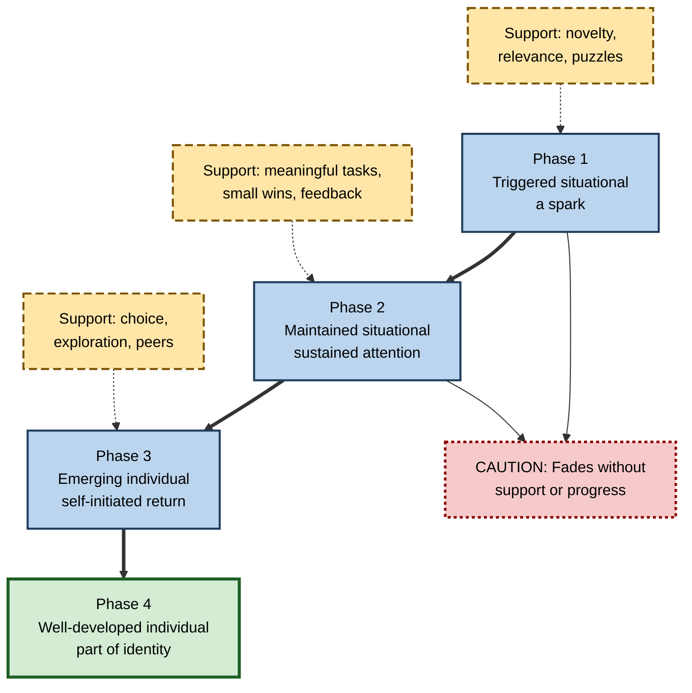
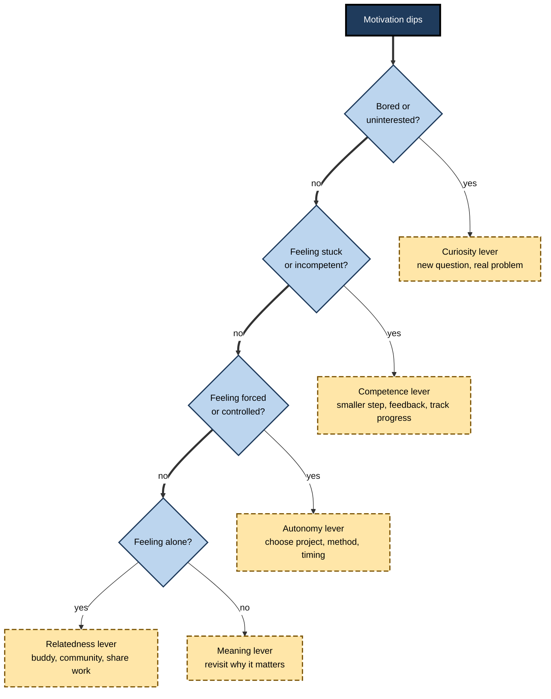
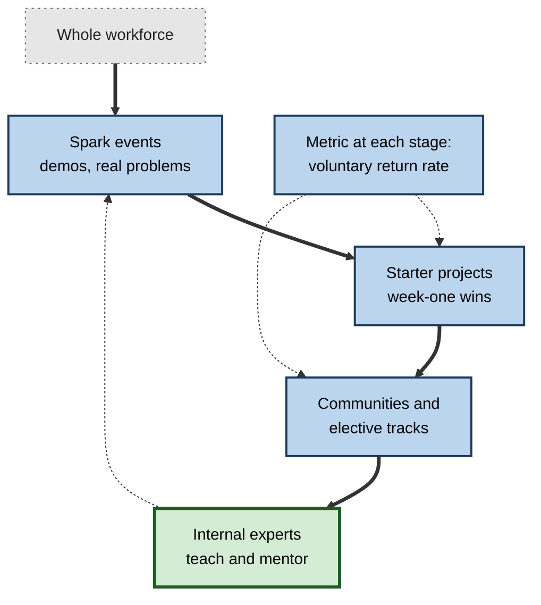

# L.11. Building Intrinsic Motivation for Learning

> **In one sentence:** Intrinsic motivation is not something you either have or lack — it can be grown, step by step, by sparking interest, feeling yourself improve, having real choices, connecting with others who care about the topic, and linking what you learn to what you value.
>
> **Why it matters:** Careers now demand continuous learning, often without teachers, grades or deadlines. People who can grow their own interest — and leaders who can grow it in others — keep learning when external pushes fade.
>
> **Level span:** Novice → Expert · **Reading time:** ~18 min · **Builds on:** intrinsic and extrinsic motivation, self-determination theory, expectancy-value theory, curiosity

---

## The Learning Ladder

| Level | Badge | After this level you can... |
|---|---|---|
| 1 | NOVICE | Explain that interest can be developed and name simple ways to make learning more interesting for yourself. |
| 2 | FOUNDATIONS | Describe the four-phase model of interest development and the main levers of intrinsic motivation. |
| 3 | PRACTITIONER | Apply a personal motivation plan and motivational self-regulation strategies to a real learning goal. |
| 4 | ADVANCED | Explain the evidence on interest development, beliefs about passion, and interventions — including what does not work. |
| 5 | EXPERT / PRO | Design programmes, teams and AI-supported learning that grow durable interest across a workforce. |

---

## Level 1 · Novice — The Big Picture

Many people believe that passion is something you *find*: you either love a subject or you don't. Research suggests a different picture. Interest usually **grows**. It starts with a spark, gets fed by small successes and good company, and over time becomes part of who you are.

Think of a campfire. A spark alone goes out quickly. To get a lasting fire you need kindling (easy early wins), fuel (deeper material), air (freedom to explore) and shelter (people and conditions that protect it). Once the fire is strong, it can burn on bigger logs — harder, deeper work — and keep itself going.

You have already experienced this when:

- a hobby you tried "just once" became something you love after a few good experiences;
- a subject you hated at school became interesting when a great teacher or colleague showed you why it mattered;
- an interest faded when it became a chore with no progress and no one to share it with.

The key idea for a beginner: **you can grow your own interest in almost any useful subject — by giving it sparks, small wins, choice, company and meaning.**

---

## Level 2 · Foundations — Core Concepts

### The four-phase model of interest development

Suzanne Hidi and Ann Renninger's **four-phase model** (2006) describes how interest develops:

| Phase | What it looks like | What it needs |
|---|---|---|
| **1. Triggered situational interest** | A momentary spark: "Oh, that's cool." | Novelty, surprise, puzzles, personal relevance. |
| **2. Maintained situational interest** | Attention holds over a session or project. | Meaningful tasks, involvement, support. |
| **3. Emerging individual interest** | You start returning to it on your own and asking your own questions. | Opportunities to explore, growing knowledge, positive feelings. |
| **4. Well-developed individual interest** | It is part of your identity; you seek challenges and persist through difficulty. | Challenge, deeper knowledge, communities, recognition. |

Two features of the model matter for practice: earlier phases need **more external support**, and **knowledge and interest grow together** — the more you know, the more you can notice what's interesting.

**Figure L.11-1 — Growing interest from spark to identity.**

*How to read it:* interest moves down the thick path; long-dash boxes show the support each phase needs. Early phases fade easily without that support.

### The five levers of intrinsic motivation

Bringing together self-determination theory, expectancy-value theory and curiosity research, five levers stand out:

1. **Curiosity** — gaps, puzzles and surprises (spark).
2. **Competence** — visible progress and optimal challenge.
3. **Autonomy** — real choices about what, how and when.
4. **Relatedness** — people to learn with, share with and be recognised by.
5. **Meaning** — connections to goals, values and identity (utility and attainment value).

### Key Terms

| Term | Plain meaning |
|---|---|
| **Situational interest** | Interest triggered by features of the environment or task. |
| **Individual interest** | A relatively enduring personal predisposition to re-engage with a topic. |
| **Four-phase model** | Hidi and Renninger's model of how interest develops from a spark to a lasting disposition. |
| **Implicit theory of interest** | Belief that interests are fixed and found ("fixed theory") or developed ("growth theory"). |
| **Motivational self-regulation** | Strategies you use deliberately to manage your own motivation. |
| **Self-concordant goal** | A goal that aligns with your values and interests. |
| **Job crafting** | Reshaping your tasks, relationships or perceptions of work to make it more meaningful. |

---

## Level 3 · Practitioner — Putting It to Work

### A personal motivation plan in six steps

1. **Pick the learning goal and phase.** Where is your interest now — no spark yet, momentary, emerging, or established?
2. **Find a spark.** Look for a surprising fact, a real problem you care about, or a person whose work in the field you admire.
3. **Design early wins.** Choose a starter project you can finish in a week that produces something you can use or show.
4. **Build in choice.** Pick your own project, resources and schedule within the constraints you have.
5. **Find your people.** Join a study group, community of practice, or find a learning buddy at work.
6. **Connect to meaning.** Write a short paragraph: "Getting good at this matters to me because..."

### Motivational self-regulation strategies

Research on how learners manage their own motivation (for example, work by Christopher Wolters) identifies several strategies:

| Strategy | Example |
|---|---|
| **Interest enhancement** | Turning a dull drill into a game or challenge; finding a personally relevant example. |
| **Value reminders** | Re-reading why the skill matters for your goals. |
| **Proximal goals** | Setting a small goal for the next 25 minutes. |
| **Self-consequating** | Planning a reward after finishing a session (use sparingly for already-interesting tasks). |
| **Environment structuring** | Removing distractions; studying where focus is easier. |
| **Mastery self-talk** | "I'm doing this to get better, not to prove anything." |

**Figure L.11-2 — Choosing a lever when motivation dips.**

*How to read it:* check the most likely cause in order; each answer points to one lever. If none fits, reconnect with meaning.

### Worked example — an accountant learning Python

| | Before | After |
|---|---|---|
| **Spark** | Generic beginner course with toy examples. | Starts by automating her most hated monthly reconciliation. |
| **Early win** | Week three: still on loops and syntax. | Week one: a 15-line script that saves 40 minutes. |
| **Choice** | Fixed syllabus. | Picks next topics based on which tasks she wants to automate. |
| **Relatedness** | Learns alone at night. | Joins an internal "finance automation" chat; shares scripts. |
| **Meaning** | "Python is a good skill to have." | "I want to spend my time on analysis, not copy-paste." |
| **Six months later** | Course abandoned. | Building tools for her team; reading about data analysis voluntarily. |

### Common mistakes

- **Waiting for passion to appear.** Interest usually follows engagement and early success, not the other way around.
- **Starting with the dullest fundamentals.** Fundamentals matter, but motivating projects make them meaningful.
- **Over-relying on rewards and streaks.** These can help start habits, but tangible, expected rewards for an already-enjoyed activity risk undermining interest.
- **Learning alone indefinitely.** Lack of community is a common reason self-directed learning fades.

---

## Level 4 · Advanced — Mechanisms, Models & Evidence

### Interest is developed, not just found

Studies by Paul O'Keefe, Carol Dweck and Gregory Walton (2018) found that people holding a **fixed theory of interest** — believing passions are inherent and waiting to be found — showed less interest in topics outside their existing interests and expected that a true passion would provide endless motivation, so their interest dropped more when material became difficult. A **growth theory of interest** was associated with more openness to new areas. This research is newer and less replicated than the core interest model, but it fits the broader evidence that interest develops through engagement.

### Evidence for need-supportive interventions

A 2024 meta-analysis of self-determination-theory-based interventions in education found reliable gains in perceived autonomy, competence and intrinsic motivation, with no significant overall effect on relatedness. Autonomy-supportive teaching and coaching is trainable, and its effects show up in learners' motivation.

### Relevance and utility interventions

Interventions that help people connect material to their own lives — **utility-value interventions** — reliably increase interest and performance by small amounts, especially for lower-confidence learners. Self-generated relevance appears more effective than relevance asserted by the instructor.

### Choice: helpful but not unlimited

Offering choice tends to increase intrinsic motivation, but effects depend on the type of choice. Meaningful choices — about topics, approaches or projects aligned with personal interests — are more motivating than trivial ones (font colours, order of identical tasks). Too many options can overwhelm, especially for novices.

### Gamification: mixed evidence

Recent meta-analyses report positive average effects of gamification on engagement and learning outcomes, but with large variation, and some reviews conclude that gamification affects perceived autonomy and relatedness more than competence. Heavy reliance on points, badges and streaks can create engagement with the game layer rather than with the learning. The best evidence-based use of game elements supports the five levers — clear progress (competence), meaningful choices (autonomy), team play (relatedness) — rather than replacing them.

### Habits and intrinsic motivation

Intrinsic motivation and habits are allies, not rivals. Habits — learning at the same time and place — carry you through low-motivation days, and the progress they produce feeds competence and interest. Over-reliance on motivation alone is fragile; over-reliance on habit without interest can make learning feel mechanical.

### What changed recently: AI and interest

AI tutors can make phase-1 and phase-2 support far cheaper: personalised examples from the learner's own field, instant feedback and endless practice variations. But research also warns that AI help can raise task performance without raising intrinsic motivation, and can short-circuit curiosity and competence by doing the hard part. A 2025 randomised study comparing ChatGPT, a human expert and a checklist for essay support found better essay scores with ChatGPT but no difference in intrinsic motivation and no advantage in knowledge gain or transfer.

---

## Level 5 · Expert / Pro — Professional Mastery

### Designing for interest across a workforce

| Phase | Programme design |
|---|---|
| **Spark** | Showcase real problems the skill solves in the organisation; short demos by peers; "what's possible" sessions. |
| **Maintain** | Short, project-based starter paths; early wins in week one; coaching and feedback. |
| **Emerging** | Elective tracks, internal hackathons, communities of practice, stretch projects. |
| **Well-developed** | Opportunities to teach, lead guilds, publish internally, mentor others; recognition of expertise. |

**Figure L.11-3 — An organisation's interest pipeline.**

*How to read it:* the thick path is the pipeline; the dotted arrow from experts back to spark events shows that developed interest becomes the source of new sparks.

### Metrics that reveal intrinsic motivation

- **Voluntary return rate** — share of learners who come back to optional content or communities.
- **Self-initiated projects** — tools, analyses or improvements people start on their own.
- **Teaching behavior** — number of people who offer to share or mentor.
- **Need-satisfaction pulse** — autonomy, competence and relatedness ratings.

### Professional scenario

**Role:** Chief Learning Officer launching an AI-fluency programme for 10,000 employees.
**Situation:** A previous digital-skills push used mandatory modules and badges; completion was high but sustained use of the skills was low.
**What the pro does:** Opens with short peer showcases of real time-saving uses in each job family (spark). Offers role-specific starter projects with a one-week win (competence). Lets employees choose tracks and projects (autonomy). Funds communities of practice with internal champions who receive recognition and time (relatedness). Asks each learner to write how AI fluency connects to their own goals (meaning). Tracks voluntary return rate and self-initiated projects instead of completion alone. Uses AI tutors configured for hints and personalised examples, not answers.

### Ethical limits

- Do not engineer "passion" to extract unpaid overtime or justify poor conditions.
- Respect that people may value learning for career, money or security — those identified reasons are legitimate.
- Avoid manipulative engagement techniques (guilt-inducing streaks, public shaming leaderboards).

---

## Myths vs. Evidence

| Myth | What the evidence shows |
|---|---|
| "You either have passion for a subject or you don't." | Interest develops through phases with support; beliefs that passion is fixed can reduce openness and persistence. |
| "Make it fun and people will be motivated." | Fun sparks interest, but lasting interest needs competence, autonomy, relatedness and meaning. |
| "More choice is always better." | Meaningful choice helps; trivial or overwhelming choice does not. |
| "Gamification builds intrinsic motivation." | Effects vary widely; points and badges alone can create shallow engagement. |
| "If you need habits or rewards, you're not really motivated." | Habits and occasional self-rewards support learning and can feed growing interest. |
| "AI tutors automatically make learning more motivating." | AI can improve task output without raising intrinsic motivation; design matters. |

## Practitioner Toolkit

**Personal intrinsic-motivation plan**

- [ ] I identified my current interest phase.
- [ ] I found a spark linked to a real problem I care about.
- [ ] I planned a win I can finish within a week.
- [ ] I chose my own project, resources or schedule.
- [ ] I found at least one person to learn with.
- [ ] I wrote why this matters to me.
- [ ] I set a regular learning time to carry me through low-motivation days.

**Template — "why this matters to me" (5 minutes)**

> "In the next year, being better at ___ would let me ___ . The part I find most interesting is ___ . The first small thing I will build or do is ___ ."

## Self-Check

1. **[NOVICE]** In the campfire analogy, what do kindling and shelter represent?
2. **[NOVICE]** Why is waiting for passion a poor strategy?
3. **[FOUNDATIONS]** Name the four phases of interest development.
4. **[FOUNDATIONS]** List the five levers of intrinsic motivation.
5. **[PRACTITIONER]** Your motivation drops because you feel you're not improving. Which lever do you pull and how?
6. **[ADVANCED]** What did research on implicit theories of interest find?
7. **[ADVANCED]** Why is the evidence on gamification described as mixed?
8. **[EXPERT / PRO]** Which metrics would you use instead of completion to judge whether a programme built intrinsic motivation?

### Answer Key

1. Kindling is early, easy wins; shelter is the people and conditions that protect growing interest.
2. Interest usually follows engagement and early success; waiting can mean never starting.
3. Triggered situational, maintained situational, emerging individual, well-developed individual.
4. Curiosity, competence, autonomy, relatedness, meaning.
5. Competence: shrink the next step, get specific feedback, and track visible progress.
6. A fixed theory of interest was linked to less openness to new areas and greater loss of interest when material became difficult; a growth theory supported openness.
7. Average effects are positive but vary widely; effects on competence are weaker, and points or badges can create shallow engagement.
8. Voluntary return rate, self-initiated projects, teaching or mentoring behavior, and need-satisfaction pulses.

## Key Takeaways

- Intrinsic motivation is **grown**, not just found.
- Interest develops through **four phases**; early phases need more support.
- Five levers: **curiosity, competence, autonomy, relatedness, meaning**.
- **Early wins** and **communities** are among the most practical boosters.
- Use **meaningful** choice, not trivial or overwhelming choice.
- Gamification and rewards are **supporting tools**, not engines.
- Measure **voluntary behavior**, not just completion.

## Glossary

| Term | Meaning |
|---|---|
| Four-phase model | Hidi and Renninger's model of interest development. |
| Growth theory of interest | Belief that interests can be developed. |
| Fixed theory of interest | Belief that interests are inherent and must be found. |
| Individual interest | Enduring personal predisposition to re-engage with content. |
| Interest enhancement | Strategy of making tasks more interesting to sustain motivation. |
| Job crafting | Reshaping work tasks, relationships or perceptions to increase meaning. |
| Motivational self-regulation | Deliberate strategies to manage one's own motivation. |
| Proximal goal | A near-term, specific goal. |
| Self-concordant goal | A goal aligned with personal values and interests. |
| Situational interest | Interest triggered by features of a situation. |
| Voluntary return rate | Share of learners re-engaging with optional learning. |
