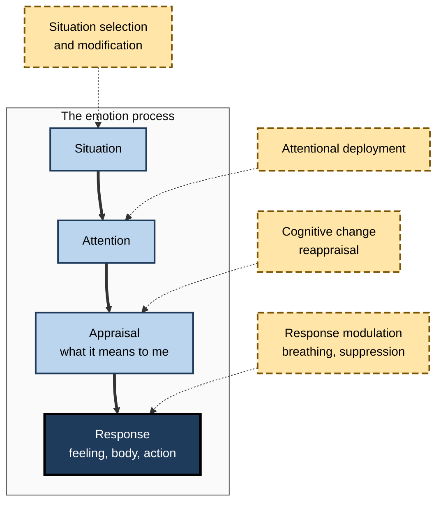
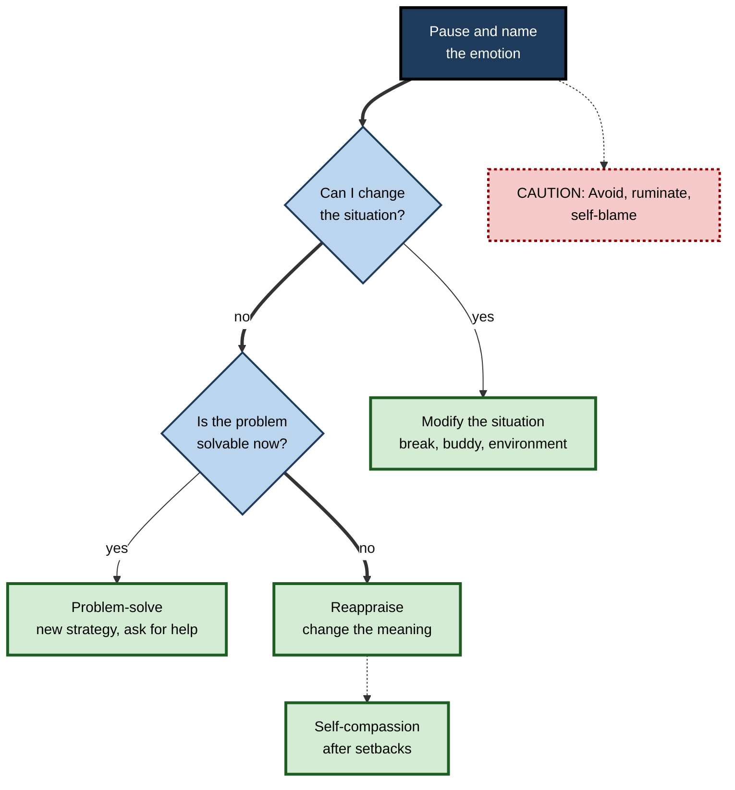
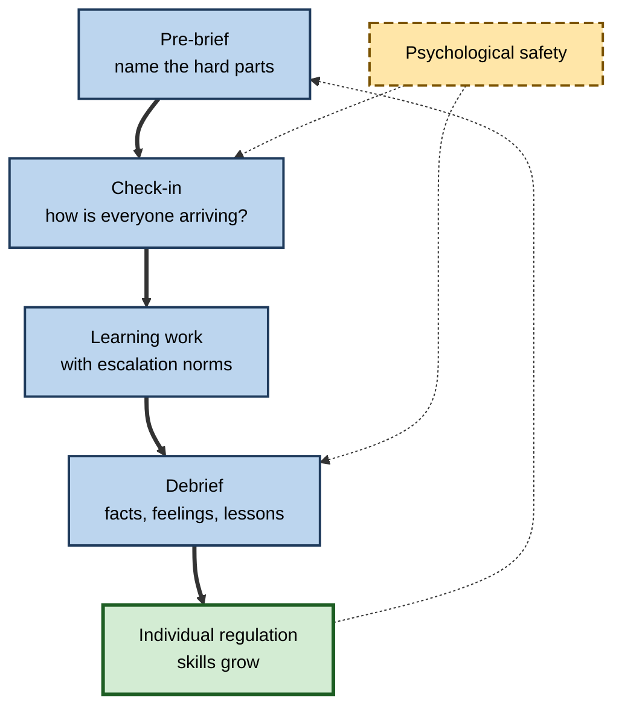

# L.12. Emotional Regulation for Optimal Learning

> **In one sentence:** Emotional regulation means noticing what you feel and shaping it — what you feel, how strongly, and what you do about it — so that emotions help your learning instead of hijacking it.
>
> **Why it matters:** Every topic in this subtopic — anxiety, boredom, frustration, curiosity, enjoyment — ends with the same practical question: what can I do about it? Regulation skills are learnable, transfer across every domain, and separate professionals who learn steadily under pressure from those who stall.
>
> **Level span:** Novice → Expert · **Reading time:** ~18 min · **Builds on:** anxiety, boredom, frustration and confusion, positive emotions

---

## The Learning Ladder

| Level | Badge | After this level you can... |
|---|---|---|
| 1 | NOVICE | Notice and name your emotions while learning and use a simple pause-and-choose routine. |
| 2 | FOUNDATIONS | Describe the process model of emotion regulation and the main strategy families. |
| 3 | PRACTITIONER | Pick the right strategy for the moment — before, during and after learning episodes. |
| 4 | ADVANCED | Explain what the evidence says about reappraisal, suppression, avoidance, self-compassion and regulatory flexibility. |
| 5 | EXPERT / PRO | Build co-regulation into teams and learning programmes, and navigate the ethics of emotion-aware AI. |

---

## Level 1 · Novice — The Big Picture

Emotions arrive on their own. You don't choose to feel anxious before an exam or annoyed when code fails. But you have more say than you think in **what happens next**: how long the feeling lasts, how strong it gets, and what you do because of it. That is **emotional regulation**.

Regulation is not the same as suppressing or "controlling" emotions. It is closer to steering. A good driver doesn't stop the car every time the road bends — they adjust speed and direction. Similarly, you don't need to eliminate anxiety or frustration; you need to keep them in a range where you can still think and learn.

The simplest regulation routine is **pause, name, choose**:

1. **Pause** — take one slow breath before reacting.
2. **Name** — put the feeling into words: "I'm frustrated", "I'm anxious", "I'm bored".
3. **Choose** — pick one small action: take a break, ask for help, reframe, change the task.

You have already experienced this when:

- you stepped away from a bug, came back after a walk, and solved it in minutes;
- you told yourself "nerves mean I care" before a presentation and felt steadier;
- you switched to an easier task to rebuild momentum after a setback.

The key idea for a beginner: **you can't always choose your feelings, but you can learn to steer them — and steering is a skill that improves with practice.**

---

## Level 2 · Foundations — Core Concepts

### The process model of emotion regulation

James Gross's **process model** describes emotion as unfolding over time — situation, attention, appraisal (interpretation), response — and identifies five families of regulation strategies that act at different points:

| Strategy family | When it acts | Learning example |
|---|---|---|
| **Situation selection** | Before — choosing which situation to enter | Choosing to study with a supportive peer rather than alone at midnight. |
| **Situation modification** | Before or early — changing the situation | Asking for a practice run before the real presentation. |
| **Attentional deployment** | During — directing attention | Focusing on the next step rather than the whole daunting project. |
| **Cognitive change (reappraisal)** | During — changing how you interpret it | "This confusion means I'm learning", "This stress helps me focus". |
| **Response modulation** | Late — changing the response | Slow breathing; hiding frustration in a meeting (suppression). |

**Figure L.12-1 — Where regulation strategies act in the emotion process.**

*How to read it:* the thick path is the emotion unfolding; dotted arrows show where each strategy family steps in. Earlier strategies prevent; later ones manage.

### Antecedent-focused and response-focused

Strategies that act early — before the emotion is fully underway — are called **antecedent-focused**; those that act on an emotion already in full swing are **response-focused**. Antecedent strategies tend to be less effortful and less costly to thinking.

### Key Terms

| Term | Plain meaning |
|---|---|
| **Emotion regulation** | Processes that influence which emotions you have, when, and how you experience and express them. |
| **Reappraisal** | Changing how you interpret a situation to change its emotional impact. |
| **Expressive suppression** | Hiding the outward signs of an emotion while it continues inside. |
| **Affect labelling** | Putting feelings into words, which can reduce their intensity. |
| **Self-compassion** | Treating yourself with the kindness and understanding you would give a friend after failure. |
| **Regulatory flexibility** | Choosing different strategies to fit different situations. |
| **Co-regulation** | Regulating emotions with others' help — mentors, peers, managers. |

---

## Level 3 · Practitioner — Putting It to Work

### Before, during and after: a regulation playbook

| Phase | Emotion risk | Strategies |
|---|---|---|
| **Before learning** | Dread, avoidance, anxiety | Situation selection (good time, good place, a buddy); break the task into a first tiny step; reappraise ("this is a chance to improve"). |
| **During learning** | Boredom, confusion, frustration | Attentional deployment (next step only); affect labelling; short breaks; switch strategy; ask for help on a time box. |
| **During evaluation** | Test or performance anxiety | Stress reappraisal; slow breathing; reset routine if you blank. |
| **After setbacks** | Shame, self-blame, hopelessness | Self-compassion; attribute to strategy and effort; plan the next concrete step. |
| **After success** | Complacency or relief-then-drop | Savour pride; note what worked; set the next stretch goal. |

### Choosing a strategy: a quick decision guide

**Figure L.12-2 — Matching a regulation strategy to the moment.**

*How to read it:* start by naming the emotion, then prefer acting on the situation or problem; when neither is possible, change the meaning. The dotted-border box shows the common unhelpful default.

### Worked example — a project manager learning a new risk framework

| | Before | After |
|---|---|---|
| **Before** | Postpones the course repeatedly ("too busy"). | Books two 45-minute slots with a colleague taking the same course. |
| **During** | Gets frustrated by jargon, scrolls email. | Notes "I'm frustrated by the jargon", makes a glossary, takes a five-minute walk, returns. |
| **Assessment** | Anxiety spikes; blanks on terminology. | "This adrenaline helps me focus"; slow breathing; starts with the questions she knows. |
| **After a failed first attempt** | "I'm terrible at this kind of thing." | "I under-prepared on quantitative risk; I'll do three practice cases this week." |
| **Outcome** | Course abandoned. | Passes on the second attempt; uses the framework in the next project. |

### Common mistakes

- **Suppressing as the default.** Hiding frustration in a meeting may be appropriate, but chronic suppression is costly.
- **Avoidance disguised as productivity.** Doing easy tasks to dodge a hard learning task feels busy but maintains anxiety.
- **Self-criticism as motivation.** Harsh self-talk after mistakes tends to increase shame and avoidance rather than effort.
- **One strategy for everything.** Reappraisal is powerful but not always the best fit; flexibility matters.

---

## Level 4 · Advanced — Mechanisms, Models & Evidence

### Reappraisal versus suppression

Laboratory research by Gross and colleagues has repeatedly found that **reappraisal** reduces negative feelings without heavy cognitive costs, whereas **expressive suppression** reduces outward expression but not inner feelings, raises physiological arousal, and can **impair memory** for information encountered while suppressing — directly relevant to learning. Habitual reappraisers tend to report more positive emotion and better well-being than habitual suppressors.

### What a 2025 meta-analysis found about academic achievement

A systematic review and meta-analysis of emotion-regulation strategies and academic achievement in secondary and university students (published in 2025) found:

- **Problem-solving** was positively associated with achievement;
- **Avoidance** and **self-blame** were negatively associated with achievement;
- **Cognitive reappraisal**, **expressive suppression** and **social support** were *not* significantly associated with achievement overall.

This is an important corrective. Reappraisal reliably changes *emotion*, and is linked to better learning emotions and motivation, but its direct link to *grades* is weaker than popular accounts suggest. The strongest achievement signals come from **acting on the problem** and **avoiding avoidance and self-blame**.

### Stress reappraisal in performance settings

A 2024 meta-analysis of randomised trials on stress-arousal reappraisal and stress-is-enhancing mindset interventions found a small overall improvement in task performance, with larger effects for combined interventions and for public performance tasks. Reappraisal is therefore best seen as a low-cost, modest-effect tool — worth using, not a cure-all.

### Affect labelling

Brain-imaging studies led by Matthew Lieberman found that putting feelings into words reduced amygdala responses to emotional images. Naming emotions is a simple, quick strategy that supports the "pause, name, choose" routine.

### Self-compassion

Research by Kristin Neff and others distinguishes **self-compassion** from self-esteem. In experiments by Juliana Breines and Serena Chen (2012), people prompted to take a self-compassionate view of a failure were *more* motivated to improve and studied longer for a retest than those prompted to boost self-esteem. The evidence base is growing but not without critics; measurement and effect sizes are debated. Its main practical value is reducing shame-driven avoidance after failure.

### Regulatory flexibility

George Bonanno and colleagues argue that no strategy is best everywhere. **Regulatory flexibility** — reading the context, having a repertoire, and switching when a strategy isn't working — predicts better adjustment than habitual reliance on any single strategy. For learners, this means suppression can be fine briefly in a client meeting, distraction can help during an unsolvable wait, and reappraisal or problem-solving are best when you can act or reinterpret.

### Learning-specific regulation research

A 2026 systematic review of learning-related emotion regulation found growing attention to **regulating specific achievement emotions** (boredom, anxiety, frustration) and to the role of teachers and environments in co-regulation, while noting that much research is correlational and relies on self-report.

### Foundations: sleep, movement and load

Regulation capacity depends on basics. Sleep loss amplifies emotional reactivity; regular physical activity is associated with better mood and stress resilience; overloaded schedules leave little room for any strategy. These are not "soft" extras but preconditions.

---

## Level 5 · Expert / Pro — Professional Mastery

### Co-regulation in teams and learning programmes

Managers, mentors and facilitators shape learners' emotions as much as learners do. Professionals build **co-regulation** into structures:

| Practice | How it helps |
|---|---|
| **Pre-briefs** | Name what's hard about the session; normalise confusion and nerves. |
| **Check-ins** | One-word emotion check at the start of workshops; adjust pace. |
| **Psychological safety** | Mistakes during learning are data, not ammunition. |
| **Escalation norms** | Clear "stuck" protocols reduce frustration spirals. |
| **Debriefs** | Structured reflection after high-stakes events, separating facts, feelings and lessons. |
| **Manager modelling** | Leaders describe their own regulation: "I was frustrated, so I stepped back and..." |

**Figure L.12-3 — A co-regulation cycle for learning teams.**

*How to read it:* the thick path is one cycle; the dotted loop shows growing individual skill feeding the next cycle. Psychological safety (long-dash) is a condition, not a step.

### Professional scenario

**Role:** Engineering manager leading a team through a major platform migration requiring rapid learning.
**Situation:** Under deadline pressure, frustration and anxiety rise; two engineers start avoiding the unfamiliar parts and a third becomes curt in reviews.
**What the pro does:** Opens each week with a five-minute check-in and names the challenge explicitly ("This is hard and we will all be confused at points"). Introduces a 30-minute stuck rule and pairs people on unfamiliar components. Models regulation in stand-ups ("I was annoyed about the outage, so I took ten minutes before replying"). After incidents, runs blameless debriefs. Encourages self-compassionate framing of mistakes in one-to-ones. Avoidance drops as pairing increases; review tone improves; the team finishes the migration with fewer late surprises.

### AI, emotion detection and ethics

- **Emotion-aware AI tutors.** Research systems detect confusion or frustration from interaction patterns or faces and adapt hints. Results in research settings are promising, but accuracy varies, especially across cultures and individuals.
- **Regulation and law.** The European Union's AI Act has prohibited AI systems that infer emotions of people in workplaces and educational institutions since February 2025, except for medical or safety reasons. Organisations elsewhere face growing scrutiny over emotion-tracking tools.
- **Better alternatives.** Let learners self-report emotions voluntarily ("I'm stuck", "this is too easy") and design AI to respond — a respectful form of co-regulation that does not depend on surveillance.
- **AI as emotional crutch.** Learners may use AI to escape discomfort rather than regulate it. Encourage AI use that helps them stay with productive difficulty.

### Clinical boundaries

Regulation skills help most people with everyday learning emotions. Persistent, severe distress — panic, depression, burnout — calls for professional support. Managers and trainers should know where to refer, not attempt therapy.

---

## Myths vs. Evidence

| Myth | What the evidence shows |
|---|---|
| "Emotional regulation means suppressing your feelings." | Suppression hides expression but not feeling, raises arousal and can impair memory; reappraisal and problem-solving are generally better. |
| "Reappraisal guarantees better grades." | Reappraisal reliably changes emotions, but a 2025 meta-analysis found no significant direct link with achievement; problem-solving was positively linked. |
| "Being hard on yourself drives improvement." | Self-blame is linked to lower achievement; self-compassion after failure was linked to more motivation to improve. |
| "There's one best strategy." | Regulatory flexibility — matching strategy to context — predicts better outcomes. |
| "AI that reads emotions is a neutral helper." | Accuracy is uneven and the EU now prohibits emotion recognition in workplaces and education, with narrow exceptions. |
| "Regulation is a personal matter only." | Managers, peers and environments co-regulate learners' emotions substantially. |

## Practitioner Toolkit

**Personal regulation checklist**

- [ ] I paused and named the emotion.
- [ ] I asked whether I can change the situation.
- [ ] I asked whether the problem is solvable now — and acted if so.
- [ ] If not, I reappraised the meaning.
- [ ] After setbacks, I used self-compassion, not self-blame.
- [ ] I noticed avoidance and took one small step instead.
- [ ] I protected sleep and breaks during intense learning periods.

**Ready-to-use scripts**

| Emotion | Script |
|---|---|
| Anxiety | "My body is preparing me to perform. Start with what I know." |
| Frustration | "I'm frustrated. What's one different strategy, or who can I ask?" |
| Boredom | "Is this too easy, too hard, or pointless? What would make it a challenge?" |
| Confusion | "This is the feeling of learning. What exactly don't I understand?" |
| Shame after failure | "Everyone learning this makes mistakes. What will I do differently next time?" |

## Self-Check

1. **[NOVICE]** What are the three steps of the pause-name-choose routine?
2. **[NOVICE]** How is regulating an emotion different from suppressing it?
3. **[FOUNDATIONS]** Name the five strategy families in the process model.
4. **[FOUNDATIONS]** Give a learning example of attentional deployment.
5. **[PRACTITIONER]** You fail a practice certification exam. Which strategies would you use and in what order?
6. **[ADVANCED]** What are the costs of expressive suppression for learning?
7. **[ADVANCED]** What did the 2025 meta-analysis find about regulation strategies and achievement?
8. **[ADVANCED]** What is regulatory flexibility?
9. **[EXPERT / PRO]** What are the legal and ethical concerns about emotion-detecting AI in learning and work?

### Answer Key

1. Pause (one slow breath), name the feeling, choose a small action.
2. Regulation steers the emotion and response flexibly; suppression only hides outward expression while the emotion continues.
3. Situation selection, situation modification, attentional deployment, cognitive change, response modulation.
4. Focusing on the next small step of a project rather than its whole scope, or on the current question rather than the exam result.
5. Name the feeling; use self-compassion to reduce shame; attribute the result to strategy and preparation; problem-solve a concrete plan; reappraise the retest as a learning opportunity.
6. It does not reduce inner feeling, raises arousal, and can impair memory for information encountered while suppressing.
7. Problem-solving was positively linked with achievement; avoidance and self-blame negatively; reappraisal, suppression and social support were not significantly linked.
8. Reading the context, having a repertoire of strategies, and switching strategies when one isn't working.
9. Accuracy varies across people and cultures, surveillance undermines trust and autonomy, and the EU AI Act prohibits emotion recognition in workplaces and educational institutions since February 2025, with narrow exceptions.

## Key Takeaways

- Regulation is **steering**, not suppressing.
- Use **pause, name, choose** as the everyday routine.
- The process model offers five strategy families; **earlier** strategies are often cheaper.
- **Problem-solving** helps achievement; **avoidance and self-blame** hurt it.
- **Reappraisal** reliably changes emotion; its direct link to grades is weaker than often claimed.
- **Self-compassion** after failure supports motivation to improve.
- **Flexibility** and **co-regulation** matter as much as any single technique.
- Emotion-detecting AI raises real **ethical and legal** limits.

## Glossary

| Term | Meaning |
|---|---|
| Affect labelling | Putting feelings into words to reduce their intensity. |
| Antecedent-focused strategy | A regulation strategy applied before an emotion fully develops. |
| Attentional deployment | Directing attention to influence emotion. |
| Co-regulation | Regulating emotion with support from others. |
| Cognitive change | Altering the meaning of a situation; includes reappraisal. |
| Emotion regulation | Processes shaping which emotions occur and how they are experienced and expressed. |
| Expressive suppression | Inhibiting outward emotional expression. |
| Process model | Gross's model of emotion regulation across the stages of emotion generation. |
| Reappraisal | Reinterpreting a situation to change its emotional impact. |
| Regulatory flexibility | Context-sensitive selection and switching of regulation strategies. |
| Response modulation | Influencing the physiological, experiential or behavioral response. |
| Self-compassion | Kindness and understanding toward oneself after failure. |
| Situation selection | Choosing situations to influence emotions. |
