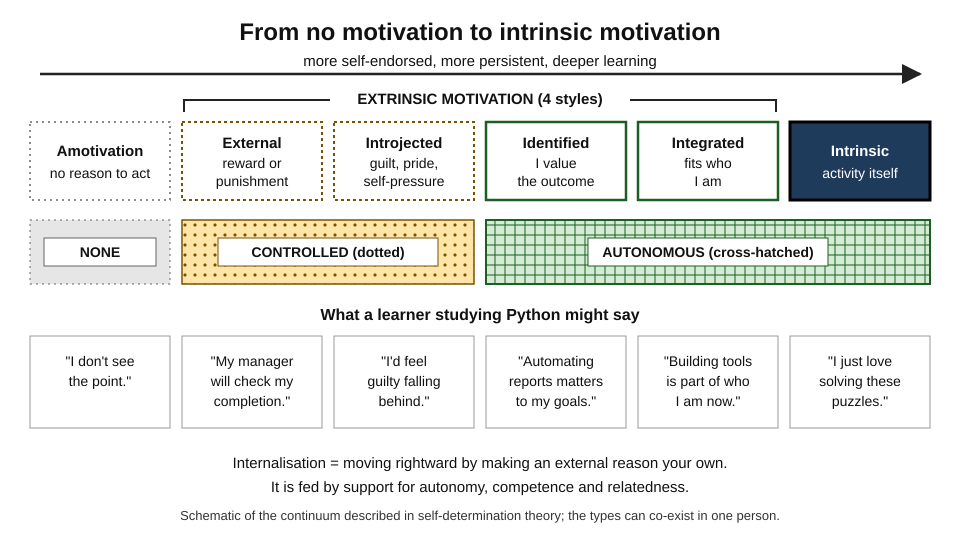
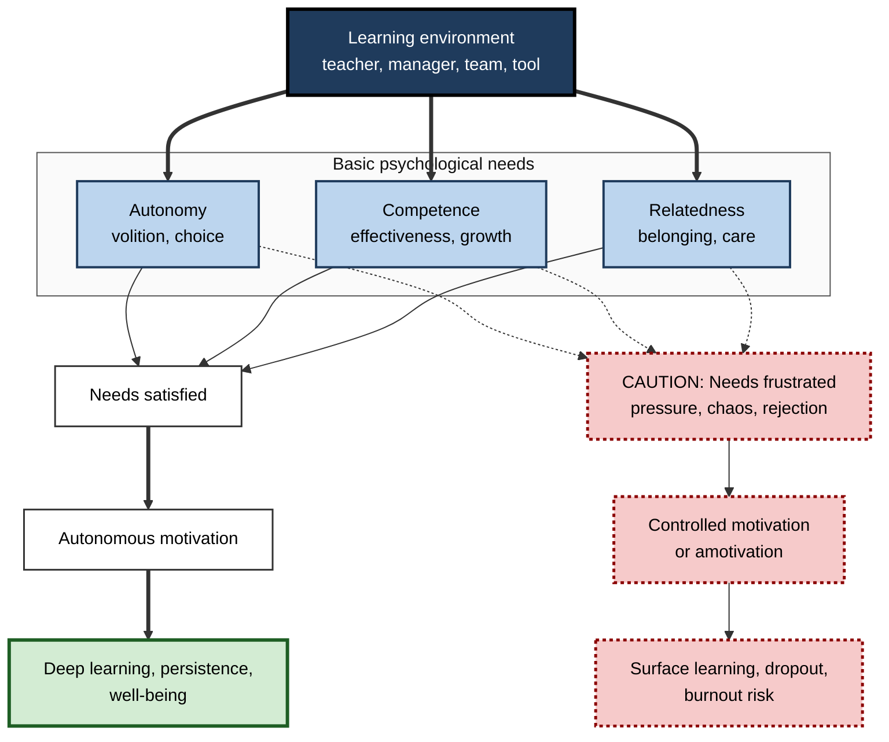
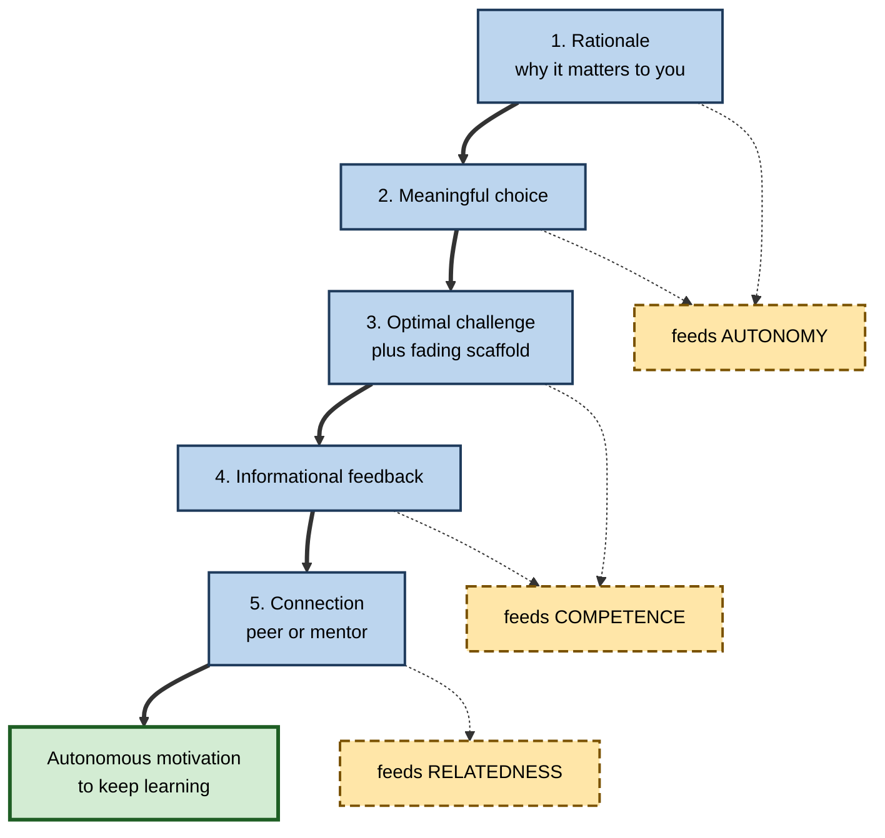
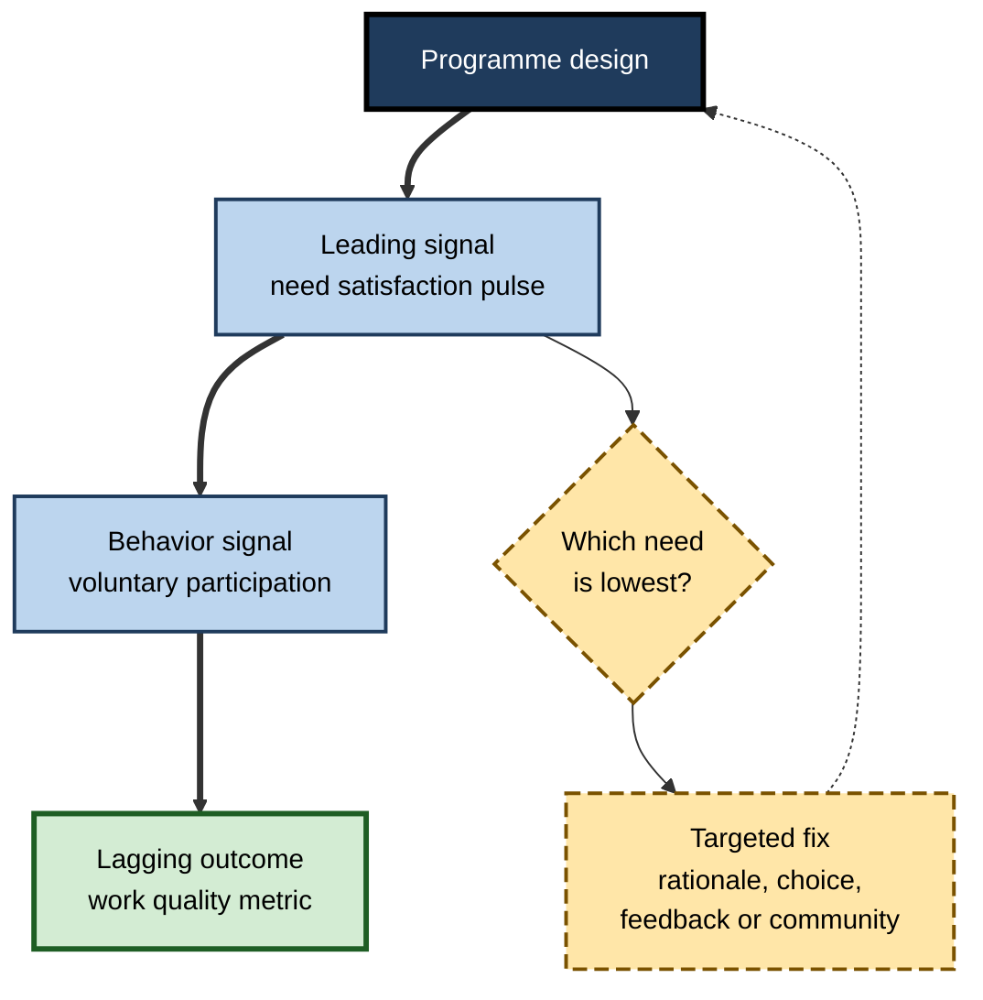

# L.2. Self-Determination Theory

> **In one sentence:** Self-determination theory says people stay motivated and learn deeply when three basic needs are met — feeling in charge of their choices (autonomy), feeling capable (competence), and feeling connected to others (relatedness).
>
> **Why it matters:** It is the most widely tested framework for explaining why the same course, job or team energises some people and drains others. It gives managers, teachers and L&D designers a short, evidence-backed checklist for building environments where people want to learn.
>
> **Level span:** Novice → Expert · **Reading time:** ~18 min · **Builds on:** intrinsic and extrinsic motivation

---

## The Learning Ladder

| Level | Badge | After this level you can... |
|---|---|---|
| 1 | NOVICE | Name the three basic needs and recognise when each is met or blocked in your own learning. |
| 2 | FOUNDATIONS | Describe the motivation continuum from amotivation to intrinsic motivation and explain internalisation. |
| 3 | PRACTITIONER | Use need-supportive behaviors — rationale, choice, structure, warmth — when teaching, coaching or managing. |
| 4 | ADVANCED | Explain the six mini-theories, need frustration, and what 2024–2026 meta-analyses say about effectiveness. |
| 5 | EXPERT / PRO | Design and evaluate need-supportive programmes, manager training and AI learning tools at scale. |

---

## Level 1 · Novice — The Big Picture

**Self-determination theory**, usually shortened to **SDT**, was developed by psychologists Edward Deci and Richard Ryan from the 1970s onward. Its central claim is simple: humans are naturally curious and growth-oriented, but that natural drive needs the right "nutrients" to flourish.

SDT names three nutrients, called **basic psychological needs**:

- **Autonomy** — feeling that what you do is your own choice and fits your values. Not the same as working alone; it means *volition*, not independence.
- **Competence** — feeling effective, that you can master challenges and get better.
- **Relatedness** — feeling cared for and connected, that you belong.

A plant analogy works well. A seed has everything it needs to grow, but it still needs light, water and soil. Remove one and the plant struggles, however good the seed. People are the same: a talented learner in a controlling, confusing or lonely environment often loses motivation.

You have already experienced this when:

- a manager let you choose how to tackle a project and you worked harder than ever (autonomy);
- you finally understood a tricky concept and suddenly wanted to learn more (competence);
- a study group or friendly team made a hard course feel doable (relatedness);
- a micromanaged task made you do the minimum (autonomy blocked).

The key idea for a beginner: **you cannot inject motivation into people, but you can create conditions that feed or starve it.**

---

## Level 2 · Foundations — Core Concepts

### The motivation continuum

SDT does not treat motivation as one amount, high or low. It looks at its *quality*, arranged along a continuum from no motivation to fully intrinsic motivation.

*Figure L.2-1 — The self-determination continuum.* Boxes run from amotivation (left) to intrinsic motivation (right). Dotted borders and the dotted band mark controlled motivation; solid borders and the cross-hatched band mark autonomous motivation.

| Type | Felt reason | Quality |
|---|---|---|
| **Amotivation** | "I don't see the point." | No intention to act. |
| **External regulation** | "To get the reward or avoid punishment." | Controlled; stops when the contingency stops. |
| **Introjected regulation** | "I'd feel guilty or ashamed otherwise." | Controlled from inside; often anxious. |
| **Identified regulation** | "I value what this leads to." | Autonomous; persistent. |
| **Integrated regulation** | "This fits who I am." | Autonomous; fully self-endorsed. |
| **Intrinsic motivation** | "I enjoy it for its own sake." | Autonomous; the activity is the reward. |

**Internalisation** is the natural process of taking an external reason and making it your own — moving rightward on the continuum. It is the most practical idea in SDT for workplaces, because much necessary learning (compliance, tooling, standards) will never be fun in itself, yet it can become *valued*.

**Figure L.2-2 — How the three needs drive motivation quality and outcomes.**

*How to read it:* thick arrows show the healthy route from a need-supportive environment to deep learning; dotted arrows show how the same needs can instead be frustrated.

### Key Terms

| Term | Plain meaning |
|---|---|
| **Basic psychological needs** | Autonomy, competence and relatedness — universal needs whose satisfaction supports growth and well-being. |
| **Autonomy** | Experiencing your actions as self-endorsed. Not the same as independence. |
| **Competence** | Feeling effective and able to grow in skill. |
| **Relatedness** | Feeling connected to and cared for by others. |
| **Internalisation** | Taking in an external value or rule and making it your own. |
| **Need support** | Behavior by others that satisfies the three needs. |
| **Need frustration** | Active thwarting of the needs — control, belittling, exclusion — which harms more than simple absence of support. |
| **Autonomy support** | Giving rationale, offering meaningful choice, acknowledging feelings, minimising pressure. |
| **Structure** | Clear expectations, guidance and feedback; supports competence. Different from control. |

---

## Level 3 · Practitioner — Putting It to Work

### The need-support toolkit

Research on teachers, coaches and managers has converged on concrete behaviors. They are trainable, which is one reason SDT is popular in L&D.

| Need | Supportive behaviors | Thwarting behaviors to avoid |
|---|---|---|
| **Autonomy** | Explain *why*; offer real choices; invite input; acknowledge that a task is dull when it is; use "you might", "consider". | Commands without reasons; "should/must" language; surveillance; deadlines as threats. |
| **Competence** | Clear goals and criteria; optimal challenge; specific, timely, informational feedback; scaffolds that fade. | Vague expectations; tasks far too hard or easy; comparison-based or humiliating feedback. |
| **Relatedness** | Learn names; show genuine interest; build peer learning; normalise mistakes; be available. | Coldness; favouritism; public shaming; isolation in self-paced content with no human contact. |

**Structure is not control.** A common misreading is that autonomy support means leaving people alone. In fact, research shows that clear structure combined with autonomy support works best: learners need to know what good looks like *and* feel that their path to it is their own.

### A five-step method for designing a need-supportive session

1. **Open with rationale.** In one or two sentences, explain why this learning matters to the learners' work, not just to the organisation.
2. **Offer a meaningful choice.** Topic, example dataset, order of tasks, format of output — at least one real choice.
3. **Set the challenge just above current skill.** Provide a worked example or scaffold, and say how it will be removed.
4. **Give informational feedback.** Specific, about the work, with a next step.
5. **Build connection.** Pair work, a short reflection shared with a peer, or a mentor check-in.

**Figure L.2-3 — Need-supportive session design.**

*How to read it:* the thick path is the session sequence; dotted arrows show which need each step feeds.

### Worked example — onboarding a new analyst

| | Before | After |
|---|---|---|
| **Autonomy** | "Complete these 14 modules in order by Friday." | "These four modules are core; pick two of the remaining ones that match your first project." |
| **Competence** | No feedback until a review at day 90. | Weekly 15-minute review of one real piece of work with specific next steps. |
| **Relatedness** | Self-paced e-learning alone at a desk. | A buddy from the team, plus a fortnightly lunch-and-learn where new joiners present. |
| **Result** | Completion on time; low confidence; questions hidden. | Earlier independent work, more questions asked early, stronger team ties. |

### Common mistakes

- **Fake choice.** Choosing between two equally irrelevant options satisfies nobody.
- **Autonomy without structure.** "Learn whatever you like" overwhelms novices and frustrates competence.
- **Treating relatedness as optional.** Fully self-paced digital learning often starves relatedness, a frequent reason for low completion.
- **Pressure disguised as encouragement.** "I know you won't let the team down" is introjection-inducing guilt, not support.

---

## Level 4 · Advanced — Mechanisms, Models & Evidence

### SDT is a family of mini-theories

SDT is not one claim but six connected **mini-theories**:

| Mini-theory | Question it answers |
|---|---|
| **Cognitive evaluation theory** | How do rewards, feedback and context affect intrinsic motivation? |
| **Organismic integration theory** | How do people internalise extrinsic motivation? (The continuum.) |
| **Causality orientations theory** | Do people differ in tending to act from autonomy, control or impersonal orientation? |
| **Basic psychological needs theory** | How do need satisfaction and frustration relate to well-being and performance? |
| **Goal contents theory** | Do intrinsic life goals (growth, relationships) and extrinsic ones (wealth, image) differ in effects? |
| **Relationships motivation theory** | What makes close relationships need-satisfying? |

### Need satisfaction versus need frustration

Since the 2010s, researchers have separated **need satisfaction** from **need frustration**. They are not simple opposites: a course can fail to satisfy relatedness without actively frustrating it. Active frustration — being controlled, belittled or excluded — predicts negative outcomes such as anxiety, defiance, disengagement and burnout more strongly than mere lack of support. A large 2024–2025 meta-analysis of need-supportive and need-thwarting teacher behaviors, synthesising several hundred samples, confirmed this "dark side" pattern across education.

### Strength of the evidence

- **Correlational evidence is vast.** Across education, work, sport and health, need satisfaction and autonomous motivation consistently relate to engagement, persistence, well-being and achievement. A 2024 meta-analysis of SDT in workplaces confirmed links with job satisfaction, engagement and performance.
- **Experimental and intervention evidence is solid.** A 2024 systematic review and meta-analysis of SDT-based educational interventions (36 interventions, more than 9,000 participants) found strong effects on perceived autonomy, moderate effects on competence and intrinsic motivation, but *no significant overall effect on relatedness* — a useful warning that relatedness is the hardest need to move with short interventions.
- **Autonomy-supportive teaching is trainable.** Teacher-training programmes reliably shift teaching style, and a 2025 analysis of accumulated studies suggested students' reported autonomy support has been gradually increasing over time.

### Boundary conditions and debates

- **Cross-cultural universality.** SDT claims the needs are universal. Critics argued that autonomy is a Western value; SDT's reply is that autonomy means volition, not individualism, and that studies in collectivist cultures still find autonomy linked to well-being. The debate is largely, though not entirely, settled in SDT's favour.
- **Measurement overlap.** Self-report scales of the three needs correlate strongly, raising questions about how distinct they are in practice.
- **Effect sizes in achievement.** Effects of motivation on *grades* are typically smaller than effects on engagement and well-being; motivation works through effort, strategy use and persistence.
- **Relationship to other theories.** SDT's competence need overlaps with self-efficacy and expectancy beliefs; its autonomy concept overlaps with interest and value. Integrative work increasingly combines SDT with expectancy-value and achievement-goal theories.

### Recent developments: AI and need support

Generative AI tutors interact with all three needs. They can support **competence** (instant feedback, adaptive challenge) and **autonomy** (learner-directed questions). Yet they can starve **relatedness** if they replace human contact, and can undermine competence if they do the work for the learner. 2025–2026 studies report that AI-integrated instruction can raise autonomous motivation when teachers scaffold its use and learners keep agency over how it is used, while other studies find human partners more effective than chatbots at sustaining interest. The emerging design principle: **use AI to extend need support, not to replace the human relationships that feed relatedness.**

---

## Level 5 · Expert / Pro — Professional Mastery

### Applying SDT at organisational scale

| Lever | Need-supportive version |
|---|---|
| **Manager behavior** | Train managers in autonomy-supportive coaching: ask before telling, give rationale, acknowledge perspectives. |
| **L&D portfolio** | Core paths plus elective choices; projects tied to the learner's real work. |
| **Assessment** | Mastery-based, with retake options and formative feedback; avoid ranking. |
| **Communities** | Guilds, communities of practice, peer review — the main source of relatedness in distributed teams. |
| **Tooling and AI** | Hint-first AI tutors; dashboards that show learners their own progress rather than leaderboards against others. |
| **Measurement** | Short pulse scales of need satisfaction and frustration alongside performance metrics. |

### Professional scenario

**Role:** Director of Engineering Enablement at a fintech firm with 400 engineers across four countries.
**Situation:** A mandatory secure-coding curriculum had high completion but poor application; engineers called it "checkbox training" and security defects did not fall.
**What the pro does:** Runs a two-question pulse ("I understand why this matters to my code" and "I had a say in how I learn this") and finds both low. Redesigns around SDT: each team's security champion explains real incidents from the company's own codebase (rationale and relatedness); engineers choose between a capture-the-flag track and a code-review track (autonomy); each track ends with fixing a real vulnerability in their service, reviewed with specific feedback (competence). Mandatory status stays, but pressure language is removed. Six months later, voluntary participation in optional advanced sessions has risen, the need-satisfaction pulse has improved, and the defect trend is tracked as the lagging outcome.

**Figure L.2-4 — An SDT-informed measurement loop for a learning programme.**

*How to read it:* the thick path shows signals from fastest to slowest; the dotted arrow is the redesign loop driven by the weakest need.

### Expert judgement

- **Diagnose before prescribing.** Ask which need is most frustrated; generic "make it engaging" changes rarely work.
- **Support managers, not just learners.** Manager style predicts employee motivation strongly; training managers in autonomy support is high-leverage.
- **Respect mandatory learning.** You cannot make compliance intrinsic, but you can make it *identified* through honest rationale and relevance.
- **Watch for introjection.** Cultures of guilt and comparison produce effort that looks good short-term but predicts anxiety and burnout.

---

## Myths vs. Evidence

| Myth | What the evidence shows |
|---|---|
| "Autonomy means letting people do whatever they want." | Autonomy means volition. It works best combined with clear structure. |
| "Autonomy is a Western idea." | Studies across many cultures link autonomy, understood as volition, to well-being and engagement. |
| "Motivation is a fixed trait — some people just have it." | Motivation quality shifts with environment; need-supportive contexts reliably raise autonomous motivation. |
| "Any motivation is good motivation; quantity is what matters." | Quality matters: autonomous motivation predicts persistence and well-being better than controlled motivation. |
| "Self-paced digital courses are enough." | They often starve relatedness, and short interventions struggle to raise relatedness. |
| "An AI tutor can meet all three needs." | AI can support competence and autonomy, but evidence suggests human connection remains important for relatedness and sustained interest. |

## Practitioner Toolkit

**Need-support checklist for any learning experience**

- [ ] I explained *why* in terms that matter to the learner.
- [ ] Learners have at least one meaningful choice.
- [ ] Goals and criteria for success are clear.
- [ ] Challenge sits just above current skill, with scaffolds that fade.
- [ ] Feedback is specific, informational and timely.
- [ ] There is at least one human connection point (peer, mentor, community).
- [ ] Language invites ("you could") rather than commands ("you must").
- [ ] I measure need satisfaction, not only completion.

**Three-item pulse (rate 1–5)**

1. "I had real choice in how I learned this." (autonomy)
2. "I feel I am getting better at this." (competence)
3. "I felt connected to others while learning this." (relatedness)

## Self-Check

1. **[NOVICE]** Name the three basic psychological needs.
2. **[NOVICE]** Why does autonomy not mean working alone?
3. **[FOUNDATIONS]** Place "I study so I won't feel ashamed in front of the team" on the continuum.
4. **[FOUNDATIONS]** What is internalisation and why is it important for workplace learning?
5. **[PRACTITIONER]** Give two autonomy-supportive behaviors and two thwarting behaviors.
6. **[PRACTITIONER]** Why is "learn whatever you like" poor advice for a novice?
7. **[ADVANCED]** How does need frustration differ from low need satisfaction?
8. **[ADVANCED]** What did the 2024 meta-analysis of SDT interventions find about relatedness?
9. **[EXPERT / PRO]** How would you use SDT to improve a mandatory compliance programme?

### Answer Key

1. Autonomy, competence, relatedness.
2. Autonomy means acting with volition and self-endorsement; you can be fully autonomous while collaborating or following a reasonable request you agree with.
3. Introjected regulation — controlled motivation driven by internal pressure.
4. Making an external reason one's own; much necessary work learning is not inherently enjoyable but can become valued and therefore self-sustaining.
5. Supportive: giving rationale, offering choice, acknowledging feelings, using invitational language. Thwarting: commands without reasons, threats, surveillance, controlling language.
6. Novices lack the knowledge to choose well and need structure; without it, competence is frustrated.
7. Low satisfaction is the absence of support; frustration is active thwarting (control, belittling, exclusion) and predicts negative outcomes more strongly.
8. Interventions improved autonomy, competence and intrinsic motivation but showed no significant overall effect on relatedness.
9. Give honest rationale linked to real incidents, offer choices of format or track, use mastery-based assessment with feedback, add peer or champion contact, remove pressure language, and measure need satisfaction.

## Key Takeaways

- SDT explains motivation *quality* through three basic needs: **autonomy, competence, relatedness**.
- Motivation runs on a **continuum**; internalisation lets dull-but-important learning become self-endorsed.
- **Structure plus autonomy support** beats both control and laissez-faire.
- **Need frustration** is worse than missing support and predicts disengagement and burnout.
- Recent meta-analyses confirm SDT interventions raise autonomy, competence and intrinsic motivation; relatedness is hardest to move.
- AI can extend need support but should not replace human connection.

## Glossary

| Term | Meaning |
|---|---|
| Amotivation | Lack of any intention or reason to act. |
| Autonomy support | Interpersonal behavior that nurtures volition: rationale, choice, acknowledgement, low pressure. |
| Basic psychological needs | Autonomy, competence and relatedness. |
| Basic psychological needs theory | SDT mini-theory linking need satisfaction and frustration to well-being. |
| Identified regulation | Acting because you value the outcome. |
| Integrated regulation | Acting because the behavior is fully aligned with your identity and values. |
| Internalisation | The process of taking in external values and making them your own. |
| Introjected regulation | Acting to avoid guilt or to protect self-worth. |
| Need frustration | Active thwarting of basic needs. |
| Organismic integration theory | SDT mini-theory describing the motivation continuum and internalisation. |
| Relatedness | Feeling connected to and cared for by others. |
| Structure | Clear expectations, guidance and feedback that support competence. |
