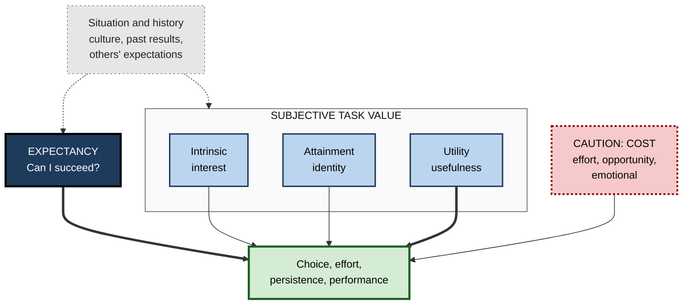
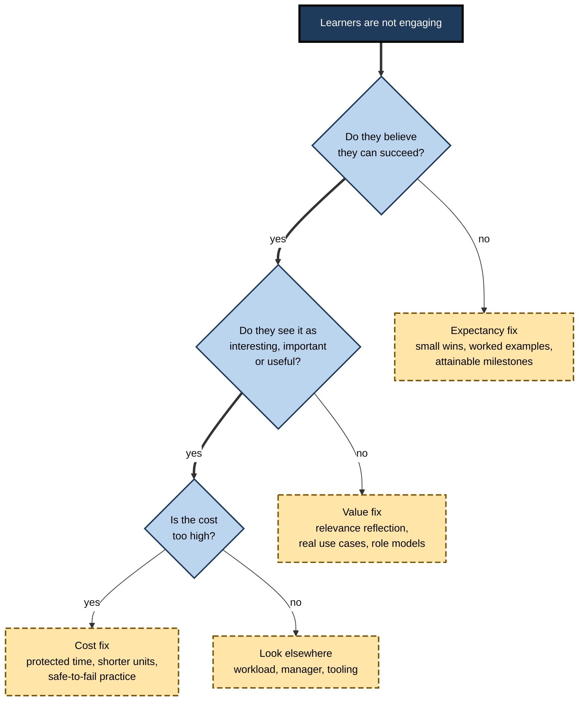
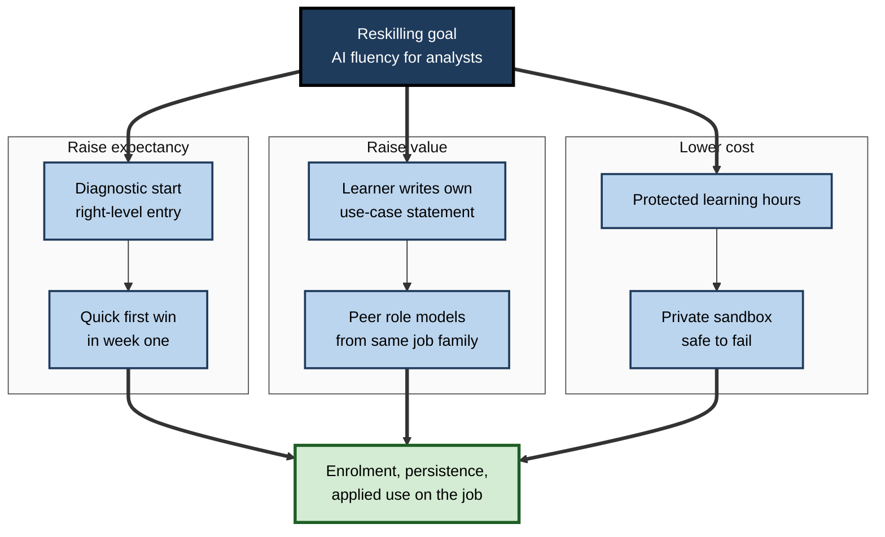

# L.3. Expectancy-Value Theory of Motivation

> **In one sentence:** Expectancy-value theory says you put effort into learning something when you believe you can succeed at it ("Can I do this?") and when you think it is worth doing ("Do I want to?"), after weighing what it will cost you.
>
> **Why it matters:** It turns a vague complaint — "people aren't motivated to learn this" — into a precise diagnosis: low confidence, low value, or high cost. Each has a different fix, and the fixes have some of the best intervention evidence in motivation science.
>
> **Level span:** Novice → Expert · **Reading time:** ~17 min · **Builds on:** intrinsic and extrinsic motivation

---

## The Learning Ladder

| Level | Badge | After this level you can... |
|---|---|---|
| 1 | NOVICE | Explain the "Can I? Do I want to? Is it worth the cost?" questions behind any choice to learn. |
| 2 | FOUNDATIONS | Name the four components of task value and distinguish expectancy from self-efficacy and ability beliefs. |
| 3 | PRACTITIONER | Diagnose a motivation problem as an expectancy, value or cost problem and pick a matching fix. |
| 4 | ADVANCED | Explain situated expectancy-value theory, the expectancy-by-value interaction, and the utility-value intervention evidence. |
| 5 | EXPERT / PRO | Use the model to design upskilling programmes, career pathways and change initiatives, and measure their effect. |

---

## Level 1 · Novice — The Big Picture

Imagine your company offers a free course on machine learning. Whether you sign up and stick with it depends on a quick mental calculation, mostly unconscious:

1. **Can I do this?** If you believe the maths will defeat you, you may not start.
2. **Do I want to?** Is it interesting, useful for your job, or important to who you want to be?
3. **What will it cost me?** Evenings, stress, the risk of looking foolish, giving up other things.

That calculation is the heart of **expectancy-value theory**. **Expectancy** is your belief about how well you will do. **Value** is how much the task is worth to you. **Cost** is what you must give up.

A helpful analogy is deciding whether to climb a hill. You consider whether you can reach the top (expectancy), whether the view is worth it (value), and how tired, wet or late it will make you (cost). If any one of these is badly off — you think the summit is impossible, the view is boring, or the climb would ruin your day — you probably stay at the bottom.

You have already experienced this when:

- you avoided a subject at school because "I'm just not a maths person" (low expectancy);
- you learned a spreadsheet trick instantly because it saved you an hour every week (high utility value);
- you dropped an evening course because it left no time for family (high cost).

The key idea for a beginner: **motivation needs both belief and value, and it is dragged down by cost.**

---

## Level 2 · Foundations — Core Concepts

### Origins

The idea goes back to John Atkinson's achievement-motivation work in the 1950s and Victor Vroom's 1964 theory of work motivation, which framed effort in terms of expectancy, instrumentality and valence. The modern educational version was developed by Jacquelynne Eccles, Allan Wigfield and colleagues from the 1980s, originally to explain why girls and boys chose different mathematics and science pathways. In 2020 Eccles and Wigfield renamed it **situated expectancy-value theory (SEVT)** to stress that beliefs and values are shaped moment by moment by the situation and culture.

### The four components of task value

| Value component | Question | Example (learning cloud architecture) |
|---|---|---|
| **Intrinsic value** (interest) | Will I enjoy it? | "I love designing systems." |
| **Attainment value** (importance) | Does it fit who I am or want to be? | "Being a solid architect is part of my professional identity." |
| **Utility value** (usefulness) | Will it help my goals? | "It's needed for the promotion and our migration." |
| **Cost** | What will it take from me? | "Three evenings a week; might fail the exam in front of colleagues." |

Researchers usually split cost into **effort cost** (time and energy), **opportunity cost** (what you give up), **emotional cost** (anxiety, fear of failure), and sometimes **outside effort cost** (demands of other responsibilities).

**Figure L.3-1 — The expectancy-value model in brief.**

*How to read it:* expectancy and value push choice and effort up; cost (dotted border) pulls them down; the situation (sparse dotted border) shapes all beliefs.

### Key Terms

| Term | Plain meaning |
|---|---|
| **Expectancy for success** | Belief about how well you will do on an upcoming task. |
| **Ability self-concept** | Belief about how good you are in a domain overall ("I'm good at statistics"). |
| **Self-efficacy** | Confidence that you can carry out the specific actions needed (Albert Bandura's concept; overlaps closely with expectancy). |
| **Subjective task value** | How much a task is worth to you — interest, importance, usefulness, minus cost. |
| **Utility value** | How useful the task is for your current or future goals. |
| **Attainment value** | How important doing well is to your identity. |
| **Cost** | Perceived negative aspects of engaging: effort, lost opportunities, emotional strain. |
| **Situated** | Beliefs and values that vary with context and moment, not just stable traits. |

---

## Level 3 · Practitioner — Putting It to Work

### Diagnose before you fix

When learners "lack motivation", ask which part of the model is failing. The fixes are different.

**Figure L.3-2 — Diagnostic tree for a motivation problem.**

*How to read it:* check expectancy first, then value, then cost; each "failing" answer leads to its own fix.

### Fix menu

| Problem | Evidence-informed fixes |
|---|---|
| **Low expectancy** | Break goals into achievable steps; provide worked examples; show progress; attribute early failure to strategy and effort, not fixed ability; share peer stories of people who started from the same place. |
| **Low utility value** | Ask learners to write or discuss how the content connects to their own work or life (the *utility-value intervention*); use authentic tasks from their job. |
| **Low attainment value** | Connect the skill to professional identity — "what good engineers do" — and to role models learners identify with. |
| **Low intrinsic value** | Use curiosity, puzzles, novelty and choice. |
| **High effort or opportunity cost** | Protect learning time on the calendar; shorten units; remove administrative friction. |
| **High emotional cost** | Make early practice private and low-stakes; normalise mistakes; separate practice from evaluation. |

### Worked example — rolling out a new analytics platform

| | Before | After |
|---|---|---|
| **Expectancy** | Two-day course, then sudden switch; many staff unsure they can cope. | Staged rollout; first task is a five-minute win reproducing a familiar report. |
| **Value** | "IT is replacing the old tool." | Each team writes one paragraph on which weekly pain the new tool removes for them. |
| **Cost** | Training scheduled on top of full workloads; mistakes visible to managers. | Two protected hours per week for a month; private sandbox for practice. |
| **Result** | Many staff kept exporting to old spreadsheets. | Faster adoption; questions shifted from "why?" to "how do I...?" |

### Common mistakes

- **Telling instead of letting learners generate relevance.** Lectures on "why this matters" can feel controlling, and for low-confidence learners can even backfire by raising the stakes. Having learners articulate relevance themselves tends to work better.
- **Ignoring cost.** Many workplace programmes fail on time cost, not on value.
- **Boosting confidence without competence.** Pep talks raise expectancy briefly; real expectancy comes from experienced success.

---

## Level 4 · Advanced — Mechanisms, Models & Evidence

### Expectancy and value interact

Early theories, following Atkinson and Vroom, proposed that expectancy and value *multiply*: if either is zero, motivation is zero. For decades, educational studies mostly modelled them as separate, additive predictors. More recent large-scale studies have revived the interaction, finding that value relates more strongly to achievement and choices when expectancy is high, and vice versa. The practical meaning: **raising value does little for someone who believes they cannot succeed, and raising confidence does little for someone who sees no point.**

### Which beliefs predict what

A consistent pattern in the research is that **expectancy and ability beliefs predict performance** (grades, test scores) more strongly, while **values predict choices** — which courses to take, which careers to pursue, whether to continue. This is why values matter so much for upskilling and career decisions, and why confidence matters so much for exam-style outcomes.

### Cost as a separate dimension

Cost was part of the original model but neglected for decades. Since the 2010s, researchers have built dedicated cost measures and found that cost explains dropout and avoidance beyond what expectancy and value predict. Eccles and Wigfield's 2024 review of four decades of the model placed cost inside subjective task value as a net judgement of benefits against costs. An intervention study in college physics found that helping students reframe the perceived cost of the course was about as effective as a utility-value intervention.

### The utility-value intervention

This is one of the best-studied brief motivation interventions. Students write short essays explaining how course material relates to their own lives or goals. Key findings:

- Meta-analytic syntheses report **small but reliable positive effects** on performance — on the order of a fifth to a third of a standard deviation — with little variation across contexts.
- Benefits are often **larger for students who start with lower expectations or performance**, and for groups underrepresented in a field.
- A 2023 study in a large national science journal reported that the intervention promoted persistence and diversity in STEM.
- Self-generated relevance generally works better than relevance asserted by the teacher.

Effects are modest, which is honest and important: brief "wise" interventions are cheap boosters, not substitutes for good teaching, workload design or fair assessment.

### Development and the "situated" turn

Expectancy and value beliefs tend to decline across childhood and adolescence in many domains, partly because feedback becomes more comparative. SEVT emphasises that these beliefs are **situated**: they shift within a lesson, a day or a project, depending on the task, the audience and recent experience. Methods such as experience sampling now capture these within-person fluctuations, which matter for designing moment-to-moment support.

### Relationship to neighbouring theories

| Theory | Overlap with expectancy-value |
|---|---|
| Self-efficacy (Bandura) | Near-equivalent to expectancy for specific tasks. |
| Self-determination theory | Intrinsic and identified motivation overlap with intrinsic and utility or attainment value. |
| Control-value theory of emotions | Applies control (expectancy) and value appraisals to explain emotions like anxiety and boredom. |
| Vroom's VIE theory | A workplace cousin: effort leads to performance (expectancy), performance to outcomes (instrumentality), outcomes have value (valence). |

---

## Level 5 · Expert / Pro — Professional Mastery

### Using the model to design upskilling

L&D leaders running reskilling programmes — data literacy, AI fluency, cloud migration — face all three barriers at once: many employees doubt they can learn technical skills, are unsure the skills matter for their role, and have no spare time.

**Figure L.3-3 — Programme design mapped to the model.**

*How to read it:* each subgraph targets one part of the model; all three feed the outcome on the thick arrows.

### Measurement

A professional measures the three components directly, briefly, before and during a programme:

| Construct | Example pulse item (1–5) |
|---|---|
| Expectancy | "I am confident I can learn to use this well." |
| Utility value | "This will help me in my day-to-day work." |
| Attainment value | "Being good at this matters to the professional I want to be." |
| Effort or opportunity cost | "Learning this takes time I don't have." |
| Emotional cost | "I worry about looking incompetent while I learn this." |

Track the lowest-scoring construct by team or role and target interventions there.

### Professional scenario

**Role:** Learning partner for a 2,000-person operations division adopting generative-AI tools.
**Situation:** Pilot teams had low adoption. Interviews revealed high anxiety about "being replaced or looking stupid" and uncertainty about where AI helped their actual tasks.
**What the pro does:** Measures the five constructs and finds emotional cost highest and utility value lowest. Introduces private, no-manager-visibility practice spaces; runs a 20-minute workshop where each person lists three of their own recurring tasks and tests AI on one; shares peer stories from operations staff, not engineers; and secures leadership statements on job security and protected learning time. Adoption and voluntary use rise in the next cohort; the utility-value pulse moves most.

### AI-era considerations

- AI raises **expectancy** for some tasks ("I can do data analysis now"), which can be motivating but can also inflate confidence beyond actual skill.
- AI can lower **utility value** for learning a skill ("why learn SQL if the assistant writes it?"). Professionals answer this honestly: specify which knowledge is needed to supervise, verify and correct AI output.
- AI anxiety is a major **emotional cost** in 2025–2026 workplaces; addressing it explicitly is part of good design.

---

## Myths vs. Evidence

| Myth | What the evidence shows |
|---|---|
| "If people knew why it matters, they'd be motivated." | Value without expectancy often fails; and imposed relevance can backfire for low-confidence learners. |
| "Confidence is all you need." | Expectancy predicts performance, but values drive choices and persistence. |
| "Brief relevance writing transforms results." | Effects are real but small; it is a cheap booster, not a cure. |
| "Cost is just lack of motivation." | Cost is a distinct, measurable barrier predicting dropout beyond value and expectancy. |
| "Some people are just not maths or tech people." | Ability beliefs are shaped by feedback and context and can change with experienced success. |

## Practitioner Toolkit

**Expectancy-value-cost diagnostic checklist**

- [ ] I asked learners whether they believe they can succeed.
- [ ] Early tasks guarantee a genuine, earned win.
- [ ] Learners generate their own statement of relevance.
- [ ] Role models resemble the learners.
- [ ] Learning time is protected, not added on top.
- [ ] Early practice is private and low-stakes.
- [ ] I measure expectancy, value and cost separately.

**Template — utility-value reflection prompt (10 minutes)**

> "Choose one idea from today's session. In a short paragraph, describe a specific situation in your work or life where it could be useful, and what you would do differently because of it."

## Self-Check

1. **[NOVICE]** What three questions sit at the heart of expectancy-value theory?
2. **[NOVICE]** Give an example of high utility value from your own work.
3. **[FOUNDATIONS]** Name the four components of task value.
4. **[FOUNDATIONS]** What are three kinds of cost?
5. **[PRACTITIONER]** Learners say "this is useful but I'll never get it". Which component is failing and what would you do?
6. **[ADVANCED]** What do expectancies tend to predict compared with values?
7. **[ADVANCED]** Summarise the evidence on utility-value interventions.
8. **[EXPERT / PRO]** How can generative AI change both expectancy and value for learning a skill?

### Answer Key

1. Can I do this? Do I want to (is it worth it)? What will it cost me?
2. Answers vary — for example, learning keyboard shortcuts that save an hour a week.
3. Intrinsic value, attainment value, utility value, and cost.
4. Effort cost, opportunity cost, emotional cost (and outside effort cost).
5. Expectancy. Use small achievable steps, worked examples, visible progress, and attributions to strategy rather than fixed ability.
6. Expectancies predict performance more strongly; values predict choices and persistence more strongly.
7. Learners write about the relevance of material to their lives; small but reliable positive effects, often larger for lower-confidence or underrepresented learners; self-generated relevance beats asserted relevance.
8. AI can raise expectancy (tasks feel doable) but risk overconfidence, and can lower perceived utility of learning the skill; pros clarify which knowledge is needed to supervise and verify AI.

## Key Takeaways

- Motivation = **expectancy** (can I?) and **value** (is it worth it?), minus **cost**.
- Value has four parts: **intrinsic, attainment, utility and cost**.
- Expectancy predicts **performance**; value predicts **choices and persistence**.
- Expectancy and value **interact**: either one near zero limits motivation.
- **Self-generated relevance** interventions have small, reliable effects.
- **Cost** — time, opportunity, emotional — is a major, often ignored barrier in workplaces.
- Diagnose which component is failing before choosing a fix.

## Glossary

| Term | Meaning |
|---|---|
| Ability self-concept | A person's belief about their competence in a domain. |
| Attainment value | Importance of doing well for one's identity. |
| Cost | Perceived negative consequences of engaging in a task. |
| Emotional cost | Anxiety, fear of failure or stress associated with a task. |
| Expectancy | Belief about how well one will do on an upcoming task. |
| Intrinsic value | Enjoyment or interest expected from the task. |
| Opportunity cost | Valued alternatives given up to do the task. |
| Self-efficacy | Confidence in one's ability to execute the actions required. |
| Situated expectancy-value theory | The 2020 renaming of Eccles' model, emphasising context and moment-to-moment variation. |
| Utility value | Usefulness of a task for one's goals. |
| Utility-value intervention | Brief writing exercise in which learners connect content to their own lives. |
| VIE theory | Vroom's expectancy, instrumentality and valence model of work motivation. |
