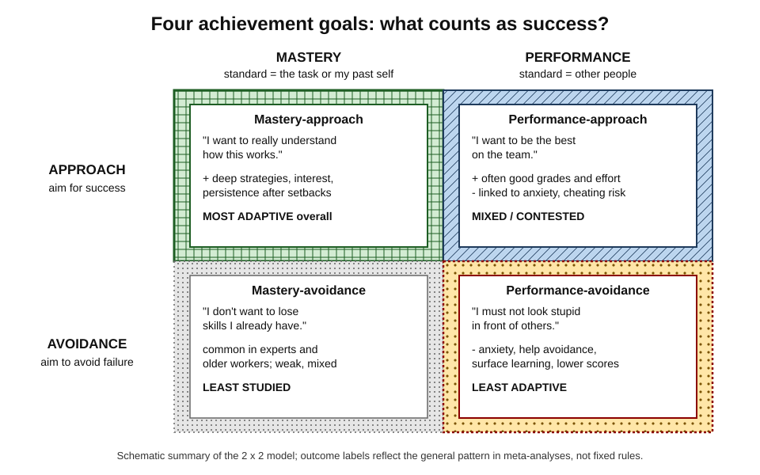
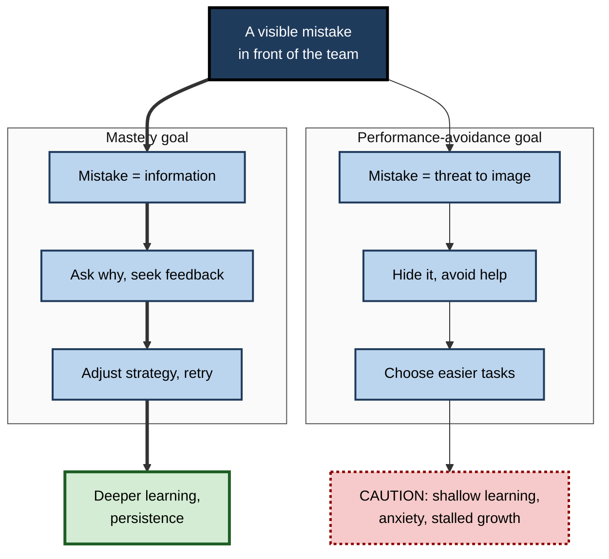
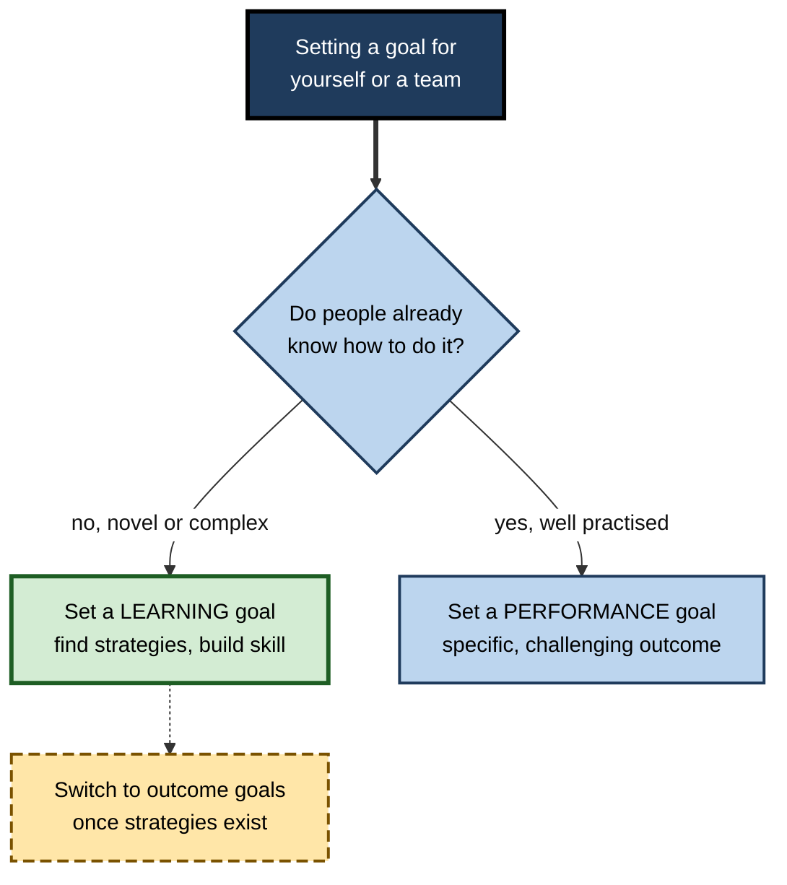

# L.4. Goal Orientation: Mastery vs. Performance

> **In one sentence:** When you learn, you can aim to get better at the thing itself (a mastery goal) or to look good compared with other people (a performance goal) — and which aim you hold changes how you study, how you handle mistakes, and how much you really learn.
>
> **Why it matters:** Teams, classrooms and companies send strong signals about which goal "counts". Leaders who reward visible ranking get people who hide mistakes and avoid hard problems; leaders who reward growth get people who seek feedback and tackle stretch work.
>
> **Level span:** Novice → Expert · **Reading time:** ~17 min · **Builds on:** intrinsic and extrinsic motivation, expectancy and value

---

## The Learning Ladder

| Level | Badge | After this level you can... |
|---|---|---|
| 1 | NOVICE | Tell a mastery goal from a performance goal in everyday situations. |
| 2 | FOUNDATIONS | Describe the 2 × 2 model (approach versus avoidance) and the typical outcomes of each goal. |
| 3 | PRACTITIONER | Rewrite your own and your team's goals so they encourage learning, feedback-seeking and challenge. |
| 4 | ADVANCED | Explain the evidence, including the long-running debate about performance-approach goals and newer 3 × 2 models. |
| 5 | EXPERT / PRO | Shape a team or organisational "goal structure" through evaluation, feedback and recognition systems. |

---

## Level 1 · Novice — The Big Picture

Two new hires join a software team on the same day. Both want to succeed, but they mean different things by "success".

- Asha wants to **get good** at the codebase. She asks lots of questions, volunteers for an unfamiliar bug, and treats code-review comments as free lessons.
- Ben wants to **look good**. He picks tickets he knows he can close fast, avoids asking questions in public, and feels stung by review comments.

Asha holds a **mastery goal** (also called a learning goal): success means improving and understanding. Ben holds a **performance goal**: success means demonstrating ability, usually compared with others. Neither is a bad person and both work hard. But over a year, Asha usually learns more — especially when the work gets hard.

An analogy: two people at a gym. One measures success by how much stronger they are than last month; the other by whether they lift more than the person next to them. The second person may skip exercises they are weak at, because doing them badly in public feels like failure.

You have already experienced this when:

- you avoided asking a "stupid question" in a meeting so you would not look uninformed (performance concern);
- you got absorbed in figuring something out and didn't care who noticed (mastery focus);
- a ranking or leaderboard made you choose easy wins over real improvement.

The key idea for a beginner: **aiming to improve tends to produce more learning than aiming to look capable — particularly when you are afraid of looking incapable.**

---

## Level 2 · Foundations — Core Concepts

### From two goals to four

Research on **achievement goals** began in the late 1970s and 1980s with Carol Dweck, John Nicholls and Carole Ames, who described the mastery-versus-performance distinction. In the late 1990s Andrew Elliot and colleagues added a second dimension — whether people are trying to **approach** success or **avoid** failure — producing the widely used **2 × 2 model**.

*Figure L.4-1 — The 2 × 2 achievement goal framework.* Columns: how competence is defined (mastery versus performance). Rows: approach versus avoidance. The thick solid cross-hatched cell (mastery-approach) is the most adaptive; the dotted cell (performance-avoidance) is the least.

| Goal | Aim | Typical thought |
|---|---|---|
| **Mastery-approach** | Develop competence, understand deeply | "I want to really get this." |
| **Performance-approach** | Outperform others, demonstrate ability | "I want to be top of the cohort." |
| **Mastery-avoidance** | Avoid losing skill or misunderstanding | "I don't want to get rusty." |
| **Performance-avoidance** | Avoid looking incompetent relative to others | "I must not be the worst." |

### Related ideas you will meet

- **Goal orientation** (more common in workplace research) usually refers to a fairly stable personal tendency — a *learning goal orientation* or a *performance goal orientation* — while **achievement goals** often refer to the goal held for a specific task.
- **Goal structure** is the message an environment sends about what counts — a classroom or team that emphasises improvement has a *mastery goal structure*; one that ranks and compares has a *performance goal structure*.
- **Mindset** (beliefs that ability is fixed or can grow) is related: a growth mindset tends to accompany mastery goals. Mindset is treated in depth elsewhere; here the focus is the goal itself.

**Figure L.4-2 — How each goal shapes the response to a mistake.**

*How to read it:* the same event follows two paths; the thick path is the mastery route and ends in the solid-border outcome.

### Key Terms

| Term | Plain meaning |
|---|---|
| **Achievement goal** | The purpose behind competence-relevant behavior — what "doing well" means to you. |
| **Mastery goal** | Aim to develop competence, judged against the task or your past self. |
| **Performance goal** | Aim to demonstrate competence, judged against other people. |
| **Approach / avoidance** | Striving toward success versus striving away from failure. |
| **Goal structure** | The goals emphasised by an environment's practices — grading, feedback, recognition. |
| **Help-seeking avoidance** | Not asking for needed help, often to protect one's image. |
| **Self-handicapping** | Creating an excuse in advance for possible failure (e.g. not studying), so failure need not reflect on ability. |

---

## Level 3 · Practitioner — Putting It to Work

### Rewriting goals: a five-step method

1. **Write the goal as you currently hold it.** "Pass the AWS exam with a top score."
2. **Find the comparison.** Is success defined against others, or against a standard of skill?
3. **Restate as a skill to develop.** "Be able to design a fault-tolerant three-tier architecture and explain the trade-offs."
4. **Add a process target.** "Two design exercises a week, each reviewed by a senior colleague."
5. **Keep the external outcome as a by-product, not the definition of success.** The exam still matters; it is now evidence of mastery rather than the whole point.

### Learning goals versus performance goals for complex tasks

Goal-setting research by Gary Latham, Gerard Seijts and colleagues found that for **complex, unfamiliar tasks**, a specific *learning* goal ("discover five strategies that work") often led to better results than a specific *performance* goal ("hit this number"). Pushing for an outcome before people know how to reach it narrows attention and raises anxiety. For simple, well-learned tasks, performance goals work well.

**Figure L.4-3 — Choosing the type of goal by task.**

*How to read it:* novelty and complexity call for learning goals first; the dotted arrow shows switching to outcome goals once people have the strategies.

### Worked example — a consulting team's analyst reviews

| | Before | After |
|---|---|---|
| **Goal language** | "Be in the top quartile of analysts." | "By Q4, independently structure a market-sizing model and defend assumptions to a client." |
| **Feedback** | Ranking against peers, shared at review time. | Monthly feedback on one deliverable against a skill rubric. |
| **Mistakes** | Errors in decks counted against ratings. | Draft errors caught in review treated as learning; only final client errors tracked. |
| **Behavior** | Analysts avoided unfamiliar sectors and hid uncertainty. | More volunteering for new sectors, earlier questions, fewer late surprises. |

### Common mistakes

- **Equating "mastery" with "no standards".** Mastery goals can be demanding; the standard is skill, not rank.
- **Turning learning into competition by accident.** Leaderboards in training platforms create performance structures even when the content is mastery-oriented.
- **Punishing visible errors during learning.** This is the fastest way to create performance-avoidance.

---

## Level 4 · Advanced — Mechanisms, Models & Evidence

### What the meta-analyses show

Across decades of studies and several recent meta-analyses, a reasonably stable pattern holds:

| Goal | Typical correlates |
|---|---|
| **Mastery-approach** | Interest, deep learning strategies, persistence, help-seeking, positive emotions; positive but modest relation to achievement. |
| **Performance-approach** | Effort and often positive relation to grades, but also test anxiety and, in some studies, cheating and surface strategies. |
| **Mastery-avoidance** | Few consistent effects; often weakly negative. |
| **Performance-avoidance** | Anxiety, help avoidance, self-handicapping, disorganised study; reliably negative relation to achievement. |

A 2024 meta-analysis linking achievement goals and academic achievement found mastery-approach and performance-approach goals positively correlated with achievement and both avoidance goals negatively correlated, with self-efficacy and engagement as mediators. Another 2024 meta-analysis on mental health linked performance-avoidance goals to anxiety and depression and performance-approach goals to anxiety, while mastery-approach goals showed the healthier pattern. A 2024 longitudinal meta-analysis found that goals are moderately stable over time but change across school years and transitions.

### The performance-approach debate

Whether performance-approach goals are "good" has been argued for over two decades. One camp (Harackiewicz and colleagues) argued they help achievement in competitive settings; the other (Midgley, Kaplan and colleagues) argued that costs — anxiety, cheating, fragile motivation after failure — outweigh benefits. The **multiple-goals perspective** suggests that holding both mastery-approach and performance-approach goals can work well for some people. The honest summary: **performance-approach goals can support grades, but they bring well-documented risks, and the risk rises sharply when performance concerns tip into avoidance after setbacks.**

### Measurement problems

Questionnaires for performance-approach goals mix two ideas: wanting to *outperform others* (normative) and wanting to *appear competent* (appearance). Studies show the appearance component is linked to worse outcomes, while the normative component is more often linked to better grades. This partly explains inconsistent findings.

### The 3 × 2 model

In 2011 Elliot, Kou Murayama and Reinhard Pekrun proposed splitting "mastery" into **task-based** (getting the task right) and **self-based** (improving on your past self) standards, alongside **other-based** (performance) standards, each with approach and avoidance forms — six goals in all. Evidence supports the distinctions statistically, though practical guidance mostly still rests on the 2 × 2.

### Goal structures beat individual traits as levers

Classroom and workplace **goal structures** predict individual goals: environments that emphasise improvement, effort and understanding cultivate mastery goals; those that publicly compare and rank cultivate performance goals, especially avoidance. Carole Ames's **TARGET** framework (Task, Authority, Recognition, Grouping, Evaluation, Time) remains a practical design checklist for shifting structure.

### Workplace evidence

Workplace research on **learning goal orientation** links it to feedback-seeking, self-efficacy, adaptability and job performance, while **performance-avoid orientation** is linked to lower feedback-seeking and poorer learning in training. These relationships are modest and correlational, but they line up with experimental goal-setting findings that learning goals help on complex, novel tasks.

---

## Level 5 · Expert / Pro — Professional Mastery

### Designing a mastery-oriented goal structure

| TARGET dimension | Performance structure | Mastery structure |
|---|---|---|
| **Task** | Uniform tasks; easy wins rewarded. | Varied, meaningful, optimally challenging tasks. |
| **Authority** | Leader decides everything. | Shared decisions about how to learn and approach work. |
| **Recognition** | Top performers praised publicly. | Improvement, effort and good strategy recognised. |
| **Grouping** | Ability-tracked, competitive groups. | Mixed, collaborative groups. |
| **Evaluation** | Norm-referenced ranking. | Criterion-referenced, private, progress-focused. |
| **Time** | Fixed pace; speed rewarded. | Flexible time to master. |

### Performance management and psychological safety

Forced ranking and stack-ranking systems create strong performance-avoidance structures. Research on **psychological safety** — a shared belief that it is safe to take interpersonal risks, a concept developed by Amy Edmondson — fits the goal literature: teams where people can admit errors and ask questions learn faster. Pros separate **developmental feedback** (frequent, private, criterion-based) from **evaluative decisions** (pay, promotion), so that learning conversations are not experienced as threats.

### Professional scenario

**Role:** Engineering manager of a platform team.
**Situation:** After a reorganisation, the team's on-call incident reviews became blame-heavy. Junior engineers stopped volunteering for on-call shadowing and nobody admitted near-misses.
**What the pro does:** Introduces blameless post-incident reviews focused on "what did we learn and change?", records near-misses as learning opportunities, sets each engineer a quarterly *learning* goal ("lead one incident review", "own one runbook rewrite"), and keeps delivery outcome goals for the team rather than ranking individuals. Recognition in team meetings shifts to good diagnosis and well-asked questions. Over two quarters, near-miss reporting rises, and more engineers join the on-call rotation.

### AI-era considerations

Generative AI makes it easy to *perform* competence — polished code, decks and analyses — without building it. Performance-goal environments reward this, encouraging people to present AI output as their own skill. Mastery-oriented structures ask a different question: "What can you now do, explain or judge that you could not before?" Pros design reviews that probe understanding (walk-throughs, explain-your-choices) rather than only final artefacts.

---

## Myths vs. Evidence

| Myth | What the evidence shows |
|---|---|
| "Competition always motivates people to learn." | Competitive, comparative structures foster performance goals; avoidance forms reliably harm learning and well-being. |
| "Mastery goals mean lower standards." | Mastery standards can be very demanding; they are anchored to skill, not rank. |
| "Performance goals are always bad." | Performance-approach goals often relate to higher grades; the risks lie in anxiety, cheating and collapse into avoidance. |
| "Goal orientation is a fixed personality trait." | Goals are moderately stable but are shaped substantially by environmental goal structures. |
| "Ambitious outcome targets work for every task." | For complex, novel tasks, specific learning goals often beat specific performance goals. |

## Practitioner Toolkit

**Mastery-structure checklist for a team or course**

- [ ] Goals are written as skills to develop, not ranks to achieve.
- [ ] Feedback is private, criterion-based and frequent.
- [ ] Improvement and strategy are recognised publicly; rankings are not.
- [ ] Mistakes during learning are treated as information.
- [ ] Novel or complex work starts with learning goals.
- [ ] Developmental conversations are separated from pay decisions.
- [ ] Reviews probe understanding, not just output (especially with AI).

**Personal goal rewrite template**

| Current goal | Comparison hidden in it | Mastery rewrite | Weekly process target |
|---|---|---|---|
| | | | |

## Self-Check

1. **[NOVICE]** What is the difference between a mastery goal and a performance goal?
2. **[NOVICE]** Which colleague in the opening example is more likely to ask for help, and why?
3. **[FOUNDATIONS]** Name the four goals in the 2 × 2 model.
4. **[FOUNDATIONS]** What is a goal structure?
5. **[PRACTITIONER]** Rewrite "Be the fastest closer on the support team" as a mastery goal.
6. **[PRACTITIONER]** When does a learning goal outperform a performance goal?
7. **[ADVANCED]** Why are findings on performance-approach goals inconsistent?
8. **[ADVANCED]** What does the 3 × 2 model add?
9. **[EXPERT / PRO]** Name three TARGET changes that would shift a team toward mastery.

### Answer Key

1. Mastery goals aim to develop competence (judged against the task or your past self); performance goals aim to demonstrate competence relative to others.
2. Asha (mastery goal), because mistakes and questions are information to her, not threats to her image.
3. Mastery-approach, performance-approach, mastery-avoidance, performance-avoidance.
4. The goals an environment emphasises through tasks, recognition, grouping and evaluation.
5. For example: "Resolve complex billing tickets end-to-end without escalation by mastering the five most common root causes."
6. On complex, novel tasks where people do not yet know the strategies needed.
7. Measures mix normative (outperforming) and appearance (looking competent) components with different effects; benefits for grades coexist with costs like anxiety; context matters.
8. It splits mastery into task-based and self-based standards, giving six goals with other-based (performance) standards.
9. Examples: recognise improvement instead of top performers; use criterion-referenced, private evaluation; offer varied tasks and some authority over how to learn; allow flexible time.

## Key Takeaways

- **Mastery goals** aim to improve; **performance goals** aim to look capable relative to others.
- Adding **approach versus avoidance** gives the 2 × 2 model; performance-avoidance is the most harmful.
- Mastery-approach goals predict deep strategies, persistence and help-seeking.
- Performance-approach goals can lift grades but carry anxiety and integrity risks.
- **Environments shape goals**: ranking and public comparison breed avoidance.
- For **complex, novel work**, set learning goals before outcome goals.
- In the AI era, assess what people can explain and judge, not just what they produce.

## Glossary

| Term | Meaning |
|---|---|
| 2 × 2 model | Framework crossing mastery/performance with approach/avoidance. |
| 3 × 2 model | Framework with task, self and other standards, each in approach and avoidance forms. |
| Achievement goal | The aim behind competence-related behavior. |
| Goal orientation | A relatively stable tendency to adopt particular achievement goals. |
| Goal structure | The goal messages conveyed by an environment's practices. |
| Help-seeking avoidance | Failing to seek needed help, often to protect image. |
| Learning goal | A goal to discover strategies or develop skill rather than reach an outcome. |
| Multiple-goals perspective | The view that people can hold mastery and performance goals simultaneously with combined benefits. |
| Psychological safety | Shared belief that a team is safe for interpersonal risk-taking. |
| Self-handicapping | Creating obstacles or excuses so that failure can be attributed to them rather than to ability. |
| TARGET | Task, Authority, Recognition, Grouping, Evaluation, Time — levers for shaping goal structures. |
