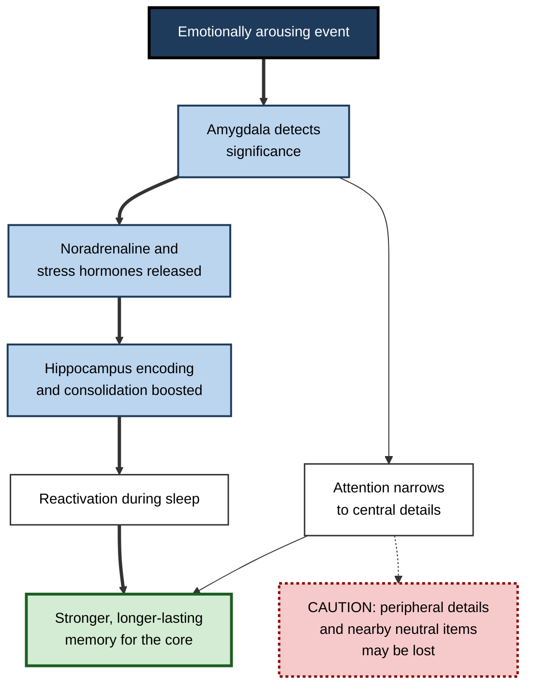
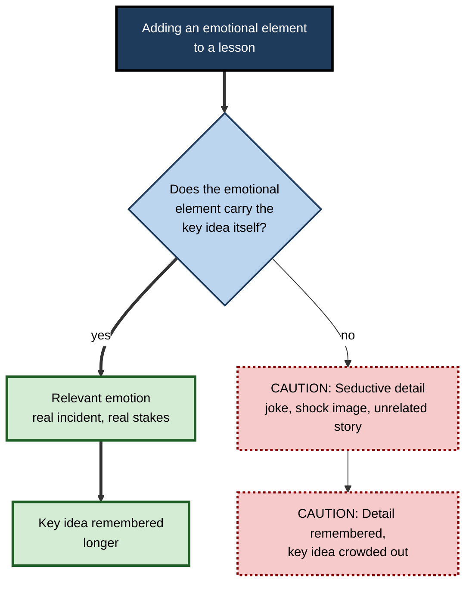
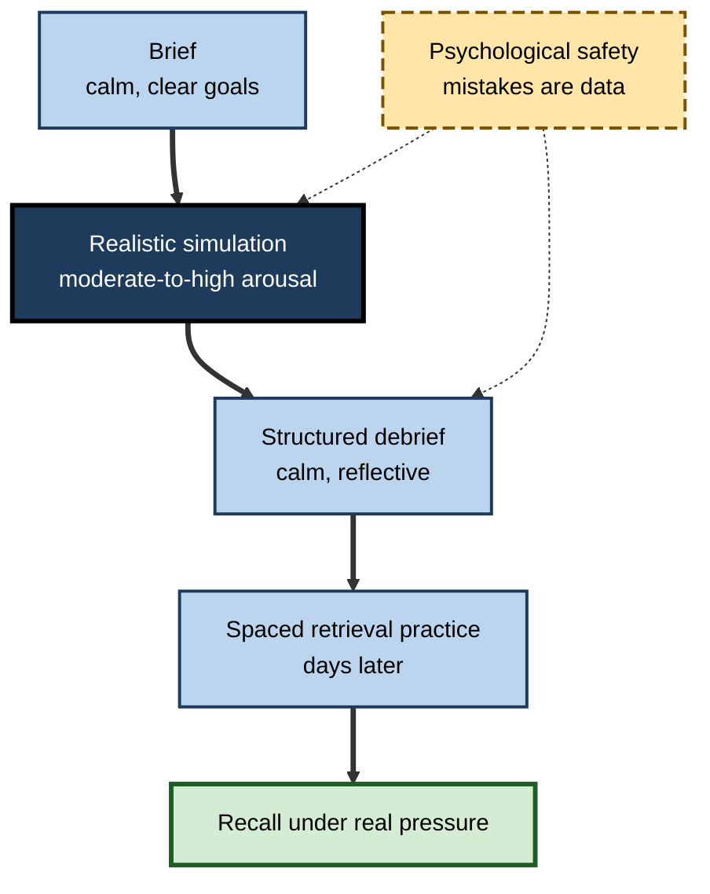

# L.5. Emotion and Memory Encoding

> **In one sentence:** Things that stir our feelings — surprise, fear, delight, high stakes — tend to be remembered more strongly than neutral things, because emotion tells the brain "this matters, keep it", though it also narrows what we notice and can make us confidently wrong.
>
> **Why it matters:** Training, presentations and onboarding compete for scarce memory. Knowing how emotion helps and harms encoding lets you make important points stick without distracting learners, misleading them, or pushing them into stress that blocks recall.
>
> **Level span:** Novice → Expert · **Reading time:** ~17 min · **Builds on:** encoding, long-term memory, consolidation

---

## The Learning Ladder

| Level | Badge | After this level you can... |
|---|---|---|
| 1 | NOVICE | Explain why emotional moments are easier to remember, with examples from your life. |
| 2 | FOUNDATIONS | Distinguish arousal from valence and describe the emotional enhancement of memory and its trade-offs. |
| 3 | PRACTITIONER | Use relevant emotion — stakes, stories, surprise — to make key ideas memorable without seductive distractions. |
| 4 | ADVANCED | Explain the amygdala–hippocampus mechanism, the role of stress hormones, flashbulb memories and emotion-induced forgetting. |
| 5 | EXPERT / PRO | Design high-stakes training, simulations and communications that use emotion ethically and effectively. |

---

## Level 1 · Novice — The Big Picture

Think back five years. You probably cannot remember what you had for lunch on an ordinary Tuesday, but you can remember the day you got a job offer, a frightening near-miss on the road, or an embarrassing moment in a meeting. Those memories feel vivid because they came with **emotion**.

Your brain is constantly deciding what to keep. Emotion acts like a highlighter pen: it marks some experiences as important, and highlighted experiences are more likely to be stored firmly and kept longer.

But a highlighter has two side effects. It draws your eye to the highlighted words and away from everything else on the page. And a bright highlight can make you *feel* certain you remember the page perfectly even when you have the details wrong.

You have already experienced this when:

- you remembered a gripping story from a training session long after you forgot the slides;
- during a car accident or argument you remembered one detail intensely but could not recall what happened just before;
- you were certain about where you heard big news, then discovered your memory had shifted over time.

The key idea for a beginner: **emotion makes the central, meaningful parts of an experience stickier, but it narrows attention and does not guarantee accuracy.**

---

## Level 2 · Foundations — Core Concepts

### Two dimensions of emotion

Researchers describe emotions on two main dimensions:

- **Arousal** — how activating or intense the emotion is, from calm to highly excited.
- **Valence** — how pleasant or unpleasant it is, from negative to positive.

For memory, **arousal is the main driver**. Highly arousing events, positive or negative, tend to be remembered better than calm ones. Valence affects *what kind* of details are remembered: negative emotion often sharpens memory for specific details, while positive emotion is associated with broader, more gist-based memory.

### Emotional enhancement of memory

The **emotional enhancement of memory** is the well-replicated finding that emotionally arousing material is remembered better than neutral material, especially after a delay. The advantage often grows over hours and days, which is a sign that emotion influences **consolidation** — the stabilisation of memories after the event — not only the moment of encoding.

**Figure L.5-1 — How emotion boosts encoding and consolidation.**

*How to read it:* the thick path is the memory boost; the dotted arrow shows the cost — narrowed attention can lose surrounding detail.

### Key Terms

| Term | Plain meaning |
|---|---|
| **Arousal** | Intensity or activation of an emotional state. |
| **Valence** | Pleasantness or unpleasantness of an emotion. |
| **Emotional enhancement of memory** | Better memory for emotionally arousing information than for neutral information. |
| **Amygdala** | Almond-shaped brain structures that detect emotional significance and modulate memory in other regions. |
| **Hippocampus** | Brain structure central to forming new memories of events and facts. |
| **Consolidation** | The process by which new memories stabilise over hours, days and sleep. |
| **Attentional narrowing** | Focusing on the central, emotional aspect of a scene at the expense of the periphery. |
| **Flashbulb memory** | A vivid, confident memory of the circumstances in which you learned shocking news. |
| **Seductive details** | Interesting but irrelevant content added to learning material, which tends to harm learning. |

---

## Level 3 · Practitioner — Putting It to Work

### The rule: attach the emotion to the point, not next to it

Because emotion narrows attention to what is *central*, the most important design question is: **is the emotional element the thing you want remembered, or something beside it?** A dramatic story that *embodies* the key principle helps. A funny cat video before a dense slide competes with it.

### A five-step method for emotionally memorable teaching

1. **Pick the one to three ideas** that must survive. Emotion is a limited resource; spread across everything, it helps nothing.
2. **Find the stakes.** What really goes wrong — for a customer, a colleague, a patient, the business — when this idea is ignored?
3. **Build a concrete case** where the emotion and the principle are the same thing: the incident, the lost client, the near-miss.
4. **Make the point explicit** right after the emotional peak, while attention is focused.
5. **Follow with calm practice and retrieval** later, when arousal has settled, so learners can encode the details and procedures that emotion does not capture well.

**Figure L.5-2 — Relevant emotion versus seductive detail.**

*How to read it:* only the thick path, where emotion and the key idea coincide, reliably helps memory.

### Worked example — a data-privacy course

| | Before | After |
|---|---|---|
| **Opening** | Shocking stock photo of a hacker in a hoodie; statistics about fines worldwide. | A five-minute walk-through of a real (anonymised) incident in a similar company: a misaddressed spreadsheet, the customer calls, the regulator's letter. |
| **Point** | Twenty policy bullet points. | Three rules, each tied to a specific moment in the story where it would have prevented harm. |
| **Practice** | Multiple-choice quiz immediately. | Two days later, short scenarios where learners decide what to do, then compare with the rules. |
| **Memory a month later** | People remember "the hoodie guy" but not the rules. | People recall the incident and the three rules it illustrates. |

### Common mistakes

- **Shock for its own sake.** Fear appeals without clear, achievable actions can produce avoidance rather than learning.
- **Overloading.** High arousal throughout a session exhausts attention; contrast matters.
- **Stressing people at the point of recall.** High-pressure assessment can block retrieval of what they know.
- **Trusting vivid memories uncritically.** A strongly felt memory of "what the client said" can still be inaccurate; write things down.

---

## Level 4 · Advanced — Mechanisms, Models & Evidence

### The modulation hypothesis

James McGaugh and colleagues showed across decades of animal and human work that emotional arousal releases stress hormones (adrenaline and cortisol) and activates noradrenaline in the brain. These signals act on the **basolateral amygdala**, which in turn strengthens consolidation in the hippocampus and cortex. Blocking noradrenergic receptors reduces the emotional memory advantage in experiments, which supports the causal role of this pathway. Brain imaging in humans shows that amygdala activity during encoding predicts later memory for emotional items.

Newer work adds the role of sleep: emotional memories are preferentially reactivated during sleep, and a 2025 study in mice showed amygdala-driven reactivation during non-REM sleep supporting emotionally associated memories. The broader picture is that emotion "tags" experiences for priority processing during later consolidation.

### Why emotional memories fade more slowly

The **emotional binding account** (Andrew Yonelinas and Maureen Ritchey, 2015) suggests that the amygdala binds items to their emotional significance, and these bindings are forgotten more slowly than the item-to-context bindings that depend on the hippocampus. That fits a common observation: you remember *that* something felt terrible long after you forget *where* and *when* it happened.

### Trade-offs and costs

| Phenomenon | What happens | Practical meaning |
|---|---|---|
| **Central–peripheral trade-off** | Memory improves for the emotional centre of an event, worsens for the periphery (classic "weapon focus" in eyewitness research). | Make the emotional centre the thing you want remembered. |
| **Emotion-induced forgetting** | Neutral items presented just before or after an emotional item are remembered worse. | Do not put critical neutral details right next to a shock moment. |
| **Flashbulb memories** | Very vivid, confident memories of shocking news; studies after major public events show confidence stays high while accuracy declines over time much like ordinary memories. | Confidence is not evidence of accuracy. |
| **Mood-congruent memory** | People recall material matching their current mood more easily. | Anxious learners recall threats and failures more readily. |

### Stress timing matters

Acute stress has different effects depending on timing. Stress closely tied to the learning event can enhance memory for that event, especially its emotional content. Stress at **retrieval** — a high-pressure exam or a hostile interview — tends to **impair** recall of what was previously learned, a finding replicated many times since the work of Dominique de Quervain and others. Chronic stress impairs hippocampal function more broadly. For practitioners, the upshot is: **meaningful arousal during learning can help, while high stress at the moment of recall usually hurts.**

### Emotional design in instructional materials

Multimedia research on **emotional design** — adding warm colours, friendly characters or expressive faces to learning materials — has found small positive effects on motivation and some learning outcomes in meta-analyses, though results vary. In contrast, research on **seductive details** consistently shows that interesting but irrelevant additions reduce learning, likely by diverting attention and disrupting the learner's mental model. The line between the two is relevance.

### Boundary conditions

- Emotional memory effects are larger after delays than on immediate tests.
- Extreme, traumatic arousal can produce fragmented memories and intrusive recall; this is a clinical matter, not a design tool.
- Individual differences (anxiety levels, prior experience) change how arousing the same material is.

---

## Level 5 · Expert / Pro — Professional Mastery

### Using emotion in high-stakes training

Fields like aviation, medicine, emergency response and cybersecurity have long used realistic simulations that recreate the arousal of real incidents. The goal is twofold: build memory for key decisions under realistic conditions, and practise retrieval *under* arousal so that stress at the moment of need disrupts less. Professionals pair this with calm debriefs where details and reasoning are consolidated.

**Figure L.5-3 — Simulation-plus-debrief cycle for high-stakes skills.**

*How to read it:* arousal peaks in the simulation box; calm phases before and after consolidate details. The long-dash box is a condition that must hold throughout.

### Communications and change management

Leaders announcing change or communicating risk use the same principles: a single concrete story that carries the message, clear next actions, and repetition in calmer settings. Pure fear messaging tends to produce defensive avoidance unless people also believe they can act effectively.

### Professional scenario

**Role:** Customer-success lead training new account managers.
**Situation:** Trainees could recite the escalation policy but kept mishandling angry enterprise customers in their first months.
**What the pro does:** Replaces the policy slides with recorded (consented, anonymised) calls where escalation went well and badly, discussing the moment each policy step mattered. Adds role-plays with a colleague playing an upset client — enough arousal to feel real — followed by a calm, structured debrief and a written one-page "what I'll do next time". Two weeks later, trainees practise again under similar pressure. Escalation handling in the first quarter improves, and trainees describe the role-play as the most memorable part of onboarding.

### Ethical limits

- Do not manufacture distress to make content memorable; fear and shame damage trust and psychological safety.
- Be careful with real incidents involving identifiable people; anonymise and obtain consent.
- Consider learners with trauma histories: give warnings before intense scenarios and offer opt-outs where appropriate.
- AI-generated "dramatic" scenarios can be compelling but inaccurate; check them against real cases.

---

## Myths vs. Evidence

| Myth | What the evidence shows |
|---|---|
| "Vivid emotional memories are accurate." | Flashbulb memories stay vivid and confident but lose accuracy over time like other memories. |
| "Any emotional hook makes learning stick." | Irrelevant hooks (seductive details) reduce learning; emotion must carry the key idea. |
| "Only negative emotions boost memory." | Arousal is the main driver; positive arousing events are also well remembered. |
| "Stress always ruins memory." | Stress tied to learning can enhance encoding; stress at retrieval and chronic stress tend to impair. |
| "Emotion only affects the moment of learning." | Much of the emotional advantage emerges during consolidation over hours, days and sleep. |

## Practitioner Toolkit

**Emotion-and-memory design checklist**

- [ ] I chose one to three ideas that must be remembered.
- [ ] Each has a concrete case with real stakes that embodies it.
- [ ] I state the principle explicitly right after the emotional moment.
- [ ] No seductive details compete with the key ideas.
- [ ] Critical neutral details are not placed right beside shock moments.
- [ ] Calm, spaced retrieval practice follows.
- [ ] Assessment conditions avoid unnecessary stress at recall — unless the goal is to rehearse performance under pressure.
- [ ] Intense content is anonymised, accurate, and comes with appropriate warnings.

**Story template for a memorable principle**

1. Situation — who, where, what was at stake.
2. Moment of decision — what the person did or did not do.
3. Consequence — concrete, felt.
4. Principle — one sentence.
5. Your turn — a scenario where learners apply it.

## Self-Check

1. **[NOVICE]** Why do you remember a job offer better than an ordinary Tuesday?
2. **[NOVICE]** What are the two side effects of emotion's "highlighter"?
3. **[FOUNDATIONS]** Which dimension of emotion — arousal or valence — mainly drives memory enhancement?
4. **[FOUNDATIONS]** What is a seductive detail?
5. **[PRACTITIONER]** How would you use emotion to make a security rule memorable?
6. **[ADVANCED]** Describe the role of the amygdala and noradrenaline in emotional memory.
7. **[ADVANCED]** How does stress at retrieval differ in effect from stress during learning?
8. **[ADVANCED]** What does research on flashbulb memories show about confidence and accuracy?
9. **[EXPERT / PRO]** Why do high-stakes professions pair simulations with calm debriefs?

### Answer Key

1. The offer was emotionally arousing, signalling importance and boosting encoding and consolidation.
2. It narrows attention (losing peripheral details) and can create high confidence without accuracy.
3. Arousal.
4. Interesting but irrelevant content that tends to divert attention from the key ideas and reduce learning.
5. Tell a real, anonymised incident where breaking the rule caused concrete harm, state the rule right after, then practise scenarios later.
6. The amygdala detects significance; noradrenaline and stress hormones act via the basolateral amygdala to strengthen hippocampal and cortical consolidation.
7. Stress tied to learning can enhance memory for the event; stress at retrieval tends to impair recall of previously learned material.
8. Confidence remains high while accuracy declines over time much like ordinary memories.
9. Simulations create realistic arousal and practise recall under pressure; calm debriefs allow encoding of details and reasoning that arousal does not capture well.

## Key Takeaways

- Emotion, especially **arousal**, tags experiences as important and improves later memory.
- Much of the benefit comes from **consolidation**, including during sleep.
- Emotion **narrows attention**: central details gain, peripheral and nearby neutral details lose.
- **Vivid is not the same as accurate.**
- Make the emotion carry the key idea; avoid **seductive details**.
- Meaningful arousal during learning can help; **stress at recall usually hurts**.
- Use emotion ethically: no manufactured fear or shame.

## Glossary

| Term | Meaning |
|---|---|
| Amygdala | Brain structures that detect emotional significance and modulate memory. |
| Arousal | Intensity of emotional activation. |
| Basolateral amygdala | Part of the amygdala central to modulating memory consolidation. |
| Consolidation | Stabilisation of memories after encoding. |
| Emotional binding account | Theory that item–emotion bindings fade more slowly than item–context bindings. |
| Emotional design | Adding affective features to learning materials to improve motivation and learning. |
| Emotion-induced forgetting | Worse memory for neutral items presented near emotional ones. |
| Flashbulb memory | Vivid, confident memory of hearing shocking news. |
| Mood-congruent memory | Easier recall of material matching current mood. |
| Noradrenaline | Neuromodulator released under arousal that enhances memory consolidation. |
| Seductive details | Interesting but irrelevant additions that impair learning. |
| Valence | Pleasantness or unpleasantness of an emotion. |
| Weapon focus | Attention narrowing onto a threatening object at the expense of other details. |
