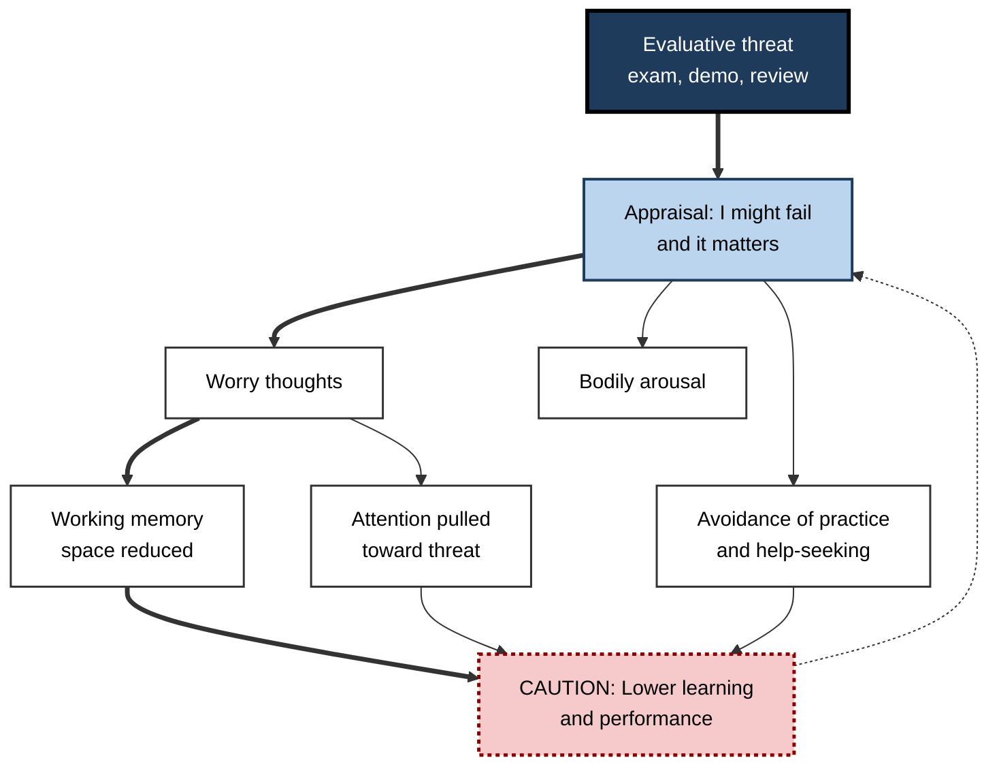
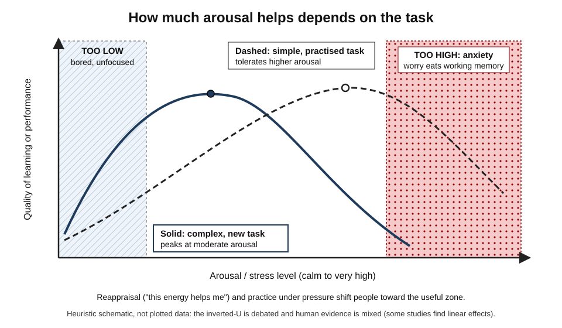
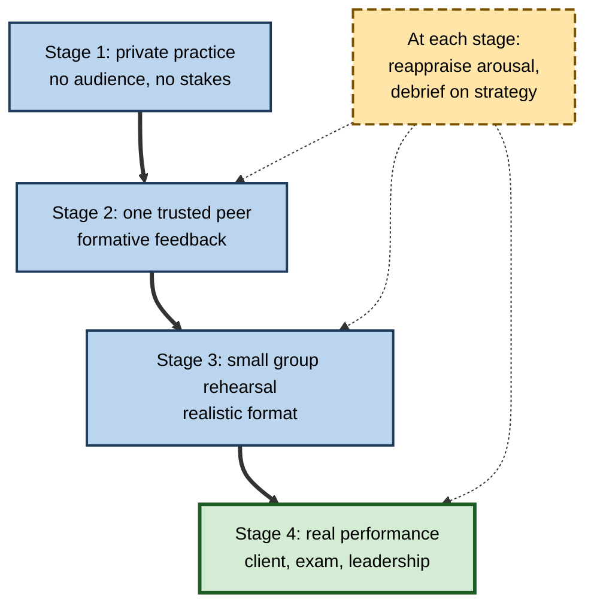

# L.6. Anxiety and Learning Performance

> **In one sentence:** Anxiety is the worried, tense feeling of possible failure or threat; a little activation can sharpen effort, but persistent worry eats up the mental workspace you need for learning and showing what you know.
>
> **Why it matters:** Certification exams, technical interviews, presentations, performance reviews and learning new tools in front of colleagues all trigger anxiety. Understanding the mechanism lets you protect your own performance and design learning environments where people can think clearly.
>
> **Level span:** Novice → Expert · **Reading time:** ~18 min · **Builds on:** working memory, emotion and memory encoding

---

## The Learning Ladder

| Level | Badge | After this level you can... |
|---|---|---|
| 1 | NOVICE | Recognise the signs of learning and test anxiety and explain why it hurts thinking. |
| 2 | FOUNDATIONS | Distinguish worry from bodily arousal and explain the working-memory account of anxiety. |
| 3 | PRACTITIONER | Use evidence-based techniques — reappraisal, expressive writing, practice testing — before and during high-stakes moments. |
| 4 | ADVANCED | Explain attentional control theory, choking under pressure, and the strength and limits of the intervention evidence. |
| 5 | EXPERT / PRO | Design assessments, onboarding and team practices that reduce harmful anxiety without removing healthy challenge. |

---

## Level 1 · Novice — The Big Picture

**Anxiety** is the feeling that something bad might happen and you might not cope. In learning, it often shows up as test anxiety ("I'll blank in the exam"), performance anxiety ("I'll freeze in the demo"), or social anxiety about learning ("everyone will see I don't know this").

Anxiety has two sides:

- **Body:** racing heart, sweaty palms, tight stomach.
- **Mind:** worried thoughts — "I'm going to fail", "they'll think I'm useless", "what if...".

An analogy: your working memory is like a small desk where you lay out the things you are thinking about right now. When you are anxious, worried thoughts pile onto that desk. There is less room left for the problem in front of you, so you make mistakes, lose your place, or "go blank" — even on things you know well.

You have already experienced this when:

- you knew an answer perfectly at home but could not recall it in the exam;
- you stumbled over a simple word while presenting to senior leaders;
- you avoided learning a new tool in front of colleagues because you feared looking slow.

The key idea for a beginner: **anxiety rarely means you don't know the material; it means worry is crowding out the space you need to use what you know.** That is fixable.

---

## Level 2 · Foundations — Core Concepts

### Worry versus emotionality

Since the 1960s, researchers have split test anxiety into two components:

- **Worry** — the *cognitive* part: negative thoughts about failure, consequences and self-worth.
- **Emotionality** — the *physical* part: perceived bodily arousal and tension.

Across studies, **worry** is the component more strongly linked to poor performance. Bodily arousal on its own is much less harmful — and, as later sections show, can even be reinterpreted as helpful.

### How large is the effect?

A major 30-year meta-analysis by Nathaniel von der Embse and colleagues (2018), covering 238 studies, found that higher test anxiety was consistently associated with lower performance, with correlations ranging from small to moderate depending on the type of test and measure. Correlations were consistently larger for worry than for emotionality. The relationship runs both ways: poor performance also feeds later anxiety, creating a loop.

### Trait, state and domain-specific anxiety

| Type | Meaning | Example |
|---|---|---|
| **Trait anxiety** | A general tendency to feel anxious across situations. | Someone who worries about most things. |
| **State anxiety** | Anxiety in the moment. | Heart pounding just before a certification exam. |
| **Test anxiety** | Anxiety specific to evaluation. | Fine in daily work, panics in exams. |
| **Domain anxiety** | Anxiety tied to a subject. | Maths anxiety, statistics anxiety, foreign-language anxiety, coding anxiety. |

**Figure L.6-1 — How anxiety disrupts learning and performance.**

*How to read it:* the thick path is the main mechanism — worry consumes working memory. The dotted arrow is the feedback loop: poor results feed the next appraisal.

### Key Terms

| Term | Plain meaning |
|---|---|
| **Anxiety** | Apprehension about possible future threat or failure. |
| **Test anxiety** | Anxiety specific to evaluative situations. |
| **Worry** | The cognitive component: negative, repetitive thoughts about failure. |
| **Emotionality** | The physiological component: perceived arousal and tension. |
| **Working memory** | The limited mental workspace used to hold and manipulate information. |
| **Choking under pressure** | Performing worse than your ability in high-pressure situations. |
| **Reappraisal** | Reinterpreting a situation or bodily response to change its emotional impact. |
| **Avoidance** | Escaping or delaying anxiety-provoking situations, which maintains anxiety over time. |

---

## Level 3 · Practitioner — Putting It to Work

### A before-during-after routine for high-stakes moments

**Weeks before**

1. **Practise retrieval under realistic conditions.** Timed practice tests, mock interviews, dry-run presentations. Familiarity with the format reduces uncertainty; retrieval practice also strengthens memory so it is more robust under stress.
2. **Spread practice out.** Last-minute cramming raises both anxiety and forgetting.

**Just before (minutes to an hour)**

3. **Expressive writing.** Spend about ten minutes writing openly about your worries regarding the upcoming test. In a well-known 2011 study by Gerardo Ramirez and Sian Beilock, this helped highly test-anxious students perform better on a high-stakes exam, likely by "offloading" worries from working memory. Later replications have been mixed, so treat it as a low-cost option to try, not a guarantee.
4. **Reappraise arousal.** Tell yourself: "This racing heart is my body preparing me to perform." This is **stress arousal reappraisal**.
5. **Slow breathing.** Several slow breaths with longer exhales can reduce physical arousal.

**During**

6. **Use a reset phrase and next action.** If you blank: pause, breathe, move to a question you can answer, come back.

**After**

7. **Review strategically, not catastrophically.** Analyse what went wrong as strategy and preparation, not as a verdict on your ability.

**Figure L.6-2 — Arousal, task type and the useful zone.**

*Figure L.6-2 — How much arousal helps depends on the task.* Solid curve: complex or new tasks peak at moderate arousal and fall quickly as anxiety rises. Dashed curve: simple, well-practised tasks tolerate higher arousal. The dotted zone on the right marks worry-dominated anxiety. The shape is a heuristic; the evidence for a precise inverted-U is debated.

### Worked example — a developer preparing for a system-design interview

| | Before | After |
|---|---|---|
| **Preparation** | Reads blog posts the night before. | Three weeks of spaced mock interviews with a peer, recorded and reviewed. |
| **Just before** | Scrolls social media, rehearses worst-case scenarios. | Ten minutes writing out worries; says "the adrenaline is fuel"; three slow breaths. |
| **During a blank** | Panics, apologises repeatedly. | "Let me think out loud — I'll start with requirements." Moves to known ground. |
| **Afterwards** | "I'm not smart enough for senior roles." | "I ran out of time on data partitioning; practise that next." |

### Common mistakes

- **Trying to suppress anxiety.** "Just calm down" rarely works and can increase worry. Reappraisal and acceptance generally outperform suppression.
- **Avoiding practice tests because they feel stressful.** Avoidance keeps anxiety high; graded exposure to realistic practice reduces it.
- **Over-preparing on content, under-preparing on format.** Many people "choke" on unfamiliar conditions, not unfamiliar material.
- **Making learning public too early.** Requiring novices to perform in front of peers before they are ready raises anxiety and reduces learning.

---

## Level 4 · Advanced — Mechanisms, Models & Evidence

### Attentional control theory

Michael Eysenck, Nazanin Derakshan and colleagues' **attentional control theory** (2007) refines the working-memory account. Anxiety:

- increases the influence of the **stimulus-driven** attention system (threats grab attention) relative to the **goal-directed** system;
- impairs **inhibition** (ignoring distractions) and **shifting** (switching attention flexibly);
- reduces **processing efficiency** (more effort and time for the same result) more than **performance effectiveness** (the quality of the final result).

That last point explains a common experience: anxious people can often perform adequately, but at a high cost in effort and fatigue. Under time pressure, or when the task is complex, the extra effort runs out and performance falls.

### Choking under pressure

Sian Beilock and colleagues identified two routes to choking:

- **Distraction** — worry consumes working memory, hurting tasks that depend on it (reasoning, mental arithmetic, complex problem solving).
- **Explicit monitoring** — pressure makes you consciously attend to well-learned, automatic skills (like a practised presentation opening or a typing pattern), disrupting them.

People with high working-memory capacity are sometimes *more* vulnerable to choking on demanding tasks, because they rely on that capacity which pressure takes away.

### The arousal–performance curve, honestly

The **Yerkes–Dodson law** — performance rises with arousal up to a point, then falls, and the peak is lower for difficult tasks — is a useful heuristic but a shaky law. The original 1908 study tested how fast mice learned a discrimination under electric shocks of different strengths; it did not measure arousal or human performance. A 2024 review revisited the curve, noting that human evidence is mixed: some studies show inverted-U patterns, others linear ones. Use the shape as a reminder that *task complexity and interpretation matter*, not as a precise prediction.

### Intervention evidence

| Intervention | What it involves | Evidence summary |
|---|---|---|
| **Stress arousal reappraisal / stress-is-enhancing mindset** | Teaching that stress responses can aid performance. | A 2024 meta-analysis of randomised trials found a small overall improvement in task performance; combined interventions showed larger effects, and effects tended to be larger for public performance tasks than written cognitive tasks. |
| **Cognitive-behavioural approaches** | Challenging catastrophic thoughts, exposure, skills training. | Meta-analyses of interventions for test-anxious students show reliable reductions in anxiety; effects on grades are smaller and less consistent. |
| **Mindfulness-based programmes** | Attention and acceptance training. | A 2024 meta-analysis found reductions in test anxiety in school-based programmes. |
| **Expressive writing** | Writing about worries before a test. | Promising original findings; replications mixed. |
| **Study-skills training** | Better preparation strategies. | Helps most when anxiety stems from genuinely weak preparation. |
| **Frequent low-stakes testing** | Regular quizzes with little at stake. | Improves learning; students often report reduced test anxiety, though the anxiety evidence is mainly survey-based. |

A key nuance: **anxiety from poor preparation** and **anxiety despite good preparation** need different treatment. The first needs better study methods; the second needs emotion-focused techniques.

### Reciprocal effects

Longitudinal studies, including work by Reinhard Pekrun and colleagues, show that anxiety predicts later lower achievement *and* lower achievement predicts later anxiety. Breaking the loop requires both building competence and changing appraisals.

---

## Level 5 · Expert / Pro — Professional Mastery

### Designing lower-anxiety, high-standard learning

| Design lever | High-anxiety version | Lower-anxiety, still rigorous version |
|---|---|---|
| **Assessment** | Single high-stakes exam. | Multiple low-stakes checks plus a final; retake options. |
| **Visibility** | Novices perform in front of the whole team. | Private practice first, then small-group, then public. |
| **Feedback** | Evaluative, delayed, comparative. | Formative, frequent, criterion-based. |
| **Format familiarity** | Surprise formats. | Published formats, practice papers, mock sessions. |
| **Psychological safety** | Mistakes punished. | Mistakes during learning treated as data. |
| **Time pressure** | Tight limits by default. | Time limits only where speed is truly part of the skill. |

**Figure L.6-3 — Graduated exposure path for a high-stakes skill.**

*How to read it:* move down only when the current stage feels manageable; the long-dash box lists habits applied at every stage.

### Professional scenario

**Role:** L&D manager responsible for a professional certification required for client-facing consultants.
**Situation:** First-time pass rates were low, and many consultants with strong client feedback failed. Exit comments mentioned "freezing" and "panic".
**What the pro does:** Analyses results and finds that failures cluster among people who scored well on practice content but had never sat a timed, proctored mock. Introduces three spaced full-format mocks, a short module on stress reappraisal and a pre-exam worry-writing option, and changes communication from "failure will be noted by your practice lead" to "most people pass within two attempts; here's how to prepare". Separates exam results from performance ratings. First-time pass rates improve, and fewer people defer the exam.

### AI-era and workplace considerations

- **AI anxiety** — fear of being replaced or of looking incompetent with new tools — is a form of learning anxiety in 2025–2026 workplaces. Private sandboxes, clear statements about role changes, and peer demonstrations reduce it.
- **AI as a crutch for anxiety.** Anxious learners may lean on AI to avoid the discomfort of struggle; this can reduce anxiety short-term while preventing competence from growing. Hint-first AI support is a better compromise.
- **Remote evaluation.** Proctoring software and on-camera assessment add new evaluative threats; explain them clearly and offer practice runs.

### Ethical and clinical limits

Learning-related anxiety exists on a spectrum. When anxiety is severe, persistent and impairing, it may be an anxiety disorder that needs professional support. Managers and trainers should point people to appropriate resources rather than attempt therapy.

---

## Myths vs. Evidence

| Myth | What the evidence shows |
|---|---|
| "Anxious learners just don't know the material." | Worry consumes working memory, so knowledgeable people underperform; anxiety and knowledge are separable. |
| "Some stress is always good — the Yerkes–Dodson law proves it." | The original study was on mice; human evidence for a precise inverted-U is mixed. Task complexity and interpretation matter. |
| "The best advice is to calm down." | Suppression often backfires; reappraising arousal as helpful shows small but reliable benefits. |
| "Avoiding practice tests reduces anxiety." | Avoidance maintains anxiety; graded, low-stakes practice reduces it and improves learning. |
| "High-ability people don't choke." | People relying on high working-memory capacity can be especially vulnerable under pressure. |
| "Reducing anxiety will automatically raise scores." | Anxiety interventions reliably reduce anxiety; effects on scores are smaller and depend on preparation. |

## Practitioner Toolkit

**Personal high-stakes checklist**

- [ ] I practised in the real format at least three times, spaced out.
- [ ] I know what to do if I blank (pause, breathe, move on, return).
- [ ] I have a reappraisal phrase ready: "This energy helps me perform."
- [ ] I tried ten minutes of worry-writing before at least one mock.
- [ ] I slept properly the night before rather than cramming.
- [ ] After the event, I reviewed strategy, not self-worth.

**Designer checklist**

- [ ] Multiple low-stakes checks precede any high-stakes one.
- [ ] Formats are published and practised.
- [ ] Novices practise privately before performing publicly.
- [ ] Learning results are separated from performance ratings where possible.
- [ ] Communication about stakes is accurate and calm.

## Self-Check

1. **[NOVICE]** Using the desk analogy, explain why anxiety makes people "go blank".
2. **[NOVICE]** Name one body sign and one mind sign of anxiety.
3. **[FOUNDATIONS]** Which component of test anxiety is more strongly related to poor performance?
4. **[FOUNDATIONS]** What is the difference between state and trait anxiety?
5. **[PRACTITIONER]** Describe two techniques to use in the hour before an exam.
6. **[ADVANCED]** According to attentional control theory, what does anxiety impair more: efficiency or effectiveness? Why does that matter?
7. **[ADVANCED]** What are the two routes to choking under pressure?
8. **[ADVANCED]** Why should the Yerkes–Dodson curve be treated cautiously?
9. **[EXPERT / PRO]** How would you redesign a single high-stakes certification to reduce harmful anxiety?

### Answer Key

1. Worry thoughts take up space on the small "desk" of working memory, leaving less for retrieving and using knowledge.
2. Body: racing heart, sweaty palms. Mind: thoughts like "I'll fail".
3. Worry (the cognitive component).
4. State anxiety is momentary; trait anxiety is a general tendency across situations.
5. Any two: expressive writing about worries, reappraising arousal as helpful, slow breathing, reviewing a familiar warm-up problem.
6. Efficiency more than effectiveness — anxious people can perform adequately with extra effort, but under time pressure or complexity performance drops and fatigue rises.
7. Distraction (worry consumes working memory) and explicit monitoring (conscious attention disrupts automatic skills).
8. The original study used mice and shocks, did not measure arousal, and human evidence is mixed; it is a heuristic, not a precise law.
9. Add spaced low-stakes mocks in the real format, publish formats, allow retakes, separate results from ratings, teach reappraisal, and communicate stakes calmly and accurately.

## Key Takeaways

- Anxiety hurts mainly through **worry consuming working memory**, not lack of knowledge.
- **Worry** is more harmful than bodily arousal; arousal can be **reappraised** as fuel.
- Anxiety reduces **efficiency** first; complexity and time pressure expose it.
- The **inverted-U** is a helpful heuristic, not a precise law.
- **Realistic, spaced, low-stakes practice** reduces anxiety and builds robust memory.
- Interventions reliably reduce anxiety; effects on scores are **smaller** and depend on preparation.
- Design for **graduated exposure** and psychological safety while keeping standards high.

## Glossary

| Term | Meaning |
|---|---|
| Attentional control theory | Theory that anxiety shifts attention toward threat and impairs inhibition and shifting, reducing processing efficiency. |
| Avoidance | Escaping anxiety-provoking situations, which maintains anxiety. |
| Choking under pressure | Performing below ability in high-pressure situations. |
| Emotionality | Physiological component of test anxiety. |
| Explicit monitoring | Conscious attention to automatic skills that disrupts them under pressure. |
| Expressive writing | Writing openly about worries to reduce their hold on working memory. |
| Processing efficiency | Performance quality relative to effort expended. |
| Reappraisal | Reinterpreting a situation or response to change its emotional impact. |
| State anxiety | Momentary anxiety. |
| Test anxiety | Anxiety specific to evaluation. |
| Trait anxiety | General tendency to experience anxiety. |
| Worry | Cognitive component of anxiety: repetitive negative thoughts. |
| Yerkes–Dodson law | Proposed inverted-U relation between arousal and performance, moderated by task difficulty. |
