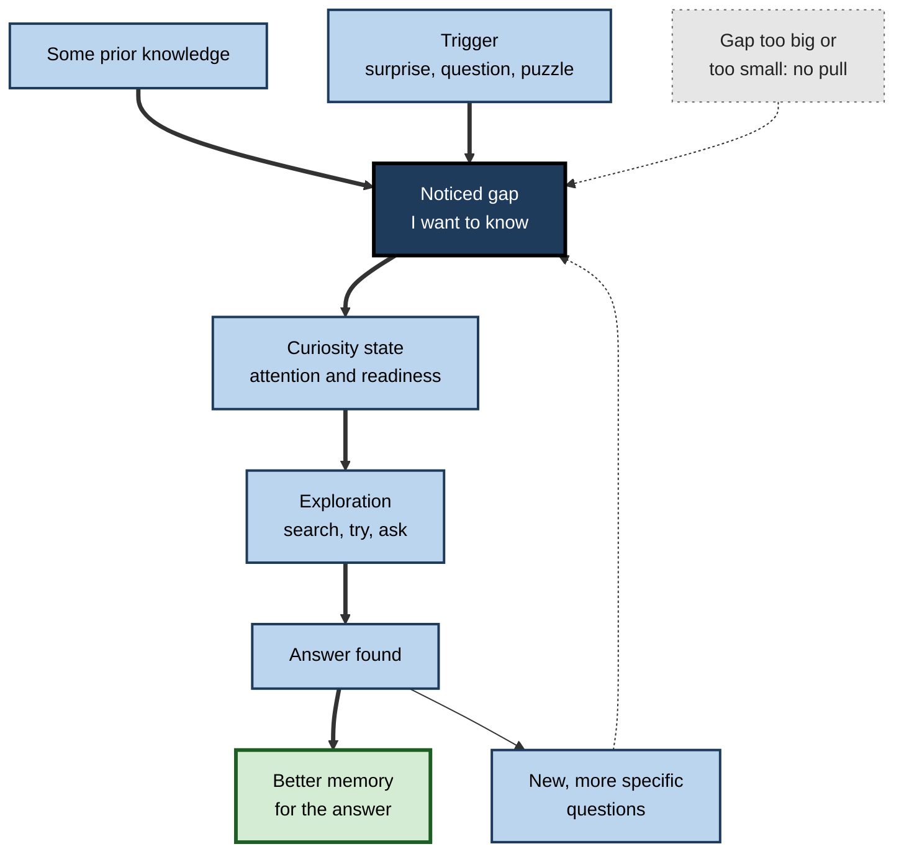
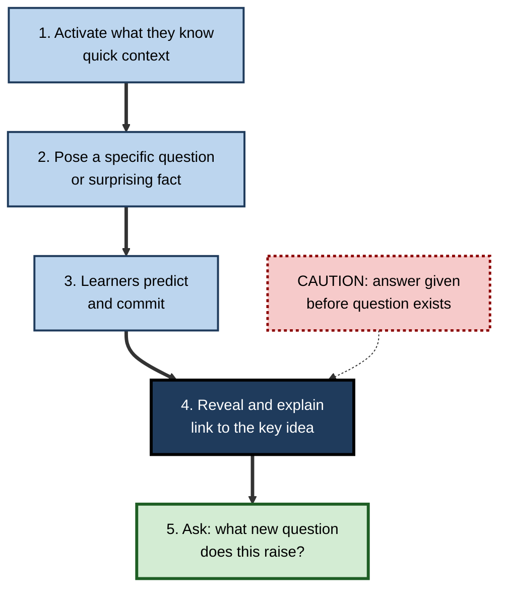
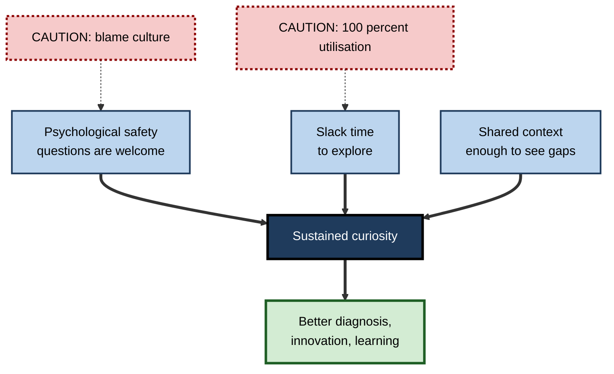

# L.7. Curiosity as a Learning Driver

> **In one sentence:** Curiosity is the itch to know something you realise you don't yet know, and when that itch is switched on, your brain gets ready to learn and remember the answer better.
>
> **Why it matters:** Curiosity is one of the few motivations that is both free and self-renewing. Teachers, leaders and product designers who can spark it get deeper attention and better memory without bribes or threats — and professionals who cultivate it keep learning for a whole career.
>
> **Level span:** Novice → Expert · **Reading time:** ~17 min · **Builds on:** intrinsic motivation, emotion and memory encoding

---

## The Learning Ladder

| Level | Badge | After this level you can... |
|---|---|---|
| 1 | NOVICE | Describe what curiosity feels like and why it helps learning. |
| 2 | FOUNDATIONS | Use the information-gap idea and distinguish state from trait curiosity and its main types. |
| 3 | PRACTITIONER | Spark curiosity deliberately with questions, predictions and puzzles before giving answers. |
| 4 | ADVANCED | Explain the dopamine–hippocampus mechanism, the PACE framework, and what 2024–2026 studies showed about its limits. |
| 5 | EXPERT / PRO | Build curiosity-driven onboarding, team practices and AI tools — and avoid clickbait and answer-dumping. |

---

## Level 1 · Novice — The Big Picture

You are reading a mystery novel and the chapter ends with "...and then she opened the door and saw who was standing there." You turn the page without thinking. That pull is **curiosity**: the desire to close a gap between what you know and what you want to know.

Curiosity feels like an itch. If you have no idea about a topic at all, there is nothing to itch. If you already know everything, there is no itch either. The strongest itch comes when you know *a bit* and realise there is something missing.

A helpful analogy is a jigsaw puzzle nearly finished with one piece missing. You notice the gap precisely because the rest is there, and finding the last piece feels great. A box of loose pieces with no picture hardly pulls at all.

You have already experienced this when:

- you fell down a rabbit hole of articles about a topic you knew a little about;
- you remembered an answer to a quiz question for years because you really wanted to know it;
- a manager opened a meeting with a surprising number and everyone leaned in to hear the explanation.

The key idea for a beginner: **curiosity is the feeling of a noticed gap — and when it is on, your brain is primed to learn.**

---

## Level 2 · Foundations — Core Concepts

### The information-gap theory

George Loewenstein's **information-gap theory** (1994) describes curiosity as a reaction to a noticed gap between what you know and what you want to know. Three practical implications follow:

1. You need **some** prior knowledge to notice a gap.
2. Making the gap **specific and salient** increases curiosity.
3. Curiosity is **strongest when people feel close to the answer** — they know a bit, but not all.

Experiments with trivia questions, notably by Min Jeong Kang, Colin Camerer and colleagues (2009), found that curiosity was highest for questions people were moderately confident about — an inverted-U against confidence — and that higher curiosity predicted better memory for the answers.

### Types of curiosity

| Type | Meaning | Example |
|---|---|---|
| **Epistemic curiosity** | Desire for knowledge and understanding. | "Why does this query run so slowly?" |
| **Perceptual curiosity** | Drawn to novel sights, sounds or sensations. | Looking at a strange new device on someone's desk. |
| **Specific curiosity** | Seeking one particular piece of information. | Searching for the exact error-message cause. |
| **Diversive curiosity** | Seeking novelty or stimulation to escape boredom. | Scrolling through random articles. |
| **Interest-type curiosity** | Pleasant anticipation of discovery. | Exploring a new field for joy. |
| **Deprivation-type curiosity** | Uncomfortable need to resolve a gap. | Not being able to sleep until you fix the bug. |

Researchers also distinguish **state curiosity** (curiosity in the moment, which you can trigger) from **trait curiosity** (a general tendency to be curious, which varies between people).

**Figure L.7-1 — The curiosity cycle.**

*How to read it:* the thick path runs from a noticed gap to better memory; the dotted feedback loop shows how answers raise new questions, which is why knowledge and curiosity tend to grow together.

### Key Terms

| Term | Plain meaning |
|---|---|
| **Curiosity** | A desire for information, triggered by a noticed gap in knowledge. |
| **Information gap** | The difference between what you know and what you want to know. |
| **State curiosity** | Curiosity felt at a particular moment. |
| **Trait curiosity** | A person's general tendency to be curious. |
| **Epistemic curiosity** | Curiosity about knowledge and ideas. |
| **Diversive curiosity** | Seeking novelty to relieve boredom, without a specific target. |
| **Prediction error** | The difference between what you expected and what happened — a powerful curiosity trigger. |

---

## Level 3 · Practitioner — Putting It to Work

### Five techniques to spark curiosity

1. **Question before answer.** Pose the question, give people time to wonder, *then* explain. Answers delivered before the question exists have no gap to fill.
2. **Predict, then reveal.** Ask learners to commit to a guess ("Which of these two pages loads faster?"). Being wrong creates a prediction error that boosts attention to the explanation.
3. **Show the surprising fact.** Lead with a result that contradicts common belief.
4. **Make the gap specific.** "There's one setting that causes 80 percent of our deployment failures — what is it?" beats "Let's learn about deployment."
5. **Give just enough background.** Novices need a little context to notice gaps; experts need puzzles at the edge of their knowledge.

**Figure L.7-2 — Designing a curiosity-first learning moment.**

*How to read it:* the thick path is the curiosity-first sequence; the dotted box shows the common shortcut that skips the gap.

### Worked example — a finance onboarding session

| | Before | After |
|---|---|---|
| **Opening** | "Today we'll cover the month-end close process." | "Last year our close took 11 days; one competitor's takes 3. Where do you think our 8 extra days go?" |
| **Engagement** | Slides in order. | Small groups predict the three biggest time sinks, then see the real data. |
| **Explanation** | Process map shown upfront. | Process map revealed step by step as each prediction is checked. |
| **Close** | "Any questions?" (silence). | "What's one thing in this process you now want to investigate?" |
| **Memory a week later** | Vague recall of slides. | New hires recall the time sinks and the reasons. |

### Common mistakes

- **Clickbait gaps.** Teasers that promise more than the content delivers erode trust and curiosity.
- **Gaps too big.** Open questions with no foothold produce confusion or disengagement, not curiosity.
- **Answer-dumping.** Search engines and AI assistants make it easy to close gaps instantly. If the answer arrives before the question has been felt, curiosity never fires.
- **Punishing questions.** Cultures where questions signal ignorance shut down curiosity.

---

## Level 4 · Advanced — Mechanisms, Models & Evidence

### The reward-learning link

Curiosity behaves much like the anticipation of a reward. In a landmark 2014 study, Matthias Gruber, Bernard Gelman and Charan Ranganath showed participants trivia questions, measured how curious they were, then presented the answers along with unrelated faces. When curiosity was high:

- memory for the answers improved;
- memory for the unrelated faces shown during the curious state also improved;
- brain imaging showed increased activity in the **dopaminergic midbrain** and the **hippocampus**, and stronger connectivity between them, during anticipation.

Gruber and Ranganath's **PACE framework** (Prediction, Appraisal, Curiosity, Exploration; 2019) summarises the mechanism: a prediction error or knowledge gap is appraised as worth resolving; this triggers curiosity and recruits the dopaminergic circuit, which promotes exploration and enhances hippocampus-dependent encoding and consolidation.

### What the meta-analysis says

A meta-analysis of state curiosity and memory, integrating 47 studies and published in 2026, found a **moderate effect of high curiosity on recall of the target information** and a **small effect on recall of incidental information** encountered during curious states. The effects were not moderated by recall delay, curiosity type, age group or exposure duration.

### A key limit: the "halo" may not cover complex material

A 2024 study by Nicole Keller, Matthias Gruber, Joseph Dunsmoor and colleagues tested whether the curiosity "halo" extends to *unrelated scholastic facts* — closer to real study material than faces. It did not: high-curiosity states **interfered** with memory for complex, unrelated facts presented close in time. The likely explanation is competition for attention: a gripping question pulls focus to its own answer. The practical lesson is to **attach curiosity directly to the content you want learned**, not to rely on a general glow.

### Curiosity, knowledge and metacognition

Curiosity depends on metacognition — the ability to sense what you know and don't know. People are most curious when they feel they are close to an answer, which helps explain why curiosity and knowledge tend to grow together: more knowledge reveals more specific gaps. This also explains why complete novices often seem incurious about a field: they cannot yet see the gaps.

### Trait curiosity and achievement

Meta-analytic work by Sophie von Stumm and colleagues described intellectual curiosity as a "third pillar" of academic performance alongside intelligence and conscientiousness, with a modest positive link to achievement. Trait measures are self-reports, so the size of the link should be read as moderate and correlational.

### Curiosity in AI-era learning

Generative AI is both an amplifier and a threat. It can answer follow-up questions instantly, supporting exploration. But by closing gaps immediately, it can short-circuit the anticipation phase that research links to dopamine-driven memory benefits. Recent work on "struggle first, prompt later" designs — attempting or predicting before consulting AI — fits the curiosity evidence well.

---

## Level 5 · Expert / Pro — Professional Mastery

### Building curiosity into organisations

| Practice | How it works |
|---|---|
| **Question-led onboarding** | New hires receive a list of real open questions about the business to investigate, rather than a binder of answers. |
| **Prediction logs** | Before reviewing data, analysts write down predictions; misses become learning prompts. |
| **Blameless "why" sessions** | Incident and project reviews ask "what surprised us?" before "what went wrong?". |
| **Curiosity time** | Protected time for exploring adjacent skills or technologies. |
| **Leader modelling** | Leaders ask genuine questions publicly and admit what they don't know. |
| **AI with a pause** | Internal AI tutors prompt users to guess or reason before showing answers. |

**Figure L.7-3 — Organisational conditions that sustain curiosity.**

*How to read it:* three conditions feed curiosity on thick arrows; dotted arrows show common killers of each condition.

### Professional scenario

**Role:** Product manager onboarding to a new analytics product.
**Situation:** The team handed her a 60-page product wiki. She skimmed it and retained little.
**What the pro does:** Writes ten specific questions she wants answered ("Why do 40 percent of trials never import data?"), predicts an answer to each, then investigates by interviewing engineers, watching session recordings and querying the data. Uses an AI assistant only after forming her own hypothesis, asking it to challenge her reasoning. Records where she was wrong. After three weeks she understands the product more deeply than colleagues who read the wiki twice, and her "prediction misses" list becomes the team's onboarding guide.

### Ethical limits

Curiosity triggers are powerful attention tools. Media and apps exploit them through clickbait and cliffhangers that serve engagement metrics, not the user. Ethical design keeps curiosity triggers honest — the payoff must be real and relevant to what the learner needs.

---

## Myths vs. Evidence

| Myth | What the evidence shows |
|---|---|
| "Curiosity is a fixed trait — you have it or you don't." | State curiosity can be reliably triggered by questions, surprise and prediction. |
| "Total novices are naturally the most curious." | Curiosity needs enough knowledge to notice specific gaps; it often rises with expertise. |
| "Once people are curious, they'll remember everything nearby." | The incidental boost is small; a 2024 study found curiosity interfered with memory for complex unrelated facts. |
| "Instant answers feed curiosity." | Answers before a felt question can short-circuit anticipation, the phase linked to memory benefits. |
| "Curiosity is a soft skill without hard evidence." | Experimental, neuroimaging and meta-analytic evidence link curiosity states to better memory. |

## Practitioner Toolkit

**Curiosity design checklist**

- [ ] The session opens with a specific question, puzzle or surprising fact.
- [ ] Learners have enough background to notice the gap.
- [ ] Learners predict or guess before the reveal.
- [ ] The curiosity trigger is tied directly to the key content.
- [ ] Time is allowed for wondering before answers.
- [ ] The session ends by asking what new questions arose.
- [ ] Any AI help comes after the learner has formed a hypothesis.

**Personal curiosity routine (weekly, 20 minutes)**

1. List three things at work that surprised or puzzled you this week.
2. For each, write a guess at the explanation.
3. Investigate one; record whether your guess was right.
4. Note one new question it raised.

## Self-Check

1. **[NOVICE]** Why does the nearly-finished jigsaw pull you more than a box of loose pieces?
2. **[NOVICE]** Give an example of curiosity improving your memory.
3. **[FOUNDATIONS]** What three implications follow from the information-gap theory?
4. **[FOUNDATIONS]** Distinguish specific and diversive curiosity.
5. **[PRACTITIONER]** Turn "Today we'll learn about caching" into a curiosity-first opening.
6. **[ADVANCED]** What did the 2014 trivia study show about the brain and memory during curiosity?
7. **[ADVANCED]** What limit did the 2024 study on scholastic facts reveal?
8. **[ADVANCED]** What did the 2026 meta-analysis find for target versus incidental information?
9. **[EXPERT / PRO]** How should an AI tutor be designed to support rather than short-circuit curiosity?

### Answer Key

1. You can see exactly which piece is missing; a specific, noticed gap creates the strongest pull.
2. Answers vary — for example, remembering a fact you looked up because you desperately wanted to know.
3. Some prior knowledge is needed; specific, salient gaps increase curiosity; curiosity peaks when people feel close to the answer.
4. Specific curiosity seeks a particular piece of information; diversive curiosity seeks novelty or stimulation in general.
5. For example: "Our homepage loads in 4 seconds, but one change could make it 0.5. What do you think it is?" — then have people predict before explaining.
6. High curiosity improved memory for answers and for incidental faces, with increased midbrain dopaminergic and hippocampal activity and connectivity during anticipation.
7. High curiosity interfered with memory for complex, unrelated scholastic facts presented nearby, suggesting the "halo" does not extend reliably to complex material.
8. A moderate effect on recall of target information and a small effect on incidental information.
9. Prompt learners to predict or attempt first, give hints before answers, and end by surfacing new questions.

## Key Takeaways

- Curiosity is the drive to close a **noticed information gap**.
- It peaks when people know **some but not all** — prior knowledge matters.
- Curiosity states engage **dopamine and hippocampal** systems and improve memory for the answers.
- The benefit for **incidental** material is small and may not cover complex unrelated content.
- Spark curiosity with **questions, predictions and surprises** before answers.
- **Attach curiosity to the key content**, not to distractions.
- AI and search can **short-circuit curiosity** if they answer before the question is felt.

## Glossary

| Term | Meaning |
|---|---|
| Curiosity | A desire for information triggered by a noticed knowledge gap. |
| Deprivation-type curiosity | Uncomfortable drive to resolve a gap. |
| Diversive curiosity | Novelty-seeking to relieve boredom. |
| Dopaminergic midbrain | Brain regions producing dopamine, involved in reward and anticipation. |
| Epistemic curiosity | Curiosity about knowledge and ideas. |
| Information-gap theory | Loewenstein's account of curiosity as a response to noticed gaps. |
| Interest-type curiosity | Pleasant anticipation of discovery. |
| PACE framework | Prediction, Appraisal, Curiosity, Exploration model of curiosity-enhanced memory. |
| Perceptual curiosity | Interest in novel sensory stimuli. |
| Prediction error | Difference between expectation and outcome. |
| Specific curiosity | Seeking a particular piece of information. |
| State curiosity | Curiosity in the moment. |
| Trait curiosity | General disposition to be curious. |
