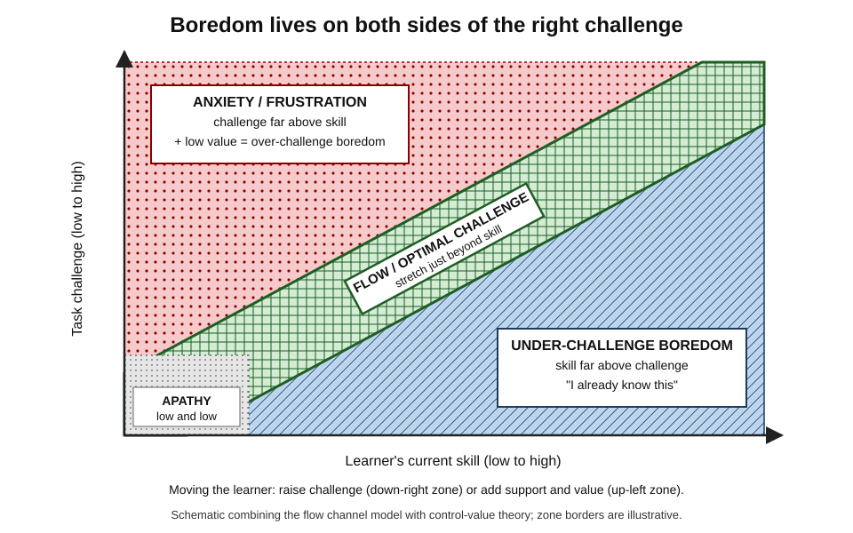
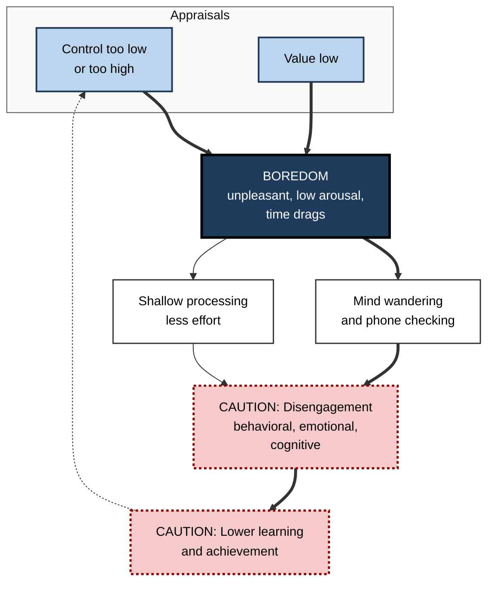
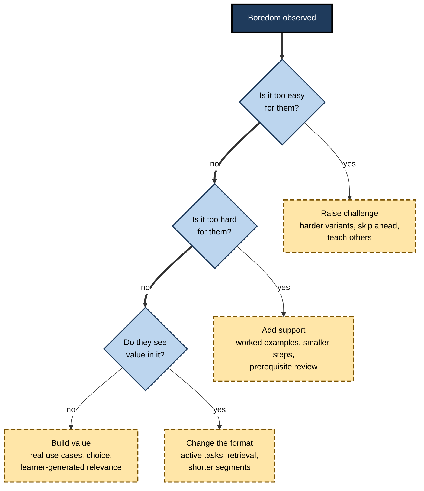

# L.8. Boredom and Disengagement

> **In one sentence:** Boredom is the restless, flat feeling of wanting to be engaged but not being able to, usually because a task feels pointless or pitched at the wrong level — and if it lasts, people mentally check out.
>
> **Why it matters:** Boredom is one of the most common emotions in classrooms, compliance training and routine work, and it reliably predicts lower learning. It is also a useful signal: it tells you exactly which dial — challenge, value or control — needs adjusting.
>
> **Level span:** Novice → Expert · **Reading time:** ~17 min · **Builds on:** attention, expectancy and value, intrinsic motivation

---

## The Learning Ladder

| Level | Badge | After this level you can... |
|---|---|---|
| 1 | NOVICE | Recognise boredom and disengagement in yourself and others and say why they matter. |
| 2 | FOUNDATIONS | Explain boredom with the control-value theory and tell under-challenge from over-challenge boredom. |
| 3 | PRACTITIONER | Diagnose the cause of boredom in a session or task and apply a matching fix. |
| 4 | ADVANCED | Summarise the evidence linking boredom to achievement, the types of boredom, and contested claims about its benefits. |
| 5 | EXPERT / PRO | Design engagement into courses, meetings and work, and measure disengagement credibly. |

---

## Level 1 · Novice — The Big Picture

You are in a two-hour mandatory training. The presenter reads slides you could read yourself. You check your phone, then your watch, then your phone again. Time seems to crawl. That is **boredom** — an unpleasant feeling of low engagement, often with restlessness and a sense that time is dragging.

Boredom is not the same as relaxing. When you relax, you don't want stimulation. When you are bored, you *do* want to be engaged — your mind is searching for something to latch onto and finding nothing.

An analogy: boredom is like a car engine revving while stuck in neutral. Energy is there, but it is not connected to the wheels. The fix is not to switch off the engine; it is to find the right gear.

You have already experienced this when:

- a course covered things you already knew (too easy);
- a lecture was so far above your level that you gave up following (too hard);
- you had to learn something you saw no reason for (no value).

**Disengagement** is what happens when boredom persists: people stop investing attention and effort, do the minimum, or leave mentally while staying physically present.

The key idea for a beginner: **boredom is a signal that the task is wrong for you right now — too easy, too hard, or pointless — not a sign that you are lazy.**

---

## Level 2 · Foundations — Core Concepts

### Control-value theory of boredom

Reinhard Pekrun's **control-value theory** explains achievement emotions through two kinds of judgement, called **appraisals**:

- **Control** — how much you feel able to influence the activity and its outcome (closely linked to whether challenge matches skill).
- **Value** — how much the activity or its outcome matters to you.

Boredom arises when **value is low**, and when **control is either very low or very high** — that is, when the task is far too hard or far too easy. Enjoyment, in contrast, arises when control is moderate-to-high and value is positive.

*Figure L.8-1 — Challenge, skill and the emotions of learning.* Skill runs left to right, challenge bottom to top. The cross-hatched diagonal band with a thick border is the zone of optimal challenge. The diagonally hatched lower-right zone is under-challenge boredom; the dotted upper-left zone is anxiety and frustration, which turns into over-challenge boredom when value is also low.

### Under-challenge and over-challenge boredom

| Type | What happens | Typical thought |
|---|---|---|
| **Under-challenge boredom** | Skill far exceeds demand. | "I know this already." |
| **Over-challenge boredom** | Demand far exceeds skill and the learner gives up. | "I can't follow this, so why bother?" |
| **Low-value boredom** | The task seems meaningless at any level. | "What's the point of this?" |

Over-challenge boredom surprises many people: they assume boredom only comes from easy tasks. In fact, struggling learners who disengage often describe themselves as bored rather than anxious.

**Figure L.8-2 — From boredom to disengagement.**

*How to read it:* appraisals of control and value produce boredom, which leads through mind wandering and shallow processing to disengagement. The dotted arrow shows the loop: lower achievement lowers future control.

### Key Terms

| Term | Plain meaning |
|---|---|
| **Boredom** | An unpleasant state of wanting but failing to engage attention in a satisfying activity. |
| **Control appraisal** | A judgement of how much you can influence an activity and its outcome. |
| **Value appraisal** | A judgement of how much an activity or outcome matters. |
| **Achievement emotions** | Emotions tied to achievement activities or their outcomes — enjoyment, boredom, anxiety, pride, shame, hopelessness. |
| **Engagement** | Active involvement, with behavioral, emotional and cognitive components. |
| **Disengagement** | Withdrawal of effort, interest and attention. |
| **Mind wandering** | Attention drifting from the task to unrelated thoughts. |

---

## Level 3 · Practitioner — Putting It to Work

### Diagnose, then fix

When you notice boredom — in a learner, a meeting or yourself — ask three questions in order.

**Figure L.8-3 — Boredom diagnostic and fixes.**

*How to read it:* check challenge first (too easy, too hard), then value; if all are fine, the delivery format is the likely culprit.

### Practical fixes for designers and presenters

1. **Pre-assess and allow skipping.** A short diagnostic lets experienced learners test out of content they already know.
2. **Interleave retrieval.** Short questions every few minutes in a video or lecture reduce mind wandering and improve learning; studies of online lectures found interpolated tests reduced mind wandering and note-free drift.
3. **Chunk and vary.** Break long passive segments into shorter ones separated by an active task.
4. **Offer choice.** Learners choose examples, datasets or projects, which raises both control and value.
5. **Connect to real work.** Have learners apply each idea to a task from their own job.

### Personal strategies when you are bored

- **Reframe value.** Write one sentence on how this could matter to you, even indirectly.
- **Set a micro-challenge.** "Can I explain this to a colleague in two minutes?" or "Can I predict the next slide?"
- **Seek the edge.** If too easy, look for advanced variations or edge cases.
- **Ask for help early** if too hard, before boredom turns into giving up.

### Worked example — a mandatory information-security e-learning

| | Before | After |
|---|---|---|
| **Structure** | 45-minute linear video, same for all staff. | Five-minute diagnostic; staff who pass skip to a short advanced scenario. |
| **Format** | Narrated slides. | Short scenarios with a decision every two minutes. |
| **Value** | "Required by policy." | Real phishing emails received by the company last quarter. |
| **Observed behavior** | Muted tabs; median "time on page" equal to video length with poor quiz scores. | Shorter total time for experts; better scenario performance; fewer complaints. |

### Common mistakes

- **Adding entertainment instead of fixing fit.** Jokes and animations cannot fix a task that is too easy, too hard or pointless.
- **One pace for all.** Mixed-experience groups guarantee both under- and over-challenge boredom.
- **Measuring engagement by clicks or seat time.** People can be present and completely disengaged.

---

## Level 4 · Advanced — Mechanisms, Models & Evidence

### What boredom does to learning

Boredom reduces attention, encourages mind wandering, lowers effort and leads to superficial processing. Meta-analytic evidence is consistent: a 2021 meta-analysis of activity-related achievement emotions found that boredom was negatively related to academic performance, at roughly the same magnitude that enjoyment was positively related. Subject-specific meta-analyses in mathematics and foreign-language learning (2024–2025) and a 2026 three-level meta-analysis of boredom and achievement confirm a reliable negative relationship. Longitudinal studies show **reciprocal effects**: boredom predicts lower later achievement, and low achievement predicts more later boredom.

### Boredom as attention failure

An influential definition by John Eastwood and colleagues (2012) describes boredom as "the unengaged mind" — the aversive experience of *wanting* but being *unable* to engage in satisfying activity, linked to failures of attention. This explains why boredom feels effortful, and why people under-stimulated by a task reach for any stimulation available — usually a phone.

### Types of boredom

Thomas Goetz and colleagues identified several boredom profiles — from relatively calm "indifferent" boredom to restless "searching" boredom and agitated "reactive" boredom — and later an "apathetic" type resembling learned helplessness. The apathetic type is especially concerning in education because it is linked to low motivation and depressive feelings.

### Test boredom

Boredom is usually studied during class or study, but research published in 2023 found that students also experience boredom *during tests*, especially when items feel too easy, too hard or irrelevant, and that this test boredom relates to lower performance.

### Is boredom ever good?

Boredom has an evolutionary **signal function**: it pushes people to change course toward more valuable activities. Some studies have found that brief boring tasks can increase creative idea generation afterwards, but these findings are small-sample and inconsistently replicated, so **"boredom boosts creativity" should be treated as contested.** What is clear is that boredom is informative: it tells you something about fit and value.

### Boredom and disengagement in the workplace

Workplace disengagement is widespread. Gallup's 2025 global workplace report estimated that only about one in five employees worldwide were engaged at work, with large costs attributed to disengagement. Boredom at work ("boreout") from under-challenge, as well as over-challenge without support, are both recognised contributors. Mandatory, one-size-fits-all e-learning is one of the most common sources of workplace learning boredom.

### Adaptivity and AI

Adaptive learning systems and AI tutors can, in principle, keep learners nearer optimal challenge by adjusting difficulty and pacing. Evidence for adaptive systems is generally positive for learning, but AI can also enable a new form of disengagement: delegating the task entirely. Engagement that consists of copying AI output is behavioral engagement without cognitive engagement.

---

## Level 5 · Expert / Pro — Professional Mastery

### Designing for engagement at scale

| Lever | Practice |
|---|---|
| **Fit** | Diagnostic pre-tests, adaptive paths, test-out options. |
| **Value** | Content built from real company cases; learner-generated relevance; clear link to role. |
| **Control** | Choice of path and pace; clear, achievable milestones. |
| **Activity** | Decision points, retrieval, discussion, practice on real tasks every few minutes. |
| **Social** | Cohort-based elements, peer review, discussion — they raise both value and accountability. |
| **Measurement** | Combine self-report pulses with behavioral signals and performance outcomes. |

### Measuring disengagement credibly

Completion rates and seat time are weak signals. Better options include:

- **Brief experience-sampling pulses** ("Right now I feel bored / interested / anxious") during long programmes.
- **Interaction quality**, such as accuracy and time on embedded decisions, compared with expected effort.
- **Drop-off maps** that show where learners abandon content.
- **Transfer evidence** — whether people use the skill afterwards.

### Professional scenario

**Role:** Learning experience designer for a global bank's annual compliance curriculum.
**Situation:** Survey comments called the programme "mind-numbing"; analytics showed many staff letting videos play in muted background tabs.
**What the pro does:** Introduces a ten-question diagnostic for each module; staff who pass move straight to two advanced, role-specific scenarios. Rebuilds content around real (anonymised) incidents from the bank's own history with decision points every two to three minutes. Adds a two-question boredom-and-value pulse at module end. Total time per employee falls, scenario accuracy improves, and boredom ratings drop — while the regulator's required coverage is still met.

### Leadership and meetings

Boredom is common in meetings too. The same principles apply: send pre-reads so meetings are for decisions, invite people only when their challenge-skill fit is right, and give everyone an active role.

### Ethical considerations

Engagement metrics can be gamed by attention-grabbing tricks that do not improve learning. Treat boredom reduction as a means to better learning, not an end; flashy content that lowers boredom but also lowers learning is a bad trade.

---

## Myths vs. Evidence

| Myth | What the evidence shows |
|---|---|
| "Boredom only happens when work is too easy." | Over-challenge also produces boredom, especially when value is low. |
| "Bored learners are lazy." | Boredom signals poor fit or low value; it is largely situational and changeable. |
| "Entertaining content fixes boredom." | Entertainment cannot fix mismatched challenge or missing value, and can distract from key content. |
| "Boredom is harmless." | Meta-analyses link boredom to lower achievement, with reciprocal effects over time. |
| "Boredom makes people more creative." | Some small studies suggest this, but findings are inconsistent; treat as contested. |
| "Seat time and completion show engagement." | People can complete while mentally disengaged; measure decisions, pulses and transfer. |

## Practitioner Toolkit

**Anti-boredom design checklist**

- [ ] A pre-assessment lets experienced learners skip what they know.
- [ ] Support exists for those who are struggling.
- [ ] Each segment connects to a real, relevant task.
- [ ] Learners make a decision or retrieve something every few minutes.
- [ ] Learners have at least one meaningful choice.
- [ ] Segments are short; passive time is limited.
- [ ] I measure boredom and value with a brief pulse, not just completion.

**Two-question pulse (1–5)**

1. "Right now, this feels too easy / about right / too hard."
2. "This is useful for my work."

## Self-Check

1. **[NOVICE]** How is boredom different from relaxing?
2. **[NOVICE]** Name three common causes of boredom when learning.
3. **[FOUNDATIONS]** According to control-value theory, which appraisals produce boredom?
4. **[FOUNDATIONS]** What is over-challenge boredom?
5. **[PRACTITIONER]** A webinar for mixed-experience staff gets low engagement. What two changes would you make first?
6. **[ADVANCED]** What does meta-analytic evidence show about boredom and achievement?
7. **[ADVANCED]** Why should the claim that boredom boosts creativity be treated cautiously?
8. **[EXPERT / PRO]** Why are completion rates poor measures of engagement, and what would you use instead?

### Answer Key

1. When relaxing you don't want stimulation; when bored you want to engage but can't find satisfying engagement.
2. Task too easy, task too hard, task seen as pointless (plus monotonous delivery).
3. Low value combined with very low or very high control.
4. Boredom that arises when demands far exceed skill and the learner gives up, especially when value is low.
5. For example: a pre-assessment with skip options or differentiated tracks, and decision points or retrieval questions every few minutes tied to real work.
6. Boredom has a reliable negative relationship with achievement, about as strong as the positive relationship for enjoyment, with reciprocal effects over time.
7. Supporting studies are small and inconsistently replicated.
8. People can complete while disengaged; use brief experience pulses, embedded decision quality, drop-off maps and transfer evidence.

## Key Takeaways

- Boredom is **wanting to engage but being unable to** — not relaxation, not laziness.
- Control-value theory: boredom comes from **low value** and **control that is too low or too high**.
- There is **under-challenge** and **over-challenge** boredom.
- Boredom reliably predicts **lower achievement**, and low achievement feeds more boredom.
- Fix **fit, value and activity** before adding entertainment.
- Measure engagement with **pulses, decisions and transfer**, not seat time.
- AI and adaptivity can improve fit but can also enable **disengaged delegation**.

## Glossary

| Term | Meaning |
|---|---|
| Achievement emotions | Emotions tied to achievement activities and outcomes. |
| Apathetic boredom | An unpleasant, low-arousal boredom type resembling helplessness. |
| Boredom | An aversive state of wanting but failing to engage in satisfying activity. |
| Boreout | Chronic workplace boredom from persistent under-challenge. |
| Cognitive engagement | Mental investment in understanding and mastering material. |
| Control appraisal | Perceived ability to influence an activity and its outcome. |
| Control-value theory | Pekrun's theory that control and value appraisals determine achievement emotions. |
| Disengagement | Withdrawal of effort, interest and attention. |
| Experience sampling | Collecting brief reports of feelings at moments during an activity. |
| Mind wandering | Attention drifting away from the current task. |
| Over-challenge boredom | Boredom from demands far exceeding skill. |
| Under-challenge boredom | Boredom from skill far exceeding demands. |
| Value appraisal | Perceived importance of an activity or outcome. |
