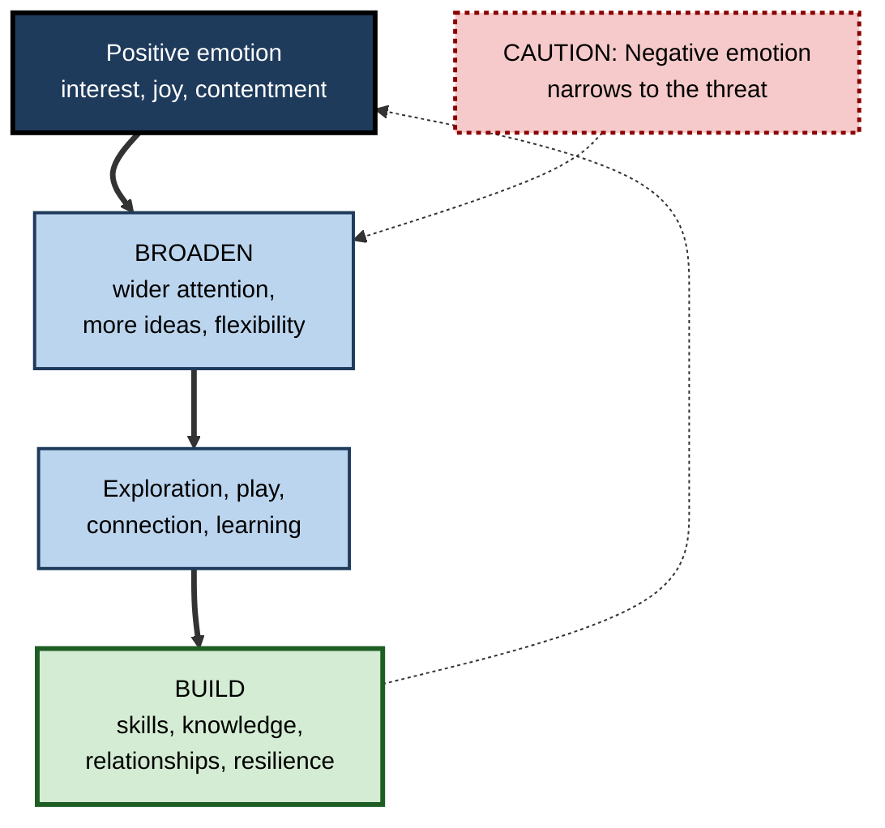
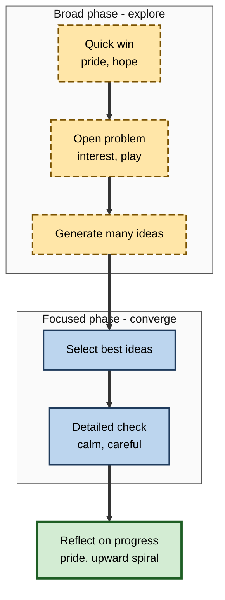
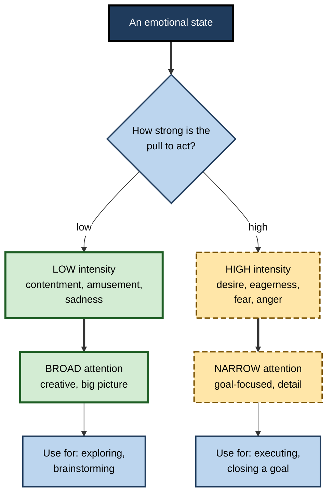

# L.9. Positive Emotions and Broadened Thinking

> **In one sentence:** Feeling good — interested, amused, content, proud, hopeful — tends to widen what you notice and the ideas you consider, which helps creative and exploratory learning, while some intense "I want it" positive feelings narrow focus instead.
>
> **Why it matters:** Enjoyment is one of the strongest emotional predictors of learning and persistence. Knowing which positive emotions broaden thinking, which focus it, and where popular claims overreach lets you design sessions, teams and personal routines that use positivity well — without forced cheerfulness.
>
> **Level span:** Novice → Expert · **Reading time:** ~17 min · **Builds on:** emotion and memory encoding, curiosity

---

## The Learning Ladder

| Level | Badge | After this level you can... |
|---|---|---|
| 1 | NOVICE | Describe how good moods change the way you think and learn. |
| 2 | FOUNDATIONS | Explain the broaden-and-build theory and name key positive achievement emotions. |
| 3 | PRACTITIONER | Use positive emotion purposefully — for exploration, creativity and persistence — and choose focused states for detail work. |
| 4 | ADVANCED | Weigh the evidence, including the motivational-intensity model and the debunked "positivity ratio". |
| 5 | EXPERT / PRO | Build cultures and learning programmes where genuine enjoyment and pride sustain learning, avoiding toxic positivity. |

---

## Level 1 · Novice — The Big Picture

Think about the last time you were in a really good mood at work — after good news, a laugh with colleagues, or solving a tricky problem. Ideas probably came more easily. You might have noticed connections you had missed, or felt more willing to try something new.

Now think about being stressed or upset. Your attention probably narrowed to the problem in front of you. That narrowing can be useful in a crisis, but it makes creative thinking harder.

Psychologist Barbara Fredrickson captured this with a simple picture: **negative emotions narrow, positive emotions broaden.** Fear says "focus on the threat". Joy and interest say "look around, play, explore".

An analogy: think of attention as a torch. Stress tightens the beam to a narrow spot — bright but small. A relaxed, positive mood widens the beam — less intense, but you see more of the room.

You have already experienced this when:

- a brainstorming session full of laughter produced more ideas than a tense one;
- you learned a hobby faster because you enjoyed it;
- pride in a small success made you want to tackle the next, harder step.

The key idea for a beginner: **genuine positive emotions open up thinking and build up resources for learning — but different positive feelings do different jobs.**

---

## Level 2 · Foundations — Core Concepts

### The broaden-and-build theory

Fredrickson's **broaden-and-build theory** (proposed in 1998 and developed in 2001) makes two claims:

1. **Broaden:** positive emotions temporarily widen the range of thoughts and actions that come to mind — more possibilities, more flexible thinking, wider attention.
2. **Build:** over time, these broadened moments build lasting personal resources — skills, knowledge, relationships, resilience — because people explore, play and connect more.

These resources make future positive emotions more likely, creating an **upward spiral**.

**Figure L.9-1 — The broaden-and-build cycle.**

*How to read it:* the thick path is the broaden-and-build chain; the dotted loop is the upward spiral. The dotted-border box shows the contrasting narrowing effect of negative emotion.

### Positive achievement emotions

Reinhard Pekrun's research on **achievement emotions** identifies several positive emotions in learning:

| Emotion | Focus | Example |
|---|---|---|
| **Enjoyment** | The activity itself | "I'm loving this data visualisation work." |
| **Hope** | Expected success | "I think I can pass this certification." |
| **Pride** | Past success due to own effort | "I finally fixed that memory leak myself." |
| **Relief** | Avoided failure | "Phew, the demo didn't crash." |
| **Gratitude** | Help from others | "My mentor's review made this much better." |

These differ in arousal: enjoyment, hope and pride are usually **activating** (they energise), while relief and contentment are **deactivating** (they calm). Activating positive emotions are the ones most consistently linked to effort, persistence and achievement.

### Key Terms

| Term | Plain meaning |
|---|---|
| **Positive affect** | Feeling pleasant emotions or moods. |
| **Broaden-and-build theory** | Positive emotions widen thinking short-term and build lasting resources long-term. |
| **Thought-action repertoire** | The range of thoughts and actions that come to mind in a moment. |
| **Global versus local processing** | Seeing the big picture versus the details. |
| **Motivational intensity** | How strongly an emotion pushes you to pursue or avoid something. |
| **Activating emotion** | An emotion that raises arousal and energy. |
| **Upward spiral** | A self-reinforcing cycle of positive emotion and growing resources. |

---

## Level 3 · Practitioner — Putting It to Work

### Match the emotional state to the task

Positive moods are excellent for some learning tasks and less helpful for others. Research on mood and thinking style suggests that positive moods favour big-picture, flexible, creative thinking, while mildly negative or neutral moods favour careful, detail-focused, analytical checking.

| Task | Helpful state | How to get there |
|---|---|---|
| Brainstorming, exploring a new field, finding connections | Relaxed interest, amusement | Light humour, curiosity triggers, low stakes |
| Persisting through a long project | Hope, pride in progress | Visible progress markers, celebrating small wins |
| Proofreading, auditing, debugging edge cases | Calm, focused, neutral | Quiet setting, checklists, no time pressure |
| Recovering after a failure | Self-compassion, hope | Reframe as learning; recall past successes |

### A routine for building positive learning emotions

1. **Start with a win.** Begin a study session or team workshop with something achievable to generate early pride and hope.
2. **Make progress visible.** Track skills gained, not just hours spent. Teresa Amabile's research on the "progress principle" found that making progress in meaningful work was the most powerful event for positive inner work life.
3. **Add genuine interest.** Use puzzles, stories and real problems rather than gimmicks.
4. **Laugh appropriately.** Relevant humour lowers tension and supports openness.
5. **End with reflection on growth.** "What can I do now that I couldn't this morning?"
6. **Switch to focus mode for detail work.** Shift environment and mindset when moving from exploring to checking.

**Figure L.9-2 — Session flow that uses broad and focused states.**

*How to read it:* long-dash boxes are the broad, positive-emotion phase; solid boxes are the focused phase; the thick-bordered box closes the loop with reflection.

### Worked example — a design sprint for a new feature

| | Before | After |
|---|---|---|
| **Opening** | Manager reviews last sprint's missed deadlines. | Team shares one thing that went well and one user quote that surprised them. |
| **Ideation** | Under deadline pressure, people propose safe tweaks. | Relaxed, timed "crazy eights" sketching with humour allowed. |
| **Selection** | Debates dominated by loudest voice. | Silent dot-voting, then focused critique with a checklist. |
| **Close** | No reflection. | Each person names something they learned. |
| **Result** | Few, incremental ideas. | Wider range of options; selected ideas checked carefully. |

### Common mistakes

- **Forced positivity.** Mandatory cheerfulness feels controlling and can backfire; genuine emotion cannot be ordered.
- **Using a party mood for precision work.** Positive moods can increase reliance on shortcuts; switch modes for detailed checking.
- **Ignoring negative emotions.** Suppressing frustration or concern to "stay positive" removes useful information and harms trust.

---

## Level 4 · Advanced — Mechanisms, Models & Evidence

### The broadening evidence

Classic studies by Alice Isen and colleagues in the 1980s found that mild positive affect — induced by small gifts or comedy clips — improved creative problem solving (such as the candle problem) and flexible categorisation. Fredrickson and Christine Branigan (2005) found that people induced into positive moods were more likely to choose the global (big-picture) match in visual tasks. These broadening effects have been replicated in many studies, though effect sizes vary and depend on how positive emotion is induced.

### Not all positive emotions broaden: motivational intensity

Philip Gable and Eddie Harmon-Jones challenged a simple "positive = broad" view. Their **motivational intensity model** proposes that what matters is how strongly an emotion pushes you toward a goal:

- **Low-intensity positive emotions** (contentment, amusement, after-the-goal satisfaction) **broaden** attention.
- **High-intensity, approach-motivated positive emotions** (desire, eager anticipation of a reward) **narrow** attention to help you pursue the goal.

Their experiments found that high approach-motivated positive states narrowed attention, just as some negative states do. This refines broaden-and-build rather than overturning it: broadening is strongest when positive emotion is low in motivational intensity.

**Figure L.9-3 — Emotion, motivational intensity and attentional scope.**

*How to read it:* the split depends on intensity, not on whether the emotion is pleasant; both outcomes have uses.

### The positivity ratio: a cautionary tale

In 2005, a widely publicised paper claimed that flourishing required a positive-to-negative emotion ratio above about 2.9 to 1, derived from mathematical modelling borrowed from fluid dynamics. In 2013, Nicholas Brown, Alan Sokal and Harris Friedman showed that the modelling was invalid; the mathematical portion was formally withdrawn. Fredrickson acknowledged the problem and defended a looser claim that more positivity relative to negativity is generally better, within limits. The core broaden-and-build ideas do not depend on the ratio, but **any precise "magic ratio" should be treated as debunked.**

### What else is contested

- **Strength of the "build" effect.** Evidence that positive emotions *cause* lasting resource gains is thinner than evidence for momentary broadening; a recent network analysis questioned whether broadening is the key bridge between positive emotion and resources.
- **Positive-psychology interventions** (gratitude journals, savouring exercises) show small average effects in meta-analyses, which shrink in higher-quality studies.

### Enjoyment and achievement

Across meta-analyses of achievement emotions, **enjoyment** shows one of the most robust positive relationships with academic performance — roughly as strong, in the opposite direction, as boredom's negative relationship. Longitudinal studies show reciprocal effects: enjoyment predicts later achievement, and success predicts later enjoyment. Hope and pride show similar positive patterns.

### Mood and processing style

Research on **affect-as-information** suggests people treat their mood as a signal: a good mood says "all is well", inviting top-down, heuristic, creative processing; a mild negative mood says "something may be wrong", inviting careful, bottom-up analysis. That is why positive moods can sometimes increase reliance on stereotypes or shortcuts and reduce error detection.

---

## Level 5 · Expert / Pro — Professional Mastery

### Building genuine positive emotion into learning cultures

| Lever | What it looks like |
|---|---|
| **Progress visibility** | Skill maps, before-and-after demos, showcases of learning. |
| **Recognition of growth** | Specific praise for improvement and strategy, not just top results. |
| **Interest by design** | Real problems, puzzles, stories, choice of projects. |
| **Psychological safety** | Room for humour, play and imperfect first attempts. |
| **Mode switching** | Explicit "diverge" and "converge" phases in workshops and reviews. |
| **Authenticity** | No compulsory positivity; negative signals are welcome and acted upon. |

### Professional scenario

**Role:** Head of Learning at a design consultancy.
**Situation:** Junior designers' portfolios were technically competent but creatively narrow. Critique sessions were tense and hierarchical.
**What the pro does:** Restructures critique into two phases. The first is a low-stakes "explore" session with playful constraints, humour and no senior judgement, to generate many directions. The second is a focused critique using a clear rubric. Adds a monthly "show what you learned" event where juniors present one new technique. Over six months, juniors produce wider ranges of concepts, senior reviewers report fewer late rework cycles, and a pulse survey shows higher enjoyment and pride in learning.

### Toxic positivity and ethical limits

**Toxic positivity** — insisting on upbeat feelings and dismissing concerns — damages trust and can hide real problems such as overload or unsafe practices. Professionals:

- invite and act on negative feedback;
- treat sadness, frustration and anxiety as legitimate data;
- avoid using positive-emotion techniques to cover structural problems (understaffing, unrealistic deadlines).

### AI-era considerations

AI assistants that respond with relentless enthusiasm and praise can create a pleasant mood that is disconnected from real progress. Professionals look for feedback that is honest and calibrated, and they design AI tools to celebrate genuine improvement rather than every interaction.

---

## Myths vs. Evidence

| Myth | What the evidence shows |
|---|---|
| "You need a 3-to-1 positivity ratio to flourish." | The mathematical basis was shown to be invalid and was withdrawn; no precise ratio is supported. |
| "All positive emotions broaden attention." | High-intensity, approach-motivated positive states can narrow attention. |
| "Positive mood always improves performance." | It aids creative and exploratory tasks but can increase shortcuts and reduce error detection. |
| "Gratitude journals transform well-being." | Average effects of positive-psychology interventions are small and shrink in rigorous studies. |
| "Good culture means everyone stays positive." | Forced positivity harms trust; genuine emotions, including negative ones, carry useful information. |
| "Enjoyment is a nice extra, not a learning factor." | Enjoyment is one of the most robust emotional predictors of achievement, with reciprocal effects. |

## Practitioner Toolkit

**Positive-emotion design checklist**

- [ ] Sessions start with an achievable win.
- [ ] Progress is visible and celebrated specifically.
- [ ] Exploration phases are low-stakes, playful and safe.
- [ ] Detail-checking phases are separated and focused.
- [ ] Humour is relevant and inclusive.
- [ ] Negative feedback and concerns are invited, not suppressed.
- [ ] No claims about magic ratios or guaranteed outcomes.

**End-of-day learning reflection (3 minutes)**

1. One thing I can do now that I couldn't yesterday.
2. One moment I enjoyed or felt proud of.
3. One question I'm curious to explore tomorrow.

## Self-Check

1. **[NOVICE]** How does a good mood change the "torch" of attention?
2. **[NOVICE]** Give an example of positive emotion helping you learn.
3. **[FOUNDATIONS]** What are the two claims of broaden-and-build theory?
4. **[FOUNDATIONS]** Name three positive achievement emotions and their focus.
5. **[PRACTITIONER]** Which state would you aim for when proofreading a contract, and why?
6. **[ADVANCED]** What does the motivational intensity model add?
7. **[ADVANCED]** What happened to the positivity ratio?
8. **[EXPERT / PRO]** How would you add positive emotion to a learning culture without creating toxic positivity?

### Answer Key

1. It widens the beam, letting you notice more and consider more possibilities.
2. Answers vary — for example, learning faster during an enjoyable hobby project.
3. Positive emotions broaden momentary thought-action repertoires and, over time, build lasting resources.
4. For example: enjoyment (the activity), hope (future success), pride (past success due to own effort); also relief and gratitude.
5. A calm, neutral, focused state, because positive moods can encourage shortcuts and reduce error detection.
6. Intensity matters: low-intensity positive emotions broaden, high-intensity approach-motivated positive emotions narrow attention.
7. Its mathematical basis was shown to be invalid in 2013 and the modelling portion was withdrawn; no precise ratio is supported.
8. Make progress visible, recognise growth specifically, design interest and safe play, separate explore and focus phases, and actively welcome negative feedback and concerns.

## Key Takeaways

- Positive emotions tend to **broaden** attention and thinking; negative ones tend to **narrow** it.
- Over time, broadened moments can **build** resources — skills, relationships, resilience — though this "build" evidence is thinner.
- **Motivational intensity** matters: eager desire narrows, contentment and amusement broaden.
- **Enjoyment** robustly predicts achievement, with reciprocal effects.
- Use **broad states to explore** and **focused states to check**.
- The **positivity ratio is debunked**; avoid magic numbers.
- Genuine emotion beats **forced positivity**.

## Glossary

| Term | Meaning |
|---|---|
| Achievement emotions | Emotions tied to achievement activities and their outcomes. |
| Activating emotion | An emotion that increases physiological and psychological arousal. |
| Affect-as-information | Theory that people use their mood as information about their situation, shaping processing style. |
| Broaden-and-build theory | Theory that positive emotions broaden thought-action repertoires and build lasting resources. |
| Global processing | Attending to the overall configuration or big picture. |
| Local processing | Attending to details. |
| Motivational intensity model | Theory that emotions high in approach or avoidance intensity narrow attention. |
| Positivity ratio | A debunked claim that flourishing requires a specific ratio of positive to negative emotion. |
| Progress principle | The finding that making progress in meaningful work strongly boosts positive inner work life. |
| Thought-action repertoire | The set of thoughts and actions that come to mind in a situation. |
| Toxic positivity | Insistence on positive feelings that dismisses legitimate negative emotions. |
| Upward spiral | A self-reinforcing cycle of positive emotion and resource growth. |
