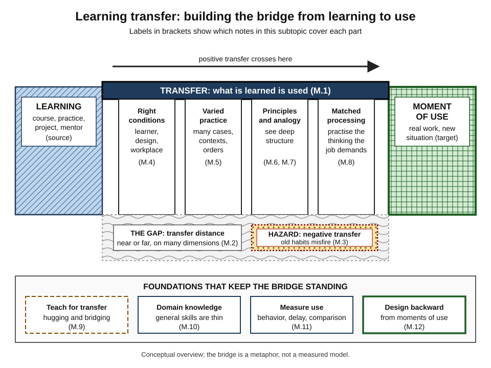
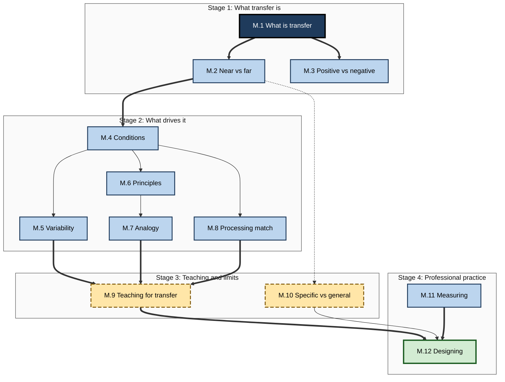
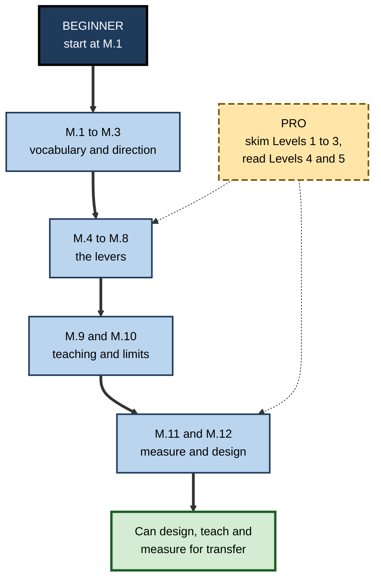

# M. Learning Transfer

> **What this subtopic is about:** How learning moves, or fails to move, from where it happened to where it is needed: the science of near and far transfer, when old knowledge helps or hurts, the conditions and practice designs that carry learning into new situations, and how professionals teach, measure and design for transfer.
>
> **Who it is for:** Anyone who learns for work, and anyone who teaches, mentors, onboards, manages or designs training · **Notes in this subtopic:** 12 · **Level span:** Novice → Expert

---

## Overview

Learning is only useful if it shows up later, somewhere else. **Transfer of learning** is the influence of prior learning on performance or learning in a new situation. It is the bridge between the classroom, course or practice session and the real moments where people must act: a client call, a production incident, an unfamiliar dataset, a new role.

For more than a century, research has delivered a consistent and sobering message. Transfer to situations that closely resemble the learning, **near transfer**, is common and can be engineered. Transfer to situations that look very different, **far transfer**, is valuable but rare, and the popular promise that general "mind training" makes people smarter at everything has not held up in large, well-controlled meta-analyses. At the same time, research has identified dependable levers: varied practice, explicit principles, comparison of cases, practice that matches the thinking the job demands, and workplaces that give people the opportunity and support to use what they learned.

This subtopic works through those ideas from definition to professional design. It sits at the end of the Learning Science and Cognition topic because it draws on almost everything before it: memory, schemas, attention, cognitive load, metacognition and motivation all shape whether learning travels.

*Figure M-1 — Learning transfer as a bridge from learning to use.* The deck is transfer itself; the four pillars are the main levers; the gap below is transfer distance, with negative transfer as a hazard; the foundation band holds the professional practices. Bracketed labels name the notes that cover each part.

---

## Why It Matters

- **It is the return on every hour of learning.** Courses, certifications, onboarding and self-study pay off only through transfer.
- **It explains a common failure.** "They did the training but nothing changed" is usually a transfer problem, located in the learner, the design or the work environment.
- **It protects budgets and careers from myths.** Brain-training products, generic "critical thinking" courses and the claim that "only 10% of training transfers" all look different once you know the evidence.
- **It matters more in the AI era.** When AI tools perform tasks, tool-assisted performance can hide whether capability ever moved into people. Field studies in 2025 showed that unrestricted AI help can raise practice performance while lowering later unaided performance, and that professionals' skill can drop when a familiar AI aid is removed.
- **It underpins career mobility.** Knowing what transfers between roles and what must be rebuilt makes career moves faster and less painful.

---

## What You Will Learn

| # | Note | Core question it answers | Primary level |
|---|---|---|---|
| M.1 | What is Transfer of Learning? | What is transfer, and why is it harder than it looks? | Novice |
| M.2 | Near Transfer vs. Far Transfer | How far can learning travel, and what does the evidence say about far transfer? | Foundations |
| M.3 | Positive vs. Negative Transfer | When does prior learning help, and when does it cause errors? | Foundations |
| M.4 | Conditions That Promote Transfer | Which learner, design and workplace conditions make transfer happen? | Practitioner |
| M.5 | Contextual Variability in Practice | Why does varied, mixed practice transfer better, and when? | Practitioner |
| M.6 | Abstract Principles and Transfer | How do principles make knowledge portable, and how should they be taught? | Practitioner |
| M.7 | Analogical Reasoning for Transfer | How do people carry solutions between situations by analogy? | Advanced |
| M.8 | Transfer-Appropriate Processing | Why must practice match the thinking the real task demands? | Advanced |
| M.9 | Teaching for Transfer | Which teaching moves produce transfer? | Advanced |
| M.10 | Domain-Specific vs. General Skills | What really transfers across fields, and what must be rebuilt? | Advanced |
| M.11 | Measuring Transfer Effectiveness | How do you know whether learning is used and makes a difference? | Expert / Pro |
| M.12 | Designing Learning for Maximum Transfer | How do you design learning backward from real moments of use? | Expert / Pro |

---

## Concept Map

**Figure M-2 — How the twelve notes fit together.**

*How to read it:* four stages run top to bottom; thick arrows mark the main line of argument, and the dotted arrow shows that the near-versus-far evidence frames the debate about general skills.

---

## Recommended Learning Path

1. **Start with M.1** to get the vocabulary and the key insight that most transfer fails at recognition.
2. **Read M.2 and M.3** to understand distance and direction: how far learning can go, and when it backfires.
3. **Read M.4** for the big map of conditions; then **M.5, M.6, M.7 and M.8** for the four main design levers.
4. **Read M.9** to turn those levers into teaching moves, and **M.10** to calibrate what "general skills" can and cannot do.
5. **Finish with M.11 and M.12**, which combine everything into measurement and design.

**Figure M-3 — Paths through the subtopic.**

*How to read it:* beginners follow the thick path; experienced professionals can join at the levers and the design notes, reading the advanced levels of each.

**Where a beginner starts:** M.1, Levels 1–3 of each note. **What a pro can skim:** the Level 1–2 sections; the Level 4 evidence tables, Level 5 scenarios, Myths tables and toolkits carry the professional value.

---

## The Big Ideas in Brief

**M.1 What is Transfer of Learning?** Transfer is prior learning influencing performance in a new situation. A century of research, from Thorndike's identical elements to modern meta-analyses, shows that narrow transfer is common and broad transfer is hard. Most failures happen at recognition: people have the knowledge but do not notice it applies.

**M.2 Near Transfer vs. Far Transfer.** Distance has many dimensions: domain, place, time, purpose, social setting and format. Near transfer is reliable when practice is good. Far transfer from brain training, working-memory training, chess and music is essentially null in well-controlled studies, and effect sizes shrink as study quality rises. Design in rings: near in training, middle by design, far with on-the-job support.

**M.3 Positive vs. Negative Transfer.** Old learning helps when the new situation needs the same action, and hurts when it looks the same but needs a different action. Sort actions into same, similar-but-different and new before any switch, and concentrate training and design safeguards on the similar-but-different items.

**M.4 Conditions That Promote Transfer.** Transfer depends on the learner, the learning design and the work environment together. The environment, especially manager support and opportunity to use, matters most for open skills such as leadership. Many of the strongest levers sit before and after the learning event.

**M.5 Contextual Variability in Practice.** Varied and interleaved practice looks worse during training and usually works better later, especially on new variations. Start consistent, then add variety along job-relevant dimensions; interleave confusable problem types. Some context effects, such as the famous underwater-divers result, have not replicated.

**M.6 Abstract Principles and Transfer.** Examples help you learn; principles help you transfer. Experts see deep structure while novices see surface features. Concreteness fading, moving from concrete case to simplified model to abstract principle, outperforms either extreme; principles need conditions and near-misses.

**M.7 Analogical Reasoning for Transfer.** Analogy carries structure from a familiar case to a new one. Retrieval is the bottleneck: people rarely notice relevant analogies spontaneously. Comparing two cases while learning makes later use far more likely. Use multiple sources, explicit mapping and a difference audit.

**M.8 Transfer-Appropriate Processing.** Learning transfers best when the processing during learning matches the processing at use. Recognition practice does not prepare people for production tasks; matching mental processes matters more than matching rooms. Design assessments that demand the job's thinking.

**M.9 Teaching for Transfer.** Combine hugging (making learning like the real situation) with bridging (making links explicit). Use multiple varied examples, comparison, named principles, retrieval and spaced returns. Worked examples suit novices; productive failure suits conceptual transfer when learners have some prior knowledge.

**M.10 Domain-Specific vs. General Skills.** Most expertise is domain-specific; general skills are real but thin. Critical thinking is taught best explicitly and inside a domain. In AI-supported work, domain knowledge is what lets people spot plausible errors.

**M.11 Measuring Transfer Effectiveness.** Measure behavior on the job after a delay, with multiple sources, a baseline and a comparison. Reactions are weak predictors. The "10% transfer" statistic is folklore. In AI-supported work, include unaided and error-detection checks.

**M.12 Designing Learning for Maximum Transfer.** Diagnose first; then design backward from moments of use, building practice before content and environment support before and after. Treat learning as a journey, not an event, and remember that AI tool design decides whether AI builds or replaces capability.

---

## Novice-to-Pro Progression

| Level | What competence looks like here |
|---|---|
| NOVICE | Explains transfer in plain words; recognises near, far, positive and negative transfer in daily life; knows that passing a course does not guarantee use. |
| FOUNDATIONS | Uses the vocabulary accurately; describes the classic theories and the main conditions; knows the far-transfer evidence and common myths. |
| PRACTITIONER | Diagnoses transfer failures in own learning; adds variability, principles and processing match to practice; plans first use and support. |
| ADVANCED | Explains mechanisms and boundary conditions with evidence; distinguishes robust from contested findings; teaches with comparison, bridging and appropriate struggle. |
| EXPERT / PRO | Designs programmes backward from moments of use; involves managers; measures behavior and results credibly; configures AI so it builds capability; challenges unsupported vendor and framework claims. |

---

## Where This Shows Up at Work

| Context | Transfer question | Notes most relevant |
|---|---|---|
| **Onboarding** | Can new joiners do real work unaided, quickly? | M.4, M.8, M.12 |
| **Tool and system migrations** | Which old habits will help, and which will cause errors? | M.3 |
| **Leadership development** | Will new behaviors survive the return to daily pressure? | M.4, M.11 |
| **Technical upskilling** | Will engineers apply new patterns to unfamiliar services? | M.5, M.6, M.9 |
| **Strategy and innovation** | Which analogies from other industries really fit? | M.7 |
| **Career moves** | What carries over to a new role, and what must be rebuilt? | M.10 |
| **Compliance and safety** | Will people spot real risks in noisy, live situations? | M.2, M.8 |
| **AI adoption** | Is capability moving into people, or only into tools? | M.1, M.11, M.12 |
| **Hiring** | Are "transferable skills" claims realistic? | M.10 |

---

## Capstone Exercises

1. **Transfer post-mortem.** Pick a course you took in the last two years. Using the four-point diagnosis from M.1 and the conditions audit from M.4, explain why it did or did not change what you do. Write one page.
2. **Switch analysis.** For a real upcoming change (new tool, process or role), complete a same, similar-but-different and new table (M.3) and design contrast practice for the top two risks.
3. **Practice redesign.** Take one skill you are learning. Redesign its practice with a variation matrix (M.5), a principle card (M.6) and a processing-match audit (M.8). Test yourself on a new variation after two weeks.
4. **Analogy workshop.** For a current work problem, generate three source analogies from different domains, build a mapping table and run a difference audit (M.7).
5. **Teach it.** Teach a principle to a colleague using two compared cases, a named principle, a near-miss and a bridging question (M.9). Check two weeks later whether they used it.
6. **Measure it.** Write a transfer measurement plan for a real programme in your organisation (M.11), including critical behaviors, two data sources, timing and a comparison.
7. **Design it.** Turn a real training request into a one-page transfer blueprint (M.12), including diagnosis, moments of use, practice, environment support, AI-use rules and measurement.

---

## Key Takeaways

- **Transfer is the point of learning**; it must be designed for, not hoped for.
- **Near transfer is dependable; far transfer is rare** and often over-promised, especially by brain-training claims.
- Prior learning can **help or hurt**; the danger zone is similar cues with different correct actions.
- The main levers are **varied practice, explicit principles, comparison and analogy, and processing match**.
- The **work environment**, especially manager support and opportunity to use, is a decisive condition.
- **General skills amplify domain knowledge**; they do not replace it.
- **Measure behavior after a delay**, with comparison, and include **unaided checks** where AI assists.
- **Design backward** from real moments of use, and treat learning as a journey.
