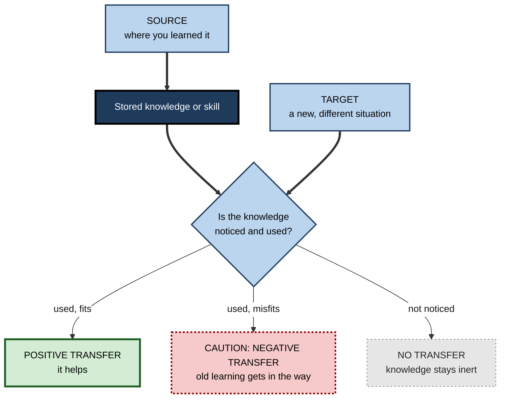
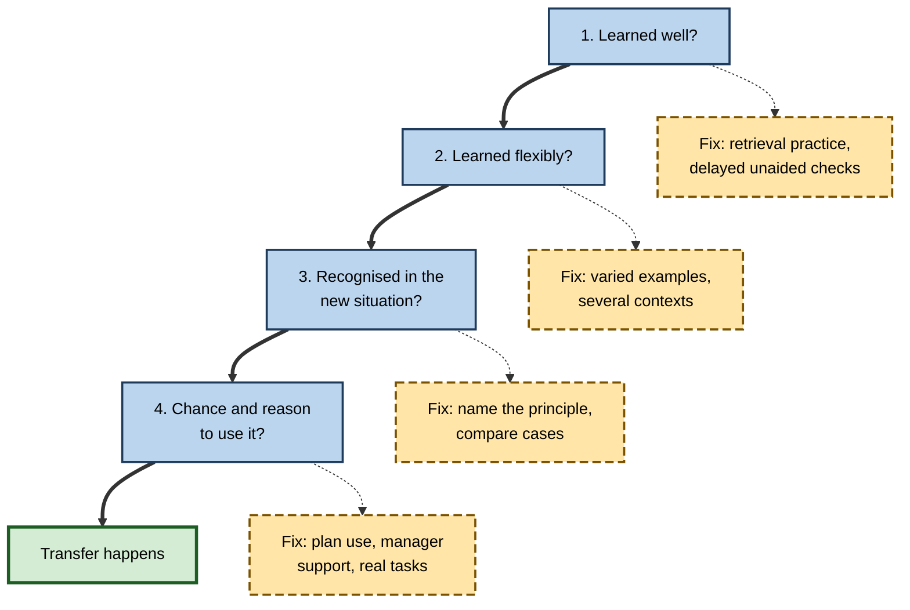

# M.1. What is Transfer of Learning?

> **In one sentence:** Transfer of learning is using something you learned in one situation to help you in a different situation, such as using fractions from school to split a restaurant bill.
>
> **Why it matters:** Nearly every course, onboarding plan and training budget is a bet on transfer. Learning that stays locked inside the classroom, the course or the practice task has no value at work, so transfer is the real return on every hour spent learning.
>
> **Level span:** Novice → Expert · **Reading time:** ~17 min · **Builds on:** the idea that learning is a lasting change caused by experience

---

## The Learning Ladder

| Level | Badge | After this level you can... |
|---|---|---|
| 1 | NOVICE | Explain transfer in plain words and spot it in your own life. |
| 2 | FOUNDATIONS | Use the core vocabulary (source, target, near, far, positive, negative) and describe the classic theories. |
| 3 | PRACTITIONER | Diagnose why something you learned did not show up when you needed it, and fix the gap. |
| 4 | ADVANCED | Explain why transfer is often rarer than expected, what the main theories predict, and what modern evidence says. |
| 5 | EXPERT / PRO | Treat transfer as the design goal of training, onboarding and AI-supported work, and argue for it with evidence. |

---

## Level 1 · Novice — The Big Picture

You learn something in one place and use it somewhere else. That jump is **transfer of learning**. If you learned to drive in a small hatchback and can then drive a rental van, your learning transferred. If you learned spreadsheets for a school project and later build a budget at work, that is transfer too.

An everyday analogy: think of learning as packing a suitcase. Packing is only useful if, when you arrive somewhere new, you can find and use what you packed. Some people pack well but cannot find anything at the destination. Transfer is the "unpacking and using" part of learning, and it is where a lot of learning quietly fails.

You have already experienced transfer, and its failure, when:

- You learned to type on a laptop and could type on an office keyboard immediately. **Transfer worked.**
- You passed a statistics exam, then froze when a manager asked whether a sales increase was "significant". **Transfer failed:** the knowledge was there, but it did not come to mind outside the exam.
- You switched from one phone brand to another and kept swiping the wrong way. **Transfer worked against you:** old habits got in the way of the new task.

The key idea for a beginner: **learning is not finished when you can do it in the lesson. It is finished when you can use it where it counts.**

---

## Level 2 · Foundations — Core Concepts

### The standard definition

Researchers usually define **transfer** as the influence of prior learning on performance or learning in a new situation. Four ideas sit inside that sentence:

1. **Source** — the situation where the learning happened (a course, a project, a game, a past job).
2. **Target** — the new situation where you try to use it (a client meeting, a new codebase, a different country).
3. **Influence** — transfer can help (positive transfer) or hurt (negative transfer). Zero influence means no transfer.
4. **Newness** — if the target is identical to the source, it is just remembering, not transfer. Transfer always involves some difference.

**Figure M.1-1 — The anatomy of a transfer event.**

*How to read it:* thick arrows show the two ingredients, stored learning and a new situation, meeting at the decision point. The three outcomes differ by border: thick solid (helps), dotted (hurts), sparse dotted (nothing happens).

### Key terms

| Term | Plain meaning |
|---|---|
| **Transfer of learning** | Prior learning affecting performance or learning in a new situation. |
| **Source / target** | Where you learned it / where you need it. |
| **Near transfer** | The target is very similar to the source (new version of the same software). |
| **Far transfer** | The target is quite different (chess strategy helping business strategy). |
| **Positive transfer** | Prior learning helps in the new situation. |
| **Negative transfer** | Prior learning interferes with the new situation. |
| **Inert knowledge** | Knowledge you have but do not use when it would help. |
| **Surface features** | The visible details of a problem (names, numbers, setting). |
| **Deep structure** | The underlying principle or relationship that makes a solution work. |

### Two old ideas that shaped the field

**Formal discipline.** For centuries, schools taught Latin, geometry and memorisation partly because they were thought to "train the mind" like a muscle, so that any mental effort would make you better at everything. This is the original far-transfer promise.

**Identical elements.** In 1901, Edward Thorndike and Robert Woodworth tested that promise and found that practice on one task improved another task only to the extent that the two shared **identical elements**, the same specific stimuli and responses. Practising estimating the area of rectangles did not much improve estimating the area of other shapes. Their result dented the formal-discipline view and set up the central tension of this whole subtopic: **broad transfer is valuable but hard to get.**

**Understanding the principle.** Around the same time, Charles Judd argued that what transfers is a general principle, not identical pieces. In a classic demonstration, learners who had been taught how light bends in water adjusted better when the depth of an underwater target changed. Modern research keeps both ideas: shared elements and shared principles both drive transfer.

---

## Level 3 · Practitioner — Putting It to Work

The practical skill at this level is **diagnosing transfer failure**. When you "knew it but could not use it", the problem almost always sits at one of four points.

### The four-point transfer diagnosis

1. **Was it learned well enough?** If you could only do it with notes, help or an AI assistant, there was little stable learning to transfer. Check with a delayed, unaided attempt.
2. **Was it learned in only one form?** Knowledge learned in one narrow format (one example, one tool, one phrasing) tends to stay tied to that format.
3. **Did the new situation look different?** If the target shares deep structure but not surface features, you may not recognise it as "the same kind of problem".
4. **Was there an opportunity and a reason to use it?** At work, transfer also fails because there is no time, no permission, no tools or no manager interest.

**Figure M.1-2 — Where transfer breaks down, and what fixes each break.**

*How to read it:* the thick path is a successful transfer; each dashed-border box is the fix to apply when that gate fails.

### Worked example — a new analyst who "knows" A/B testing

| | Before | After |
|---|---|---|
| **Situation** | Completed an online course on A/B testing with full marks. | Same course, then deliberate transfer work. |
| **At work** | Asked whether a 2% lift in checkout conversion is real, she says "I'd need to look that up". | She recognises the question as "is this difference bigger than chance?" and asks for sample size and variance. |
| **What changed** | Learned with one tidy textbook example; quiz questions always said "A/B test". | Re-worked three messy cases from her own company (email, pricing, onboarding), wrote the principle in one sentence, and explained it to a colleague. |
| **Diagnosis** | Points 2 and 3 failed: narrow learning, no recognition. | Varied cases and an explicit principle fixed both. |

### Common mistakes

- **Assuming transfer is automatic.** "They did the course, so they can do it" is the most expensive assumption in corporate learning.
- **Testing in the source context only.** A quiz that uses the course's own wording measures memory of the course, not transfer.
- **Blaming the learner alone.** Many transfer failures come from the work environment, not the person.
- **Confusing transfer of learning with transfer learning.** In machine learning, **transfer learning** means reusing a model trained on one task for another. It is a useful metaphor but a different thing.

---

## Level 4 · Advanced — Mechanisms, Models & Evidence

### Why transfer is often disappointing

A recurring finding over a century of research is that spontaneous transfer, especially to situations that look different, is rarer than people expect. Douglas Detterman's well-known critique in the 1990s argued that most claimed demonstrations of far transfer either were not far or relied on telling participants about the connection. Mary Gick and Keith Holyoak's analogy experiments in the early 1980s made the point vividly: many people who had just read a story containing the key to a medical problem did not use it until they were given a hint that the story was relevant. The knowledge was there; noticing it was the bottleneck.

### The main models of transfer

| Model | Core claim | What it predicts | Status today |
|---|---|---|---|
| **Formal discipline** | Exercising the mind on any hard subject strengthens it generally. | Latin, chess or brain games improve general thinking. | Largely rejected; large meta-analyses find far-transfer effects near zero once study quality is accounted for. |
| **Identical elements** (Thorndike) | Transfer depends on shared specific elements. | Transfer is narrow and predictable. | Partly right; explains near transfer well. |
| **Principle / schema** (Judd; later schema theory) | Transfer depends on an abstract principle or **schema**, a mental template for a class of problems. | Understanding the "why" extends reach. | Well supported, especially when the principle is made explicit and practised. |
| **Low road / high road** (Perkins and Salomon) | Low-road transfer is automatic, triggered by similar cues after lots of practice; high-road transfer is mindful abstraction and deliberate search for connections. | Two different routes need two different designs. | Widely used framework in instructional design. |
| **Preparation for future learning** (Bransford and Schwartz) | Good prior learning may not show up as direct application but as faster, better learning of the next thing. | Test transfer by giving a learning resource, not just a problem. | Influential; changed how researchers measure transfer. |
| **Situated / sociocultural** | Knowledge is tied to the practices and settings where it was learned. | Transfer requires similar participation, tools and communities. | Important correction; explains workplace transfer barriers. |

### What the modern evidence says

- **Near transfer is reliable when practice is good.** Retrieval practice, varied practice and worked examples reliably produce transfer to similar problems.
- **Far transfer of general "mental fitness" is not supported.** Second-order meta-analyses by Giovanni Sala and Fernand Gobet, updated in 2023, conclude that once placebo effects, control groups and publication bias are handled, far transfer from working-memory training, chess, music and commercial brain games is essentially null.
- **Workplace transfer is a system property.** The Baldwin and Ford model of 1988 and the 2010 meta-analysis by Blume and colleagues (89 studies) show transfer depends on the trainee, the training design and the work environment together, and that the environment matters most for open skills such as leadership.
- **The "only 10% transfers" statistic is folklore.** It traces back to a 1982 opinion piece, not to data. Real transfer rates vary widely by programme.

### Boundary conditions

- **Distance is multi-dimensional.** A target can be near in content but far in time, setting or social context. Barnett and Ceci's 2002 taxonomy formalised this.
- **Expertise changes what counts as "similar".** Experts see deep structure, so more situations look similar to them; novices see surface features.
- **Transfer can be delayed.** The value of prior learning may appear only when you start learning something related.

---

## Level 5 · Expert / Pro — Professional Mastery

### Transfer as the design goal

Professionals who design learning treat transfer as the **definition of success**, not a hoped-for side effect. They start with the target situation and work backward: what will people face, under what conditions, with what tools, and what must they notice and do there?

| Question pros ask first | Why it matters |
|---|---|
| What is the real target situation, in detail? | You cannot design for transfer to a situation you have not described. |
| How far is it from the training context? | Determines how much variety, principle teaching and practice is needed. |
| What will trigger the right behavior there? | Transfer often fails at recognition, not ability. |
| What in the environment helps or blocks use? | Manager support and opportunity to apply are major predictors. |
| How will we know transfer happened? | Defines the measurement plan before the build begins. |

### AI-era implications

Generative AI raises the stakes in two ways. First, it can **replace** the performance that training was supposed to build: a 2025 field experiment in high-school mathematics found that students using an unrestricted chatbot did better on practice but worse on a later unaided exam, while a hint-based tutor largely avoided that harm. Second, it can **mask** non-transfer at work: if an assistant does the task, nobody notices that the skill never moved into the person. An observational study published in 2025 found that colonoscopy specialists who had been working with an AI detection aid detected fewer precancerous growths in procedures done without it than they had before the aid was introduced. Pros therefore define which capabilities must transfer into people (judgement, error detection, supervision of AI output) and check them without the tool.

### Professional scenario

**Role:** Head of sales enablement at a software company.
**Situation:** A new negotiation programme gets excellent ratings, but deal discounts do not improve.
**What the pro does:** Shadows ten real calls and finds reps recognise the taught tactics in role-plays scripted like the course, but not in messy calls where the buyer raises price late. She rebuilds the programme around comparing pairs of real call recordings that share the same underlying tactic, adds a one-line principle for each, schedules spaced follow-up practice on live deals with manager coaching, and measures average discount and win rate per rep before and after. She reports the business metric, not the satisfaction score.

---

## Myths vs. Evidence

| Myth | What the evidence shows |
|---|---|
| "Learning something hard trains the mind in general." | Far transfer from general mental exercise is weak or null in large meta-analyses. |
| "If they passed the test, they will use it at work." | Passing a test in the source context says little about recognition and use in the target context. |
| "Only 10% of training transfers to the job." | This figure has no empirical origin; transfer rates vary widely with design and environment. |
| "Transfer is purely the learner's responsibility." | The work environment, especially manager support and opportunity to use, strongly predicts transfer. |
| "Doing the task with AI means I learned it." | Tool-supported performance can rise while unaided capability falls. |

## Practitioner Toolkit

**Transfer diagnosis checklist**

- [ ] I can do it cold, without notes or AI, after a delay.
- [ ] I have practised it in at least three different contexts or formats.
- [ ] I can state the underlying principle in one sentence.
- [ ] I can list two situations at work where it applies, and how I would recognise them.
- [ ] I have a concrete first opportunity to use it, with a date.
- [ ] Someone (manager, peer) knows I am trying to apply it.

**Template — Source-to-Target map**

| What I learned | Where I learned it (source) | Where I need it (target) | How the target looks different | Cue that should trigger it |
|---|---|---|---|---|
| | | | | |

## Self-Check

1. **[NOVICE]** Give an example of transfer from your own life.
2. **[NOVICE]** What is the difference between remembering something and transferring it?
3. **[FOUNDATIONS]** Define source, target, positive transfer and negative transfer.
4. **[FOUNDATIONS]** What did Thorndike's identical-elements research challenge?
5. **[PRACTITIONER]** Name the four points where transfer commonly fails.
6. **[ADVANCED]** Contrast low-road and high-road transfer.
7. **[ADVANCED]** What does "preparation for future learning" change about how transfer is measured?
8. **[EXPERT / PRO]** Why is the "10% transfer" statistic a problem for L&D teams?
9. **[EXPERT / PRO]** How can AI assistance hide a failure of transfer at work?

### Answer Key

1. Answers vary, for example using cooking skills from home in a friend's kitchen, or using presentation skills from university at work.
2. Remembering reproduces learning in the same situation; transfer applies it to a situation that differs in some way.
3. Source: where learning happened. Target: the new situation. Positive transfer: prior learning helps. Negative transfer: prior learning interferes.
4. The doctrine of formal discipline, the idea that hard subjects strengthen the mind generally.
5. Not learned well enough; learned in only one form; not recognised in the new situation; no opportunity or reason to apply it.
6. Low road: automatic, triggered by similar cues after much practice. High road: deliberate abstraction of a principle and mindful search for where it applies.
7. It measures whether prior learning helps people learn new material faster or better, not just whether they can solve a new problem cold.
8. It has no empirical basis, misleads budget decisions, and hides the real question of which designs and environments increase transfer.
9. The tool performs the task, so outcomes look fine even though the person cannot do it unaided; the gap appears only when the tool is absent or wrong.

## Key Takeaways

- Transfer is **using learning in a new situation**; it is the real return on learning.
- Transfer can be **positive, negative or absent**, and near or far.
- The century-old lesson: **broad transfer is valuable but hard to get**; narrow transfer is common.
- Most failures happen at **recognition**: the knowledge exists but is not noticed.
- Transfer depends on **learner, design and work environment** together.
- In the AI era, check transfer **without the tool**.

## Glossary

| Term | Meaning |
|---|---|
| Deep structure | The underlying principle that makes a solution work. |
| Far transfer | Applying learning to a target that is very different from the source. |
| Formal discipline | The discredited idea that hard subjects train the mind in general. |
| High-road transfer | Deliberate, mindful abstraction and application of a principle. |
| Identical elements | Thorndike's theory that transfer depends on shared specific elements. |
| Inert knowledge | Knowledge that is held but not used when relevant. |
| Low-road transfer | Automatic transfer triggered by familiar cues after extensive practice. |
| Near transfer | Applying learning to a target very similar to the source. |
| Negative transfer | Prior learning interfering with performance in a new situation. |
| Preparation for future learning | Prior learning that shows its value by speeding up later learning. |
| Schema | A mental template for a class of situations or problems. |
| Surface features | The visible, often irrelevant, details of a problem. |
| Transfer of learning | The influence of prior learning on performance or learning in a new situation. |
