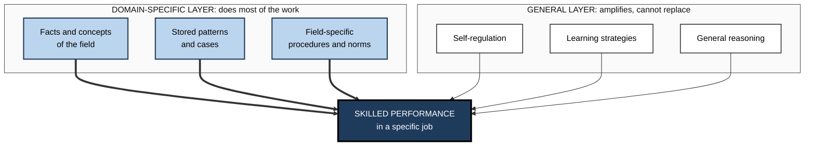
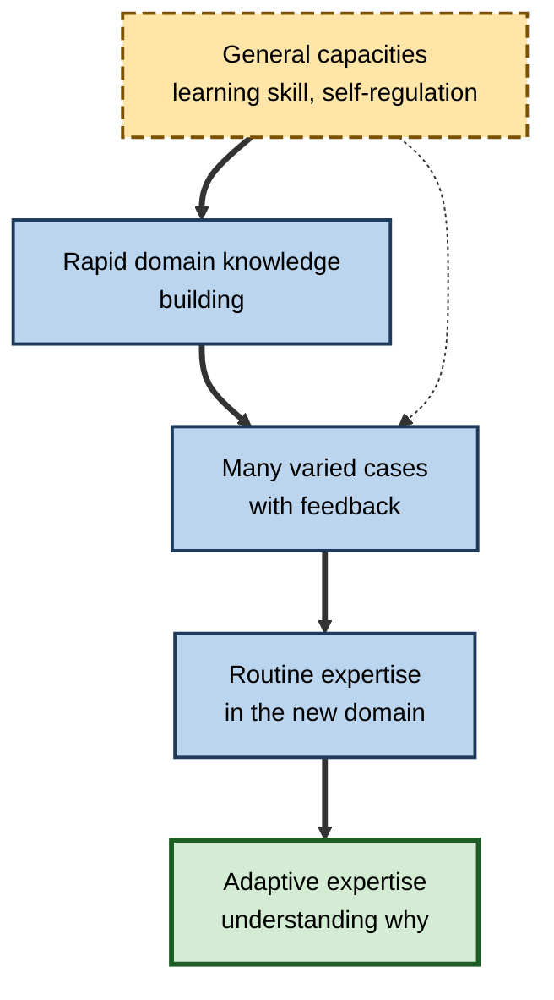

# M.10. Domain-Specific vs. General Skills

> **In one sentence:** Domain-specific skills work inside one field, like reading an X-ray or tuning a database, while general skills, like "critical thinking" or "problem solving", are supposed to work everywhere; research shows that most real expertise is far more domain-specific than people assume.
>
> **Why it matters:** Careers, curricula and hiring are full of promises about "transferable skills". Knowing what actually transfers between fields, and what has to be rebuilt, helps you plan career moves, design training and judge candidates realistically.
>
> **Level span:** Novice → Expert · **Reading time:** ~17 min · **Builds on:** near and far transfer; abstract principles

---

## The Learning Ladder

| Level | Badge | After this level you can... |
|---|---|---|
| 1 | NOVICE | Tell the difference between a domain-specific skill and a general one, with examples. |
| 2 | FOUNDATIONS | Explain why expertise is mostly domain-specific and what genuinely general capacities exist. |
| 3 | PRACTITIONER | Analyse a career move or role change to see what will transfer and what must be rebuilt. |
| 4 | ADVANCED | Summarise the evidence on expert memory, critical-thinking instruction and "21st-century skills". |
| 5 | EXPERT / PRO | Design programmes and hiring practices that develop general capabilities through domain knowledge. |

---

## Level 1 · Novice — The Big Picture

A brilliant heart surgeon is not automatically a brilliant pilot. A chess grandmaster is not automatically good at business strategy. A great software architect may be a poor negotiator. Each is an expert, but their expertise lives inside a **domain**, a particular field with its own knowledge, patterns and practices.

Analogy: expertise is like a detailed local map. A superb map of London will not help you navigate Tokyo, even if you are an excellent map-reader. Map-reading is a general skill; the map is domain knowledge, and in practice the map does most of the work.

You have already experienced this when:

- You were sharp at analysing problems in your own job but felt lost reading a contract or a medical report. **Your thinking skills depended on knowledge you had.**
- You changed industries and found your "people skills" worked, but your judgement about what mattered was off for months. **Some things transferred; others had to be rebuilt.**

The key idea: **general skills are real but thin; most of what makes people good at something is knowledge of that domain.**

---

## Level 2 · Foundations — Core Concepts

### Two kinds of skill

| Type | Definition | Examples |
|---|---|---|
| **Domain-specific skill** | Depends on knowledge and patterns from one field. | Diagnosing a rash, reading a balance sheet, debugging a memory leak, writing a legal brief. |
| **Domain-general skill** | Applies across many fields, at least in principle. | Planning, self-regulation, general reasoning, communicating clearly, learning how to learn. |

### Why expertise is mostly specific

In the 1940s and 1970s, chess research by Adriaan de Groot and later William Chase and Herbert Simon showed that masters could reproduce a mid-game position after a brief glance far better than novices, but only if the position came from a real game. For randomly scattered pieces, their advantage largely disappeared. Their superiority came from thousands of stored, meaningful patterns, not from a better general memory. The same pattern has been found in medicine, physics, programming, music and sport.

Daniel Willingham and others make the same argument for thinking skills: you cannot think critically about something you know little about, because critical thinking in practice means recognising what is plausible, what evidence matters and what is missing, and each of those depends on knowledge of the field.

### What is genuinely general?

Some capacities do operate across domains:

- **General cognitive ability** — predicts learning speed and performance in many fields, though it is not easily trained.
- **Self-regulation and conscientiousness** — planning, persistence and managing your own effort.
- **Metacognition** — monitoring your understanding; partly general, though accuracy is often domain-specific.
- **Communication and collaboration basics** — though what counts as good communication varies by field.
- **Learning skills** — strategies such as retrieval and spacing apply broadly.

**Figure M.10-1 — The two layers of skilled performance.**

*How to read it:* thick arrows from the domain layer show its larger contribution; thin arrows from the general layer show support that cannot substitute for domain knowledge.

### Key terms

| Term | Plain meaning |
|---|---|
| **Domain** | A field with its own knowledge, patterns and practices. |
| **Domain-specific skill** | A skill that depends on knowledge of one field. |
| **Domain-general skill** | A capacity that applies across many fields. |
| **Chunk** | A meaningful pattern stored as one unit in memory. |
| **Routine expertise** | Fast, accurate performance on familiar problems in a domain. |
| **Adaptive expertise** | The ability to handle novel problems and change methods within or near a domain. |
| **T-shaped professional** | Someone with deep expertise in one area and broad, shallower knowledge across others. |
| **Transferable skills** | Skills claimed to carry over between jobs; the real extent varies widely. |

---

## Level 3 · Practitioner — Putting It to Work

### The career-move transfer analysis

Use this before changing role, industry or function.

1. **List your strengths** in the current role.
2. **Sort each one:** general capacity, portable domain knowledge (knowledge shared with the new field), or local domain knowledge (knowledge that stays behind).
3. **Map the new role's critical knowledge.** What must people know to make good judgements there?
4. **Identify gaps.** Usually these are in the new field's facts, patterns, vocabulary and norms.
5. **Plan deliberate knowledge-building.** Reading, shadowing, case libraries, mentors, early low-stakes work.
6. **Expect a judgement dip.** Your general capacities work from day one; your judgement catches up as domain knowledge grows.

### Worked example — a software engineer moving into product management

| Strength | Category | Transfers? |
|---|---|---|
| Breaking problems into parts | General (with some domain flavour) | Yes, largely. |
| Knowledge of system architecture | Portable domain knowledge | Yes, valuable in technical products. |
| Debugging skill for one codebase | Local domain knowledge | Mostly no. |
| Writing clear technical documents | General plus domain | Partly; product writing needs different audiences and goals. |
| Understanding customer segments and pricing | Missing domain knowledge | Must be built. |
| Judging which features matter to buyers | Missing domain patterns | Must be built from many cases. |

**Plan:** shadow customer calls weekly, build a case library of past launches and outcomes, pair with a senior product manager on prioritisation for three months.

### Common mistakes

- **Overrating transferable skills.** "I'm a strong analyst, so I can analyse anything" underestimates how much analysis depends on knowing what matters in a field.
- **Underrating them.** Self-regulation, learning skill and portable knowledge are real advantages; career switchers often undervalue them.
- **Skipping knowledge-building.** Hoping judgement will come from general ability alone leads to costly early mistakes.
- **Hiring for generic "critical thinking".** It predicts less than domain knowledge plus learning ability.

---

## Level 4 · Advanced — Mechanisms, Models & Evidence

### Evidence on general-skill training

| Claim | Evidence |
|---|---|
| **Critical thinking can be taught** | Meta-analyses led by Philip Abrami (2008, 2015) found positive effects, largest for explicit instruction combined with subject content, dialogue and authentic problems; purely implicit approaches showed small effects. Effects were measured mostly on critical-thinking tests close to the instruction. |
| **General "brain training" builds general skills** | Large second-order meta-analyses find essentially no far transfer once studies are well controlled. |
| **Learning to program builds general thinking** | A 2019 meta-analysis found moderate transfer to mathematics, creativity and reasoning, alongside strong near transfer; study quality varies. |
| **Expert memory is general** | Chess and other studies show expert memory advantages are tied to meaningful domain patterns. |
| **Some skills are "biologically primary"** | David Geary's distinction and work by André Tricot and John Sweller argue that general skills such as basic problem solving are largely acquired naturally, while what schools and workplaces must teach is mostly domain-specific, "biologically secondary" knowledge. This framework is influential but debated. |

### Routine versus adaptive expertise

Giyoo Hatano and Kayoko Inagaki distinguished **routine experts**, fast and accurate on familiar problems, from **adaptive experts**, who also understand why their methods work and can invent new procedures when needed. Adaptive expertise is still domain-anchored, but it extends further, because it rests on conceptual understanding and on experience with variation. This is the realistic target for "transferable skill": not a free-floating general ability, but deep domain understanding that stretches to related problems.

### Where general skills do matter

- **Learning new domains.** Learning strategies, self-regulation and metacognition speed up acquiring domain knowledge, so their value shows up as **preparation for future learning**.
- **Weak-method problem solving.** When you know little, general heuristics, such as breaking a problem down or working backward, help a bit; experts rely on them less because they have strong domain methods.
- **Collaboration across domains.** Communication and translation skills let domain experts combine knowledge.

**Figure M.10-2 — How a professional builds capability in a new domain.**

*How to read it:* general capacities accelerate knowledge-building (thick path) and help learners use cases well (dotted arrow); expertise itself grows from domain knowledge and varied cases.

### AI-era implications

Generative AI changes the balance in two ways. It makes **domain facts easier to retrieve**, which tempts people to think domain knowledge matters less. But evaluating AI output requires domain knowledge: you can only spot a plausible-sounding error if you know the field. A 2025 survey of knowledge workers by Microsoft Research and Carnegie Mellon University found that people who trusted the AI more reported doing less critical thinking, while those more confident in their own expertise reported doing more. Studies of automation bias, for example in radiology, have found that incorrect AI suggestions mislead readers at all experience levels, with less experienced readers typically affected more. Domain knowledge is becoming more, not less, important for supervising AI.

---

## Level 5 · Expert / Pro — Professional Mastery

### Designing for general capability through domain knowledge

| Goal | Weak design | Strong design |
|---|---|---|
| Better critical thinking | Generic critical-thinking course with puzzles. | Explicit reasoning instruction embedded in real domain cases with discussion. |
| Better problem solving | Abstract problem-solving frameworks. | Domain case libraries, worked examples, then varied practice. |
| Adaptable employees | "Agility" workshops. | Rotations with mentoring, comparison across contexts, deep conceptual teaching. |
| Hiring "transferable skills" | Generic aptitude puzzles. | Work samples in the target domain plus evidence of learning speed. |

### Hiring and career advice

- **Hiring:** Assess domain-relevant work samples, and assess **learning ability** separately (for example, how quickly a candidate absorbs a new short brief). Generic critical-thinking tests predict less than many assume.
- **Career moves:** Expect general capacities and portable knowledge to carry over, and budget time to build new domain knowledge. Adjacent moves, sharing much domain knowledge, are fastest.
- **Team design:** T-shaped people bridge domains; deep specialists provide judgement. Both are needed.

### Professional scenario

**Role:** Head of talent at a consulting firm.
**Situation:** The firm hires generalists and assumes "structured problem solving" transfers to any client industry. Clients complain that junior consultants lack sector understanding.
**What the pro does:** Keeps the problem-solving training but adds sector "knowledge sprints" in the first two weeks of every engagement: a curated case library, a glossary, expert interviews and a short test of key industry concepts. Teams compare cases from the new sector with past ones to see which principles transfer and which do not. Client satisfaction on "understands our business" improves.

---

## Myths vs. Evidence

| Myth | What the evidence shows |
|---|---|
| "Critical thinking is a general skill you can learn once and use everywhere." | Critical thinking depends heavily on domain knowledge; instruction works best embedded in subject matter. |
| "Experts have better general memory." | Expert memory advantages are tied to meaningful domain patterns. |
| "Smart people can master any field quickly." | General ability speeds learning, but expertise still requires extensive domain knowledge and practice. |
| "Domain knowledge matters less now that AI can look things up." | Evaluating AI output requires domain knowledge; less experienced users tend to be misled more by wrong suggestions. |
| "Transferable skills are a myth." | Some capacities, such as self-regulation and learning skills, do transfer; they amplify but do not replace domain knowledge. |

## Practitioner Toolkit

**Career-move transfer worksheet**

| Strength or skill | General / portable domain / local domain | Transfers? | Gap in new role | Plan to close |
|---|---|---|---|---|
| | | | | |

**Checklist for "general skills" programmes**

- [ ] The skill is taught explicitly, not hoped for implicitly.
- [ ] Practice uses real cases from the learners' domains.
- [ ] Learners compare cases across contexts to see what transfers.
- [ ] Outcomes are measured on domain tasks, not just generic tests.
- [ ] Domain knowledge-building is part of the plan.

## Self-Check

1. **[NOVICE]** Give one domain-specific and one general skill from your own work.
2. **[NOVICE]** Why is an expert in one field not automatically an expert in another?
3. **[FOUNDATIONS]** What did the chess memory studies show?
4. **[FOUNDATIONS]** Name three capacities that are genuinely somewhat general.
5. **[PRACTITIONER]** How would you sort strengths before a career move?
6. **[ADVANCED]** What makes critical-thinking instruction most effective, according to meta-analyses?
7. **[ADVANCED]** Contrast routine and adaptive expertise.
8. **[EXPERT / PRO]** Why might AI make domain knowledge more important?
9. **[EXPERT / PRO]** How would you hire for "transferable skills" more realistically?

### Answer Key

1. Answers vary; for example writing financial models (specific) and planning your week (general).
2. Expertise relies on stored domain knowledge and patterns that do not exist in the other field.
3. Masters recalled real game positions far better than novices but lost most of their advantage with random positions: expertise is pattern knowledge.
4. Any three of: general cognitive ability, self-regulation, metacognition, learning strategies, basic communication.
5. Into general capacities, portable domain knowledge and local domain knowledge, then map the new role's critical knowledge and gaps.
6. Explicit instruction combined with subject content, dialogue and authentic problems.
7. Routine experts are fast and accurate on familiar problems; adaptive experts understand why and can invent new methods for novel problems.
8. Evaluating AI output requires knowing the field well enough to spot plausible errors.
9. Use domain-relevant work samples and assess learning ability directly, rather than relying on generic aptitude tests.

## Key Takeaways

- Most expertise is **domain-specific**: it rests on knowledge and patterns of a field.
- **General skills are real but thin**; they amplify domain knowledge rather than replacing it.
- Critical thinking is best taught **explicitly and inside a domain**.
- Aim for **adaptive expertise**: deep understanding that stretches to related problems.
- In career moves, expect general capacities to transfer and **budget time to build domain knowledge**.
- AI raises the value of domain knowledge for **evaluating and supervising** its output.

## Glossary

| Term | Meaning |
|---|---|
| Adaptive expertise | Expertise that handles novel problems through conceptual understanding. |
| Biologically primary knowledge | Skills humans acquire naturally without formal teaching. |
| Biologically secondary knowledge | Culturally specific knowledge that must be taught. |
| Chunk | A meaningful pattern stored as one unit. |
| Domain | A field with its own knowledge and practices. |
| Domain-general skill | A capacity applying across many fields. |
| Domain-specific skill | A skill depending on knowledge of one field. |
| Routine expertise | Fast, accurate performance on familiar problems. |
| T-shaped professional | Deep in one area, broad across others. |
| Transferable skills | Skills claimed to carry over between roles. |
| Weak methods | General problem-solving heuristics used when domain knowledge is lacking. |
