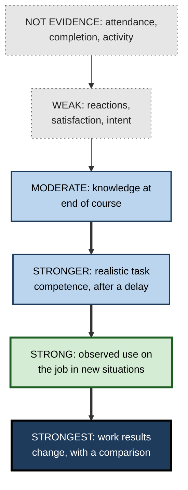
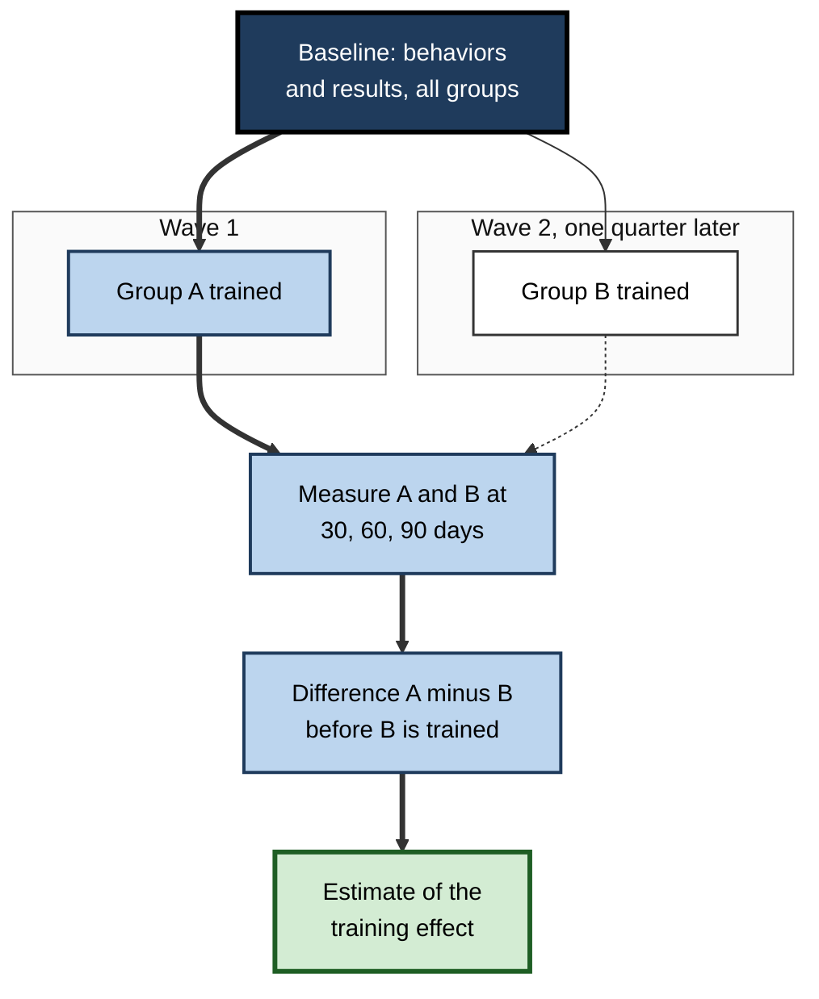

# M.11. Measuring Transfer Effectiveness

> **In one sentence:** Measuring transfer means checking whether people actually use what they learned in new, real situations, and whether that use improves results, rather than just asking whether they liked the learning or passed a quiz.
>
> **Why it matters:** What gets measured gets designed for. Organisations that measure only satisfaction and completion end up optimising for enjoyable, forgettable learning. Credible transfer measurement shows what works, justifies investment and reveals where the work environment blocks use.
>
> **Level span:** Novice → Expert · **Reading time:** ~17 min · **Builds on:** conditions that promote transfer; the difference between learning and performance

---

## The Learning Ladder

| Level | Badge | After this level you can... |
|---|---|---|
| 1 | NOVICE | Explain why "did you like it?" is not a measure of transfer. |
| 2 | FOUNDATIONS | Describe the main evaluation models and where transfer sits in each. |
| 3 | PRACTITIONER | Build a simple transfer measurement plan for a course or your own learning. |
| 4 | ADVANCED | Explain the research on what predicts transfer, common measurement biases and how researchers test transfer. |
| 5 | EXPERT / PRO | Run credible transfer evaluation at scale, including in AI-supported work, and report it to leaders. |

---

## Level 1 · Novice — The Big Picture

Imagine a cooking class. At the end, everyone says it was fun (reaction) and passes a quiz on the recipes (learning). A month later, nobody has cooked anything new at home. Did the class work? Not in the way that matters. **Transfer** is whether people cook differently at home, and **effectiveness** is whether their meals actually got better.

Analogy: a gym can count how many people sign up, how many attend and how many enjoy the music. None of these tell you whether members are fitter. To know that, you have to measure fitness itself, later, outside the gym.

You have already seen this when:

- A training rated "excellent" changed nothing in your team's behavior.
- A manager asked, months after a course, "so what are you doing differently?" and you struggled to answer.
- A new process stuck because someone checked, weeks later, whether people were using it.

The key idea: **measure the behavior where it matters, after a delay, not the feeling at the end.**

---

## Level 2 · Foundations — Core Concepts

### The main evaluation models

| Model | Levels or tiers | Where transfer sits |
|---|---|---|
| **Kirkpatrick** (from 1959, updated as the New World Kirkpatrick Model) | 1 Reaction, 2 Learning, 3 Behavior, 4 Results | Level 3 Behavior; Level 4 measures its effects. |
| **Phillips ROI** | Adds Level 5: return on investment | Level 3, with monetary conversion at Level 5. |
| **Learning-Transfer Evaluation Model (LTEM)**, Will Thalheimer, 2018 | 8 tiers: attendance, activity, learner perceptions, knowledge, decision-making competence, task competence, transfer, effects of transfer | Tier 7 Transfer and Tier 8 Effects, with competence tiers as leading indicators. |
| **Success Case Method**, Robert Brinkerhoff | Survey to find best and worst cases, then interview them | Documents concrete transfer stories and barriers. |
| **Learning Transfer System Inventory**, Elwood Holton and colleagues | 16 factors that help or hinder transfer | Diagnoses the environment, not transfer itself. |

### A useful distinction: knowing versus doing versus impact

1. **Can they?** Knowledge and competence, ideally tested in realistic tasks after a delay.
2. **Do they?** Transfer: actual use on the job, in new situations.
3. **Does it matter?** Effects: did work results improve because of that use?

**Figure M.11-1 — An evidence ladder for transfer.**

*How to read it:* evidence strengthens moving down; the thick arrows mark the steps most programmes skip.

### Key terms

| Term | Plain meaning |
|---|---|
| **Reaction measure** | Learners' opinions of the learning experience. |
| **Behavior (transfer) measure** | Evidence of actual use of learning on the job. |
| **Results measure** | Change in work outcomes, such as errors, sales or time. |
| **Leading indicator** | An early signal that predicts later results. |
| **Comparison group** | People who did not receive the learning, used to separate its effect from other causes. |
| **Same-source bias** | Inflated relationships when the same person rates both predictor and outcome at the same time. |
| **Time-to-proficiency** | How long it takes a new person to reach a defined performance standard. |
| **Unaided performance** | Performance without notes, help or AI tools. |

---

## Level 3 · Practitioner — Putting It to Work

### A seven-step transfer measurement plan

1. **Define the critical behaviors.** Two to four specific, observable actions that the learning should change ("runs a pre-mortem before each project kickoff").
2. **Link them to a result.** Which work metric should move if the behaviors happen (fewer late projects)?
3. **Take a baseline.** Measure behaviors and results before the learning.
4. **Choose sources.** Use at least two: for example, system data plus manager observation, or work samples plus peer ratings.
5. **Set the timing.** Check at about 30, 60 and 90 days; behavior needs time to appear and time to fade.
6. **Find a comparison.** A group trained later, a matched team, or a time series before and after.
7. **Collect barrier data.** Ask what helped and what blocked use; this tells you what to fix.

### Worked example — a code-review training for a 40-person engineering group

| | Before | After |
|---|---|---|
| **Measure used** | Satisfaction 4.6 of 5; 95% completion. | Critical behaviors: review comments that explain reasoning; reviews completed within one working day. |
| **Data source** | Survey. | Repository data (review timing, comment content sampled and rated by two seniors) plus a short developer survey on barriers. |
| **Timing** | End of course. | Baseline, then 30, 60, 90 days. |
| **Comparison** | None. | One team trained a quarter later served as comparison. |
| **Finding** | "Training successful." | Explanatory comments rose in the trained group; review speed improved only in teams whose leads protected review time, an environment finding. |

### Common mistakes

- **Stopping at reactions.** Satisfaction correlates weakly with learning and behavior.
- **Measuring too early.** End-of-course scores mostly reflect short-term performance.
- **Vague behaviors.** "Better leadership" cannot be measured; "holds a weekly one-to-one with each direct report" can.
- **Self-report only.** People overestimate their own transfer, and same-source designs inflate results.
- **No comparison.** Without one, you cannot tell training effects from seasonal trends, new tools or new managers.

---

## Level 4 · Advanced — Mechanisms, Models & Evidence

### What research says about measures

- **Reactions are weak predictors.** Meta-analytic work on training evaluation has repeatedly found only small relationships between how much trainees liked training and how much they learned or changed. Questions about perceived usefulness relate somewhat better than enjoyment.
- **Measurement design changes the answer.** In the 2010 meta-analysis by Blume and colleagues, relationships between predictors and transfer were stronger when both were measured by the same source at the same time, a sign of inflation. Multi-source, time-lagged designs give more realistic estimates.
- **Transfer decays.** Surveys of training professionals in the early 2000s estimated that a substantial share of trainees fail to use training soon after and a larger share a year later. These are expert estimates, not measurements, and should be quoted cautiously. The often-quoted claim that only 10% of training transfers has no empirical source.

### How researchers test transfer

| Method | What it shows |
|---|---|
| **Near and far transfer tests** | Problems that differ from training on chosen dimensions, given after a delay. |
| **Preparation-for-future-learning tests** | Learners receive a new learning resource; better prior learning shows up as faster or better learning from it. |
| **Delayed, unaided performance** | Whether capability lasts without support. |
| **Field experiments** | Random or staggered assignment of training in real organisations, with work outcomes. |
| **Observation and work samples** | Direct evidence of behavior, rated against defined criteria. |

### Measuring quantity and quality

Transfer has at least two dimensions: **how often** people use the learning (frequency) and **how well** they use it (quality and adaptation). Recent research also stresses **adaptive transfer**, where people adjust the learned skill to their context. Measures that only count exact replication can miss successful adaptation, and measures that only count frequency can miss poor-quality use.

**Figure M.11-2 — A measurement design that separates training effects from other causes.**

*How to read it:* staggering training lets the later group act as a comparison; the effect estimate comes from the gap before the second group is trained.

---

## Level 5 · Expert / Pro — Professional Mastery

### Building a transfer measurement system

| Component | What pros do |
|---|---|
| **Design-time agreement** | Agree critical behaviors, results and measures with business owners before building the learning. |
| **Data infrastructure** | Use operational data (CRM, code repositories, ticketing, quality systems) rather than surveys alone; learning record stores and standards such as xAPI can link learning activity to work data. |
| **Sampling and rating** | Sample work products and have trained raters score them against rubrics. |
| **Success Case interviews** | Interview top and bottom users to understand what enabled or blocked transfer. |
| **Environment diagnostics** | Use transfer-climate surveys to locate barriers. |
| **Reporting** | Report behavior and results, with uncertainty, alongside reactions. |

### AI-era measurement

AI tools create a new measurement problem: **assisted performance can mask a lack of transfer**. If a tool does the task, results may look fine even though people have not learned. Pros add three checks:

1. **AI-on versus AI-off comparisons** — periodic unaided tasks, especially for capabilities people must keep (judgement, error detection).
2. **Error-detection tasks** — work samples with planted AI errors to test whether people can catch them.
3. **Skill-retention monitoring** — tracking performance when tools fail or are unavailable. A 2025 observational study found colonoscopy specialists detected fewer precancerous growths without an AI aid after a period of using it, illustrating why such monitoring matters.

### Professional scenario

**Role:** Director of learning analytics at a large insurer.
**Situation:** The executive committee asks whether a two-million-dollar claims-handling programme "worked". Existing data show high satisfaction and completion.
**What the pro does:** Agrees four critical behaviors with claims leaders, such as documenting coverage reasoning and escalating complex claims early. Uses the staggered regional roll-out as a natural comparison. Samples claim files at baseline and 90 days and has two senior handlers rate them blind. Links behaviors to claims-leakage and cycle-time data. Runs eight success-case interviews to find barriers. Reports that behaviors improved in regions where team leads ran weekly file reviews, with smaller changes elsewhere, and recommends investing in team-lead coaching rather than more content.

### Ethics and limits

Measuring behavior can feel like surveillance. Pros are transparent about what is measured and why, use aggregate data for programme decisions, avoid using learning data punitively and separate development measurement from performance appraisal where possible.

---

## Myths vs. Evidence

| Myth | What the evidence shows |
|---|---|
| "High satisfaction means the training worked." | Reactions are weak predictors of learning and behavior. |
| "Only 10% of training transfers." | The figure has no empirical source; transfer varies widely. |
| "End-of-course test scores show transfer." | They mostly show immediate performance in the training context. |
| "Self-reported use is good enough." | Self-reports and same-source designs inflate transfer estimates. |
| "Business results can't be linked to training." | With critical behaviors, baselines and comparison groups, credible estimates are often possible. |

## Practitioner Toolkit

**Transfer measurement plan template**

| Element | Entry |
|---|---|
| Critical behaviors (2–4) | |
| Linked work results | |
| Baseline date and data | |
| Data sources (at least two) | |
| Measurement points (e.g., 30/60/90 days) | |
| Comparison group or design | |
| Barrier data collection | |
| Owner and report date | |

**Checklist**

- [ ] Behaviors are specific and observable.
- [ ] At least one measure is not self-report.
- [ ] Measurement happens after a delay.
- [ ] There is a comparison or baseline.
- [ ] Barriers to transfer are collected.
- [ ] For AI-supported tasks, unaided performance is checked.

## Self-Check

1. **[NOVICE]** Why is satisfaction not evidence of transfer?
2. **[NOVICE]** What is the difference between "can they" and "do they"?
3. **[FOUNDATIONS]** Where does transfer sit in the Kirkpatrick model and in LTEM?
4. **[FOUNDATIONS]** What does the Success Case Method do?
5. **[PRACTITIONER]** List the seven steps of a transfer measurement plan.
6. **[ADVANCED]** What is same-source bias and why does it matter?
7. **[ADVANCED]** What is a preparation-for-future-learning test?
8. **[EXPERT / PRO]** How can AI tools mask a lack of transfer, and how would you check?
9. **[EXPERT / PRO]** How can a staggered roll-out help estimate training effects?

### Answer Key

1. People can enjoy learning that does not change their behavior; reactions correlate weakly with learning and behavior.
2. "Can they" asks about competence; "do they" asks about actual use on the job.
3. Kirkpatrick Level 3 (Behavior); LTEM Tier 7 (Transfer), with Tier 8 for its effects.
4. Identifies the most and least successful participants through a survey, then interviews them to document impact and barriers.
5. Define critical behaviors; link to results; take a baseline; choose multiple sources; set timing; find a comparison; collect barrier data.
6. Relationships appear stronger when the same person rates both predictor and outcome at the same time; it inflates estimates of transfer.
7. A test that gives learners a new learning resource and measures how well prior learning helps them learn from it.
8. The tool performs the task, so outcomes look fine without people learning; check with unaided tasks, planted-error reviews and monitoring when tools are unavailable.
9. The later group serves as a comparison for the earlier group until it is trained, separating training effects from other changes.

## Key Takeaways

- Measure **behavior on the job, after a delay**, not just reactions or end-of-course scores.
- Define **critical behaviors** and link them to **results**.
- Use **multiple sources**, a **baseline** and a **comparison**.
- Collect **barrier data**; it tells you what to fix.
- The "10% transfer" claim is **folklore**.
- In AI-supported work, include **unaided and error-detection checks**.

## Glossary

| Term | Meaning |
|---|---|
| Adaptive transfer | Using learning in a modified form to fit a new context. |
| Comparison group | People without the learning, used to isolate its effect. |
| Critical behavior | A specific, observable action the learning should change. |
| Kirkpatrick model | Four-level evaluation: reaction, learning, behavior, results. |
| Leading indicator | An early signal predicting later results. |
| LTEM | Thalheimer's eight-tier Learning-Transfer Evaluation Model. |
| Same-source bias | Inflation when the same source rates predictor and outcome. |
| Success Case Method | Brinkerhoff's approach of studying best and worst cases. |
| Time-to-proficiency | Time for a new person to reach a performance standard. |
| Unaided performance | Performance without notes, help or AI. |
| xAPI | A data standard for recording learning experiences across systems. |
