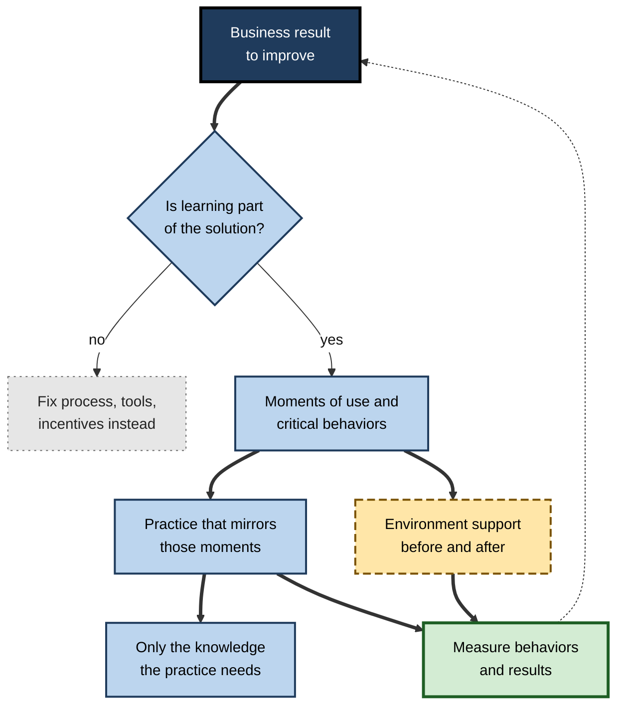
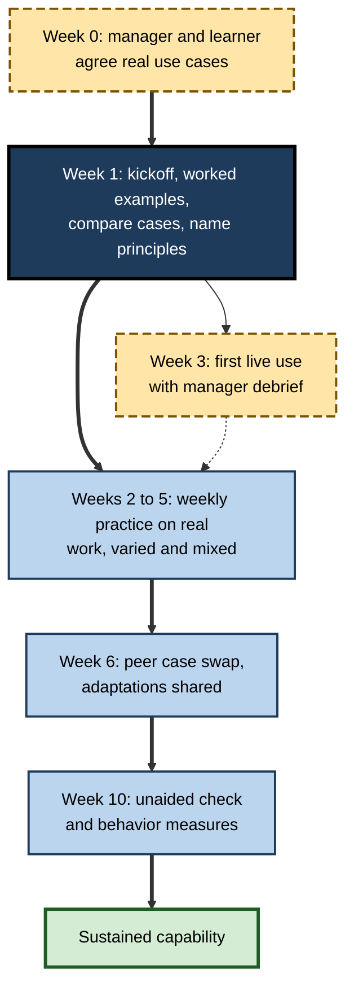

# M.12. Designing Learning for Maximum Transfer

> **In one sentence:** Designing for maximum transfer means starting from the real situations where people must perform, and working backward to build learning, practice and workplace support that carry capability all the way into those situations.
>
> **Why it matters:** This is where everything about transfer comes together. A transfer-first design process turns training from an event people attend into a capability the organisation can rely on, and it is increasingly how strong L&D teams, managers and educators prove their value.
>
> **Level span:** Novice → Expert · **Reading time:** ~18 min · **Builds on:** all earlier ideas about transfer: distance, similarity, conditions, variability, principles, analogy, processing match, teaching moves and measurement

---

## The Learning Ladder

| Level | Badge | After this level you can... |
|---|---|---|
| 1 | NOVICE | Explain why designing backward from the real task produces better transfer. |
| 2 | FOUNDATIONS | Name the stages of a transfer-first design process and the main design levers. |
| 3 | PRACTITIONER | Turn a training request into a transfer-focused design using a one-page blueprint. |
| 4 | ADVANCED | Justify each design choice with evidence and know which popular frameworks are weakly supported. |
| 5 | EXPERT / PRO | Lead transfer-first design across a portfolio, with stakeholders, AI tooling and measurement. |

---

## Level 1 · Novice — The Big Picture

Imagine planning a trip. You would not start by packing random things; you would start with where you are going, what the weather will be and what you will do there, then pack for that. Most training is designed the other way round: it starts with the content someone wants to cover and hopes it will be useful somewhere.

**Designing for transfer** starts with the destination: the real moments at work where people must act differently. Then it asks what practice, knowledge and support will get them there.

Analogy: a bridge is designed from both banks. One bank is the learning; the other is the workplace. If you only build from the learning side, the bridge ends in mid-air.

You have already experienced this when:

- A course had you practise on exactly the kind of problem you faced the next week, and you used it straight away. **Designed backward.**
- A course covered dozens of topics in two days and you used almost none of them. **Designed forward from content.**

The key idea: **design from the moment of use, not from the slide deck.**

---

## Level 2 · Foundations — Core Concepts

### The transfer-first design process

1. **Diagnose** — Is learning actually the solution? Many performance problems come from unclear expectations, missing tools, bad incentives or broken processes.
2. **Define moments of use** — the real situations where people must perform, and the critical behaviors there.
3. **Analyse transfer distance** — how far those moments are from any training context, and on which dimensions.
4. **Design practice** — realistic, varied, retrieval-based, with explicit principles and comparison.
5. **Design the environment** — before, during and after: manager roles, opportunity to use, job aids, peers.
6. **Build measurement in** — critical behaviors, baselines, comparisons.
7. **Pilot, measure, iterate.**

**Figure M.12-1 — Designing backward from the moment of use.**

*How to read it:* design flows from the result down; knowledge content comes after practice is designed, not before; the dotted arrow closes the loop back to the business result.

### The design levers

| Lever | What it does for transfer |
|---|---|
| **Realistic tasks (hugging)** | Shares cues and processes with the job, so near transfer is automatic. |
| **Varied practice** | Builds flexible representations that work in new variations. |
| **Explicit principles and comparison (bridging)** | Makes deep structure visible for farther transfer. |
| **Retrieval and spacing** | Makes knowledge durable and accessible when needed. |
| **Processing match** | Practice demands the same thinking the job demands. |
| **Similar-but-different contrasts** | Prevents negative transfer where old habits conflict. |
| **Action planning** | If-then plans tie learning to specific upcoming situations. |
| **Manager and peer support** | Creates opportunity, expectation and feedback. |
| **Performance support** | Job aids and tools at the moment of use. |
| **Measurement** | Shows what works and where the environment blocks use. |

### Key terms

| Term | Plain meaning |
|---|---|
| **Backward design** | Planning learning by starting from desired outcomes and evidence, then designing activities. |
| **Moment of use** | A real situation where the learning must be applied. |
| **Performance consulting** | Diagnosing whether a performance gap needs training or another fix. |
| **Action mapping** | A design method that starts from business goals and actions, then designs practice before content. |
| **Learning journey** | A sequence of spaced activities across weeks or months instead of a single event. |
| **Performance support** | Tools, aids or guidance used during work rather than before it. |
| **Learning in the flow of work** | Learning embedded in everyday tasks and tools. |

---

## Level 3 · Practitioner — Putting It to Work

### The one-page transfer blueprint

| Section | Questions to answer |
|---|---|
| **1. Result** | Which work metric should improve? By how much, by when? |
| **2. Diagnosis** | What, besides skill, contributes to the gap? What will we fix outside training? |
| **3. Moments of use** | List three to five real situations. Who, where, under what pressure, with what tools? |
| **4. Critical behaviors** | What must people do in each moment? |
| **5. Distance** | Which dimensions (time, setting, social, format) are far from training? |
| **6. Practice** | Realistic tasks; variation plan; mixed problem types; retrieval schedule. |
| **7. Principles** | Which few principles, compared across which cases? |
| **8. Negative-transfer risks** | Which old habits conflict, and how will we contrast them? |
| **9. Before / after** | Manager briefing, first-use opportunity, job aids, peer support, refreshers. |
| **10. Measurement** | Behaviors, sources, timing, comparison. |

### Worked example — "We need a presentation-skills course"

| | Before (content-first) | After (transfer-first) |
|---|---|---|
| **Request** | Two-day presentation skills course for analysts. | Diagnosis shows the real problem: analysts' updates to executives run long and bury the recommendation. |
| **Moments of use** | Not defined. | Weekly 10-minute executive updates; ad-hoc questions in steering meetings. |
| **Practice** | Each participant gives one 10-minute talk on a topic of choice. | Repeated short updates on their real work, with an executive persona interrupting; varied audiences; "answer first" principle compared across good and bad real examples. |
| **Environment** | None. | Managers review one update per week for six weeks using a three-point checklist; template for "answer first" slides added to the shared drive. |
| **Measurement** | Satisfaction. | Executive ratings of update clarity at baseline and eight weeks; meeting overruns. |
| **Format** | Two consecutive days. | Half-day kickoff plus six weekly 30-minute practice sessions. |

### Common mistakes

- **Skipping diagnosis.** Training cannot fix a broken process or a conflicting incentive.
- **Content before practice.** Designing slides first leads to information-heavy, practice-light learning.
- **Event thinking.** A single workshop without spacing or follow-up rarely sustains behavior.
- **No owner for the after.** Without a named owner, follow-up does not happen.
- **Designing for the average case only.** Include edge cases and the similar-but-different situations where errors cluster.

---

## Level 4 · Advanced — Mechanisms, Models & Evidence

### Evidence behind the levers

| Lever | Evidence strength | Key boundary condition |
|---|---|---|
| Realistic, functional fidelity | Strong for near transfer | Physical realism matters less than functional and psychological match. |
| Varied and interleaved practice | Strong in the lab; good in applied settings | Novices need a consistent start; benefit largest for confusable types. |
| Comparison of cases | Strong | Cases need different surfaces, same structure. |
| Retrieval and spacing | Very strong for retention | Transfer benefits larger with broader, elaborative retrieval. |
| Problem solving before instruction | Moderate for conceptual transfer | Needs careful design and explicit instruction afterwards. |
| Implementation intentions | Moderate to strong for follow-through | Plans must be specific and tied to real cues. |
| Manager support and opportunity | Strong, especially for open skills | Weak for closed procedural skills. |
| Performance support | Good for closed, infrequent tasks | Can reduce learning if it replaces understanding people need. |

### Popular frameworks: what is and is not evidence-based

| Framework | Status |
|---|---|
| **Backward design** (Grant Wiggins and Jay McTighe, *Understanding by Design*) | A design logic, not a tested intervention, but highly consistent with transfer research; it names transfer as the ultimate goal. |
| **Action mapping** (Cathy Moore) | Practitioner method aligned with evidence: practice before content, start from business goals. |
| **70-20-10** | Originated in surveys of successful executives about where they learned; the ratio is not an evidence-based design rule. Useful only as a reminder that most learning happens through work. |
| **Learning styles matching** | Not supported: matching instruction to preferred style does not improve learning. |
| **"Microlearning" alone** | Short modules help spacing and access, but brevity alone does not create transfer. |

### Designing for adaptive transfer

Recent work on workplace transfer emphasises that people do not simply copy what they learned; they **adapt** it to their context. Designs that encourage adaptation include practising across varied contexts, explaining the principle behind a procedure, letting learners plan their own application, and capturing how people adapted the skill so others can learn from it.

**Figure M.12-2 — A transfer-designed learning journey over ten weeks.**

*How to read it:* the thick path is a spaced journey rather than an event; dashed-border boxes are environment touchpoints, and the dotted arrow shows live use feeding back into practice.

---

## Level 5 · Expert / Pro — Professional Mastery

### Portfolio-level practice

Senior learning leaders apply transfer-first design across whole portfolios:

- **Triage requests**: run a short diagnosis for every training request; redirect non-training problems.
- **Tier by transfer need**: compliance awareness may need only near transfer and performance support; leadership and complex judgement need full journeys with environment design.
- **Standardise the blueprint**: every programme above a cost threshold has a one-page transfer blueprint and a measurement plan.
- **Partner with managers**: equip managers with short coaching routines; they are the most powerful transfer lever for open skills.
- **Close the loop**: retire or redesign programmes whose behavior data stay flat.

### AI-era design

Generative AI changes what is possible and what is risky:

| Opportunity | Risk | Design response |
|---|---|---|
| Unlimited realistic, varied practice cases and role-play partners | Cases may be unrealistic or wrong | Expert review; specify the dimensions to vary. |
| Personal tutoring and feedback at scale | Answer-giving can replace the learner's thinking | Configure as hint-first tutor; require learner attempts; unaided checks. |
| Performance support in the flow of work | Dependence; skills never form or decay | Decide which capabilities must live in people; test those without the tool. |
| Analytics linking learning to work data | Surveillance concerns | Transparency, aggregate use, separation from appraisal. |

Field evidence from 2025 showed that a hint-based AI tutor protected unaided exam performance while an unrestricted assistant harmed it; other randomised trials found well-designed AI tutors improved learning. The lesson for designers is that **tool design and usage rules decide whether AI helps or hinders transfer**.

### Professional scenario

**Role:** Head of L&D for a global professional-services firm.
**Situation:** The firm must upskill 5,000 consultants to use AI tools on client work responsibly within a year.
**What the pro does:** Rejects a single e-learning module. Defines moments of use: scoping an analysis with AI, verifying AI-generated outputs, explaining AI-supported findings to clients. For each, builds practice on realistic, varied client cases, including outputs with planted errors and contrasts with pre-AI workflows where old habits conflict. Engagement managers run fortnightly 20-minute reviews of how teams used AI. Measures include rated quality of verification notes in sampled deliverables, error rates caught in quality review and periodic unaided analysis tasks. Uses a staggered roll-out by region as a comparison and adjusts the design after the first wave.

### Ethical limits

Designing for transfer gives organisations real influence over how people think and behave. Pros respect learner autonomy, explain why practice is designed as it is, avoid manipulative incentives, protect data and keep in mind that the purpose is capability that serves both the organisation and the person's career.

---

## Myths vs. Evidence

| Myth | What the evidence shows |
|---|---|
| "More content means more value." | Transfer depends on practice, variation and support, not on volume of content. |
| "The 70-20-10 ratio is research-based." | It comes from executive surveys and is not a validated design rule. |
| "A great workshop is enough." | Without spacing, opportunity to use and support, behavior often fades. |
| "Matching learning styles improves transfer." | Not supported by evidence. |
| "AI tutors automatically improve learning." | Outcomes depend on design: hint-first tutors can help; answer-giving tools can harm unaided performance. |
| "Training is the answer to performance problems." | Many gaps come from processes, tools or incentives; diagnosis comes first. |

## Practitioner Toolkit

**Transfer-design review checklist**

- [ ] The business result and critical behaviors are defined.
- [ ] A diagnosis confirmed learning is part of the solution.
- [ ] Moments of use are described in detail.
- [ ] Practice mirrors those moments in process and conditions.
- [ ] Practice is varied, mixed and spaced.
- [ ] Principles are explicit and taught through compared cases.
- [ ] Similar-but-different risks are contrasted.
- [ ] Learners make if-then plans tied to real upcoming situations.
- [ ] Managers have a defined before and after role.
- [ ] Performance support is available at the moment of use.
- [ ] Measurement includes behavior, delay, a comparison and, for AI-supported tasks, unaided checks.

**Blueprint template**

| Section | Entry |
|---|---|
| Result | |
| Diagnosis | |
| Moments of use | |
| Critical behaviors | |
| Distance analysis | |
| Practice design | |
| Principles and cases | |
| Negative-transfer risks | |
| Before / after support | |
| Measurement | |

## Self-Check

1. **[NOVICE]** What does "designing backward" mean?
2. **[NOVICE]** Why does content-first design often fail to transfer?
3. **[FOUNDATIONS]** List the seven stages of the transfer-first design process.
4. **[FOUNDATIONS]** Name five design levers for transfer.
5. **[PRACTITIONER]** What goes in a one-page transfer blueprint?
6. **[ADVANCED]** What is the evidence status of 70-20-10?
7. **[ADVANCED]** Why design for adaptive transfer?
8. **[EXPERT / PRO]** How should AI tutors be configured to protect transfer?
9. **[EXPERT / PRO]** How would you tier a training portfolio by transfer need?

### Answer Key

1. Starting from the real moments of use and desired results, then designing practice, content and support to reach them.
2. It covers what someone wants to teach rather than what people must do, so practice and support for real situations are missing.
3. Diagnose; define moments of use; analyse distance; design practice; design the environment; build measurement in; pilot and iterate.
4. Any five of: realistic tasks, varied practice, explicit principles and comparison, retrieval and spacing, processing match, contrasts for negative transfer, action planning, manager and peer support, performance support, measurement.
5. Result, diagnosis, moments of use, critical behaviors, distance, practice, principles, negative-transfer risks, before/after support, measurement.
6. It originated in executive surveys; the ratio is not a validated design rule.
7. People adapt skills to their context; designs that support and capture adaptation produce more flexible and useful transfer.
8. As hint-first tutors that require the learner's attempt, with unaided checks to confirm capability.
9. Match design intensity to transfer need: near-transfer tasks get practice and performance support; complex, open skills get full journeys with environment design and measurement.

## Key Takeaways

- Design **backward from moments of use**, not forward from content.
- **Diagnose first**: not every performance gap is a learning problem.
- Combine **realistic, varied, spaced practice** with **explicit principles** and **environment support**.
- Treat learning as a **journey** with managers involved before and after.
- Several popular frameworks, such as **70-20-10 ratios and learning styles**, are not evidence-based design rules.
- In the AI era, **tool design decides** whether AI builds or replaces capability; measure unaided performance.

## Glossary

| Term | Meaning |
|---|---|
| 70-20-10 | A popular claim about where people learn at work; not an evidence-based ratio. |
| Action mapping | Design starting from business goals and actions, with practice before content. |
| Adaptive transfer | Modifying learned skills to fit a new context. |
| Backward design | Planning from desired outcomes and evidence to activities. |
| Learning in the flow of work | Learning embedded in everyday tasks and tools. |
| Learning journey | Spaced learning activities across weeks or months. |
| Moment of use | A real situation where learning must be applied. |
| Performance consulting | Diagnosing whether a gap needs training or another fix. |
| Performance support | Tools and aids used during work. |
| Transfer blueprint | A one-page plan linking results, moments of use, practice, support and measurement. |
