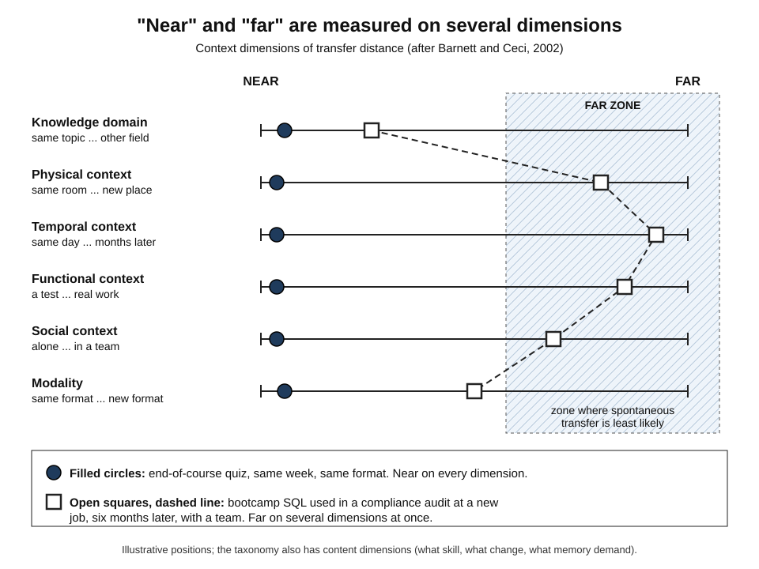
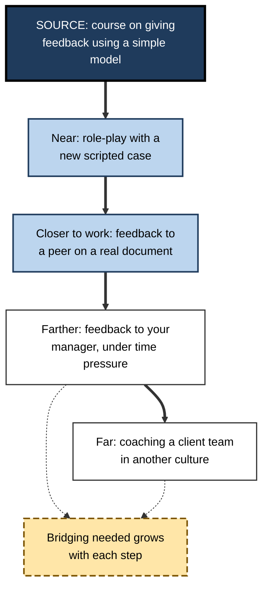
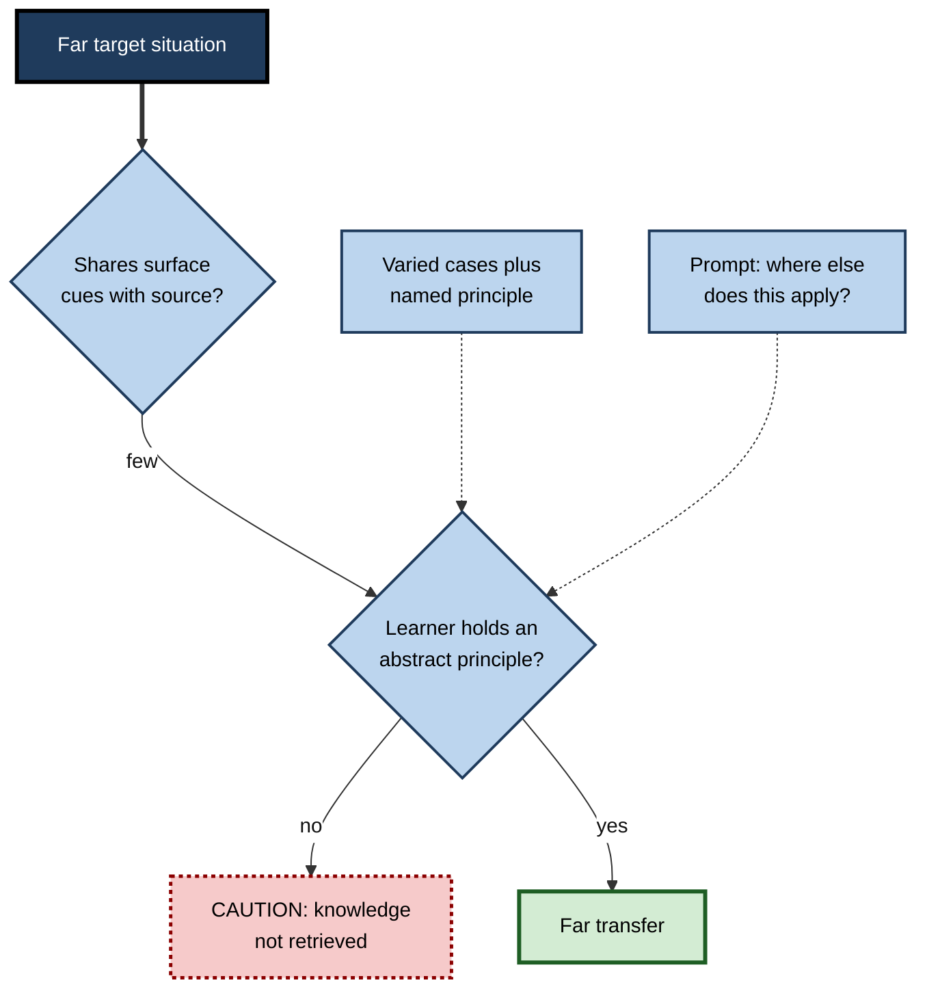

# M.2. Near Transfer vs. Far Transfer

> **In one sentence:** Near transfer is using what you learned in a situation that closely resembles where you learned it; far transfer is using it in a situation that looks and feels very different.
>
> **Why it matters:** Near transfer is dependable and can be engineered; far transfer is precious but rare and often over-promised. Knowing the difference stops you from buying "brain training" that will not pay off, and helps you design learning that reaches as far as the job really requires.
>
> **Level span:** Novice → Expert · **Reading time:** ~16 min · **Builds on:** what transfer of learning is; surface features versus deep structure

---

## The Learning Ladder

| Level | Badge | After this level you can... |
|---|---|---|
| 1 | NOVICE | Tell near and far transfer apart with everyday examples. |
| 2 | FOUNDATIONS | Describe transfer distance as several dimensions, not one. |
| 3 | PRACTITIONER | Estimate how far a training-to-job jump is and plan the right amount of bridging. |
| 4 | ADVANCED | Summarise what meta-analyses say about far transfer from brain training, chess, music, programming and critical-thinking courses. |
| 5 | EXPERT / PRO | Make honest promises about transfer, challenge vendor claims, and build programmes that extend reach step by step. |

---

## Level 1 · Novice — The Big Picture

Imagine learning to ride a bicycle. Riding a slightly different bicycle is **near transfer**: almost everything is the same. Using your sense of balance to learn a scooter is a bit further. Using "keep your eyes on where you want to go, not on the obstacle" when steering a difficult conversation at work is **far transfer**: the setting, the purpose and the actions are all different, and only a deep idea carries over.

An analogy: near transfer is like taking a key from your front door to your back door, which is a similar lock. Far transfer is like realising your front-door key is the right shape to open a parcel. The first is easy and expected; the second requires you to see something in a new way.

You have already experienced both when:

- You moved from one email app to another and were productive within minutes. **Near transfer.**
- You used the logic of a family budget to plan a project's resources. **Farther transfer.**
- You did hours of puzzle apps hoping to become "sharper" at work and noticed no difference. **Hoped-for far transfer that did not happen,** which is the typical result.

The key idea: **the more different the new situation is, the less likely learning is to travel there on its own.**

---

## Level 2 · Foundations — Core Concepts

### Distance is not one number

Early researchers spoke of near and far as if they were a single scale. In 2002, Susan Barnett and Stephen Ceci showed that the terms had been used inconsistently and proposed a taxonomy with **content** dimensions (what is transferred) and **context** dimensions (when and where).

| Group | Dimension | Near end | Far end |
|---|---|---|---|
| Content | Learned skill | A specific procedure | A general principle or strategy |
| Content | Performance change | Speed | Accuracy or approach |
| Content | Memory demand | Just execute | Recognise, recall and then execute |
| Context | Knowledge domain | Same topic | Different field |
| Context | Physical context | Same room | Different place |
| Context | Temporal context | Same session | Months or years later |
| Context | Functional context | Same purpose (a test) | Different purpose (real work, play) |
| Context | Social context | Alone, as in training | With others, in a team |
| Context | Modality | Same format | Different format (written versus spoken) |

*Figure M.2-1 — Transfer distance across six context dimensions.* Filled circles: an end-of-course quiz is near on every dimension. Open squares on a dashed line: using a bootcamp SQL skill in a compliance audit at a new job, months later and in a team, is far on several dimensions at once. Positions are illustrative.

### Key terms

| Term | Plain meaning |
|---|---|
| **Near transfer** | Applying learning to a target that shares most features with the source. |
| **Far transfer** | Applying learning to a target that differs on many dimensions. |
| **Transfer distance** | How different the target is from the source, judged on several dimensions. |
| **Specific transfer** | Transfer of particular facts or procedures. |
| **General transfer** | Transfer of broad strategies, principles or dispositions. |
| **Cognitive training** | Practice on tasks designed to improve general mental abilities such as working memory. |
| **Placebo effect (in training studies)** | Improvement caused by expectation, not by the training itself. |
| **Active control group** | A comparison group that does a believable alternative activity, which makes placebo effects visible. |

**Figure M.2-2 — From near to far: a ladder of transfer for one skill.**

*How to read it:* each step down moves farther from the source on more dimensions; the dashed box notes that design support must increase as distance grows.

---

## Level 3 · Practitioner — Putting It to Work

### The transfer-distance estimate — a five-step method

1. **Describe the source precisely.** Format, setting, tools, social setup, time, examples used.
2. **Describe the target precisely.** What will the real situation look like, with what pressure and which people?
3. **Score each dimension.** For each of the six context dimensions, mark near, middle or far.
4. **Count the far marks.** Zero or one: near transfer, ordinary practice will do. Two or three: medium, add varied practice and explicit principles. Four or more: far, add bridging steps, on-the-job practice and support.
5. **Close the gap from both ends.** Move training closer to the target (realistic cases, real tools) and move the target closer to training (job aids, cues, coaching).

### Worked example — security awareness training

| | Before | After |
|---|---|---|
| **Source** | Annual video plus multiple-choice quiz on phishing. | Short monthly sessions plus simulated phishing in the real inbox. |
| **Target** | A convincing message in a busy inbox, months later. | Same. |
| **Distance score** | Far on time, function, modality and physical context: four far marks. | Near on modality and physical context, medium on time. |
| **Result pattern** | High quiz scores; little change in real-world reporting. | Reporting of suspicious messages rises; click-through falls over successive simulations. |

The content did not change much. What changed was the distance between practice and use.

### Common mistakes

- **Treating "far" as one thing.** A task can be near in content and far in time; fix the dimension that is actually far.
- **Assuming similar-sounding equals near.** A spreadsheet course and a database job share vocabulary but may differ deeply.
- **Promising far transfer from near-transfer training.** A course on one tool will not make people "more digital" in general.
- **Ignoring time.** Temporal distance alone causes a lot of transfer failure; spaced follow-up practice is cheap insurance.

---

## Level 4 · Advanced — Mechanisms, Models & Evidence

### Why near transfer is easier

Retrieval of knowledge is driven by **cues**, features of the current situation that match features stored with the memory. Near targets share many cues, so the right knowledge comes to mind automatically. Far targets share few surface cues, so success depends on recognising **deep structure**, which requires an abstract representation the learner may not have formed. This is the logic behind David Perkins and Gavriel Salomon's distinction between **low-road** transfer (automatic, cue-driven, built by lots of varied practice) and **high-road** transfer (mindful abstraction and search).

### The far-transfer evidence, field by field

| Claimed source of far transfer | What large syntheses show | Confidence |
|---|---|---|
| **Working-memory training** | Reliable near transfer to similar memory tasks; far transfer to reasoning, school achievement or intelligence close to zero once active controls and publication bias are handled. | High; repeatedly confirmed. |
| **Commercial brain games** | Improvement mainly on the trained games and very similar tasks. | High. |
| **Chess and music instruction** | Apparent benefits for school skills shrink with better study designs; the best-designed studies show little or none. | Moderate to high. |
| **Video games** | Some gains in specific perceptual skills; broad cognitive far transfer not established. | Moderate; debated. |
| **Learning to program** | A 2019 meta-analysis by Ronny Scherer and colleagues found strong near transfer and moderate transfer to skills such as mathematics, creative thinking and reasoning. | Moderate; positive but study-quality concerns remain. |
| **Critical-thinking instruction** | Philip Abrami's meta-analyses show critical thinking can be taught, most effectively when explicit and embedded in subject matter with real discussion and authentic problems. | Moderate to high for near-domain gains. |

Gobet and Sala summarised the cognitive-training field in 2023 as "a field in search of a phenomenon": after accounting for sampling error, placebo, control-group type and publication bias, the far-transfer effect across many forms of training was essentially null and did not differ much by training type. A striking pattern across these syntheses is that **effect sizes shrink as study quality rises**.

### So does far transfer ever happen?

Yes, but usually not as a free side effect. Far transfer is more likely when:

- the learner has formed an explicit, abstract principle;
- the principle was learned through several varied cases;
- the learner has been prompted to look for where else it applies;
- the target situation gives some cue that the principle is relevant;
- the learner has strong knowledge in the target domain too.

**Figure M.2-3 — Why far transfer usually fails, and the routes that rescue it.**

*How to read it:* without shared cues, far transfer depends on an abstract principle; dotted arrows show the two design routes that build one.

### Open debates

- **Is "far" even the right frame?** Situated-cognition researchers argue that the question should be how people participate in new practices, not whether a mental item moves.
- **Long-run, broad education.** Years of schooling do appear to raise measured intelligence, a broad effect that short training programmes do not reproduce. Why is debated: it may reflect accumulated knowledge across many domains rather than a trained general capacity.
- **Programming and critical thinking** remain the most contested "general skill" claims; effects are positive in syntheses but strongest close to the trained domain.

---

## Level 5 · Expert / Pro — Professional Mastery

### Making honest promises

Senior L&D leaders and managers avoid two opposite errors: promising far transfer that will not happen ("this logic-puzzle programme will improve strategic thinking") and settling for near transfer when the job needs more ("they passed the tool certification, so they are ready for client work"). A defensible stance is: **train near, design deliberately for the next ring out, and support the far ring on the job.**

| Ring | What it looks like | How pros design for it |
|---|---|---|
| Near | Same tasks, same tools, new instances | Plenty of practice, retrieval, spaced review. |
| Middle | Same principle, different products, clients or data | Varied cases, explicit principles, comparison of examples. |
| Far | New roles, domains, cultures, unprecedented problems | Stretch assignments with coaching, communities of practice, after-action reviews, building domain knowledge in the new field. |

### Evaluating vendor claims

When a vendor promises general cognitive benefits, ask for: randomised studies with **active** control groups, outcome measures different from the trained tasks, delayed follow-up, independent replication, and effects on real work outcomes. Most "brain training for the workforce" offers fail this checklist.

### AI-era implications

Generative AI is a powerful near-transfer amplifier (it applies patterns to new instances instantly) and a weak substitute for human far transfer, which depends on recognising that a situation is novel and choosing what principle applies. Professionals therefore emphasise the human ability to notice when a familiar-looking case is actually different, and to question AI output when the situation is outside the patterns the tool has seen.

### Professional scenario

**Role:** Engineering manager moving a team from monolith development to cloud-native services.
**Situation:** Leadership bought a general "systems-thinking" e-learning course and expects better architecture decisions.
**What the pro does:** Treats the course as, at best, vocabulary. She maps the transfer distance: the target (designing resilient services in their own stack) is far from generic examples on most dimensions. She adds architecture decision records on real services, weekly design reviews comparing two past incidents with the same underlying failure pattern, and pairing with an experienced platform engineer. She measures incident recurrence and review quality, and quietly reports that the e-learning showed no measurable effect on its own.

---

## Myths vs. Evidence

| Myth | What the evidence shows |
|---|---|
| "Brain games make you smarter at work." | Gains stay close to the trained games; far transfer is near zero in high-quality studies. |
| "Learning chess or music boosts school and work performance generally." | Benefits shrink or vanish in well-controlled studies. |
| "Near transfer is trivial, so we do not need to plan for it." | Even near transfer fails when practice is thin, unvaried or long ago. |
| "Far transfer never happens." | It happens, but mostly through explicit principles, varied cases, prompting and support, not as a free by-product. |
| "Similar topic means near transfer." | Distance has many dimensions; time, setting and purpose can make a same-topic task far. |

## Practitioner Toolkit

**Transfer-distance scorecard**

| Dimension | Near | Middle | Far | Design action if far |
|---|---|---|---|---|
| Knowledge domain | | | | Teach principle with cases from both domains |
| Physical context | | | | Practise in the real setting or a realistic simulation |
| Temporal context | | | | Spaced follow-up practice and refreshers |
| Functional context | | | | Use real work tasks, not quizzes |
| Social context | | | | Team practice, role-plays with real roles |
| Modality | | | | Practise in the format of use |

**Vendor-claim checklist**

- [ ] Randomised design with an active control group
- [ ] Outcomes measured on tasks unlike the training tasks
- [ ] Delayed follow-up, not just immediate post-test
- [ ] Independent replication
- [ ] Evidence on work outcomes, not only test scores

## Self-Check

1. **[NOVICE]** Give one example each of near and far transfer from your life.
2. **[NOVICE]** Why is far transfer harder?
3. **[FOUNDATIONS]** Name four context dimensions of transfer distance.
4. **[FOUNDATIONS]** Why does an active control group matter in brain-training research?
5. **[PRACTITIONER]** A course is near in content but far in time and function. What would you add?
6. **[ADVANCED]** What do second-order meta-analyses conclude about far transfer from working-memory training?
7. **[ADVANCED]** Which "general skills" claims have the most positive, though contested, evidence?
8. **[EXPERT / PRO]** What questions would you ask a vendor promising general cognitive gains?
9. **[EXPERT / PRO]** Describe the three-ring approach to designing for transfer.

### Answer Key

1. Answers vary; for example near: switching from one word processor to another; far: using negotiation principles from buying a car in a salary discussion.
2. The target shares few surface cues, so the knowledge is not automatically triggered; success depends on recognising deep structure.
3. Any four of: knowledge domain, physical, temporal, functional, social, modality.
4. It reveals improvement caused by expectation and engagement rather than by the training itself.
5. Spaced follow-up practice over time and practice on real work tasks, plus cues or job aids at the point of use.
6. Near transfer to similar memory tasks is reliable, but far transfer is essentially null once placebo, control type and publication bias are handled.
7. Learning to program and explicit, subject-embedded critical-thinking instruction.
8. Active controls, untrained outcome measures, delayed follow-up, independent replication and work-outcome evidence.
9. Train near with ample practice; design for the middle ring with varied cases and explicit principles; support the far ring on the job with stretch work, coaching and reflection.

## Key Takeaways

- **Near transfer** is reliable and designable; **far transfer** is rare and often over-promised.
- Distance has **many dimensions**: domain, place, time, purpose, social setting and format.
- Meta-analyses find **no meaningful far transfer** from brain training, working-memory training, chess or music once studies are well controlled.
- Far transfer becomes more likely with **explicit principles, varied cases and prompts** to look for applications.
- **Effects shrink as study quality rises**; be sceptical of glossy claims.
- Design in **rings**: near in training, middle by design, far with on-the-job support.

## Glossary

| Term | Meaning |
|---|---|
| Active control group | A comparison group given a credible alternative activity. |
| Cognitive training | Practice designed to improve general mental capacities. |
| Content dimensions | Aspects of what is transferred: skill, performance change, memory demand. |
| Context dimensions | Aspects of where and when transfer happens: domain, place, time, function, social, modality. |
| Far transfer | Transfer to a target that differs on many dimensions. |
| General transfer | Transfer of broad strategies or dispositions. |
| High-road transfer | Mindful, principle-based transfer. |
| Low-road transfer | Automatic, cue-driven transfer from extensive practice. |
| Near transfer | Transfer to a target similar to the source. |
| Publication bias | The tendency for positive results to be published more than null results. |
| Second-order meta-analysis | A synthesis of several meta-analyses. |
| Transfer distance | The degree of difference between source and target. |
