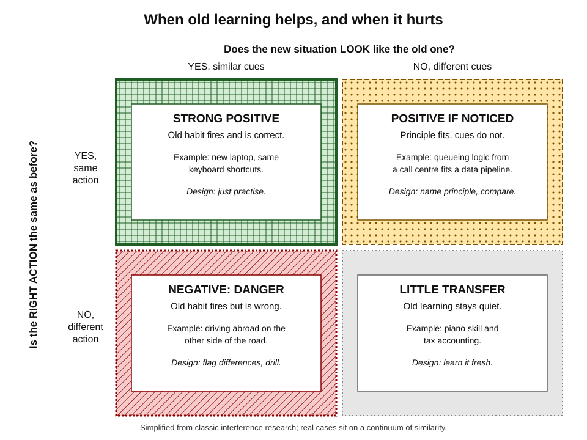
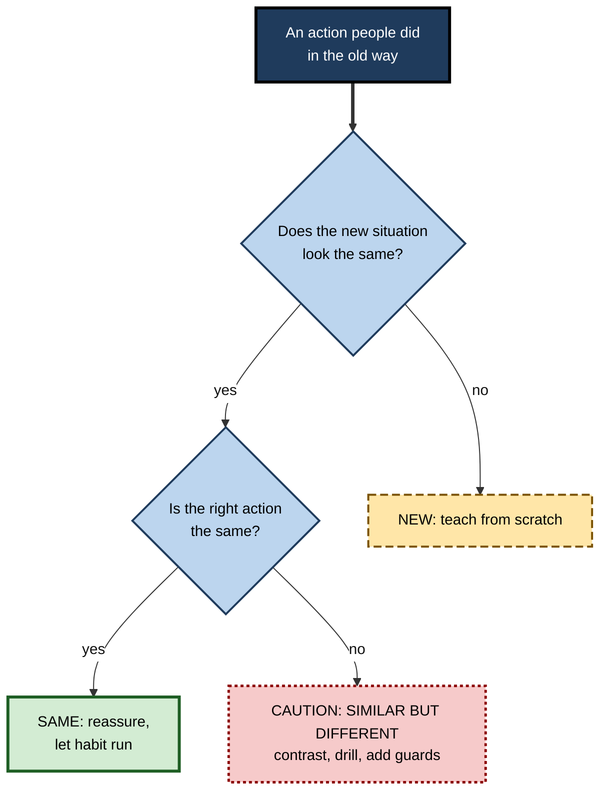
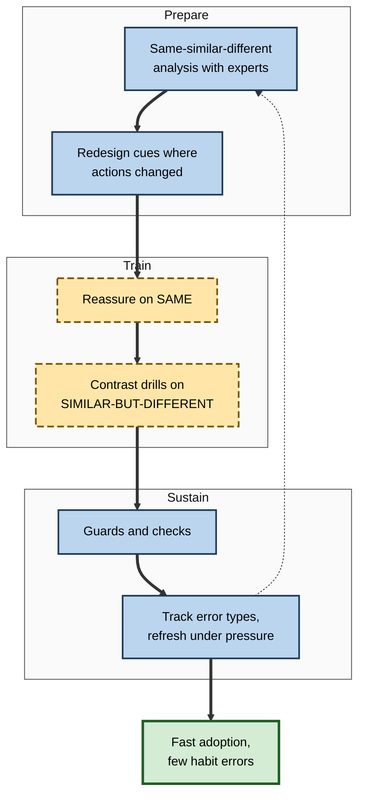

# M.3. Positive vs. Negative Transfer

> **In one sentence:** Positive transfer is when something you already know makes a new task easier; negative transfer is when something you already know makes a new task harder or causes mistakes.
>
> **Why it matters:** Every reorganisation, tool migration, language switch and career move mixes both. Professionals who can predict where old habits will help and where they will bite can speed up change, prevent costly errors and design safer systems.
>
> **Level span:** Novice → Expert · **Reading time:** ~16 min · **Builds on:** what transfer of learning is; the difference between surface cues and the action required

---

## The Learning Ladder

| Level | Badge | After this level you can... |
|---|---|---|
| 1 | NOVICE | Recognise when old knowledge is helping you and when it is tripping you up. |
| 2 | FOUNDATIONS | Use the similarity rule to predict positive and negative transfer. |
| 3 | PRACTITIONER | Run a "same, similar, different" analysis before switching tools, languages or processes. |
| 4 | ADVANCED | Explain interference, mental set and expert entrenchment, and what research says about each. |
| 5 | EXPERT / PRO | Design training, interfaces and change programmes that harvest positive transfer and neutralise negative transfer. |

---

## Level 1 · Novice — The Big Picture

When you learn a second language, your first language helps you: many words look alike, and you already understand what a verb is. That is **positive transfer**. But your first language also makes you say things the wrong way, using its word order or a "false friend" word that looks the same but means something else. That is **negative transfer**, sometimes called **interference**.

Analogy: old knowledge is like a well-worn path in a field. If your new destination is along the same route, the path speeds you up. If your new destination branches off at a slightly different angle, your feet keep following the old path and you end up in the wrong place.

You have already experienced both when:

- You changed to a new car of the same brand and drove off confidently. **Positive transfer.**
- You rented a car where the indicator and wiper stalks were swapped, and turned on the wipers at every corner. **Negative transfer.**
- You moved from one spreadsheet program to another and kept pressing the old shortcut, which did something different. **Negative transfer.**

The key idea: **old learning helps when the new situation needs the same action, and hurts when the new situation looks the same but needs a different action.**

---

## Level 2 · Foundations — Core Concepts

### The similarity rule

Classic research on verbal learning, summarised by Charles Osgood in 1949, showed that whether prior learning helps or hurts depends on two kinds of similarity:

1. **Cue similarity** — how much the new situation looks like the old one.
2. **Response similarity** — how much the correct action is the same.

The dangerous combination is **similar cues with a different correct response**. The old response is triggered automatically, and it is wrong.

*Figure M.3-1 — When old learning helps and when it hurts.* Thick solid border with grid pattern: strong positive transfer. Long-dashed border with dots: positive only if the learner notices the link. Dotted border with diagonal hatching: negative transfer, the danger zone. Sparse dotted grey: little transfer either way.

### Key terms

| Term | Plain meaning |
|---|---|
| **Positive transfer** | Prior learning makes new performance or learning faster or better. |
| **Negative transfer** | Prior learning makes new performance or learning slower or more error-prone. |
| **Zero transfer** | Prior learning has no measurable effect. |
| **Interference** | Competition between memories or habits that causes errors or forgetting. |
| **Proactive interference** | Older learning disrupts newer learning ("I keep typing my old password"). |
| **Retroactive interference** | Newer learning disrupts older learning ("after learning Spanish my French got worse"). |
| **Mental set (Einstellung)** | A tendency to keep using a familiar approach even when a better one exists. |
| **Functional fixedness** | Seeing an object or tool only in its usual role. |
| **False friend** | A word or concept that looks familiar but means something different. |

### Where you meet each type at work

| Situation | Typical positive transfer | Typical negative transfer |
|---|---|---|
| New programming language | Loops, functions, debugging habits | Equality rules, indexing, memory model differ |
| New CRM or ERP | Customer and pipeline concepts | Different meaning of the same field names |
| New country or culture | Professional skills, domain knowledge | Meeting norms, directness, hierarchy cues |
| Promotion to manager | Domain expertise, credibility | "Fix it myself" reflex, solving instead of coaching |
| New version of a process | Most steps unchanged | The one step that changed |

---

## Level 3 · Practitioner — Putting It to Work

### The "same, similar, different" analysis

Use this before any switch: a new tool, language, process, role or market.

1. **List the core actions** in the old and new situations side by side.
2. **Mark each pair:** SAME (cue and action both match), SIMILAR-LOOKING BUT DIFFERENT (cue matches, action differs), or NEW (nothing comparable).
3. **Lean on the SAME items.** Tell people explicitly "this works exactly as before" so they stop worrying and move quickly.
4. **Spotlight the SIMILAR-BUT-DIFFERENT items.** These are where errors will cluster. Name them, show a side-by-side contrast, and drill the new response until it is reliable.
5. **Teach the NEW items as new.** Do not dress them up as variations of something familiar.
6. **Add guards.** For high-risk differences, add checklists, confirmations, distinctive visual cues or automated checks.

**Figure M.3-2 — Triage of prior knowledge before a switch.**

*How to read it:* every old action is sorted into one of three bins; the dotted-border bin is where training and safeguards should concentrate.

### Worked example — moving a team from one cloud provider to another

| | Before | After |
|---|---|---|
| **Approach** | Generic two-day course on the new provider. | Same-similar-different table built with the team's senior engineers. |
| **Same** | Not mentioned; engineers anxious about everything. | Core networking and container concepts flagged as "works as you know". |
| **Similar but different** | Covered in passing. | Identity and permission model, default network rules and storage naming flagged as high-risk, with side-by-side examples and a hands-on lab for each. |
| **Guards** | None. | Policy-as-code checks for the permission differences. |
| **Outcome pattern** | Misconfigurations traced to "it worked like that before". | Errors concentrate early and drop quickly; fewer production incidents. |

### Common mistakes

- **Selling a change as "basically the same".** It reassures people but hides the dangerous differences.
- **Treating everything as new.** It wastes the large positive transfer people bring and insults experienced staff.
- **Relying on "be careful".** Warnings do little against automatic habits; contrast drills and design guards work better.
- **Ignoring retroactive effects.** After a switch, people who must still use the old system part-time make more errors in both.

---

## Level 4 · Advanced — Mechanisms, Models & Evidence

### Why negative transfer happens

Practised responses become **automatic**: they fire quickly when their cues appear, without conscious checking. That speed is the benefit of expertise. Negative transfer is its cost. When a familiar cue appears in a new context with a different correct response, the old response is retrieved first and must be actively suppressed. Under time pressure, fatigue or distraction, suppression fails.

### Four forms of negative transfer

| Form | Classic evidence | Workplace version |
|---|---|---|
| **Habit interference** | Paired-associate learning studies showed that learning new responses to old cues was slower and error-prone. | Shortcut and control conflicts between tools. |
| **Design-induced error** | After the Second World War, Paul Fitts and Richard Jones analysed hundreds of pilot "errors" and found many came from inconsistent control layouts across aircraft types. Shape-coded controls followed. | Inconsistent interfaces across products, devices or versions. |
| **Mental set** | Abraham Luchins's water-jar problems in 1942: people who learned a complicated formula kept using it even when a simple solution existed. | Re-using last project's architecture or playbook when the problem has changed. |
| **Expert entrenchment** | Research on cognitive entrenchment suggests deep expertise can reduce flexibility when the rules of a domain change. Evidence is mixed and context-dependent. | Senior staff resisting a new paradigm because the old one made them successful. |

### Language as the classic case

Second-language research has long documented both directions. First-language grammar, sounds and vocabulary speed up learning where languages align and produce predictable errors where they diverge, for example word order or a single word in one language covering two words in another. Modern views see this **cross-linguistic influence** as two-way and dependent on how similar learners perceive the languages to be.

### Important nuances

- **Positive transfer usually dominates.** In most switches between related tools or domains, prior knowledge speeds learning overall; negative transfer is concentrated in specific items.
- **Negative transfer is usually temporary.** Errors cluster early and fall with practice on the contrast, though they can return under stress.
- **Perceived similarity matters.** People transfer more, in both directions, when they believe the situations are alike.
- **Negative transfer is not only a learner problem.** It is often a design problem: inconsistent systems create it.

### AI-era twist

AI tools add a new kind of negative transfer: habits formed while working with an assistant may misfire when it is absent or wrong. **Automation bias**, the tendency to over-trust automated suggestions, is a learned response to a cue ("the system flagged it") that can be wrong in a new context. A 2025 study of colonoscopy specialists found lower detection rates in procedures done without an AI aid after a period of routinely using one, a pattern consistent with a learned reliance on the tool.

---

## Level 5 · Expert / Pro — Professional Mastery

### Designing to harvest the positive and block the negative

| Lever | How pros use it |
|---|---|
| **Consistency** | Keep the same controls, names and conventions across products and versions. Change a familiar cue only when the action really changes. |
| **Distinctiveness** | When an action must change, change the cue too: new colour, label, location or confirmation step. |
| **Contrast training** | Teach the old and new responses side by side and practise discriminating between them. |
| **Error-prone item focus** | Spend most training time on the similar-but-different items, not on what is truly new. |
| **Guards and checks** | Checklists, linters, policy checks, confirmations and peer review for high-risk differences. |
| **Unlearning support** | Expect relapse under pressure; schedule refreshers and make the new path the easy path. |

**Figure M.3-3 — A change programme that manages both kinds of transfer.**

*How to read it:* the thick path runs through three stages; the dotted arrow shows error data feeding back into the next analysis.

### Professional scenario

**Role:** Clinical informatics lead in a hospital network replacing its electronic health record system.
**Situation:** Nurses are highly fluent in the old system. Several medication-ordering screens look similar in the new system but default to different units.
**What the pro does:** Runs a same-similar-different workshop with senior nurses and pharmacists, identifies the dose-unit defaults as the top similar-but-different hazard, asks the vendor to change the default display so the unit is visually distinct, builds a short simulation that contrasts old and new orders, adds a hard-stop confirmation for unusual doses, and tracks near-miss reports by type for the first three months.

### Ethical and leadership angle

Calling a negative-transfer error "carelessness" misplaces responsibility. Experienced people make these errors precisely because they are skilled. Leaders who understand this design better systems, train smarter and treat early errors as data, not character flaws.

---

## Myths vs. Evidence

| Myth | What the evidence shows |
|---|---|
| "Experienced people will adapt fastest to anything." | They gain most from positive transfer but can make more habit errors where cues match and actions differ. |
| "Telling people to be careful prevents habit errors." | Automatic responses are hard to suppress by intention; contrast practice and design changes work better. |
| "If two systems look alike, training is easy." | Look-alike systems with different behavior are the classic source of negative transfer. |
| "Negative transfer means prior knowledge is bad." | Overall, prior knowledge usually helps; negative transfer is concentrated in specific items and fades with practice. |
| "Pilot or operator error is a personal failing." | Classic aviation research traced many errors to inconsistent designs that invited negative transfer. |

## Practitioner Toolkit

**Same-similar-different worksheet**

| Old action | New action | Category (Same / Similar-but-different / New) | Risk if wrong (Low / Med / High) | Training or guard |
|---|---|---|---|---|
| | | | | |

**Switch checklist**

- [ ] I listed the core actions in old and new side by side.
- [ ] I told people explicitly which parts work exactly as before.
- [ ] I identified the similar-but-different items and ranked them by risk.
- [ ] I built side-by-side contrast practice for the top risks.
- [ ] I changed cues or added guards where the risk is high.
- [ ] I scheduled a refresher and tracked errors by type for the first weeks.

## Self-Check

1. **[NOVICE]** Give an example of positive transfer and one of negative transfer.
2. **[NOVICE]** Why do experienced people sometimes make "beginner" mistakes after a change?
3. **[FOUNDATIONS]** Which combination of cue and response similarity produces negative transfer?
4. **[FOUNDATIONS]** Define proactive and retroactive interference.
5. **[PRACTITIONER]** What are the three categories in a same-similar-different analysis?
6. **[ADVANCED]** What did Luchins's water-jar studies show?
7. **[ADVANCED]** What did post-war aviation research reveal about "pilot error"?
8. **[EXPERT / PRO]** Name three design levers for preventing negative transfer.
9. **[EXPERT / PRO]** How can AI assistance create a new form of negative transfer?

### Answer Key

1. Answers vary; for example, cycling balance helping on a scooter (positive), and reaching for the old position of a light switch in a new home (negative).
2. Their responses are automatic; similar cues trigger the old, now-wrong response before conscious checking can stop it.
3. Similar cues with a different correct response.
4. Proactive: older learning disrupts newer learning. Retroactive: newer learning disrupts older learning.
5. Same, similar-but-different, and new.
6. People who learned a complicated method kept using it even when a much simpler solution was available: a mental set.
7. Many errors came from inconsistent control layouts across aircraft, a design-induced negative transfer; shape coding and standardisation followed.
8. Any three of: consistency, distinctive cues for changed actions, contrast training, focus on error-prone items, guards and checks, unlearning support.
9. People learn to rely on the tool's cues; when the tool is absent or wrong, the learned reliance produces errors or reduced vigilance.

## Key Takeaways

- Prior learning can **help, hurt or do nothing** in a new situation.
- The danger zone is **similar cues with a different correct action**.
- Before any switch, sort actions into **same, similar-but-different, and new**.
- Spend training on **similar-but-different items**, and add **design guards** for high-risk ones.
- Negative transfer is often a **design problem**, not a personal failing.
- AI reliance can create **new habits that misfire** when the tool is absent or wrong.

## Glossary

| Term | Meaning |
|---|---|
| Automation bias | Over-reliance on automated suggestions, even when they are wrong. |
| Cognitive entrenchment | Reduced flexibility that can accompany deep expertise in a stable domain. |
| Contrast training | Practising old and new responses side by side to sharpen discrimination. |
| Cross-linguistic influence | Effects, helpful or harmful, of one language on learning or using another. |
| Einstellung (mental set) | Persisting with a familiar method when a better one exists. |
| False friend | Something that looks familiar but means something different. |
| Functional fixedness | Seeing an object only in its usual function. |
| Interference | Competition between memories or habits causing errors. |
| Negative transfer | Prior learning that harms new performance or learning. |
| Positive transfer | Prior learning that helps new performance or learning. |
| Proactive interference | Older learning disrupting newer learning. |
| Retroactive interference | Newer learning disrupting older learning. |
