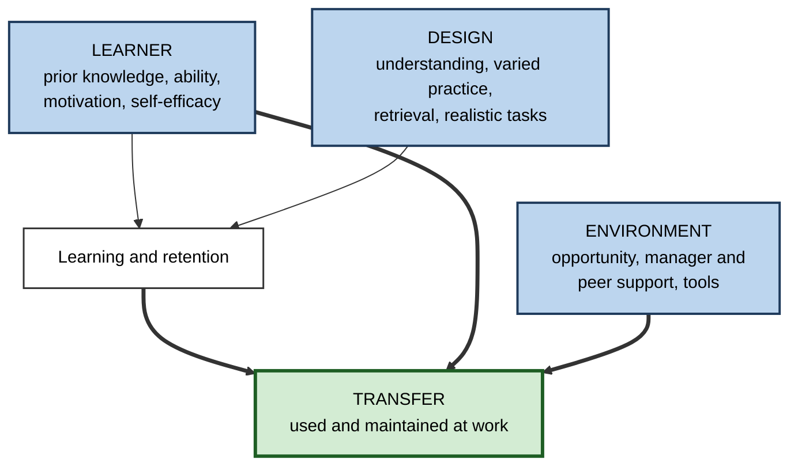
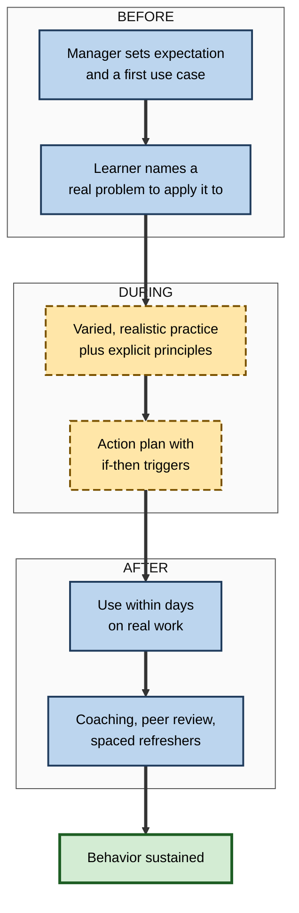

# M.4. Conditions That Promote Transfer

> **In one sentence:** Transfer happens when three things line up: the learner learned it deeply, the learning was designed to travel, and the new situation gives the learner a reason, a chance and the support to use it.
>
> **Why it matters:** Most failed training does not fail in the classroom; it fails afterwards. Knowing the conditions that drive transfer lets you fix the real bottleneck, whether it is the learner, the design or the workplace, instead of buying another course.
>
> **Level span:** Novice → Expert · **Reading time:** ~17 min · **Builds on:** near and far transfer; positive and negative transfer

---

## The Learning Ladder

| Level | Badge | After this level you can... |
|---|---|---|
| 1 | NOVICE | Name the three families of conditions: learner, learning design, and environment. |
| 2 | FOUNDATIONS | List the specific conditions in each family and explain why each matters. |
| 3 | PRACTITIONER | Audit a learning experience or your own learning against the conditions and fix the weakest link. |
| 4 | ADVANCED | Summarise the research on which conditions predict transfer most strongly, and when. |
| 5 | EXPERT / PRO | Build a transfer system around a programme, involving managers, tools and measurement. |

---

## Level 1 · Novice — The Big Picture

Think of a seed. Whether it grows depends on three things: the seed itself (is it healthy?), how it was planted (deep enough, watered?), and the soil and weather where it ends up (light, nutrients, care). Learning works the same way. Whether what you learn grows into real use depends on **you**, on **how you learned it**, and on **where you try to use it**.

You have already experienced this when:

- You learned a skill properly, with plenty of practice, and used it for years. **Strong seed, good planting.**
- You attended an inspiring workshop, came back full of ideas, and found your inbox, your boss and your deadlines left no room to try any of them. **Good seed, bad soil.**
- You skimmed a tutorial and forgot it immediately. **Weak planting.**

The key idea: **if learning does not show up at work, look at all three, not just at the learner.**

---

## Level 2 · Foundations — Core Concepts

### The three families of conditions

Timothy Baldwin and Kevin Ford's 1988 model, still the most cited framework in workplace learning research, organises transfer conditions into three inputs:

1. **Learner characteristics** — what the person brings.
2. **Learning design** — how the experience is built.
3. **Work environment** — what happens around the person afterwards.

**Figure M.4-1 — The three families of transfer conditions.**

*How to read it:* learner and design produce learning; learning, learner and environment together decide whether it transfers. Note that the environment acts directly on transfer.

### The conditions in detail

| Family | Condition | Why it helps |
|---|---|---|
| Learner | **Prior knowledge** in the domain | More hooks for new knowledge and better recognition of where it applies. |
| Learner | **Motivation to transfer** | People apply what they believe is worth applying. |
| Learner | **Self-efficacy** | Belief that you can succeed makes you try the skill in real, risky situations. |
| Learner | **Metacognition** | Monitoring your own understanding helps you notice when knowledge is relevant. |
| Design | **Sufficient initial learning** | You cannot transfer what you never really learned. |
| Design | **Understanding, not just memorising** | Knowing why lets you adapt to new cases. |
| Design | **Varied practice** | Practice across several contexts frees knowledge from any single one. |
| Design | **Explicit principles and comparisons** | Makes deep structure visible so it can be recognised later. |
| Design | **Retrieval and spacing** | Builds durable, accessible memories. |
| Design | **Realistic tasks (fidelity)** | Shared cues and actions with the target make near transfer automatic. |
| Environment | **Opportunity to use** | Without early chances to apply, skills decay. |
| Environment | **Manager support** | Expectations, coaching and recognition from the manager are strong levers. |
| Environment | **Peer support** | Colleagues who use the skill model it and help troubleshoot. |
| Environment | **Transfer climate** | Norms, rewards and tools that make using the new way safe and worthwhile. |

### Key terms

| Term | Plain meaning |
|---|---|
| **Transfer climate** | The signals in a workplace about whether using new learning is expected, supported and rewarded. |
| **Motivation to transfer** | The learner's desire to use the learning on the job. |
| **Self-efficacy** | Confidence in your ability to perform a specific task. |
| **Opportunity to use** | Actual chances to apply new skills soon after learning. |
| **Fidelity** | How closely a learning task resembles the real task. |
| **Open skill** | A skill applied flexibly in varied situations, such as leadership or negotiation. |
| **Closed skill** | A skill performed in a fixed, standard way, such as a software procedure. |

---

## Level 3 · Practitioner — Putting It to Work

### The transfer-conditions audit

1. **Name the target behavior.** "Uses the new code-review checklist on every pull request", not "understands quality".
2. **Rate each condition** from the table above on a 1–3 scale: absent, partial, strong.
3. **Find the weakest family.** If learner and design are strong but environment is weak, more training will not help.
4. **Pick one or two fixes per weak condition.** Small, concrete, owned by someone.
5. **Act before, during and after.** Some conditions are set before the learning (manager expectations), some during (practice design), some after (opportunity, reinforcement).
6. **Re-check in four to eight weeks** by looking at the behavior itself.

**Figure M.4-2 — Conditions placed on the timeline of a learning event.**

*How to read it:* read top to bottom; most organisations invest only in the middle group, while many of the strongest levers sit before and after.

### Worked example — a leadership programme for new managers

| | Before | After |
|---|---|---|
| **Learner** | Nominated without explanation. | Each participant agrees one leadership challenge with their manager beforehand. |
| **Design** | Three days of models and slides. | Same models, plus practice on participants' own challenges, peer comparison of cases and an if-then action plan. |
| **Environment** | No follow-up; managers unaware of content. | Managers get a one-page brief, hold a 20-minute debrief within a week and a check-in at 30 days. Peer groups meet monthly. |
| **Measure** | Satisfaction survey. | Direct-report survey on specific behaviors at baseline and three months. |

### Common mistakes

- **Fixing design when the problem is environment.** A polished e-learning module cannot overcome a manager who says "forget that, we do it my way".
- **Late opportunity.** Skills learned months before the first chance to use them decay heavily.
- **No owner after the event.** If nobody is responsible for the "after" phase, it does not happen.
- **One-size support.** Closed skills need job aids and practice; open skills need coaching and a supportive climate.

---

## Level 4 · Advanced — Mechanisms, Models & Evidence

### What predicts transfer most strongly

The 2010 meta-analysis by Brian Blume, Kevin Ford, Timothy Baldwin and Jason Huang pooled 89 studies. Key patterns:

- **Learner factors** such as cognitive ability, conscientiousness and motivation, and **environment factors** such as support and transfer climate, showed positive relationships with transfer.
- Most predictors, including motivation and work environment, mattered **more for open skills** (leadership, interpersonal) than for **closed skills** (software procedures). For closed skills, the environment correlation was close to zero; for open skills it was meaningful.
- Studies where transfer was measured by the **same source** at the **same time** as the predictors inflated relationships, a warning about self-report-only evaluation.

A 2018 Annual Review by Ford, Baldwin and Prasad summarised the field as "the known and the unknown": the importance of support and opportunity is well established; how transfer unfolds over time, and how learners adapt skills rather than copy them, is less understood.

### Design conditions from cognitive science

| Condition | Mechanism | Evidence strength |
|---|---|---|
| Sufficient initial learning | Stable memory traces are required before anything can be transferred. | Very strong. |
| Understanding over rote | Principles generalise; rote responses stay tied to cues. | Strong. |
| Varied practice | Builds a representation that spans many contexts. | Strong for motor and category learning; good for problem solving. |
| Comparison of cases | Highlights shared structure and strips away surface features. | Strong. |
| Retrieval practice | Strengthens access; transfers across test formats and to related questions. | Strong for near transfer, moderate for farther transfer. |
| Problem-solving before instruction | Activates prior knowledge, highlights what the concept solves. | Moderate; depends on design fidelity and learner age. |
| Metacognitive prompts | Encourage learners to ask "where else does this apply?" | Moderate. |

### Environment conditions from organisational research

The **Learning Transfer System Inventory**, developed by Elwood Holton and colleagues around 2000, measures 16 factors such as supervisor support, peer support, opportunity to use, personal capacity for transfer, and openness to change. Its higher-order structure, climate, job utility and rewards, is a practical map of the environmental side.

### Nuances and open questions

- **Support is not uniform.** Who supports matters: research in the 2020s suggests peers and knowledge networks can matter as much as formal managers for some skills.
- **Transfer is not only replication.** Newer work treats transfer as **adaptive**: people modify skills to fit their context. Measuring only exact replication can miss successful adaptation.
- **Self-efficacy can overshoot.** Very high confidence after easy training can reduce effort to practise further.
- **Implementation intentions help.** If-then plans ("If a client pushes for a discount, then I will ask about their priorities first") roughly double follow-through in health and goal research, and studies in management development show similar benefits for transfer.

---

## Level 5 · Expert / Pro — Professional Mastery

### From event to transfer system

Mature L&D organisations stop designing "courses" and start designing **transfer systems**: the learning event plus the before and after, with named owners.

| Role | Before | During | After |
|---|---|---|---|
| Learner | Agrees a real use case | Practises on it | Applies within days, logs results |
| Manager | Sets expectation, frees time | Optional sponsor touchpoint | Debriefs, coaches, recognises use |
| L&D | Diagnoses need and environment | Designs varied, realistic practice | Provides refreshers, job aids, measurement |
| Peers | Agree to be a practice partner | Shared case comparison | Peer review and swap of examples |
| Tools and AI | Pre-work diagnostic | Practice simulations, feedback | Point-of-use prompts that coach, not replace |

### AI-era implications

AI can strengthen several conditions: personalised practice on realistic cases, instant feedback, spaced prompts, and just-in-time job aids. It can also weaken a key one, **sufficient initial learning**, if learners let it do the thinking. Field evidence from 2025 showed that a tutor-style assistant that gives hints protected unaided performance, while an answer-giving assistant harmed it. Pros configure tools for the condition they want to strengthen.

### Professional scenario

**Role:** L&D partner for a regional operations team.
**Situation:** A Lean problem-solving course has run for three years with high ratings, yet few improvement projects follow.
**What the pro does:** Runs a transfer-conditions audit with ten graduates and five managers. Design scores well; environment scores poorly: no time is protected and managers do not ask for improvement projects. She negotiates two protected hours per fortnight, has each participant bring a live problem to the course, trains managers in a 15-minute coaching routine, and tracks completed improvement projects per graduate at 90 days. The course content barely changes; completed projects rise.

---

## Myths vs. Evidence

| Myth | What the evidence shows |
|---|---|
| "Transfer depends on how good the training is." | Design matters, but learner and environment factors are equally important, especially for open skills. |
| "Motivated learners will transfer anyway." | Motivation helps, but without opportunity and support even motivated learners lose skills. |
| "Realistic, expensive simulations always transfer better." | Matching the psychological and functional demands of the task matters more than physical realism. |
| "Satisfaction predicts transfer." | Reactions are weak predictors of on-the-job behavior. |
| "Managers just need to approve the training." | Active manager involvement before and after is one of the strongest environmental levers. |

## Practitioner Toolkit

**Transfer-conditions audit (rate 1 absent, 2 partial, 3 strong)**

| Family | Condition | Rating | Fix | Owner |
|---|---|---|---|---|
| Learner | Prior knowledge | | | |
| Learner | Motivation to transfer | | | |
| Learner | Self-efficacy | | | |
| Design | Sufficient practice | | | |
| Design | Explicit principles and varied cases | | | |
| Design | Realistic tasks | | | |
| Environment | Opportunity to use soon | | | |
| Environment | Manager support | | | |
| Environment | Peer support | | | |
| Environment | Tools and climate | | | |

**If-then action plan template**

- If ______ (situation at work), then I will ______ (new behavior).
- My first opportunity is on ______ (date) during ______.
- I will tell ______ (person) and review results with them on ______.

## Self-Check

1. **[NOVICE]** What are the three families of transfer conditions?
2. **[NOVICE]** Give an example of good learning that failed because of the environment.
3. **[FOUNDATIONS]** Define transfer climate and opportunity to use.
4. **[FOUNDATIONS]** What is the difference between open and closed skills?
5. **[PRACTITIONER]** Why place conditions on a before, during and after timeline?
6. **[ADVANCED]** What did the 2010 meta-analysis find about open versus closed skills?
7. **[ADVANCED]** Name three design conditions with strong evidence.
8. **[EXPERT / PRO]** What does a manager do in a transfer system?
9. **[EXPERT / PRO]** How can AI strengthen or weaken transfer conditions?

### Answer Key

1. Learner characteristics, learning design and work environment.
2. Answers vary; for example a time-management course followed by a manager who schedules constant interruptions.
3. Transfer climate: signals that using new learning is expected, supported and rewarded. Opportunity to use: real chances to apply the skill soon after learning.
4. Open skills are applied flexibly in varied situations; closed skills are performed in a fixed, standard way.
5. Because many strong levers, such as manager expectations and early use, sit outside the learning event.
6. Motivation and environment predicted transfer more strongly for open skills than for closed skills.
7. Any three of: sufficient initial learning, understanding over rote, varied practice, comparison of cases, retrieval practice.
8. Sets expectations and frees time before; debriefs, coaches and recognises use afterwards.
9. Strengthen: personalised realistic practice, feedback, spaced prompts, job aids. Weaken: doing the thinking for learners so initial learning is shallow.

## Key Takeaways

- Transfer depends on **learner, design and environment** together.
- The environment acts **directly on transfer**, and matters most for **open skills**.
- Strong design conditions: **sufficient learning, understanding, varied practice, comparison, retrieval**.
- Many of the most powerful levers sit **before and after** the learning event.
- **If-then plans**, early **opportunity to use** and **manager follow-up** are cheap and effective.
- Configure AI to **strengthen**, not replace, the learner's own thinking.

## Glossary

| Term | Meaning |
|---|---|
| Closed skill | A skill performed in a standard, fixed way. |
| Fidelity | Resemblance of a learning task to the real task. |
| Implementation intention | An if-then plan linking a situation to a planned behavior. |
| Learning Transfer System Inventory | A survey of 16 factors that help or hinder workplace transfer. |
| Metacognition | Awareness and regulation of your own thinking and learning. |
| Motivation to transfer | Desire to use new learning on the job. |
| Open skill | A skill applied flexibly across varied situations. |
| Opportunity to use | Real chances to apply learning soon after training. |
| Self-efficacy | Confidence in your ability to perform a specific task. |
| Transfer climate | Workplace signals that support or discourage using new learning. |
| Transfer system | The learning event plus the before-and-after conditions that drive use. |
