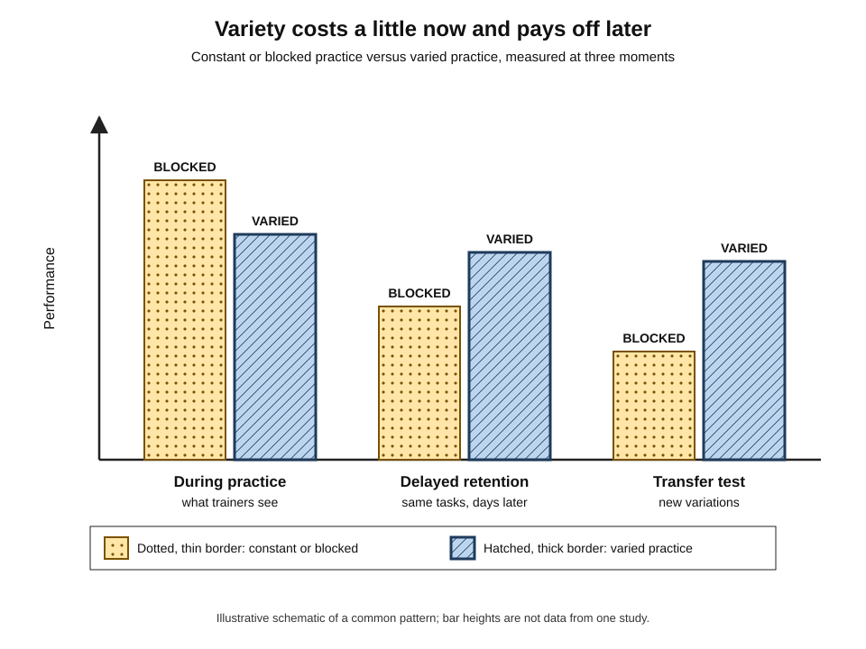
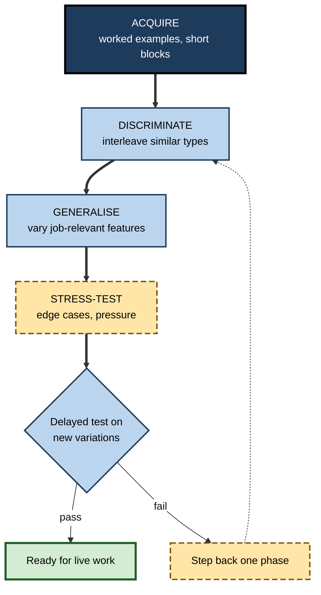

# M.5. Contextual Variability in Practice

> **In one sentence:** Contextual variability means practising a skill in different ways, settings, examples and orders, instead of repeating it the same way every time, so that it works in situations you have not seen before.
>
> **Why it matters:** Work never repeats the training exactly. Practice that includes variety looks slower and messier during training, but produces skills that survive new clients, new data, new tools and new pressures.
>
> **Level span:** Novice → Expert · **Reading time:** ~17 min · **Builds on:** near and far transfer; the difference between practice performance and lasting learning

---

## The Learning Ladder

| Level | Badge | After this level you can... |
|---|---|---|
| 1 | NOVICE | Explain why practising the same thing the same way can leave you stuck when things change. |
| 2 | FOUNDATIONS | Distinguish variable practice, interleaving and context variation, and name the trade-off. |
| 3 | PRACTITIONER | Add the right kind and amount of variety to your own or your team's practice. |
| 4 | ADVANCED | Explain schema theory, contextual interference and the boundary conditions found in recent meta-analyses. |
| 5 | EXPERT / PRO | Design practice curricula and simulations that systematically vary what matters and hold constant what does not. |

---

## Level 1 · Novice — The Big Picture

Imagine practising free throws in basketball from exactly one spot, every day. You get very good from that spot. In a real game, you shoot from everywhere, while tired and with someone's hand in your face. Players who practised from many spots, at different speeds and under some pressure are usually better in the game, even if they looked less polished in practice.

That is **contextual variability**: deliberately changing the conditions of practice. Analogy: a hiking boot broken in on only one smooth trail may blister on rocky ground. Walk in it on many kinds of ground and it fits every trail.

You have already experienced this when:

- You learned to drive only in your quiet neighbourhood, then panicked on a motorway. **Too little variety.**
- You learned a language from one textbook voice and could not understand real speakers with different accents. **Too little variety.**
- You cooked the same dish in different kitchens with different pans and could then cook it anywhere. **Useful variety.**

The key idea: **practise the way the world will test you, which means with variety.**

---

## Level 2 · Foundations — Core Concepts

### Three kinds of variability

| Kind | What changes | Everyday example | Work example |
|---|---|---|---|
| **Variable practice** | The parameters of one skill (distance, speed, numbers, wording) | Throwing to targets at different distances | Writing the same type of SQL query on different schemas |
| **Interleaved practice** | The order of different skills or problem types, mixed rather than in blocks | Mixing maths problem types in one session | Handling a mix of support-ticket types instead of one type per day |
| **Context variation** | The surroundings: place, people, tools, format | Studying in different rooms | Presenting to different audiences, on video and in person |

### The trade-off

Varied and mixed practice usually makes performance **during practice lower** than constant, blocked practice. Learners feel less fluent. But on **delayed tests** and especially on **new variations**, varied practice often wins. This is one of the classic **desirable difficulties**.

*Figure M.5-1 — The variability trade-off.* Dotted bars with thin borders: constant or blocked practice. Hatched bars with thick borders: varied practice. Blocked looks better during practice; varied tends to win on delayed retention and on transfer to new variations. Schematic, not data from a single study.

### Key terms

| Term | Plain meaning |
|---|---|
| **Constant practice** | Repeating a skill with the same parameters every time. |
| **Variable practice** | Practising a skill with deliberately changing parameters. |
| **Blocked practice** | Practising one skill or problem type many times before moving to the next (AAA BBB CCC). |
| **Interleaved (random) practice** | Mixing skills or problem types within a session (ABC BCA CAB). |
| **Contextual interference** | The extra difficulty caused by mixing tasks during practice, which often improves retention and transfer. |
| **Schema (motor)** | A general rule linking conditions to the actions needed, built from varied experience. |
| **Discrimination** | Telling apart which kind of problem you are facing, and so which method fits. |

**Figure M.5-2 — Blocked versus interleaved schedules for three ticket types.**

```mermaid
%%{init: {'theme':'base','themeVariables':{'fontFamily':'Arial, Helvetica, sans-serif','fontSize':'15px','primaryColor':'#FFFFFF','primaryTextColor':'#111111','primaryBorderColor':'#222222','lineColor':'#333333','secondaryColor':'#F2F2F2','tertiaryColor':'#FFFFFF','clusterBkg':'#FAFAFA','clusterBorder':'#555555','edgeLabelBackground':'#FFFFFF','titleColor':'#111111'}}}%%
flowchart TD
    classDef key     fill:#BCD5EE,stroke:#1F3B5C,stroke-width:2px,color:#000000
    classDef detail  fill:#FFFFFF,stroke:#333333,stroke-width:1.5px,color:#000000
    classDef good    fill:#D3ECD3,stroke:#1E5E24,stroke-width:3px,color:#000000
    classDef caution fill:#F6CACA,stroke:#8B0000,stroke-width:2.5px,stroke-dasharray:3 3,color:#000000

    subgraph Blocked["BLOCKED: same type in a row"]
        B1["Billing"] --> B2["Billing"] --> B3["Billing"] --> B4["Login"] --> B5["Login"] --> B6["Bug"]
    end
    subgraph Mixed["INTERLEAVED: types mixed"]
        M1["Billing"] --> M2["Bug"] --> M3["Login"] --> M4["Billing"] --> M5["Login"] --> M6["Bug"]
    end
    RB["CAUTION: you always know<br/>which method comes next"]
    RM["You must first decide<br/>what kind of ticket this is"]

    Blocked -.-> RB
    Mixed ==> RM

    class B1,B2,B3,B4,B5,B6 detail
    class M1,M2,M3,M4,M5,M6 key
    class RB caution
    class RM good
```

*How to read it:* both schedules contain the same tickets; only the interleaved one forces the step real work demands, deciding which kind of problem you face.

---

## Level 3 · Practitioner — Putting It to Work

### A five-step method for adding variability

1. **Get the basics first.** For a brand-new skill, start with a short block of consistent practice until the learner can do it at all. Variety on top of nothing is just confusion.
2. **List the dimensions that will vary at work.** Data shapes, client types, tools, time pressure, audience, language, device.
3. **Vary what matters, hold constant what does not.** Change the features that change the right action; keep irrelevant features stable so learners notice what matters.
4. **Mix problem types once each is familiar.** Interleave so learners must choose the method, not just execute it.
5. **Warn and track.** Tell learners practice will feel harder; judge success on delayed and novel tests, not on practice scores.

### Worked example — onboarding customer-success managers

| | Before (constant and blocked) | After (varied and interleaved) |
|---|---|---|
| **Practice** | Week 1: five renewal calls with the same scripted persona. Week 2: five escalation calls. | Week 1: short blocked intro to each call type. Weeks 2–3: mixed role-plays where the call type is revealed only during the call; personas vary in seniority, mood and industry. |
| **Learner feeling** | "I've nailed renewals." | "Harder than I expected, I had to work out what kind of call it was." |
| **Practice scores** | High. | Lower at first. |
| **First month live** | Struggles when a renewal turns into an escalation mid-call. | Recognises the shift and changes approach. |

### Common mistakes

- **Variety too early.** Novices with no foundation can be overwhelmed. Recent studies with low-achieving learners found that a phase of blocked practice before interleaving worked better than interleaving from the start.
- **Irrelevant variety.** Changing fonts or colours of practice materials adds noise without building judgement.
- **Mixing things that are unrelated.** Interleaving helps most when problem types are easy to confuse; mixing unrelated topics gives little benefit.
- **Judging by practice scores.** The dip during varied practice is expected; abandoning the method because of it throws away the benefit.

---

## Level 4 · Advanced — Mechanisms, Models & Evidence

### Why variability helps

| Mechanism | Explanation | Main origin |
|---|---|---|
| **Schema abstraction** | Varied experiences let the learner extract a general rule relating conditions to actions, which can generate responses for unseen conditions. | Richard Schmidt's schema theory of motor learning, 1975. |
| **Discrimination and contrast** | Mixing similar types forces learners to notice the features that tell them apart. | Interleaving research in category and mathematics learning. |
| **Reloading (forgetting and reconstructing)** | Switching tasks means the action plan must be rebuilt each time, which strengthens it. | Contextual interference accounts. |
| **Decontextualising** | Learning across many settings reduces dependence on any one set of retrieval cues. | Context-dependent memory research. |

A classic demonstration of variable practice comes from children throwing beanbags: children who practised at two distances, but never the test distance, were more accurate at the test distance than children who practised only at it. Results like this are the strongest form of the argument: varied practice can beat specific practice even on the specific target.

### What the evidence shows

- **Contextual interference in motor learning.** John Shea and Robyn Morgan's 1979 study made the effect famous: random practice was worse during acquisition but better on retention and transfer. A 2024 systematic review and meta-analysis by Stefan Czyż and colleagues confirmed benefits of high-interference practice for retention, with a medium effect in adults, a larger one in older adults and a negligible one in children. Researchers still debate how well the effect generalises from laboratory tasks to complex sports and real-world skills; some reviews call it partly a laboratory phenomenon, so treat it as **robust in the lab, more variable in the field**.
- **Interleaving in cognitive learning.** A 2019 meta-analysis by Brunmair and Richter found a moderate overall benefit, strongest for visual categories such as painting styles and weaker for mathematics; for expository text it was unclear or absent. The key moderator was **similarity**: interleaving helps most when the categories are easy to confuse.
- **Context variation.** Studying in more than one room has improved recall in a new room in classic experiments. But the famous divers study, where words learned underwater were recalled better underwater, did not replicate in a 2021 attempt, and meta-analytic work suggests environmental context effects are modest and shrink when people mentally reinstate the original context. **Varying context is sensible; do not overclaim it.**
- **Perception and language.** High-variability training, for example hearing new speech sounds from many different speakers, produces better generalisation to new voices than training with one speaker.

### Boundary conditions

- **Expertise level.** Novices may need consistency first; variability pays most once basic patterns exist.
- **Task complexity.** For very complex tasks, too much interference can overload working memory.
- **Type of variability.** Variation along dimensions that matter for the target helps; random noise does not.
- **Learner beliefs.** Most learners believe blocked practice works better because it feels better. Studies from 2024 show that explaining the evidence and prompting reflection increases learners' own use of interleaving.

---

## Level 5 · Expert / Pro — Professional Mastery

### Designing a variability curriculum

| Phase | Variability level | What pros do |
|---|---|---|
| **Acquire** | Low | Worked examples and short blocked practice for each new skill. |
| **Discriminate** | Medium | Interleave similar problem types; ask "which kind is this, and why?" |
| **Generalise** | High | Vary data, clients, tools, formats and pressure along the dimensions found in the job. |
| **Stress-test** | High plus realism | Rare and edge cases, time pressure, distractions, combined problems. |

**Figure M.5-3 — Ramping variability across a programme.**

*How to read it:* variability increases down the thick path; failure on a new-variation test sends learners back one phase rather than to the start.

### Tools and the AI era

Generative AI makes variety cheap. A trainer can generate dozens of realistic case variations, customer personas, datasets or code bases in minutes. Pros use this to **vary systematically**: they specify the dimensions to change and keep others constant, and they review generated cases for realism and errors. There is a useful parallel in machine learning, where **data augmentation** and **domain randomisation** train models on deliberately varied inputs so they generalise; the same logic applies to people.

### Professional scenario

**Role:** Training lead for a security operations centre.
**Situation:** Analysts trained on a library of 20 canonical alerts perform well in drills but miss real incidents that look slightly different.
**What the pro does:** Rebuilds drills so each alert type appears in several variants (different hosts, log formats, times of day and noise levels), interleaves alert types so analysts must classify before acting, adds monthly "unseen variant" tests, and uses an AI tool to generate variants that she and two senior analysts review. Drill scores drop for a month, then real-incident detection improves.

---

## Myths vs. Evidence

| Myth | What the evidence shows |
|---|---|
| "Perfect practice means doing it exactly the same way every time." | Constant practice builds a narrow skill; variable practice usually generalises better. |
| "If practice feels smooth, it is working." | Blocked practice feels smoother but often gives weaker retention and transfer. |
| "Always interleave everything." | Interleaving helps most for confusable categories, and novices may need a blocked start. |
| "Studying in the same room as the exam guarantees recall." | Environmental context effects are modest, and a famous demonstration did not replicate. |
| "More variety is always better." | Irrelevant or excessive variety adds load without building the right discriminations. |

## Practitioner Toolkit

**Variability design checklist**

- [ ] Learners can do the basic skill before variety is added.
- [ ] I listed the dimensions that vary in real work.
- [ ] Practice varies those dimensions and holds irrelevant ones constant.
- [ ] Similar, confusable problem types are interleaved.
- [ ] Learners are warned that practice will feel harder.
- [ ] Success is judged on a delayed test with new variations.

**Variation matrix template**

| Practice item | Dimension 1 (e.g., client type) | Dimension 2 (e.g., data quality) | Dimension 3 (e.g., time pressure) | Problem type |
|---|---|---|---|---|
| 1 | | | | |
| 2 | | | | |
| 3 | | | | |

## Self-Check

1. **[NOVICE]** Why might practising from only one spot leave you weak in a real game?
2. **[NOVICE]** Give an example of useful variety in your own learning.
3. **[FOUNDATIONS]** What is the difference between variable practice and interleaved practice?
4. **[FOUNDATIONS]** Describe the variability trade-off.
5. **[PRACTITIONER]** Why start with some blocked practice for brand-new skills?
6. **[ADVANCED]** How does schema theory explain the benefit of variable practice?
7. **[ADVANCED]** What moderator most affects the benefit of interleaving?
8. **[EXPERT / PRO]** Which context-dependent memory finding is contested, and what is the practical lesson?
9. **[EXPERT / PRO]** How would you use generative AI to add variability responsibly?

### Answer Key

1. The skill becomes tuned to that one set of conditions and does not adapt to new angles, distances or pressure.
2. Answers vary; for example practising presentations to different audiences or on different topics.
3. Variable practice changes the parameters of one skill; interleaved practice mixes different skills or problem types.
4. Variety lowers performance during practice but often improves delayed retention and transfer to new variations.
5. Learners need a basic representation before variety can sharpen it; very early variety can overwhelm novices.
6. Varied experiences let learners build a general rule linking conditions to actions, which can generate responses for new conditions.
7. Similarity between the categories or problem types; the more confusable, the bigger the benefit.
8. The divers underwater recall effect failed to replicate in 2021; varying context is sensible but its effects are modest, so do not rely on context matching alone.
9. Specify which job-relevant dimensions to vary and which to hold constant, generate many cases, and have experts review them for realism and errors.

## Key Takeaways

- Practise the way work will test you: **with variety**.
- **Variable, interleaved and context-varied** practice usually look worse in training and work better later.
- Interleaving helps most for **confusable** problem types.
- **Start consistent, then add variety**; ramp it in phases.
- Vary **what matters**; hold the rest constant.
- Judge practice by **delayed, novel-variation tests**, not by smooth practice scores.

## Glossary

| Term | Meaning |
|---|---|
| Blocked practice | Practising one skill or type repeatedly before moving on. |
| Constant practice | Repeating a skill with identical parameters. |
| Context-dependent memory | Better recall when the retrieval context matches the learning context. |
| Contextual interference | Difficulty from mixing tasks in practice, often improving retention and transfer. |
| Data augmentation | In machine learning, training on varied versions of data to improve generalisation. |
| Discrimination | Telling which kind of problem you face. |
| High-variability training | Training with many different examples or speakers to improve generalisation. |
| Interleaved practice | Mixing different problem types within a session. |
| Schema theory | Schmidt's account that varied practice builds general rules for action. |
| Variable practice | Practising one skill with deliberately changing parameters. |
