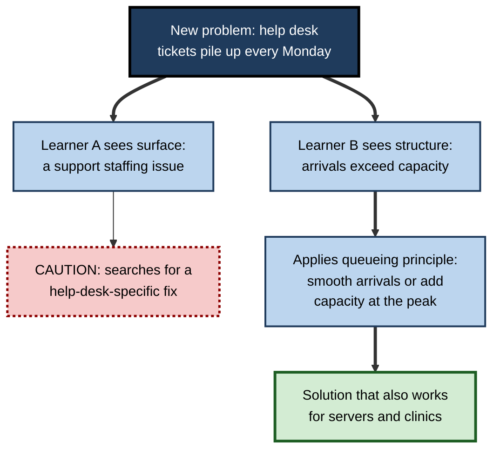
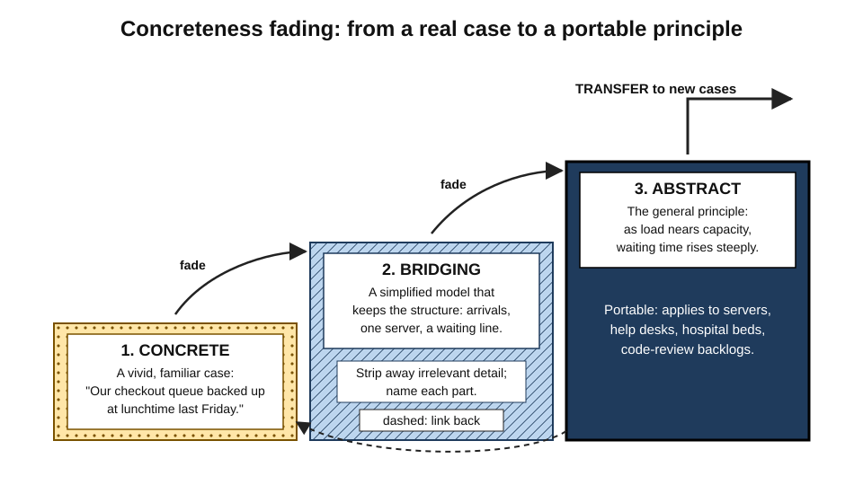
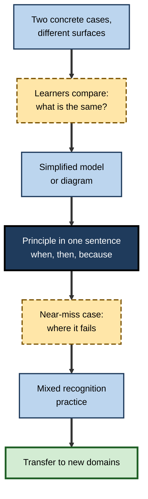

# M.6. Abstract Principles and Transfer

> **In one sentence:** An abstract principle is the general "why" behind a set of examples, and learning it lets you recognise and solve new problems that look different on the surface but work the same way underneath.
>
> **Why it matters:** Principles are what make knowledge portable. A consultant who grasps "constraints determine throughput" can help a factory, a hospital and a software team; one who only memorised a factory case can help only factories.
>
> **Level span:** Novice → Expert · **Reading time:** ~17 min · **Builds on:** surface features versus deep structure; near and far transfer

---

## The Learning Ladder

| Level | Badge | After this level you can... |
|---|---|---|
| 1 | NOVICE | Explain the difference between an example and the principle behind it. |
| 2 | FOUNDATIONS | Describe how experts and novices see problems differently, and why principles transfer. |
| 3 | PRACTITIONER | Extract, state and test a principle from your own experience or a course. |
| 4 | ADVANCED | Explain concreteness fading, the concrete-versus-abstract debate, and when abstraction fails. |
| 5 | EXPERT / PRO | Teach principles to others in a way that sticks and transfers, and build principle libraries for teams. |

---

## Level 1 · Novice — The Big Picture

Suppose you learn that you should not put metal in a microwave. That is a **specific rule**. Now suppose you understand **why**: metal reflects microwaves and can cause sparks. With the principle, you can predict that a foil-wrapped sandwich, a mug with a gold rim and a takeaway box with a metal handle are all risky, even though no one told you about them.

That is the power of an **abstract principle**: a general idea that explains many specific cases. Analogy: specific examples are like individual photographs; the principle is the camera. With the camera, you can take new pictures of places you have never been.

You have already experienced this when:

- You learned "the person who wants something more usually concedes more" and noticed it in salary talks, house buying and supplier negotiations. **A principle travelled.**
- You learned one recipe by heart and could not adapt it when an ingredient was missing. **No principle, so no transfer.**

The key idea: **examples help you learn; principles help you transfer.**

---

## Level 2 · Foundations — Core Concepts

### Surface features versus deep structure

Every problem has **surface features**, the visible details (characters, objects, industry, numbers), and **deep structure**, the relationships that determine how it can be solved. In a classic 1981 study, Michelene Chi, Paul Feltovich and Robert Glaser asked physics novices and experts to sort problems into groups. Novices grouped by surface features ("these are all about inclined planes"); experts grouped by underlying principles ("these are all conservation of energy"). Experts see the principle first; that is a large part of why their knowledge transfers.

### Key terms

| Term | Plain meaning |
|---|---|
| **Abstract principle** | A general statement of how something works, independent of any one example. |
| **Concrete example** | A specific, detailed instance with real objects, people or numbers. |
| **Deep structure** | The relationships that determine how a problem is solved. |
| **Surface features** | The visible details that may not matter for the solution. |
| **Schema** | A mental template for a class of problems, linking features to a solution approach. |
| **Abstraction** | The process of extracting what is common across examples and dropping what is not. |
| **Concreteness fading** | Moving from concrete examples, through simplified models, to abstract principles. |
| **Self-explanation** | Explaining to yourself why each step or example works. |

**Figure M.6-1 — Two learners, one new problem.**

*How to read it:* the same problem is seen in two ways; only the structure-based path leads to a solution that can be reused elsewhere.

### Why principles transfer

A principle is stored without the details of the original case, so it can be triggered by any case that shares the structure. A concrete memory is tied to its details, so it is triggered mainly by cases that look similar. That is why principle knowledge supports **far transfer**, and why purely example-based knowledge tends to stay near.

---

## Level 3 · Practitioner — Putting It to Work

### The principle extraction routine

1. **Collect two or more cases** where something worked or failed for what seems to be the same reason.
2. **Strip the surface.** Rewrite each case without names, industry or numbers.
3. **State the principle in one sentence**, ideally as "When X, then Y, because Z."
4. **Test it on a new case** that looks different, preferably from another domain.
5. **Find the boundary.** Ask "when would this not hold?" and add the condition.
6. **Re-attach examples.** Keep two vivid examples linked to the principle so it stays meaningful.

### Worked example — a product manager learning from failed launches

| | Before | After |
|---|---|---|
| **Lesson recorded** | "The mobile wallet launch failed because the partner bank was slow." | Principle: "When a launch depends on an external party's timeline, then schedule risk is outside our control, because our incentives are not theirs. Mitigate with a fallback scope." |
| **Next project** | Treats a new data-vendor dependency as unrelated. | Recognises the same structure in a data-vendor dependency and a legal-review dependency. |
| **Boundary added** | — | "Weaker when the partner shares our incentive, for example a joint revenue target." |

### Common mistakes

- **Principle without examples.** A slogan like "think customer-first" carries no structure and does not transfer; it is too abstract to apply.
- **Examples without a principle.** War stories are memorable but stay tied to their surface.
- **Over-generalising.** Stating a principle without its boundary leads to applying it where it fails.
- **Telling, not discovering.** Hearing a principle once is weaker than extracting it yourself from cases and testing it.

---

## Level 4 · Advanced — Mechanisms, Models & Evidence

### From Judd to schema theory

In the early twentieth century, Charles Judd showed that learners who understood the principle of light refraction adapted better when the depth of an underwater target changed than learners who only practised. Later, schema theory explained this: learners build a general template linking features of a situation to a solution. Gick and Holyoak's analogy studies in the 1980s found that comparing two stories with the same solution produced a **schema** that transferred to a new problem far better than reading one story.

### The concrete versus abstract debate

| Position | Claim | Evidence |
|---|---|---|
| **Concrete first** | Familiar, vivid materials make ideas understandable and memorable. | Strong for initial understanding; but learners often stay tied to surface details. |
| **Abstract first** | Generic symbols strip away distractions and transfer better. | A 2008 study with university students found that a generic, symbolic version of a mathematical concept transferred better than a concrete one. Later studies replicated it only partly and with qualifications, so the strong claim is **contested**. |
| **Concreteness fading** | Start concrete, move through simplified models, end abstract. | Reviews by Emily Fyfe and colleagues (2014) and experiments with children and adults support fading over either extreme; concrete-to-abstract outperformed the reverse order. |

*Figure M.6-2 — Concreteness fading.* Dotted step: a concrete case. Hatched step: a simplified model that keeps the structure. Dark step: the abstract principle, from which transfer to new cases is easiest. The dashed arrow shows learners returning to concrete grounding when they get stuck.

### Mechanisms

- **Grounding** — concrete cases connect the principle to things the learner already understands, giving it meaning.
- **Idealisation** — removing irrelevant detail reduces the chance that surface features become part of the learned representation.
- **Explicit linking** — showing how each part of the concrete case maps onto the abstract model is what makes the fade work.
- **Self-explanation** — learners who explain why examples work extract principles more reliably; this effect is well replicated.

### Boundary conditions and open questions

- **Prior knowledge** shifts the best starting point: experts can start more abstractly.
- **Abstraction can produce inert knowledge** if learners never practise recognising when the principle applies.
- **Principles need conditions.** Expert knowledge is "conditionalised": it includes when a principle applies, not just what it says.
- **Generative AI** can produce plausible-sounding principles fluently. Whether a principle is true, and where its boundaries are, still needs human testing against cases.

---

## Level 5 · Expert / Pro — Professional Mastery

### Teaching principles that transfer

| Practice | What it looks like |
|---|---|
| **Case pairs, then principle** | Show two different-looking cases with the same structure; ask learners what they share before naming it. |
| **State it crisply** | One sentence, with when, then and because. |
| **Show the boundary** | Include a near-miss case where the principle does not apply. |
| **Fade** | Move from vivid case to a simple model or diagram to the general statement. |
| **Recognition practice** | Give mixed cases and ask "which principle applies here?" before solving. |
| **Revisit** | Return to the principle in later units with new cases. |

**Figure M.6-3 — A principle-teaching sequence.**

*How to read it:* the thick path moves from concrete to abstract and back out to application; the dashed-border steps are where learners do the thinking.

### Principle libraries in organisations

Mature teams turn post-mortems, retrospectives and deal reviews into **principle libraries**: short entries with the principle, its conditions, two linked cases and a near-miss. Engineering teams do this with design principles and incident patterns; consulting firms with frameworks; sales teams with objection patterns. The value is not the document but the habit of extracting structure from experience.

### Professional scenario

**Role:** Senior consultant onboarding analysts to an operations practice.
**Situation:** Analysts memorise frameworks but cannot apply them to unfamiliar industries.
**What the pro does:** For each core principle, such as "throughput is set by the bottleneck", she presents a factory case and a hospital case, asks analysts to map the parts of each onto the other, then gives a simple flow diagram, the one-sentence principle and a near-miss where demand, not capacity, is the constraint. She ends each week with mixed mini-cases from new industries and asks only "which principle, and why?" before any analysis.

---

## Myths vs. Evidence

| Myth | What the evidence shows |
|---|---|
| "Real-world examples alone produce flexible knowledge." | Examples alone tend to stay tied to their surface; extracting the principle is what transfers. |
| "Abstract teaching is always better for transfer." | Pure abstraction risks inert, meaningless knowledge; the strong abstract-first claim is contested. |
| "Once you know the principle, you will apply it." | Recognising when a principle applies is a separate skill that must be practised. |
| "Frameworks are principles." | Many frameworks are lists of categories; a principle states a causal relationship and its conditions. |
| "Experts just know more facts." | Experts organise knowledge around deep principles, which is why they see structure novices miss. |

## Practitioner Toolkit

**Principle card template**

| Field | Entry |
|---|---|
| Principle (when, then, because) | |
| Conditions where it holds | |
| Where it fails (near-miss) | |
| Case 1 (domain A) | |
| Case 2 (domain B) | |
| Cue that signals it applies | |

**Checklist for teaching a principle**

- [ ] I used at least two cases with different surface features.
- [ ] Learners compared the cases before I named the principle.
- [ ] I showed a simplified model linking the cases to the principle.
- [ ] I stated the principle in one sentence with its conditions.
- [ ] I showed a near-miss case.
- [ ] Learners practised recognising the principle in mixed cases.

## Self-Check

1. **[NOVICE]** What is the difference between a rule and a principle?
2. **[NOVICE]** Why do principles help you deal with situations you have never seen?
3. **[FOUNDATIONS]** What did the physics sorting study show about novices and experts?
4. **[FOUNDATIONS]** Define surface features and deep structure.
5. **[PRACTITIONER]** List the six steps of the principle extraction routine.
6. **[ADVANCED]** What is concreteness fading, and why does it outperform the reverse order?
7. **[ADVANCED]** Why is the "abstract first" claim considered contested?
8. **[EXPERT / PRO]** What belongs in a principle library entry?
9. **[EXPERT / PRO]** Why include a near-miss case when teaching a principle?

### Answer Key

1. A rule says what to do in a specific case; a principle explains why, so it can generate answers for new cases.
2. They are stored without the details of the original case, so any situation sharing the structure can trigger them.
3. Novices grouped problems by surface features; experts grouped them by underlying principles.
4. Surface features: visible details that may not matter. Deep structure: the relationships that determine the solution.
5. Collect cases, strip the surface, state the principle, test on a different case, find the boundary, re-attach examples.
6. Moving from concrete cases through simplified models to abstract principles; it grounds meaning first, then removes irrelevant detail, which supports transfer better than starting abstract and adding concrete later.
7. The original result has been replicated only partly and with qualifications; abstract-only learning can also produce inert knowledge.
8. The principle, its conditions, where it fails, two cases from different domains, and the cue that signals it applies.
9. It sharpens the conditions of the principle and prevents over-generalisation.

## Key Takeaways

- **Examples help you learn; principles help you transfer.**
- Experts see **deep structure**; novices see **surface features**.
- Extract principles by **comparing cases**, stripping the surface and stating **when, then, because**.
- **Concreteness fading**, concrete then model then abstract, beats either extreme.
- Principles need **conditions and near-misses**, or they will be misapplied.
- Recognising **when a principle applies** must be practised separately.

## Glossary

| Term | Meaning |
|---|---|
| Abstract principle | A general statement of how something works, independent of examples. |
| Abstraction | Extracting what is common across cases. |
| Concreteness fading | Moving from concrete cases through models to abstract principles. |
| Conditionalised knowledge | Knowledge that includes when it applies. |
| Deep structure | The relationships that determine how a problem is solved. |
| Inert knowledge | Knowledge held but not used when relevant. |
| Near-miss case | A case that resembles one where the principle applies but does not satisfy its conditions. |
| Principle library | A team's collection of principles with conditions and linked cases. |
| Schema | A mental template for a class of problems. |
| Self-explanation | Explaining to yourself why an example or step works. |
| Surface features | Visible details that may not affect the solution. |
