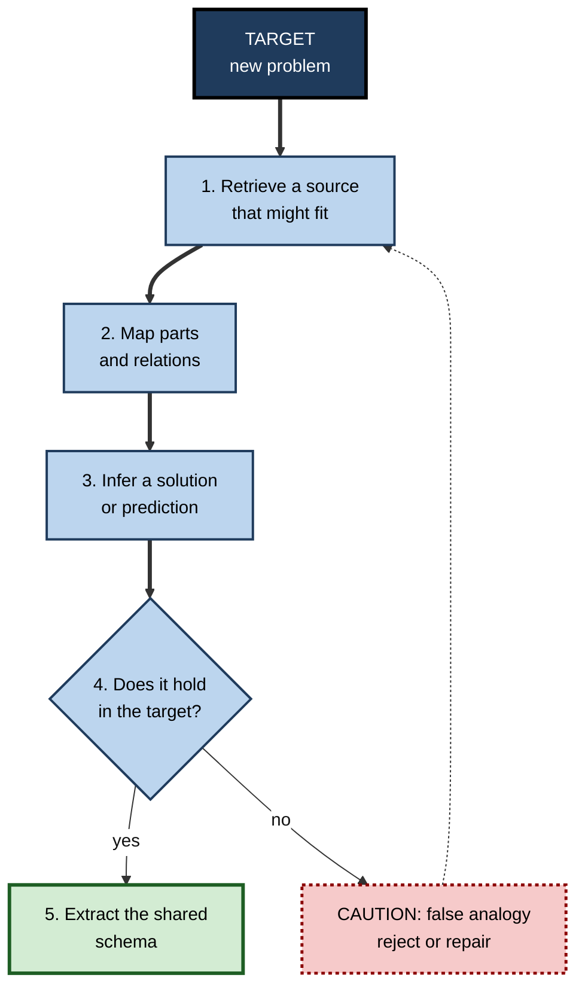
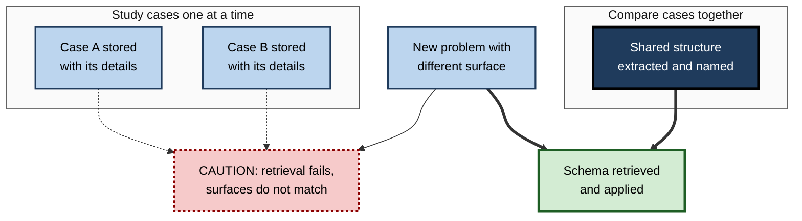

# M.7. Analogical Reasoning for Transfer

> **In one sentence:** Analogical reasoning is solving a new problem by noticing that it works like something you already understand, and carrying the solution across.
>
> **Why it matters:** Analogy is the main engine of far transfer in real life. Strategists, engineers, doctors and designers constantly solve new problems by mapping them onto old ones. Doing it well, and avoiding seductive false analogies, is a professional skill that can be trained.
>
> **Level span:** Novice → Expert · **Reading time:** ~17 min · **Builds on:** abstract principles; surface features versus deep structure

---

## The Learning Ladder

| Level | Badge | After this level you can... |
|---|---|---|
| 1 | NOVICE | Explain what an analogy is and give examples of analogies that helped you understand something. |
| 2 | FOUNDATIONS | Name the stages of analogical reasoning and tell a deep analogy from a surface one. |
| 3 | PRACTITIONER | Use a structured mapping routine to borrow solutions and test whether an analogy holds. |
| 4 | ADVANCED | Explain structure-mapping theory, the retrieval bottleneck, and the evidence for analogical encoding. |
| 5 | EXPERT / PRO | Use and teach analogies for strategy, innovation and training, and guard teams against false analogies. |

---

## Level 1 · Novice — The Big Picture

When someone explains electricity by saying "voltage is like water pressure in a pipe, and current is like the amount of water flowing", they are using an **analogy**. You already understand water, so the explanation lets you carry that understanding over to electricity.

An **analogy** says: "this new thing works like that familiar thing". Analogy is like a translator between two languages. If you know one language well, a good translator lets you understand the other quickly. A bad translator, one who matches words that sound alike but mean different things, misleads you.

You have already used analogical reasoning when:

- You understood a computer's memory by thinking of a desk (working space) and a filing cabinet (storage).
- You handled a difficult new client by thinking "this is like that tough negotiation last year".
- You were misled by an analogy: "this start-up is the Uber of laundry, so it will grow like Uber", ignoring that the businesses differ in what matters.

The key idea: **a good analogy matches how things work, not how they look.**

---

## Level 2 · Foundations — Core Concepts

### The stages of analogical reasoning

1. **Retrieval (access)** — noticing that something you already know is relevant. This is the hardest step.
2. **Mapping** — lining up the parts and relationships of the source with those of the target.
3. **Inference** — carrying over a solution, prediction or explanation from source to target.
4. **Evaluation** — checking whether the inference actually fits the target.
5. **Learning (schema induction)** — extracting the shared structure so it is easier to use next time.

**Figure M.7-1 — The analogical reasoning cycle.**

*How to read it:* thick arrows are the main cycle; a failed evaluation sends you back to find a better source rather than forcing the bad one.

### Surface versus structural similarity

| Type of similarity | What matches | Example | Value for transfer |
|---|---|---|---|
| **Surface (literal)** | Objects and attributes look alike | Two companies in the same industry | Easy to notice, often misleading |
| **Structural (relational)** | Relationships between parts match | A hospital emergency department and a call centre both face random arrivals and limited servers | Hard to notice, powerful |
| **True literal** | Both match | Last quarter's sales dip and this quarter's | Useful but not really analogy |

### Key terms

| Term | Plain meaning |
|---|---|
| **Analogy** | A comparison that maps the structure of a familiar situation onto a new one. |
| **Source (base) analog** | The familiar case you reason from. |
| **Target analog** | The new case you reason about. |
| **Mapping** | Lining up the elements and relations between source and target. |
| **Relational similarity** | Similarity in how parts relate, such as cause, constraint or flow. |
| **Analogical encoding** | Learning by comparing two cases to extract their shared structure. |
| **False analogy** | An analogy that matches surface features but not the structure that matters. |

---

## Level 3 · Practitioner — Putting It to Work

### The structured mapping routine

1. **Describe the target in relational terms.** Not "our onboarding is slow" but "new joiners wait for access that depends on three separate approvers".
2. **Search for sources by structure.** Ask "where else do people wait on several independent approvals?" (visa processing, procurement, clinical trials).
3. **Build a mapping table.** Source element, target element, relation in source, relation in target.
4. **Carry over candidate solutions.** What fixed it in the source?
5. **Stress-test the mapping.** List the key differences. Does any difference break the solution?
6. **Decide and record the shared principle** so it is reusable.

### Worked example — reducing hand-off errors in software releases

| | Before | After |
|---|---|---|
| **Problem framing** | "Release managers make mistakes." | "Information is lost when responsibility passes between people under time pressure." |
| **Source found** | None; team proposed more training. | Hospital shift hand-overs and aviation crew briefings. |
| **Mapping** | — | Shift change maps to on-call rotation; patient status maps to service status; structured hand-over protocols map to a release hand-off checklist. |
| **Difference checked** | — | Software state can be captured automatically, unlike patient state, so part of the checklist became a generated dashboard. |
| **Result** | Repeated errors. | Structured hand-off with automated state summary; fewer hand-off-related incidents. |

### Common mistakes

- **Searching by surface.** Looking only at competitors in the same industry misses the best analogies.
- **Stopping at one source.** A single analogy invites over-commitment; two or three reveal what is truly shared.
- **Skipping evaluation.** The persuasive power of an analogy can hide its weak points.
- **Mapping attributes, not relations.** "Both are big companies" is not a useful mapping; "both depend on a single supplier" may be.

---

## Level 4 · Advanced — Mechanisms, Models & Evidence

### Structure-mapping theory

Dedre Gentner's **structure-mapping theory**, from 1983, holds that analogy is the alignment of relational structure between two representations. Two principles guide which mapping people prefer:

- **One-to-one correspondence** — each element in the source maps to one element in the target.
- **Systematicity** — people prefer mappings that preserve connected systems of relations, especially higher-order relations such as causes and constraints, over isolated matches.

Keith Holyoak and Paul Thagard's **multiconstraint theory** adds that mapping is shaped by structural consistency, semantic similarity and the reasoner's goals at the same time.

### The retrieval bottleneck

The classic finding comes from Mary Gick and Keith Holyoak's studies, from 1980 and 1983. Participants read a story about a general who captures a fortress by splitting his army into small groups that converge from many roads. They then tried Karl Duncker's "radiation problem": how to destroy a tumour with rays that would damage healthy tissue at full strength. Only a minority used the converging solution spontaneously, but most did once told that the story might help. **Mapping was easy; retrieval was hard.** People had the analogy but did not notice it.

Memory retrieval is driven largely by surface similarity, while reasoning and evaluation favour structural similarity. This mismatch explains why the right analogy so often stays unused.

### Analogical encoding: the fix

Gick and Holyoak also showed that reading **two** source stories and comparing them produced a schema that transferred much better than one story. Gentner, Jeffrey Loewenstein and Leigh Thompson extended this into **analogical encoding**: comparing two cases during learning. In studies with management students learning negotiation strategies, those who compared two cases were about two to three times as likely to use the strategy in a later face-to-face negotiation as those who studied the same cases one at a time. Comparison makes the shared structure explicit and less tied to context, which solves part of the retrieval problem in advance.

**Figure M.7-2 — Why comparison during learning improves later retrieval.**

*How to read it:* separately studied cases stay tied to their surfaces and are not retrieved; a compared, named schema is triggered by structure.

### Boundary conditions and debates

- **Explaining helps too.** Studies of comparison and explanation show both can improve transfer, and combining them is often best.
- **Too-similar pairs teach little.** Pairs need different surfaces but the same structure to reveal what matters.
- **Classroom practice lags evidence.** Cross-national video studies of mathematics lessons suggested that teachers in higher-achieving systems more often supported analogies with visual aids and explicit mapping than teachers elsewhere.
- **Large language models and analogy.** Studies from 2023 found that large language models could match people on some analogy tasks; later work found performance dropped on unfamiliar or counterfactual variants that people handled well. Whether these systems reason by structure or by pattern familiarity remains **debated**.

---

## Level 5 · Expert / Pro — Professional Mastery

### Analogy in strategy and innovation

Strategy researchers have long noted that executives reason heavily by analogy ("we are the Netflix of X"). Analogies can be powerful because they import a whole tested logic at once, and dangerous because they import it uncritically. Pros apply three disciplines:

| Discipline | Practice |
|---|---|
| **Multiple sources** | Generate at least three source analogies from different domains before choosing. |
| **Explicit mapping** | Write down the relations that must hold for the analogy to work. |
| **Difference audit** | List the key differences and test whether any of them breaks the logic. |
| **Reference classes** | For forecasts, compare with a class of similar past projects (the outside view) rather than one vivid case. |

### Analogy in training design

- **Teach with paired cases** that share structure but differ in surface; ask learners to compare before you name the principle.
- **Use analogies with explicit mapping**: show which part maps to which, and where the analogy breaks.
- **Prompt retrieval at the point of use**: "What does this remind you of structurally?" in templates, checklists and reviews.
- **Build an analogy bank**: well-chosen source cases from other domains linked to recurring problem types.

### AI-era practice

Generative AI is a useful **analogy generator**: it can quickly propose source cases from many domains. Pros treat its suggestions as candidates, then perform the mapping and difference audit themselves, because the tool may offer fluent but surface-level matches.

### Professional scenario

**Role:** Head of innovation at a logistics company.
**Situation:** Leadership wants to "do what ride-hailing did" for freight.
**What the pro does:** Runs a workshop that generates sources from ride-hailing, air-traffic control, stock exchanges and hospital bed management. For each, the team maps the relations that made it work: liquidity on both sides, standardised units, low switching costs. A difference audit shows freight loads are far less standardised than rides, which breaks the ride-hailing analogy at a key point. The stock-exchange analogy, matching standardised contracts, survives and leads to a pilot focused on standardising load categories first.

---

## Myths vs. Evidence

| Myth | What the evidence shows |
|---|---|
| "People naturally use relevant analogies." | Spontaneous retrieval of a structurally relevant analogy is surprisingly rare without a hint or prior comparison. |
| "A good analogy looks similar." | Useful analogies match relations; surface similarity often misleads. |
| "One good example is enough to learn a principle." | Comparing two or more cases transfers much better than studying one. |
| "Analogies are just figures of speech." | Analogy is a core reasoning process in science, design, law and strategy. |
| "AI reasons by analogy like people do." | Evidence is mixed; performance drops on unfamiliar variants, so it remains debated. |

## Practitioner Toolkit

**Analogy mapping table**

| Source element | Target element | Relation in source | Relation in target | Holds? |
|---|---|---|---|---|
| | | | | |

**Analogy discipline checklist**

- [ ] I described the target problem in relational terms.
- [ ] I generated at least three sources from different domains.
- [ ] I mapped relations, not just attributes.
- [ ] I listed key differences and tested each against the solution.
- [ ] I recorded the shared principle for reuse.

## Self-Check

1. **[NOVICE]** What is an analogy, in your own words?
2. **[NOVICE]** Give an example of an analogy that helped you understand something.
3. **[FOUNDATIONS]** Name the five stages of analogical reasoning.
4. **[FOUNDATIONS]** What is the difference between surface and structural similarity?
5. **[PRACTITIONER]** Why search for sources outside your own industry?
6. **[ADVANCED]** What did the fortress-and-tumour studies reveal?
7. **[ADVANCED]** What is analogical encoding, and what did the negotiation studies find?
8. **[EXPERT / PRO]** What is a difference audit, and why does it matter?
9. **[EXPERT / PRO]** How should you use an AI tool in analogical reasoning?

### Answer Key

1. A comparison that carries the structure of something familiar over to something new.
2. Answers vary; for example, thinking of a computer cache as a desk drawer for frequently used items.
3. Retrieval, mapping, inference, evaluation, schema induction.
4. Surface similarity: things look alike. Structural similarity: the relationships between parts match.
5. Memory retrieves surface-similar cases by default; the most useful structural analogies often come from other domains.
6. People rarely retrieved a relevant analogy spontaneously, but mapped it easily once told it was relevant: retrieval is the bottleneck.
7. Comparing two cases during learning to extract their shared structure; learners who compared were about two to three times as likely to use the strategy later.
8. Listing important differences between source and target and checking whether any breaks the inferred solution; it guards against false analogies.
9. Use it to generate candidate sources, then do the mapping, difference audit and evaluation yourself.

## Key Takeaways

- Analogy carries **structure** from a familiar case to a new one.
- **Retrieval is the bottleneck**: people often have the right analogy but do not notice it.
- **Comparing two cases** while learning makes later retrieval far more likely.
- Good analogies match **relations**, not appearances.
- Use **multiple sources, explicit mapping and a difference audit**.
- AI can propose analogies; **humans still need to test them**.

## Glossary

| Term | Meaning |
|---|---|
| Analogical encoding | Comparing cases during learning to extract shared structure. |
| Analogy | A mapping of structure from a familiar case to a new one. |
| Difference audit | Checking whether differences between source and target break an analogy. |
| False analogy | An analogy based on surface features that misleads. |
| Mapping | Aligning elements and relations between source and target. |
| Multiconstraint theory | Holyoak and Thagard's account that mapping balances structure, meaning and goals. |
| Reference class | A set of comparable past cases used for forecasting. |
| Relational similarity | Similarity in how parts relate to one another. |
| Retrieval (access) | Noticing that a known case is relevant. |
| Source analog | The familiar case used for reasoning. |
| Structure-mapping theory | Gentner's theory that analogy aligns relational structure. |
| Systematicity | Preference for mappings that preserve connected systems of relations. |
| Target analog | The new case being reasoned about. |
