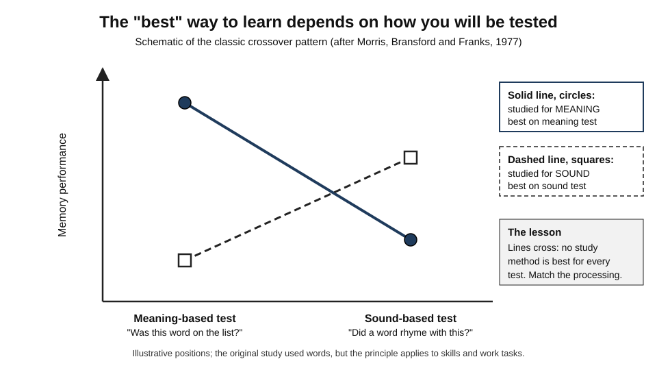
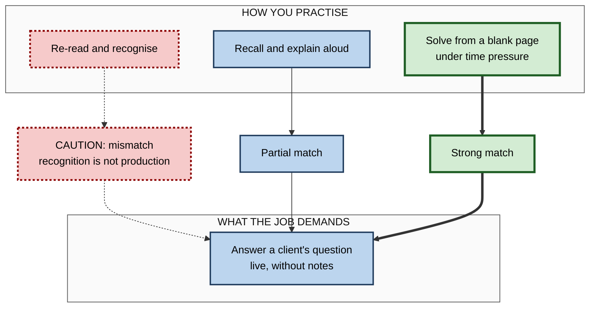
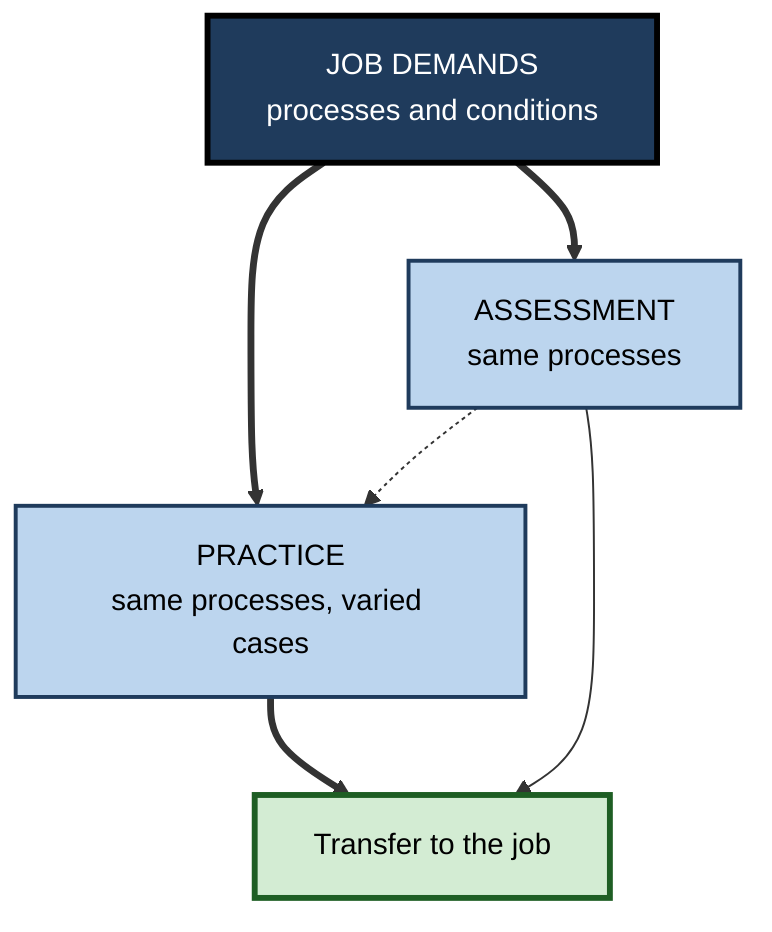

# M.8. Transfer-Appropriate Processing

> **In one sentence:** Transfer-appropriate processing is the finding that you remember and use knowledge best when the kind of thinking you did while learning matches the kind of thinking the later task demands.
>
> **Why it matters:** It explains why people ace quizzes and then fail at work, and why "study harder" is not always the fix. If you practise recognising answers but your job requires producing them, or you practise in calm conditions but perform under pressure, the mismatch, not effort, is the problem.
>
> **Level span:** Novice → Expert · **Reading time:** ~16 min · **Builds on:** encoding and retrieval; the difference between surface and processing similarity

---

## The Learning Ladder

| Level | Badge | After this level you can... |
|---|---|---|
| 1 | NOVICE | Explain why practising the way you will perform matters. |
| 2 | FOUNDATIONS | State the principle, its origin, and how it relates to encoding specificity. |
| 3 | PRACTITIONER | Match your practice to the processing demands of a real task or exam. |
| 4 | ADVANCED | Explain the evidence, including the limits of "matching" and the retrieval-practice findings. |
| 5 | EXPERT / PRO | Design assessments and training whose processing demands mirror the job. |

---

## Level 1 · Novice — The Big Picture

Imagine preparing for a job interview by re-reading your CV many times. You will recognise every line. But in the interview, nobody asks you to recognise your CV; they ask you to **explain**, out loud, under pressure, a time you solved a hard problem. Re-reading trained recognition. The interview tests spoken production. That mismatch is why prepared-feeling candidates often stumble.

**Transfer-appropriate processing** is the idea that the way you learn should match the way you will use what you learn. Analogy: training for a marathon by swimming will make you fit, but not fit for running a marathon. Fitness is real; it is just the wrong kind.

You have already experienced this when:

- You could understand a foreign language when reading it but could not speak it. **You practised comprehension, not production.**
- You knew a software tool's features from tutorials but froze when asked to build something from a blank screen. **You practised following, not creating.**
- You rehearsed a presentation aloud, standing up, with a timer, and it went smoothly on the day. **Processing matched.**

The key idea: **practise the thinking the real task will demand.**

---

## Level 2 · Foundations — Core Concepts

### Where the idea came from

In the 1970s, the dominant **levels-of-processing** view held that deeper, meaning-based processing always produces better memory than shallow processing, such as attending to a word's sound. In 1977, C. Donald Morris, John Bransford and Jeffery Franks challenged this. People studied words either for meaning or for rhyme. On a standard meaning-based recognition test, meaning study won. But on a test that asked which new words **rhymed** with studied words, rhyme study won. The value of the processing depended on the test.

*Figure M.8-1 — The classic crossover.* Solid line with filled circles: words studied for meaning. Dashed line with open squares: words studied for sound. Each method wins on the test that demands its own kind of processing. Positions are schematic.

### Related principle: encoding specificity

Endel Tulving and Donald Thomson's **encoding specificity principle**, from 1973, states that a retrieval cue helps only to the extent that it was encoded with the original memory. Transfer-appropriate processing extends this from cues to **processes**: the match that matters is between the mental operations at learning and at use.

### Key terms

| Term | Plain meaning |
|---|---|
| **Transfer-appropriate processing (TAP)** | Memory and transfer are best when processing at learning matches processing at use. |
| **Encoding specificity** | A cue works only if it was part of how the memory was stored. |
| **Levels of processing** | The idea that deeper, meaning-based processing produces stronger memory. |
| **Recognition** | Identifying something as familiar when you see it. |
| **Recall (production)** | Generating information or actions from memory without it being shown. |
| **Retrieval practice** | Practising by pulling information or skills from memory, such as self-testing. |
| **Cue diagnosticity** | How uniquely a cue points to one memory rather than many. |

**Figure M.8-2 — Matching learning processes to the demands of use.**

*How to read it:* the thick path shows practice whose processing closely matches the job; the dotted path shows the common mismatch of practising recognition for a task that needs production.

---

## Level 3 · Practitioner — Putting It to Work

### The processing-match method

1. **Describe the use situation.** What exactly will you have to do? Recognise, recall, explain, decide, perform physically, write, speak?
2. **List the conditions.** Time pressure, interruptions, tools available, audience, stakes, format.
3. **List what your current practice involves.** Be honest: reading, watching, highlighting, following along.
4. **Find the gaps.** Which processes and conditions does the job demand that your practice does not?
5. **Redesign practice to close them.** Swap recognition for recall, add time pressure, practise aloud, use the real tool, simulate the audience.
6. **Keep some deep understanding work.** Matching the surface format is not enough; you still need meaning-based processing to adapt.

### Worked example — a data scientist preparing for stakeholder meetings

| | Before | After |
|---|---|---|
| **Use situation** | Explaining model results to non-technical executives, live, with interruptions. | Same. |
| **Practice** | Re-reading the technical report and polishing slides. | Explaining results aloud in two minutes to a non-technical friend; answering random "so what?" questions; practising with a colleague who interrupts. |
| **Process match** | Recognition and editing versus live explanation: poor. | Spoken, simplified, interrupted explanation: strong. |
| **Outcome pattern** | Gets lost in detail when interrupted. | Answers crisply; returns to the key message after interruptions. |

### Common mistakes

- **Matching the surface, not the process.** Studying in the exam room matters far less than practising the same kind of thinking.
- **Practising recognition for production tasks.** Multiple-choice quizzes rarely prepare you for open-ended work.
- **Practising in ideal conditions only.** If performance happens under stress, some practice should include stress.
- **Narrow matching.** Training only for one exact test format can produce brittle knowledge; combine TAP with varied practice.

---

## Level 4 · Advanced — Mechanisms, Models & Evidence

### Why matching works

Memories are not stored as copies; they are records of the operations performed during learning. Retrieval succeeds when the operations at use re-create enough of those operations. If learning involved generating, explaining and deciding, the memory includes those operations and is ready for tasks that need them. If learning involved recognising, the memory is optimised for recognition.

### Evidence from retrieval practice

Retrieval practice is one of the best-replicated learning effects. TAP predicts that practice tests transfer best to final tests with similar processing. A 2018 meta-analysis by Steven Pan and Timothy Rickard of transfer from retrieval practice found:

- a moderate overall benefit of retrieval practice for transfer to new questions;
- relatively strong transfer **across test formats**, for example from short-answer practice to multiple-choice tests;
- weaker transfer to questions requiring application or inference beyond what was practised, unless practice included elaborative feedback or broader retrieval.

The practical reading: retrieval practice transfers well when the underlying processing overlaps, even if surface format differs, and less well when the final task demands different thinking.

### Limits of "matching"

| Limit | Explanation |
|---|---|
| **Match is not sufficient** | James Nairne argued in 2002 that what matters most is whether retrieval cues are **diagnostic**: they must point to the target memory and not to many competitors. A cue can match well and still fail if it also matches many other memories. |
| **Context effects are modest** | Matching physical environments produces small effects; the famous underwater-divers result did not replicate in 2021. Matching mental processes matters more than matching rooms. |
| **Over-specific practice is brittle** | Practising one test format exactly can raise scores on that format while reducing flexibility. |
| **Depth still matters** | Meaning-based processing generally produces more durable and adaptable knowledge; TAP refines this rather than overturning it. |

### Implicit and explicit tasks

Research by Henry Roediger and colleagues extended TAP to the distinction between **perceptual** processing (how something looks or sounds) and **conceptual** processing (what it means). Tasks relying on perception benefit from perceptual study; tasks relying on meaning benefit from conceptual study. Work skills usually need both, which is why realistic practice includes both the look and feel of the task and the reasoning behind it.

---

## Level 5 · Expert / Pro — Professional Mastery

### "Train as you perform"

High-reliability fields embody TAP: pilots train in simulators that demand the same decisions and actions as flight; surgeons rehearse on models that require the same hand movements; military units "train as they fight". The fidelity that matters most is **psychological and functional**: the same decisions, cues and pressures, rather than perfect physical realism. A 2024 systematic review in healthcare simulation found limited differences between high- and lower-fidelity simulators for many outcomes, consistent with this view.

| Job demand | Matching practice | Common mismatch |
|---|---|---|
| Live explanation | Spoken explanation with interruptions | Silent reading of notes |
| Diagnosis under uncertainty | Unlabelled mixed cases with incomplete data | Labelled textbook cases |
| Writing code from scratch | Blank-file exercises, timed | Fill-in-the-blank tutorials |
| Negotiation | Role-plays with unpredictable counterparts | Watching videos of negotiations |
| Spotting AI errors | Reviewing AI output that contains planted errors | Reading correct AI output |

### Designing assessment with TAP

Assessments shape practice. If the assessment is multiple-choice recognition, learners will practise recognition. Pros design assessments whose processing matches the job: performance tasks, simulations, case write-ups, oral explanations, code reviews. This turns the assessment itself into transfer-appropriate practice.

**Figure M.8-3 — Aligning practice, assessment and job demands.**

*How to read it:* both assessment and practice are derived from the job's processing demands; the dotted arrow shows how assessment shapes what learners practise.

### AI-era implications

When AI handles drafting, recall and routine production, the processing demanded of people shifts toward **evaluation, verification and judgement**. TAP implies that people must practise those processes: reviewing AI output with planted errors, deciding when to trust a suggestion, explaining why an answer is wrong. Training that only shows correct AI output trains recognition of good answers, not detection of bad ones.

### Professional scenario

**Role:** Compliance training lead at a bank.
**Situation:** Staff pass the annual anti-money-laundering quiz easily, but auditors find suspicious transactions are under-reported.
**What the pro does:** Notes the mismatch: the quiz tests recognition of definitions, while the job requires spotting subtle patterns in noisy transaction data and deciding whether to escalate. She replaces half the quiz with short case reviews of realistic, unlabelled transaction histories, some suspicious and some not, requiring a written escalation decision. She tracks escalation quality in real work over the following quarters.

---

## Myths vs. Evidence

| Myth | What the evidence shows |
|---|---|
| "Deeper processing is always better, whatever the task." | Deeper processing is generally strong, but the best processing depends on what the later task demands. |
| "Study in the exam room and you will remember more." | Physical context effects are modest and not always replicable; matching mental processing matters more. |
| "If I recognise it, I know it." | Recognition and recall are different; recognition practice often fails on production tasks. |
| "Practising the exact test format is the best preparation." | It helps on that format, but too-specific practice can be brittle; combine with varied, meaning-based practice. |
| "Higher physical fidelity always means better transfer." | Functional and psychological fidelity matter more than physical realism. |

## Practitioner Toolkit

**Processing-match audit**

| Job task | Processes demanded (recognise / recall / explain / decide / perform) | Conditions (time, stress, tools, audience) | Current practice | Gap | Practice redesign |
|---|---|---|---|---|---|
| | | | | | |

**Checklist**

- [ ] I know which processes the real task demands.
- [ ] My practice uses recall and production, not only recognition.
- [ ] Some practice happens under realistic conditions.
- [ ] Assessment demands the same processes as the job.
- [ ] Practice also builds understanding, so the skill can adapt.

## Self-Check

1. **[NOVICE]** Why might re-reading your CV be poor preparation for an interview?
2. **[NOVICE]** Give an example of a learning-use mismatch from your life.
3. **[FOUNDATIONS]** What did the 1977 meaning-versus-rhyme study show?
4. **[FOUNDATIONS]** How does encoding specificity relate to TAP?
5. **[PRACTITIONER]** List the six steps of the processing-match method.
6. **[ADVANCED]** What did the 2018 meta-analysis find about retrieval practice and transfer?
7. **[ADVANCED]** Why is a matching cue not always enough?
8. **[EXPERT / PRO]** Why does psychological fidelity matter more than physical fidelity?
9. **[EXPERT / PRO]** How does AI shift what people need to practise?

### Answer Key

1. Re-reading trains recognition; the interview demands spoken recall and explanation under pressure.
2. Answers vary; for example, reading about public speaking but never practising aloud.
3. Meaning study was best for a meaning-based test, but rhyme study was best for a rhyme-based test: the best processing depends on the test.
4. Encoding specificity says cues work if they were encoded with the memory; TAP extends this to the match between learning and retrieval processes.
5. Describe the use situation; list conditions; list current practice; find gaps; redesign practice; keep understanding work.
6. Retrieval practice transfers moderately to new questions and relatively well across test formats, less well to application and inference questions unless practice was broader.
7. Cues must also be diagnostic: a cue that matches many memories may fail to retrieve the right one.
8. Transfer depends on practising the same decisions, cues and pressures; physical realism adds cost but often little learning.
9. People need more practice in evaluation, verification and judgement, such as detecting errors in AI output.

## Key Takeaways

- Learning transfers best when **the processing at learning matches the processing at use**.
- **Recognition practice** does not prepare you for **production tasks**.
- Matching **mental processes** matters far more than matching rooms.
- Retrieval practice **transfers well across formats**; less so to new kinds of thinking.
- Good matching includes **conditions**: time pressure, interruptions, tools.
- Design **assessments** that demand the same processes as the job.

## Glossary

| Term | Meaning |
|---|---|
| Conceptual processing | Processing focused on meaning. |
| Cue diagnosticity | How uniquely a cue points to one memory. |
| Encoding specificity | The principle that cues work only if they were encoded with the memory. |
| Functional fidelity | How closely training reproduces the tasks and decisions of the job. |
| Levels of processing | The view that deeper processing produces stronger memory. |
| Perceptual processing | Processing focused on appearance or sound. |
| Psychological fidelity | How closely training reproduces the mental demands of the job. |
| Recall | Producing information from memory without seeing it. |
| Recognition | Identifying information as familiar. |
| Retrieval practice | Learning by pulling information from memory. |
| Transfer-appropriate processing | Best performance when learning and use processes match. |
