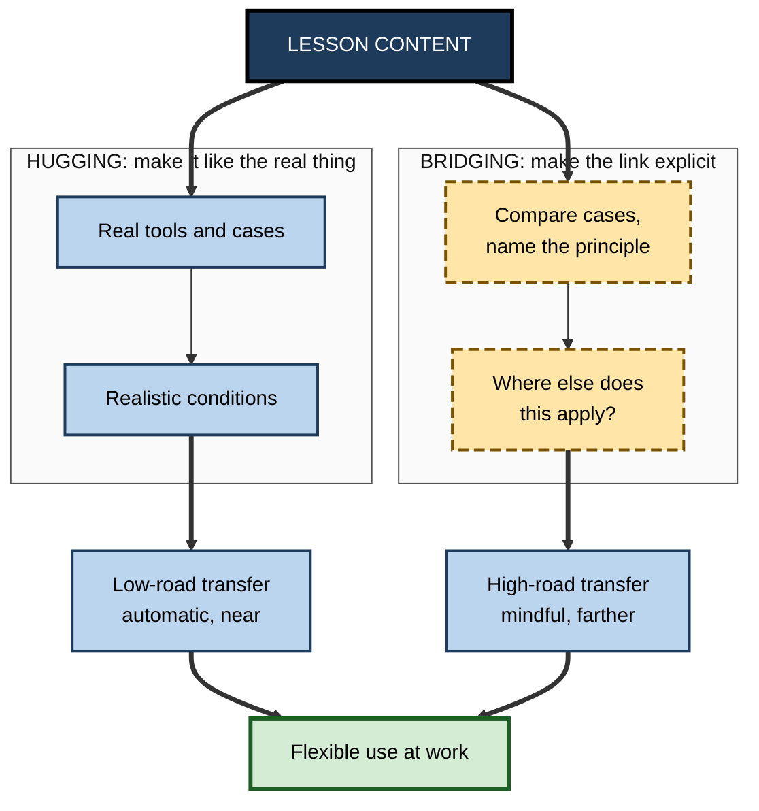
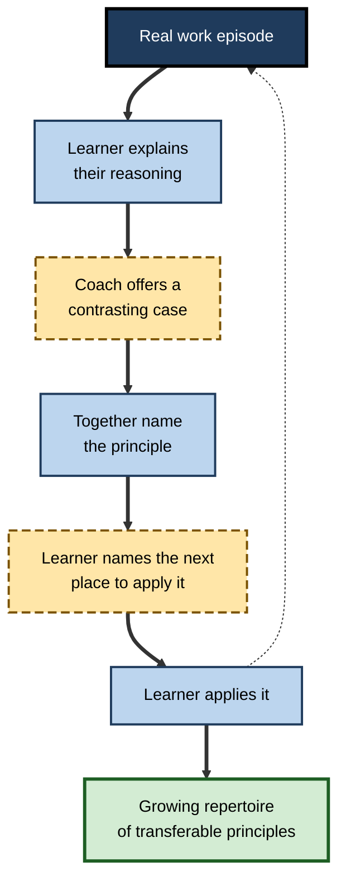

# M.9. Teaching for Transfer

> **In one sentence:** Teaching for transfer means deliberately building lessons, coaching and practice so that learners can use what they learn in situations beyond the lesson, instead of hoping it will happen by itself.
>
> **Why it matters:** Anyone who explains, mentors, trains or onboards is a teacher. The difference between a teacher whose people can only repeat the examples and one whose people can handle new problems is mostly a handful of learnable techniques.
>
> **Level span:** Novice → Expert · **Reading time:** ~17 min · **Builds on:** conditions that promote transfer; abstract principles; analogical reasoning; variable practice

---

## The Learning Ladder

| Level | Badge | After this level you can... |
|---|---|---|
| 1 | NOVICE | Explain why "covering the material" is not the same as teaching for transfer. |
| 2 | FOUNDATIONS | Describe hugging and bridging, and name the core teaching moves for transfer. |
| 3 | PRACTITIONER | Plan a lesson, workshop or coaching session using a transfer-focused structure. |
| 4 | ADVANCED | Explain the evidence on worked examples, comparison, productive failure and explicit bridging. |
| 5 | EXPERT / PRO | Coach other teachers, mentors and managers to teach for transfer, and audit existing programmes. |

---

## Level 1 · Novice — The Big Picture

Imagine teaching a teenager to cook by having them follow one recipe exactly, five times. They will make that dish well. Now imagine teaching them why onions are cooked first, how salt changes flavour and what to do if the pan is too hot, using three different dishes and asking them, each time, "what would you change if you had no butter?" The second teenager can cook dishes they have never seen. That is **teaching for transfer**.

Analogy: some teaching gives people a fish; some gives them a fishing rod for one pond; teaching for transfer teaches them how fishing works so they can fish in any water.

You have already experienced this when:

- A good mentor asked "where else could you use this?" after you solved a problem. **Bridging.**
- A training course had you practise on your own real project rather than a toy example. **Hugging.**
- A teacher showed only one example and then tested you on something that looked different, and you were lost. **Teaching that did not aim for transfer.**

The key idea: **if you want people to use it elsewhere, you have to teach for elsewhere.**

---

## Level 2 · Foundations — Core Concepts

### Hugging and bridging

David Perkins and Gavriel Salomon, in a widely cited 1988 article, proposed two complementary strategies:

| Strategy | What it does | Builds which transfer | Examples |
|---|---|---|---|
| **Hugging** | Makes learning experiences closely resemble the target situations. | Low-road, automatic transfer through shared cues. | Real tools, real cases, role-plays, simulations, on-the-job practice. |
| **Bridging** | Helps learners make the abstract connection to other situations explicitly. | High-road, mindful transfer through principles. | "Where else does this apply?", comparing cases, analogy, reflection, planning use. |

Good teaching for transfer uses both.

### The core teaching moves

1. **Teach for understanding** — explain why, not just what.
2. **Use multiple, varied examples** — with different surfaces and the same structure.
3. **Compare and contrast** — have learners find what examples share and where they differ.
4. **Name the principle** — make the abstract idea explicit.
5. **Practise retrieval and application** — learners produce, decide and solve, not just watch.
6. **Mix problem types** — so learners practise choosing the method.
7. **Bridge explicitly** — prompt learners to connect the learning to their own contexts.
8. **Revisit over time** — spaced returns with new cases.

**Figure M.9-1 — Hugging and bridging together.**

*How to read it:* the same content is taught through two channels; hugging (solid borders) builds automatic near transfer, bridging (dashed borders) builds mindful farther transfer.

### Key terms

| Term | Plain meaning |
|---|---|
| **Hugging** | Making learning closely resemble the situations where it will be used. |
| **Bridging** | Explicitly connecting learning to other contexts and principles. |
| **Worked example** | A step-by-step solution shown to learners to study. |
| **Faded worked example** | A worked example where steps are gradually removed for learners to complete. |
| **Contrasting cases** | Pairs of examples that differ in one key feature, used to highlight what matters. |
| **Productive failure** | Letting learners attempt problems before instruction, so they discover what the concept solves. |
| **Self-explanation prompt** | A question asking learners to explain why a step or idea works. |

---

## Level 3 · Practitioner — Putting It to Work

### A transfer-focused session plan

1. **Open with a real problem** from the learners' world, ideally one they cannot yet solve well.
2. **Optional exploration** — let them try for a few minutes, so they feel what is missing.
3. **Show two worked examples** with different surfaces and the same structure.
4. **Ask them to compare**: what is the same, what is different, what made each work?
5. **Name the principle** in one sentence, with its conditions.
6. **Practise** on a mix of new cases, fading support as they improve.
7. **Bridge**: each learner writes where they will use it, when, and what will cue them.
8. **Schedule a return**: a short follow-up practice days or weeks later.

### Worked example — teaching junior engineers to write good incident post-mortems

| | Before (covering content) | After (teaching for transfer) |
|---|---|---|
| **Opening** | Slide deck on the post-mortem template. | Learners read a real, poorly written post-mortem from their company and list what is missing. |
| **Examples** | One polished example from a famous outage. | Two strong post-mortems from different systems (database outage, deployment error) compared side by side. |
| **Principle** | Implicit. | "A good post-mortem explains the system conditions that allowed the error, not just the person who made it." |
| **Practice** | None; template handed out. | Each writes a post-mortem for a recent minor incident; peers review against the principle. |
| **Bridge** | — | "Where else would 'conditions, not culprits' change how you write?" (design reviews, customer escalations) |
| **Return** | — | Two weeks later, review a fresh incident together. |

### Common mistakes

- **One perfect example.** It teaches the example, not the principle.
- **Principles without practice.** Learners nod along and then cannot apply them.
- **Hugging without bridging.** Learners become fluent in the training context but cannot adapt.
- **Bridging without hugging.** Learners can talk about the principle but cannot act on it in real conditions.
- **Ending at the lesson.** No follow-up means no spaced return and weak transfer.

---

## Level 4 · Advanced — Mechanisms, Models & Evidence

### What the evidence supports

| Teaching move | Evidence | Notes |
|---|---|---|
| **Worked examples** (for novices) | Strong. Studying worked examples beats unguided problem solving for novices; known as the worked-example effect. | Benefit reverses as expertise grows (expertise reversal); fade examples over time. |
| **Multiple varied examples with comparison** | Strong. Comparing cases builds schemas that transfer better than single cases. | Pairs must differ in surface and share structure. |
| **Self-explanation** | Well replicated across domains. | Prompts must be specific; "explain why this step works". |
| **Retrieval practice** | Very strong for retention; moderate for transfer. | Broader, more elaborative retrieval helps transfer more. |
| **Interleaving** | Moderate; strongest for confusable categories. | Start blocked for new skills. |
| **Productive failure / problem solving first** | A 2021 meta-analysis by Tanmay Sinha and Manu Kapur of 53 studies found a moderate advantage for problem solving followed by instruction over instruction first, for conceptual knowledge and transfer, without harming procedural knowledge. | Effects were larger when designs followed productive-failure principles closely and for older learners; younger children benefited less. |
| **Explicit bridging prompts** | Supported; spontaneous transfer is rare without prompts. | Prompts work best when learners already understand the principle. |

### Resolving an apparent conflict

Worked examples (show first) and productive failure (struggle first) seem to contradict each other. They are better seen as tools for different goals and learners:

- For **novices learning procedures**, worked examples reduce overload and build initial competence.
- For learners with **some prior knowledge** aiming at **conceptual understanding and transfer**, a short, well-designed struggle before instruction can prepare them to understand why the canonical solution works.
- In both cases, **explicit instruction is still essential**. Productive failure is not discovery learning without guidance; it ends with clear instruction that builds on students' attempts.

### Why transfer needs teaching

Studies across decades show that learners rarely transfer spontaneously to situations that look different, even when they have the knowledge. Transfer depends on noticing, and noticing depends on having a representation of deep structure and a habit of looking for it. Both can be taught. Cross-national comparisons of mathematics lessons suggest that teachers in some high-performing systems more often use explicit comparison and visual mapping when teaching with analogies, illustrating that these moves are teachable practices.

### Open questions

- **How much struggle is optimal?** The design details of productive failure matter, and poor implementations can frustrate learners.
- **Which prompts generalise?** Generic "where else could you use this?" prompts help, but domain-specific prompts may help more.
- **Teaching with AI tutors.** Early randomised studies from 2024–2025 show well-designed AI tutors can raise learning gains, while answer-giving designs can reduce unaided performance. Design, not the technology itself, appears to decide the outcome.

---

## Level 5 · Expert / Pro — Professional Mastery

### Teaching for transfer at work

Most workplace teaching is done by people who are not trainers: senior engineers, team leads, account directors, consultants. Pros make transfer-focused teaching a habit in everyday moments.

| Everyday moment | Covering approach | Transfer approach |
|---|---|---|
| Code review | Fixes the bug in a comment. | Names the principle behind the fix and asks where else in the codebase it applies. |
| Deal debrief | Tells the story of the deal. | Compares this deal with a past one that shares the same dynamic. |
| Onboarding | Walks through documentation. | Gives a real starter task, then debriefs which principles the new joiner used. |
| Mentoring | Gives advice. | Asks the mentee to explain their reasoning, then offers a contrasting case. |
| Incident review | Lists actions. | Extracts the system pattern and searches for other places it could recur. |

**Figure M.9-2 — The transfer coaching loop for everyday work.**

*How to read it:* each real episode becomes a short teaching loop; the dotted arrow shows the next episode feeding the cycle again.

### Professional scenario

**Role:** Principal engineer responsible for raising the design skills of a 30-person team.
**Situation:** Design reviews keep catching the same class of problems: services that fail badly when a dependency is slow.
**What the pro does:** Instead of commenting on each review, she runs a 45-minute session. Engineers compare two past incidents from different services that share the same pattern, a missing timeout on a downstream call. They name the principle: "every remote call needs a timeout and a fallback". She shows a near-miss where a timeout alone was insufficient because retries amplified load. Each engineer then audits one of their own services and presents findings a week later. Over the next quarter, the pattern stops appearing in reviews.

### Ethical and practical limits

Teaching for transfer takes more time per topic than covering content. Pros prioritise: they teach for transfer on the principles that matter most and recur most often, and accept covering-level teaching for low-stakes, rarely used content that can be looked up.

---

## Myths vs. Evidence

| Myth | What the evidence shows |
|---|---|
| "If I explain it clearly, they will apply it." | Clear explanation helps understanding, but spontaneous transfer to different-looking situations is rare without practice and bridging. |
| "Discovery learning produces the best transfer." | Unguided discovery is weak for novices; guided approaches, including productive failure followed by instruction, work better. |
| "One great example is enough." | Multiple varied examples with comparison produce much better transfer. |
| "Realistic practice alone guarantees transfer." | Hugging builds near transfer; bridging is needed for farther transfer. |
| "Worked examples and productive failure contradict each other." | They suit different learners and goals; both end with explicit instruction. |

## Practitioner Toolkit

**Teaching-for-transfer lesson checklist**

- [ ] I started with a real problem from the learners' context.
- [ ] I used at least two examples with different surfaces and the same structure.
- [ ] Learners compared the examples before I named the principle.
- [ ] I stated the principle with its conditions.
- [ ] Learners practised on new, mixed cases with fading support.
- [ ] Each learner planned where and when they will use it.
- [ ] I scheduled a follow-up practice.

**Bridging prompts**

- "What does this remind you of from your own work?"
- "Where would this not work, and why?"
- "If the situation changed in this way, what would you do differently?"
- "What is the one-sentence principle here?"
- "When will you next face this, and what will tell you it is time to use it?"

## Self-Check

1. **[NOVICE]** What is the difference between covering material and teaching for transfer?
2. **[NOVICE]** Give one example of a bridging question.
3. **[FOUNDATIONS]** Define hugging and bridging.
4. **[FOUNDATIONS]** List four core teaching moves for transfer.
5. **[PRACTITIONER]** Describe the eight steps of a transfer-focused session.
6. **[ADVANCED]** What did the 2021 productive-failure meta-analysis find?
7. **[ADVANCED]** How can worked examples and productive failure both be right?
8. **[EXPERT / PRO]** How would you turn a code review into a transfer-focused teaching moment?
9. **[EXPERT / PRO]** Why should teaching for transfer be prioritised rather than applied to everything?

### Answer Key

1. Covering presents content; teaching for transfer designs examples, practice and bridging so learners can use it in new situations.
2. For example: "Where else in your work does this apply?"
3. Hugging: making learning resemble the target situation. Bridging: explicitly linking learning to other contexts and principles.
4. Any four of: teach for understanding; varied examples; compare and contrast; name the principle; retrieval and application; mix problem types; bridge explicitly; revisit over time.
5. Open with a real problem; optional exploration; two worked examples; compare; name the principle; practise on mixed cases; bridge to own context; schedule a return.
6. Problem solving followed by instruction moderately outperformed instruction first for conceptual knowledge and transfer, especially with high-fidelity designs and older learners.
7. Worked examples suit novices learning procedures; productive failure suits learners with some prior knowledge aiming at conceptual transfer; both include explicit instruction.
8. Name the principle behind the fix, show a contrasting case, and ask the author where else the principle applies in the codebase.
9. It takes more time; focus it on high-value, recurring principles and accept lighter teaching for content that can be looked up.

## Key Takeaways

- Transfer must be **taught for**; it rarely happens by itself.
- Combine **hugging** (realistic practice) and **bridging** (explicit links).
- Use **multiple varied examples**, **comparison** and a **named principle**.
- Worked examples suit **novices**; productive failure suits **conceptual transfer** with prior knowledge.
- Everyday work moments, such as **code reviews, debriefs and mentoring**, are prime teaching-for-transfer opportunities.
- **Prioritise** transfer-focused teaching for principles that matter and recur.

## Glossary

| Term | Meaning |
|---|---|
| Bridging | Explicitly connecting learning to other contexts and principles. |
| Contrasting cases | Examples differing in one key feature to highlight what matters. |
| Expertise reversal effect | Techniques that help novices can become unhelpful for experts. |
| Faded worked example | A worked example with steps gradually removed. |
| Hugging | Making learning resemble the situations where it will be used. |
| Productive failure | Problem solving before instruction to prepare for deeper learning. |
| Self-explanation | Explaining to oneself why steps or ideas work. |
| Teaching for transfer | Designing teaching so learning can be used in new situations. |
| Worked example | A step-by-step solution for learners to study. |
| Worked-example effect | Novices learn more from studying worked examples than from unguided problem solving. |
