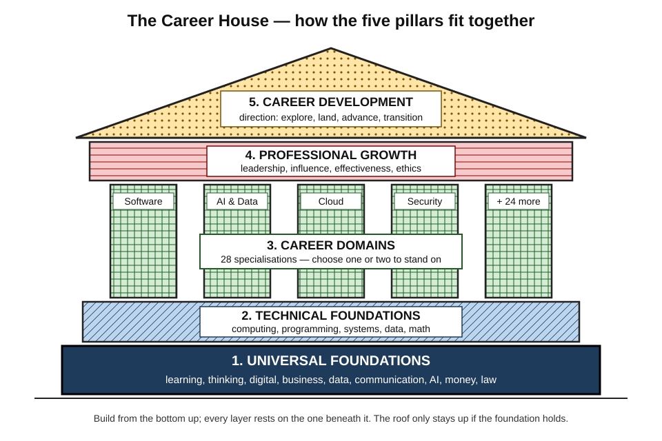
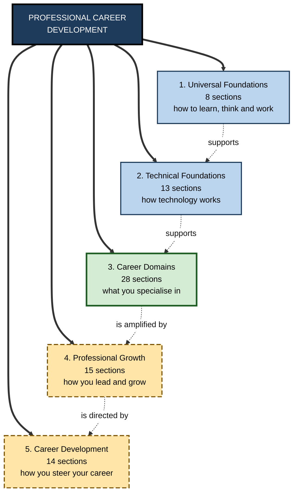
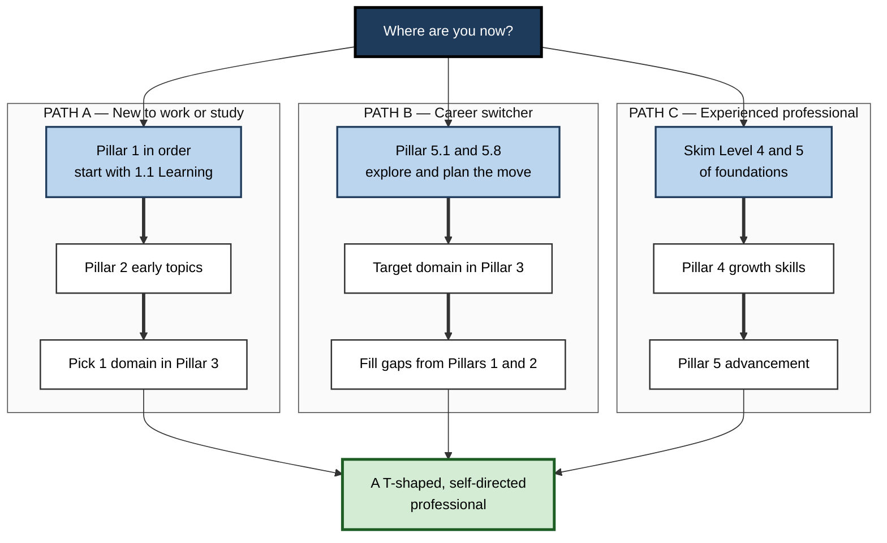

# Professional Career Development

> **Scope:** A complete, structured curriculum for building a professional career — from learning how to learn, through technical and domain expertise, to leadership, influence and long-term career strategy. · **Contains:** 5 pillars · 78 sections · 951 topics · **Level span:** Novice → Expert

---

## Overview

This map is a curriculum for an entire working life. It answers one question at every level of detail: **what does a person need to know and be able to do to build a strong, durable career — and in what order should they learn it?**

It is organised like a building. You cannot put a roof on a house without walls, and you cannot raise walls without a foundation. In the same way, it is hard to become an outstanding machine-learning engineer, consultant or product leader without first being able to learn efficiently, think clearly, communicate well and handle data, money and AI tools with confidence. The map therefore starts with universal foundations that everyone needs, adds technical foundations, branches into specialised career domains, and then adds the professional-growth and career-management skills that turn competence into a career.

Every node in the map — from the five pillars down to individual notes — is written to work for two readers at once: a complete beginner meeting the idea for the first time, and an experienced professional who wants a precise, current, evidence-based treatment. That is achieved with a five-level ladder inside every note, explained below.

*Figure 0-1 — The Career House.* The dark base is Pillar 1, the diagonal-hatched layer is Pillar 2, the cross-hatched columns are Pillar 3, the horizontal-lined beam is Pillar 4, and the dotted roof is Pillar 5. Each layer rests on the ones beneath it.

---

## Why It Matters

Careers are changing faster than most education systems. Large employer surveys published in 2025 expect a substantial share of workers' core skills — close to two in five — to change by 2030. The skills employers expect to grow fastest are technological (AI and big data, networks and cybersecurity, technological literacy), but the skills they rate as most important *today* are human ones: analytical thinking, resilience and adaptability, leadership and social influence, creative thinking, and curiosity with lifelong learning.

Three conclusions follow, and the map is built around them:

1. **Foundations compound.** The ability to learn, think and communicate well is used every day in every job. Small improvements there pay off across a whole career.
2. **Specialisation still wins jobs.** Employers hire for concrete domain capability. The map gives each of 28 domains its own deep structure.
3. **Careers are managed, not just experienced.** Growth, influence, positioning and transitions are learnable skills, not luck.

The most widely recommended shape for a modern professional is **T-shaped**: broad, transferable capability across many areas (the horizontal bar) combined with deep expertise in one or two (the vertical stem). Pillars 1, 2, 4 and 5 build the bar; Pillar 3 builds the stem.

---

## Structure at a Glance

**Figure 0-2 — The five pillars and what each one gives you.**

*How to read it:* thick arrows show the map's containment; dotted arrows show how each pillar supports the next. Solid-bordered boxes are the foundation layers, the thick-bordered box is your specialisation, and dashed-bordered boxes are the growth and steering layers.

### How the map is labelled

| Depth | Name | Label | Example | What it holds |
|---|---|---|---|---|
| 0 | Map | plain | Professional Career Development | This note |
| 1 | Pillar | `N.` | 1. Universal Foundations | A major layer of the career house |
| 2 | Section | `N.N.` | 1.1. Learning Foundation | A field within the pillar |
| 3 | Topic | `N.N.N.` | 1.1.1. Learning Science & Cognition | A coherent subject |
| 4 | Subtopic | `A.` | A. Learning How to Learn | A teachable unit of about a dozen notes |
| 5 | Note | `A.1.` | A.1. What is Learning? | A single concept, taught novice to expert |

Every pillar, section, topic and subtopic also has its own index note — like this one — that summarises what sits beneath it.

---

## What Each Part Covers

| Pillar | Sections | The question it answers | You will be able to... |
|---|---|---|---|
| **1. Universal Foundations** | 8 | How do I learn, think and operate as a capable modern professional? | Learn anything faster, reason clearly, handle digital tools, data, AI, money and law with confidence, and communicate well. |
| **2. Technical Foundations** | 13 | How does modern technology actually work? | Understand computing, programming, algorithms, databases, the web, distributed systems, mathematics and tooling at the level a technologist needs. |
| **3. Career Domains** | 28 | Which field will I build deep expertise in? | Work professionally in a chosen domain — software, AI and data, cloud, security, product, design, finance, science, consulting, and many more. |
| **4. Professional Growth** | 15 | How do I become more effective, influential and trusted? | Lead, decide, innovate, write, present, persuade, collaborate across cultures and use AI to amplify your work — sustainably and ethically. |
| **5. Career Development** | 14 | How do I deliberately steer my career? | Explore options, earn credentials, build a brand, find and win roles, advance, go independent, work globally and navigate transitions in the AI era. |

**Pillar 1 — Universal Foundations.** The base slab of the house. It covers learning foundations (the science of learning, study strategies, skill mastery, self-directed learning, thinking skills and productivity), digital literacy, business literacy, data literacy, communication and professional skills, AI literacy for everyone, financial and economic literacy, and legal and regulatory literacy. Everything else in the map assumes these.

**Pillar 2 — Technical Foundations.** The structural layer for anyone working in or alongside technology: computer-science and programming foundations, core and modern technology foundations, programming languages, advanced algorithms and data structures, databases, web and frontend fundamentals, system design and distributed systems, mathematics and theoretical computer science, developer tooling, and computer architecture. Non-technical professionals benefit from its early topics; engineers need much of it in depth.

**Pillar 3 — Career Domains.** The columns — 28 specialised fields ranging from software engineering, AI and data, cloud and infrastructure, and cybersecurity, through business and product, design, finance, science, consulting and developer relations, to emerging fields such as quantum computing, spatial computing, climate tech, biotech and robotics. Most people stand on one or two columns, not all of them.

**Pillar 4 — Professional Growth.** The beam that connects the columns: leadership and management, innovation and entrepreneurship, strategic thinking, personal effectiveness and wellbeing, research and creativity, ethics and sustainability, lifelong learning, mentorship and influence, financial wealth building, AI-augmented professional skills, career navigation, cross-cultural collaboration, public speaking, professional writing, and influence for non-salespeople.

**Pillar 5 — Career Development.** The roof that gives the house its direction: career exploration and planning, education and credentials, personal branding, job search, advancement, freelancing and consulting, global and remote careers, career transitions, AI-era career strategy, purpose-driven careers, executive careers, technical career ladders and individual-contributor tracks, interview preparation for competitive markets, and mastery of freelance platforms.

---

## How to Use This Part

**Figure 0-3 — Three ways to travel through the map.**

*How to read it:* pick the box that describes you and follow the thick arrows; every path ends at the same goal.

### How to read a single note

Every note teaches its idea on a **five-level ladder**. Read as far up the ladder as you need:

| Level | Badge | Written for | What you get |
|---|---|---|---|
| 1 | NOVICE | Anyone, no background | The idea in plain language, with an everyday analogy |
| 2 | FOUNDATIONS | Learners building vocabulary | Core concepts, key terms and the first diagram |
| 3 | PRACTITIONER | People who want to use it | Step-by-step methods, worked examples, common mistakes |
| 4 | ADVANCED | People who want to understand why | Mechanisms, models, evidence, debates and recent findings |
| 5 | EXPERT / PRO | Professionals and people who design for others | Organisational practice, metrics, scaling, AI-era implications |

Each note then closes with **Myths vs. Evidence**, a **Practitioner Toolkit**, a **Self-Check** with answer key, **Key Takeaways** and a **Glossary** — so any single note can be printed and used on its own.

### How the diagrams are designed for print

All diagrams are built to read correctly on a black-and-white printout. Meaning is never carried by colour alone:

| Visual cue | Meaning |
|---|---|
| Dark box, white text, thick border | The central concept |
| Light box, solid border | A main component or stage |
| White box, thin border | A supporting detail or example |
| Long-dashed border | A tip, technique or highlight |
| Thick solid border, light fill | A recommended practice or good outcome |
| Dotted border, label starting CAUTION or MYTH | A risk, mistake or misconception |
| Thick arrow | The main path |
| Dotted arrow | An influence, feedback loop or optional step |

---

## Core Principles

These ideas run through the whole map:

1. **Foundations first, but not foundations only.** Build the base, then specialise early enough to become employable.
2. **Learning is the master skill.** Every other node is easier if you learn efficiently — which is why the map begins with the science of learning.
3. **Evidence over folklore.** Notes separate what is well supported from what is popular but wrong, and flag contested claims.
4. **Capability, not familiarity.** The measure of progress is what you can do later, unaided — not what you have read.
5. **T-shaped breadth with real depth.** Broad literacy across many areas; genuine mastery in one or two.
6. **AI as amplifier, not replacement.** Use AI tools to extend what you can do, while deliberately keeping the knowledge and judgement needed to direct and check them.
7. **Careers are designed.** Direction, positioning and transitions are skills you can practise.
8. **Sustainability and ethics.** Long careers depend on wellbeing, integrity and trust.

---

## Novice-to-Pro Progression

| Stage | What competence looks like across the map |
|---|---|
| **Novice** | Can name the five pillars, knows which apply to them now, and has started Pillar 1. |
| **Foundations** | Learns deliberately, reasons clearly, handles digital tools, data, AI and personal finance competently. |
| **Practitioner** | Has working depth in one career domain plus the technical foundations it requires; delivers real work independently. |
| **Advanced** | Has deep, current expertise in a domain; leads work, makes sound decisions and communicates with influence. |
| **Expert / Pro** | Shapes their field and organisation; develops others; manages their career strategically through change. |

---

## Key Takeaways

- The map is a **career house**: universal foundations, technical foundations, domain columns, a professional-growth beam and a career-development roof.
- It contains **5 pillars, 78 sections and 951 topics**, each broken into subtopics and single-concept notes.
- **Start with learning how to learn** — it multiplies the value of everything else.
- Aim to be **T-shaped**: broad transferable skills plus deep expertise in one or two domains.
- Every note climbs a **five-level ladder from novice to expert**, so beginners and professionals can use the same material.
- Diagrams are **print-safe**: meaning is carried by text, borders and arrows, not by colour alone.
